# CodeBuddy: Your AI Coding Assistant

CodeBuddy is a powerful Visual Studio Code extension that integrates various generative AI models to enhance your coding workflow and productivity.

This extension provides a wide range of AI-powered features to assist developers in their daily coding tasks, from code generation and refactoring and to unit test creation.

## Install in Vscode Market Place
https://marketplace.visualstudio.com/items?itemName=fiatinnovations.ola-code-buddy


## Architecture

```mermaid
flowchart TD

    %% VS Code Extension Frontend
    subgraph "VS Code Extension Frontend"
        CE["Editor Interface"]:::frontend
        CL["Commands Layer"]:::frontend
        WV1["Webview (VS Code)"]:::frontend
        WV2["Webview (React UI)"]:::frontend
    end

    %% Core Application Layer
    subgraph "Core Application"
        AA["AI Agents"]:::core
        MS["Memory System"]:::core
        subgraph "Application Services"
            BL["Business Logic"]:::core
            AI["Application Interfaces"]:::core
        end
        subgraph "Infrastructure Layer"
            HTTP["HTTP Services"]:::infra
            LOG["Logging"]:::infra
            REP["Repository"]:::infra
            LS["Local Storage"]:::infra
        end
    end

    %% AI Providers
    subgraph "AI Providers"
        LLM["Language Model Integrations"]:::provider
        ESP["External Service Providers"]:::provider
    end

    %% Storage Layer
    subgraph "Storage Layer"
        DB["Database (SQLite)"]:::storage
        FS["File System"]:::storage
        VD["Vector Database"]:::storage
    end

    %% Connections between VS Code Extension Frontend
    CE -->|"UserInput"| CL
    CL -->|"ProcessRequest"| AA
    CL -->|"UIUpdate"| WV1

    %% Connections within Core Application
    AA -->|"ContextManagement"| MS
    AA -->|"Orchestration"| BL
    AA -->|"ContractCall"| AI

    %% Connections to Infrastructure
    AA -->|"APIRequest"| HTTP
    HTTP -->|"APICall"| LLM
    HTTP -->|"APICall"| ESP
    HTTP -->|"Feedback"| WV1

    %% Connections from Application Services to Storage
    BL -->|"DataAccess"| DB
    BL -->|"FileAccess"| FS
    BL -->|"EmbedData"| VD
    AI -->|"RepositoryAccess"| REP

    %% Memory System stores context to Storage
    MS -->|"StoreContext"| DB

    %% Styling Classes
    classDef frontend fill:#cce5ff,stroke:#2a6592,stroke-width:2px;
    classDef core fill:#d4edda,stroke:#155724,stroke-width:2px;
    classDef infra fill:#f8d7da,stroke:#a71d2a,stroke-width:2px;
    classDef provider fill:#fff3cd,stroke:#856404,stroke-width:2px;
    classDef storage fill:#d1ecf1,stroke:#0c5460,stroke-width:2px;

    %% Click Events
    click CE "https://github.com/olasunkanmi-se/codebuddy/blob/main/src/extension.ts"
    click CL "https://github.com/olasunkanmi-se/codebuddy/tree/main/src/commands"
    click WV1 "https://github.com/olasunkanmi-se/codebuddy/tree/main/src/webview"
    click WV2 "https://github.com/olasunkanmi-se/codebuddy/tree/main/webviewUi"
    click AA "https://github.com/olasunkanmi-se/codebuddy/tree/main/src/agents"
    click MS "https://github.com/olasunkanmi-se/codebuddy/tree/main/src/memory"
    click BL "https://github.com/olasunkanmi-se/codebuddy/tree/main/src/services"
    click AI "https://github.com/olasunkanmi-se/codebuddy/tree/main/src/application"
    click HTTP "https://github.com/olasunkanmi-se/codebuddy/tree/main/src/infrastructure/http"
    click LOG "https://github.com/olasunkanmi-se/codebuddy/blob/main/src/infrastructure/logger/logger.ts"
    click REP "https://github.com/olasunkanmi-se/codebuddy/tree/main/src/infrastructure/repository"
    click LS "https://github.com/olasunkanmi-se/codebuddy/blob/main/src/infrastructure/storage/local-storage.ts"
    click LLM "https://github.com/olasunkanmi-se/codebuddy/tree/main/src/llms"
    click ESP "https://github.com/olasunkanmi-se/codebuddy/tree/main/src/providers"
    click DB "https://github.com/olasunkanmi-se/codebuddy/tree/main/src/infrastructure/repository"
    click FS "https://github.com/olasunkanmi-se/codebuddy/blob/main/src/services/file-system.ts"
```


### Database
- SQLite database for code pattern storage
- Vector embeddings for semantic code search

### File System
- Workspace management for multi-root projects
- TypeScript configuration detection
- File watching and indexing services


## Roadmap
- [ ] Codebase Understanding: Comprehensive local codebase indexing with Retrieval-Augmented Generation (RAG) capabilities.
- [ ] Code search: Search code across the entire codebase
- [ ] Rewrite the Webview UI with React
- [ ] Incorporate AI agents for seamless interaction with external resources and APIs.
- [ ] Context Pinning: Allow users to pin specific directories, files, and code elements (functions, classes, etc.) as persistent context for AI models.
- [ ] Automated Documentation Generation: Generate comprehensive and up-to-date codebase documentation.
- [ ] Intelligent Orchestration: Orchestrate ReAct models activities through advanced tools and function calling.
- [ ] Access to real-time data.
- [ ] Support for local LLMs such as Ollama
- [ ] Support for Deepseek model


## Repository Structure
```
.
├── src/                         # Source code directory
│   ├── agents/                  # AI agent implementations and orchestration
│   ├── application/             # Core application constants and interfaces
│   ├── commands/                # Command implementations for VS Code extension
│   ├── infrastructure/          # Core infrastructure components (HTTP, logging, storage)
│   ├── llms/                    # Language model integrations (Anthropic, Gemini, Groq)
│   ├── memory/                  # Memory management for AI context
│   ├── providers/               # Provider implementations for different services
│   ├── services/                # Business logic and core services
│   └── webview/                 # VS Code webview implementation
├── webviewUi/                   # React-based UI for the extension
└── package.json                 # Project configuration and dependencies
```


## Usage Instructions

### Installation

1. Ensure you have Visual Studio Code version 1.78.0 or higher installed.
2. Install the CodeBuddy extension from the Visual Studio Code Marketplace.

### Configuration

1. Open VS Code settings (File > Preferences > Settings).
2. Search for "CodeBuddy" in the settings search bar.
3. Configure the following settings:
   - Select the Generative AI model (Gemini, Groq, Anthropic, or XGrok)
   - Enter the API key for your chosen model
   - Choose your preferred font family and chat view theme

### Getting Started

1. Open a Vscode workspace/file containing some code
2. Right-click on the selected code to access CodeBuddy features in the context menu.
3. Access the chat interface via the CodeBuddy panel in the Activity Bar.

### Troubleshooting

1. API Key Issues:

   - Problem: "Failed to generate content" error message.
   - Solution: Double-check your API key in the CodeBuddy settings.

2. Model Selection:

   - Problem: Features not working as expected.
   - Solution: Ensure you've selected the correct AI model in the settings.

3. Performance Issues:
   - Problem: Slow response times from CodeBuddy.
   - Solution: Check your internet connection and consider switching to a faster AI model.

