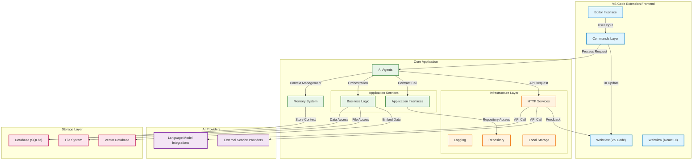

# CodeBuddy: AI-Powered Coding Assistant

[](https://marketplace.visualstudio.com/items?itemName=fiatinnovations.ola-code-buddy)
[](https://marketplace.visualstudio.com/items?itemName=fiatinnovations.ola-code-buddy)
[](https://marketplace.visualstudio.com/items?itemName=fiatinnovations.ola-code-buddy)

**CodeBuddy** is a revolutionary Visual Studio Code extension that transforms your development workflow with AI-powered assistance. From intelligent code completion to comprehensive documentation generation, CodeBuddy is your complete development companion.

## ✨ What's New in v3.4.3

🚀 **Context-Aware Code Completion** - Get Copilot-style inline suggestions based on your codebase patterns  
📚 **Intelligent Documentation Generator** - Auto-generate comprehensive project documentation  
🔍 **Advanced Codebase Understanding** - Deep architectural analysis with RAG capabilities  
🤖 **AI Agent Orchestration** - Multi-agent system for complex development tasks  
💡 **Real-time Code Analysis** - Instant feedback and suggestions as you code  

## 🎯 Core Features

### 🧠 **AI-Powered Code Assistance**
- **Multiple AI Models**: Choose from Gemini, Anthropic Claude, Groq, Deepseek, and XGrok
- **Intelligent Code Review**: Deep analysis of code quality, security, and best practices
- **Smart Refactoring**: Context-aware code improvements and restructuring
- **Performance Optimization**: AI-driven suggestions for better performance
- **Bug Detection & Fixes**: Automatic error detection with intelligent fix suggestions

### 💫 **Context-Aware Code Completion**
- **Inline Suggestions**: Copilot-style grey text completions as you type
- **Pattern Learning**: Learns from your codebase to suggest relevant completions
- **Function Signatures**: Smart parameter suggestions based on your patterns
- **Variable Naming**: Intelligent variable name suggestions following your conventions
- **Block Completion**: Auto-completes common code structures (if/for/try blocks)

### 📚 **Intelligent Documentation Generator**
- **Comprehensive README**: Auto-generates professional README.md files
- **API Documentation**: Extracts and documents REST endpoints automatically  
- **Architecture Analysis**: Creates Mermaid diagrams and architectural overviews
- **Component Documentation**: Documents classes, interfaces, and modules
- **Smart Analysis**: Understands project structure and generates relevant docs

### 🔍 **Deep Codebase Understanding**
- **RAG-Powered Analysis**: Retrieval-Augmented Generation for accurate codebase insights
- **Architectural Recommendations**: Suggests improvements based on your project structure
- **Framework Detection**: Identifies and analyzes technologies in use
- **Pattern Recognition**: Understands your coding patterns and conventions
- **Context-Aware Q&A**: Answer questions about your specific codebase

### 💬 **Interactive Chat Interface**
- **Modern React UI**: Beautiful, responsive chat interface
- **Code Context**: Automatic code context inclusion in conversations
- **File Upload**: Support for various file formats (PDF, DOCX, CSV, JSON, TXT)
- **Syntax Highlighting**: Code blocks with proper language detection
- **Customizable Themes**: Multiple chat themes to match your preferences

## 🚀 Quick Start

### Installation
1. Open VS Code
2. Go to Extensions (Ctrl+Shift+X)
3. Search for "CodeBuddy"
4. Click Install

### Setup
1. **Select AI Model**: Choose your preferred AI provider in VS Code settings
2. **Add API Key**: Configure your API key for the chosen model
3. **Start Coding**: CodeBuddy is now ready to assist!

### Getting Your API Keys
- **Gemini**: [Get API Key](https://aistudio.google.com/app/apikey)
- **Anthropic**: [Get API Key](https://docs.anthropic.com/en/docs/about-claude/models)
- **Groq**: [Get API Key](https://console.groq.com/keys)
- **Deepseek**: [Get API Key](https://platform.deepseek.com/api_keys)
- **XGrok**: [Get API Key](https://console.x.ai/)

## 📋 How to Use

### Right-Click Context Menu
Right-click on selected code to access these features:
- 💭 **Add Comments** - Intelligent code documentation
- 🔍 **Review Code** - Comprehensive code analysis
- 🔄 **Refactor Code** - Smart code improvements
- ⚡ **Optimize Code** - Performance enhancements
- 💬 **Explain Code** - Clear explanations of complex logic
- 📝 **Generate Commit Message** - Smart Git commit messages
- 💫 **Inline Chat** - Context-aware code discussions
- 📚 **Interview Questions** - Technical interview preparation
- 📊 **Generate Diagram** - Mermaid diagram creation
- 🏗️ **Analyze Codebase** - Deep architectural analysis

### Command Palette
Access additional features via Ctrl+Shift+P:
- **CodeBuddy: Generate Documentation** - Create comprehensive docs
- **CodeBuddy: Toggle Context Completion** - Enable/disable smart completion
- **CodeBuddy: Test Completion** - Verify completion provider status
- **CodeBuddy: Configure Context Completion** - Adjust completion settings
- **CodeBuddy: Analyze Codebase Patterns** - View pattern analysis

### Chat Interface
Click the CodeBuddy icon in the Activity Bar to open the interactive chat:
- Ask questions about your code
- Upload files for analysis
- Get architectural recommendations
- Discuss implementation strategies

## 🔧 Configuration

Access CodeBuddy settings in VS Code preferences:

### AI Model Selection
```json
{
  "generativeAi.option": "Gemini", // or "Groq", "Anthropic", "XGrok", "Deepseek"
}
```

### Model-Specific Settings
```json
{
  "google.gemini.apiKeys": "your-gemini-api-key",
  "google.gemini.model": "gemini-1.5-flash",
  "anthropic.apiKey": "your-anthropic-api-key",
  "groq.llama3.apiKey": "your-groq-api-key",
  "deepseek.apiKey": "your-deepseek-api-key"
}
```

### UI Customization
```json
{
  "font.family": "JetBrains Mono",
  "chatview.theme": "Atom One Dark",
  "chatview.font.size": 16
}
```

## 🏗️ Architecture



## 🚀 Roadmap

### ✅ Completed Features
- [x] **Codebase Understanding** - Comprehensive RAG-powered analysis
- [x] **Code Search** - Semantic search across entire codebase  
- [x] **React Webview UI** - Modern, responsive interface
- [x] **AI Agent Orchestration** - Multi-agent workflow coordination
- [x] **Context Pinning** - Persistent context for AI models
- [x] **Documentation Generation** - Automated comprehensive docs
- [x] **Real-time Data Access** - External API integration
- [x] **Multiple AI Models** - Support for 5 different providers
- [x] **Context-Aware Completion** - Copilot-style inline suggestions

### 🔜 Coming Soon
- [ ] **Local LLM Support** - Ollama integration for offline usage
- [ ] **Multi-language Support** - Python, Java, Go, and more
- [ ] **Advanced Caching** - Redis support for better performance
- [ ] **Team Collaboration** - Share contexts and documentation
- [ ] **Custom Templates** - Personalized documentation templates
- [ ] **Integration Testing** - Validate docs against actual code

## 📁 Repository Structure

```
codebuddy/
├── src/                          # Source code
│   ├── agents/                   # AI agent orchestration
│   ├── commands/                 # VS Code command implementations  
│   ├── llms/                     # AI provider integrations
│   ├── services/                 # Core business logic
│   │   ├── documentation-generator.service.ts
│   │   ├── inline-completion.service.ts
│   │   ├── context-aware-completion.service.ts
│   │   └── codebase-understanding.service.ts
│   ├── webview/                  # VS Code webview components
│   ├── infrastructure/           # Infrastructure layer
│   └── extension.ts              # Main extension entry point
├── webviewUi/                    # React-based chat interface
├── docs/                         # Documentation
└── package.json                  # Extension configuration
```

## 🤝 Contributing

We welcome contributions! Here's how to get started:

1. **Fork the repository**
2. **Create a feature branch** from `development`
3. **Install dependencies**: `npm install`
4. **Start development**: Run → Start Debugging (F5)
5. **Make your changes** in the new VS Code instance
6. **Test thoroughly** with various scenarios
7. **Submit a pull request**

### Development Setup
- Main entry point: `src/extension.ts`
- React UI entry: `webviewUi/src/App.tsx`  
- Testing: New VS Code instance opens automatically
- Build: `npm run compile` and `npm run build:webview`

For detailed contribution guidelines, see [CONTRIBUTING.md](CONTRIBUTING.md)

## 🛠️ Troubleshooting

### Common Issues

**❓ Completion not working**
- Ensure you're in a TypeScript/JavaScript file
- Check if the completion provider is active in Command Palette
- Try the "CodeBuddy: Test Completion" command

**❓ API Key Issues**
- Verify your API key is correctly entered in VS Code settings
- Check that you've selected the matching AI model
- Ensure your API key has sufficient credits/quota

**❓ Documentation generation fails**
- Make sure you have proper file permissions in the workspace
- Check that your project structure is supported
- Review the output panel for detailed error messages

**❓ Performance Issues**
- Try switching to a faster AI model (Groq is typically fastest)
- Clear the extension cache: Use "CodeBuddy: Restart" command
- Check your internet connection stability

### Getting Help
- 📖 Check our [documentation](docs/)
- 🐛 Report issues on [GitHub](https://github.com/olasunkanmi-SE/codebuddy/issues)
- 💬 Join our community discussions
- 📧 Contact: oyinolasunkanmi@gmail.com

## 📊 Analytics & Performance

- **Bundle Size**: ~8.7MB (Extension) + ~398KB (UI)
- **Supported Languages**: TypeScript, JavaScript, React, Vue
- **VS Code Version**: 1.78.0+
- **AI Models**: 5 providers supported
- **Database**: SQLite for local storage, Vector embeddings for search

## 📄 License

MIT License - see [LICENSE](LICENSE) file for details.

## 🌟 Support the Project

If CodeBuddy enhances your development workflow:
- ⭐ Star the repository
- 📝 Leave a review on the [VS Code Marketplace](https://marketplace.visualstudio.com/items?itemName=fiatinnovations.ola-code-buddy)
- 🐛 Report bugs or suggest features
- 🤝 Contribute to the codebase
- 💬 Share with fellow developers

---

**Made with ❤️ by [Olasunkanmi Raymond](https://olasunkanmi.app)**

*Transform your coding experience with AI-powered assistance. Install CodeBuddy today and code smarter, not harder!*

[](https://marketplace.visualstudio.com/items?itemName=fiatinnovations.ola-code-buddy)
