# CodeBuddy: AI-Powered Agentic Coding Assistant

[](https://marketplace.visualstudio.com/items?itemName=fiatinnovations.ola-code-buddy)
[](https://marketplace.visualstudio.com/items?itemName=fiatinnovations.ola-code-buddy)
[](https://marketplace.visualstudio.com/items?itemName=fiatinnovations.ola-code-buddy)

**CodeBuddy** is an advanced AI-powered VS Code extension featuring a **Multi-Agent System**, **Terminal Integration**, and **Local LLM Support**. It transforms your development workflow by acting as a full-fledged autonomous pair programmer that can plan, execute, test, and debug complex tasks.

## What's New in v3.8.x

**Terminal Integration** - Agents can now execute shell commands (builds, tests, git) with real-time output streaming and safety guards.
**Expanded Agent Team** - New specialized agents: **Architect**, **Reviewer**, and **Tester** join the existing team.
**Collaboration Protocols** - Agents follow structured playbooks for New Features, Bug Fixes, and Refactoring.
**Local LLM Support** - Full support for Ollama and LM Studio (OpenAI-compatible endpoints).
**New Model Support** - Added support for Qwen, GLM-4, and DeepSeek-R1/V3.

---

## Architecture Overview

CodeBuddy employs a sophisticated **multi-agent architecture** built on **DeepAgents** and **LangGraph**:

```mermaid
flowchart TB
    subgraph Extension["CodeBuddy Extension"]
        subgraph AgentLayer["Agent Service Layer"]
            ProjectManager["Project Manager<br/>(Main Agent)"]

            subgraph SubAgents["Specialized Team"]
                Architect["Architect<br/>(System Design)"]
                CodeAnalyzer["Code<br/>Analyzer"]
                Reviewer["Reviewer<br/>(Quality/Security)"]
                Tester["Tester<br/>(QA/Automation)"]
                Debugger["Debugger"]
                DocWriter["Doc<br/>Writer"]
                FileOrganizer["File<br/>Organizer"]
            end
        end

        subgraph Tools["Tool Provider"]
            Terminal["Terminal<br/>(Exec Command)"]
            WebSearch["Web<br/>Search"]
            FileTool["File<br/>Ops"]
            ThinkTool["Reasoning"]
        end

        subgraph Backends["Backend Systems"]
            Filesystem["Filesystem<br/>(/workspace/)"]
            Store["Store<br/>(/docs/)"]
            State["State<br/>(/ ephemeral)"]
        end
    end

    ProjectManager --> SubAgents
    ProjectManager --> Tools
    SubAgents --> Tools
    Tools --> Backends
```



### The Agent Team

- **Project Manager (Main Agent)**: Orchestrates the workflow and delegates tasks.
- **Architect**: Designs scalable systems, selects patterns, and creates ADRs.
- **Reviewer**: Enforces code quality, security standards, and best practices.
- **Tester**: Writes and executes unit/integration tests to ensure stability.
- **Debugger**: Investigates root causes of errors and proposes fixes.
- **Code Analyzer**: Deeply scans codebase for anti-patterns and complexity.
- **Doc Writer**: Generates comprehensive documentation and API references.
- **File Organizer**: Refactors directory structures and cleans up projects.

---

## Core Features

### Terminal Integration (New!)
CodeBuddy can now **run commands directly in your terminal**.
- **Execution**: Run `npm test`, `git status`, `docker build`, or any shell command.
- **Visibility**: Watch real-time output in the dedicated "CodeBuddy Terminal" channel.
- **Safety First**: Every command requires **explicit user confirmation** via a modal dialog before running.
- **Feedback Loop**: Agents read command output (e.g., build errors) to self-correct.

### Collaboration Playbooks
Agents don't just work in isolation; they follow strict protocols:
1.  **New Feature**: Architect designs -> Developer implements -> Tester verifies -> Reviewer approves.
2.  **Bug Fix**: Debugger finds cause -> Developer fixes -> Tester prevents regression.
3.  **Refactoring**: Analyzer identifies issues -> Architect plans -> File Organizer executes -> Tester validates.

### Local LLM Privacy
Run completely offline with local models:
- **Ollama / LM Studio**: Point CodeBuddy to your local server (e.g., `http://localhost:11434/v1`).
- **Privacy**: Your code never leaves your machine when using local models.
- **Zero Cost**: No API fees when running Llama 3, Qwen, or DeepSeek locally.

### Deep Code Understanding
- **RAG & Embeddings**: Vector-based search for semantic understanding of your codebase.
- **Hybrid Storage**:
    - `/workspace/`: Real-time file operations.
    - `/docs/`: Persistent long-term memory (SQLite).
    - `/`: Ephemeral session context.

### Model Context Protocol (Beta)
Connect CodeBuddy to external tools and data sources using the open standard **MCP**.
- **Unified Tooling**: Access database, git, and other tools through a single protocol.
- **Extensibility**: Add any MCP-compliant server to extend CodeBuddy's capabilities.
- **Future-Proof**: Ready for the next generation of AI-tool integration.

---

## Quick Start

### Installation
You can install **CodeBuddy** from your preferred registry:
- [**VS Code Marketplace**](https://marketplace.visualstudio.com/items?itemName=fiatinnovations.ola-code-buddy)
- [**Open VSX Registry**](https://open-vsx.org/extension/fiatinnovations/ola-code-buddy)

Alternatively, search for "CodeBuddy" in your editor's extension manager.

### Configuration
Configure your preferred AI provider in VS Code Settings:

**1. Cloud Providers (Recommended for best performance)**
- **Gemini**: `gemini-2.5-pro` (Great balance of speed/quality)
- **Anthropic**: `claude-3-5-sonnet` (Top-tier coding capability)
- **Groq**: `llama-3.1-70b` (Insanely fast)
- **DeepSeek**: `deepseek-chat` (Cost-effective)

**2. Local LLMs (Ollama/LM Studio)**
Set the following in your `settings.json`:
```json
{
  "codebuddy.local.baseUrl": "http://localhost:11434/v1", // Default for Ollama
  "codebuddy.local.model": "qwen2.5-coder:latest",
  "codebuddy.generativeAi.option": "Local"
}
```

---

## Capabilities & Commands

### Shortcuts
| Command | Shortcut | Description |
| :--- | :--- | :--- |
| **Inline Chat** | `Cmd+I` / `Ctrl+I` | Ask questions about selected code |
| **Review Code** | `Cmd+Shift+R` | Deep quality & security review |
| **Explain** | `Cmd+Shift+E` | Explain complex logic |
| **Add Tests** | `Cmd+Shift+T` | Generate unit tests |
| **Fix Bugs** | `Cmd+Shift+F` | Analyze and fix selected error |

### Supported Models
| Provider | Models | Best For |
| :--- | :--- | :--- |
| **Anthropic** | Claude 3.5 Sonnet, Opus | Complex Architecture, Refactoring |
| **Gemini** | Gemini 1.5 Pro/Flash | Long Context, General Coding |
| **OpenAI** | GPT-4o, o1-preview | Reasoning, Planning |
| **DeepSeek** | DeepSeek-V3, R1 | Cost-Efficiency |
| **Qwen** | Qwen 2.5 Coder | Open Source Leader |
| **Local** | Llama 3, Mistral, etc. | Privacy, Offline |

---

## Troubleshooting

**"Command Execution Failed"**
- Ensure you approved the command in the popup modal.
- Check the "CodeBuddy Terminal" output channel for stderr details.

**Local LLM Connection Refused**
- Ensure Ollama/LM Studio is running.
- Verify the port (default `11434` for Ollama, `1234` for LM Studio).
- Check `codebuddy.local.baseUrl` setting.

**Agent Loop / Getting Stuck**
- Use the "Stop" button in the chat interface.
- Clear context using the broom icon.

---

## Contributing
We welcome contributions! Please see [CONTRIBUTING.md](CONTRIBUTING.md).

## License
MIT License - see [LICENSE](LICENSE).

---
**Made with by [Olasunkanmi Raymond](https://olasunkanmi.app)**
_CodeBuddy: Your AI Pair Programmer._
