# CodeBuddy: AI-Powered Agentic Coding Assistant

[](https://marketplace.visualstudio.com/items?itemName=fiatinnovations.ola-code-buddy)
[](https://marketplace.visualstudio.com/items?itemName=fiatinnovations.ola-code-buddy)
[](https://marketplace.visualstudio.com/items?itemName=fiatinnovations.ola-code-buddy)

**CodeBuddy** is an advanced AI-powered VS Code extension featuring an **agentic architecture** with specialized sub-agents, tool orchestration, and multi-model support. It transforms your development workflow with intelligent code assistance, autonomous task execution, and deep codebase understanding.

## ✨ What's New in v3.7.x

🤖 **Agentic Architecture** - DeepAgents-powered autonomous developer agent with specialized sub-agents  
🧠 **LangGraph Integration** - Sophisticated multi-agent orchestration with stateful workflows  
🔧 **Tool Orchestration** - Web search, file operations, and think tools for complex reasoning  
📊 **Mermaid Diagram Rendering** - Visual diagram rendering with auto-fix for LLM syntax errors  
🔍 **PR Review System** - Intelligent pull request analysis with change detection  
📚 **Persistent Codebase Understanding** - SQLite-backed analysis caching across sessions  
⚡ **Streaming Responses** - Real-time token streaming for responsive interactions

---

## 🏗️ Architecture Overview

CodeBuddy employs a sophisticated **multi-agent architecture** built on modern AI orchestration patterns:

```mermaid
flowchart TB
    subgraph Extension["🧩 CodeBuddy Extension"]
        subgraph UI["User Interface Layer"]
            Webview["💬 Webview<br/>(React UI)"]
            Commands["⚡ Commands<br/>(Actions)"]
            Orchestrator["🎯 Orchestrator<br/>(Event Publisher)"]
        end

        subgraph AgentLayer["🤖 Agent Service Layer"]
            DeveloperAgent["🧠 Developer Agent<br/>(DeepAgents)"]

            subgraph SubAgents["Specialized Sub-Agents"]
                CodeAnalyzer["🔍 Code<br/>Analyzer"]
                DocWriter["📝 Doc<br/>Writer"]
                Debugger["🐛 Debugger"]
                FileOrganizer["📁 File<br/>Organizer"]
            end
        end

        subgraph Tools["🔧 Tool Provider"]
            WebSearch["🌐 Web<br/>Search"]
            FileTool["📄 File<br/>Tool"]
            ThinkTool["💭 Think<br/>Tool"]
            TavilySearch["🔎 Tavily<br/>Search"]
        end

        subgraph Backends["💾 Backend Systems"]
            Filesystem["📂 Filesystem<br/>(/workspace/)"]
            Store["🗄️ Store<br/>(/docs/)"]
            State["⚡ State<br/>(/ ephemeral)"]
        end
    end

    subgraph External["☁️ External Services"]
        Gemini["Gemini"]
        Anthropic["Anthropic"]
        Groq["Groq"]
        Deepseek["Deepseek"]
        Tavily["Tavily API"]
    end

    Webview --> DeveloperAgent
    Commands --> DeveloperAgent
    Orchestrator --> DeveloperAgent

    DeveloperAgent --> SubAgents
    DeveloperAgent --> Tools

    Tools --> Backends
    Tools --> External
```



### 🤖 Agentic System

The core of CodeBuddy is built on **DeepAgents** and **LangGraph**, providing:

- **Developer Agent**: Main orchestrating agent with access to tools and sub-agents
- **Specialized Sub-Agents**:
  - **Code Analyzer**: Deep code review, architecture analysis, bug detection
  - **Doc Writer**: Comprehensive documentation generation
  - **Debugger**: Error investigation with web search for solutions
  - **File Organizer**: Project structure refactoring and organization

### 🗄️ Hybrid Storage Architecture

CodeBuddy uses a sophisticated three-tier storage system:

| Path          | Backend    | Persistence   | Purpose                               |
| ------------- | ---------- | ------------- | ------------------------------------- |
| `/workspace/` | Filesystem | Permanent     | Real file operations on your codebase |
| `/docs/`      | Store      | Cross-session | Long-term knowledge and documentation |
| `/` (root)    | State      | Session only  | Temporary scratch space               |

---

## 🎯 Core Features

### 🧠 AI-Powered Developer Agent

- **Autonomous Task Execution**: Agent can plan, execute, and verify multi-step tasks
- **Tool Usage**: Web search, file analysis, and structured thinking capabilities
- **Sub-Agent Delegation**: Complex tasks are delegated to specialized agents
- **Human-in-the-Loop**: Optional approval for file write/edit operations

### 💬 Interactive Chat Interface

- **Modern React UI**: Beautiful, responsive chat with syntax highlighting
- **Real-time Streaming**: Token-by-token response streaming
- **Mermaid Diagrams**: Visual diagram rendering with auto-fix for syntax errors
- **File Upload**: Support for PDF, DOCX, CSV, JSON, TXT analysis
- **Customizable Themes**: Multiple themes to match your preferences

### 🔍 Code Intelligence

- **Code Review**: Comprehensive analysis of code quality, security, and best practices
- **Refactoring**: Context-aware code improvements and restructuring
- **Optimization**: AI-driven performance enhancement suggestions
- **Explanation**: Clear explanations of complex code logic
- **Comment Generation**: Intelligent documentation for your code

### 📊 Mermaid Diagram Support

- **Visual Rendering**: Automatic detection and rendering of Mermaid diagrams
- **Dark Theme**: Beautiful purple-accented dark theme matching VS Code
- **Auto-Fix**: Intelligent repair of common LLM syntax errors:
  - `&` symbol conversion to `and`
  - Smart quote normalization
  - Bracket balancing
  - Sequence/flowchart-specific fixes
- **Copy & Collapsible Source**: Easy access to diagram code

### 🔄 Pull Request Review

- **Branch Comparison**: Compare current branch against any target branch
- **Change Detection**: Multi-provider fallback for robust change detection
- **Comprehensive Analysis**: Security, performance, and best practice review
- **Git CLI Integration**: Direct integration with Git for accurate diffs

### 📚 Documentation Generation

- **README Generation**: Auto-generates professional README files
- **API Documentation**: Extracts and documents REST endpoints
- **Architecture Diagrams**: Creates Mermaid diagrams for system visualization
- **Component Documentation**: Documents classes, interfaces, and modules

### 🌐 Web Search Integration

- **Tavily Search**: High-quality search results for current information
- **URL Reranking**: Prioritizes authoritative sources
- **Content Extraction**: Readability-based article parsing
- **Solution Discovery**: Find fixes for errors and best practices

---

## 🚀 Quick Start

### Installation

1. Open VS Code
2. Go to Extensions (`Ctrl+Shift+X` / `Cmd+Shift+X`)
3. Search for "CodeBuddy"
4. Click Install

### Setup

1. **Select AI Model**: Choose your preferred AI provider in settings
2. **Add API Key**: Configure your API key for the chosen model
3. **Start Coding**: CodeBuddy is ready to assist!

### Getting Your API Keys

| Provider  | Get API Key                                                                 |
| --------- | --------------------------------------------------------------------------- |
| Gemini    | [Google AI Studio](https://aistudio.google.com/app/apikey)                  |
| Anthropic | [Anthropic Console](https://docs.anthropic.com/en/docs/about-claude/models) |
| Groq      | [Groq Console](https://console.groq.com/keys)                               |
| Deepseek  | [Deepseek Platform](https://platform.deepseek.com/api_keys)                 |
| XGrok     | [X.AI Console](https://console.x.ai/)                                       |
| Tavily    | [Tavily Dashboard](https://app.tavily.com/home) (for web search)            |

---

## 📋 How to Use

### Right-Click Context Menu

Right-click on selected code to access:

| Feature             | Description                    |
| ------------------- | ------------------------------ |
| 💭 Add Comments     | Intelligent code documentation |
| 🔍 Review Code      | Comprehensive code analysis    |
| 🔄 Refactor Code    | Smart code improvements        |
| ⚡ Optimize Code    | Performance enhancements       |
| 💬 Explain Code     | Clear explanations             |
| 📝 Generate Commit  | Smart Git commit messages      |
| 💫 Inline Chat      | Context-aware discussions      |
| 📚 Interview Me     | Technical interview prep       |
| 📊 Generate Diagram | Mermaid diagram creation       |
| 🏗️ Analyze Codebase | Deep architectural analysis    |
| 🔍 Review PR        | Pull request review            |

### ⌨️ Keyboard Shortcuts

| Command                       | Windows/Linux  | macOS         |
| ----------------------------- | -------------- | ------------- |
| Add Comment                   | `Ctrl+Shift+J` | `Cmd+Shift+J` |
| Review Code                   | `Ctrl+Shift+R` | `Cmd+Shift+R` |
| Refactor Code                 | `Ctrl+Shift+;` | `Cmd+Shift+;` |
| Optimize Code                 | `Ctrl+Shift+O` | `Cmd+Shift+O` |
| Explain Code                  | `Ctrl+Shift+1` | `Cmd+Shift+1` |
| Generate Commit               | `Ctrl+Shift+2` | `Cmd+Shift+2` |
| Inline Chat                   | `Ctrl+Shift+8` | `Cmd+Shift+8` |
| Generate Architecture Diagram | `Ctrl+Shift+8` | `Cmd+Shift+8` |
| Analyze Codebase              | `Ctrl+Shift+6` | `Cmd+Shift+6` |

> **Note:** Customize shortcuts in VS Code's Keyboard Shortcuts settings (`Cmd+K Cmd+S` / `Ctrl+K Ctrl+S`)

### Command Palette

Access via `Ctrl+Shift+P` / `Cmd+Shift+P`:

- `CodeBuddy: Generate Documentation`
- `CodeBuddy: Show Cache Status`
- `CodeBuddy: Clear Cache`
- `CodeBuddy: Refresh Analysis`
- `CodeBuddy: Restart`

---

## 🔧 Configuration

### AI Model Selection

```json
{
  "generativeAi.option": "Gemini" // or "Groq", "Anthropic", "XGrok", "Deepseek"
}
```

### API Keys

```json
{
  "google.gemini.apiKeys": "your-gemini-api-key",
  "google.gemini.model": "gemini-2.5-pro",
  "anthropic.apiKey": "your-anthropic-api-key",
  "anthropic.model": "claude-sonnet-4-5",
  "groq.llama3.apiKey": "your-groq-api-key",
  "groq.llama3.model": "llama-3.1-70b-versatile",
  "deepseek.apiKey": "your-deepseek-api-key",
  "tavily.apiKey": "your-tavily-api-key"
}
```

### UI Customization

```json
{
  "font.family": "JetBrains Mono",
  "chatview.theme": "Atom One Dark",
  "chatview.font.size": 16
}
```

---

## 📁 Project Structure

```
codebuddy/
├── src/
│   ├── extension.ts              # Extension entry point
│   ├── orchestrator.ts           # Event orchestration system
│   ├── agents/
│   │   ├── agentService.ts       # Main agent service
│   │   ├── developer/
│   │   │   ├── agent.ts          # Developer agent (DeepAgents)
│   │   │   ├── prompts.ts        # System prompts
│   │   │   └── subagents.ts      # Specialized sub-agents
│   │   ├── backends/
│   │   │   └── filesystem.ts     # VS Code filesystem backend
│   │   ├── langgraph/
│   │   │   ├── tools/            # LangGraph tool implementations
│   │   │   ├── nodes/            # Graph nodes (planner, responder, etc.)
│   │   │   └── state/            # State management
│   │   └── tools/
│   │       └── provider.ts       # Tool factory and provider
│   ├── commands/                 # VS Code command implementations
│   │   ├── pr/                   # PR review system
│   │   └── *.ts                  # Individual commands
│   ├── services/
│   │   ├── codebase-understanding.service.ts
│   │   ├── documentation-generator.service.ts
│   │   ├── context-retriever.ts
│   │   ├── web-search-service.ts
│   │   ├── embedding.ts
│   │   └── *.ts
│   ├── tools/
│   │   └── tools.ts              # Tool definitions (Web, File, Think)
│   ├── llms/                     # AI provider integrations
│   ├── infrastructure/           # Logging, database, etc.
│   └── webview-providers/        # Webview provider management
├── webviewUi/                    # React chat interface
│   ├── src/
│   │   ├── components/
│   │   │   ├── MermaidDiagram.tsx
│   │   │   ├── thinkingComponent.tsx
│   │   │   └── *.tsx
│   │   └── App.tsx
│   └── package.json
└── package.json                  # Extension manifest
```

---

## 🔌 Supported AI Models

| Provider      | Models                           | Best For                       |
| ------------- | -------------------------------- | ------------------------------ |
| **Gemini**    | gemini-2.5-pro, gemini-1.5-flash | General purpose, embeddings    |
| **Anthropic** | claude-sonnet-4-5, claude-3-opus | Complex reasoning, code review |
| **Groq**      | llama-3.1-70b-versatile          | Fast responses                 |
| **Deepseek**  | deepseek-chat                    | Cost-effective coding          |
| **XGrok**     | grok-beta                        | Latest capabilities            |

---

## 🚀 Roadmap

### ✅ Completed

- [x] Multi-model AI support (5 providers)
- [x] Agentic architecture with DeepAgents
- [x] LangGraph integration for orchestration
- [x] Specialized sub-agents (Code Analyzer, Doc Writer, Debugger, File Organizer)
- [x] Web search with Tavily integration
- [x] Mermaid diagram rendering with auto-fix
- [x] PR review system
- [x] Persistent codebase analysis (SQLite)
- [x] Real-time streaming responses
- [x] Keyboard shortcuts

### 🔜 Coming Soon

- [ ] **MCP Integration** - Model Context Protocol for enhanced tool usage
- [ ] **Agent-to-Agent Communication** - A2A protocol support
- [ ] **Local LLM Support** - Ollama integration for offline usage
- [ ] **Multi-language Support** - Extended language support
- [ ] **Team Collaboration** - Shared contexts across teams
- [ ] **Custom Agents** - User-defined specialized agents

---

## 🛠️ Troubleshooting

### Common Issues

**❓ Agent not responding**

- Verify API key is correct in settings
- Check API quota/billing status
- Try a different AI model

**❓ Mermaid diagrams not rendering**

- Diagrams auto-fix common syntax errors
- Check console for specific parse errors
- Try "Show Source Code" to see raw diagram

**❓ PR Review not working**

- Ensure you're in a Git repository
- Check that you have multiple branches
- Verify Git CLI is accessible

**❓ Slow responses**

- Try Groq for faster responses
- Check internet connection
- Clear cache with `CodeBuddy: Clear Cache`

### Getting Help

- 📖 [Documentation](docs/)
- 🐛 [Report Issues](https://github.com/olasunkanmi-SE/codebuddy/issues)
- 📧 Contact: oyinolasunkanmi@gmail.com

---

## 🤝 Contributing

We welcome contributions! See [CONTRIBUTING.md](CONTRIBUTING.md) for guidelines.

### Development Setup

```bash
# Clone the repository
git clone https://github.com/olasunkanmi-SE/codebuddy.git

# Install dependencies
npm install
cd webviewUi && npm install

# Build
npm run compile
cd webviewUi && npm run build

# Run in development
# Press F5 in VS Code to launch extension development host
```

---

## 📊 Technical Specs

- **Bundle Size**: ~9MB (Extension) + ~800KB (UI)
- **VS Code Version**: 1.78.0+
- **AI Models**: 5 providers supported
- **Database**: SQLite for metadata, LanceDB for vectors
- **Agent Framework**: DeepAgents + LangGraph
- **UI Framework**: React + styled-components

---

## 📄 License

MIT License - see [LICENSE](LICENSE) for details.

---

## 🌟 Support the Project

If CodeBuddy enhances your workflow:

- ⭐ Star the repository
- 📝 Leave a review on the [VS Code Marketplace](https://marketplace.visualstudio.com/items?itemName=fiatinnovations.ola-code-buddy)
- 📝 Leave a review on the [open-vsx.org Marketplace](https://open-vsx.org/extension/fiatinnovations/ola-code-buddy)
- 🐛 Report bugs or suggest features
- 🤝 Contribute to the codebase
- 💬 Share with fellow developers

---

**Made with ❤️ by [Olasunkanmi Raymond](https://olasunkanmi.app)**

_Transform your coding experience with AI-powered agentic assistance. Install CodeBuddy today and code smarter, not harder!_

[](https://marketplace.visualstudio.com/items?itemName=fiatinnovations.ola-code-buddy)
