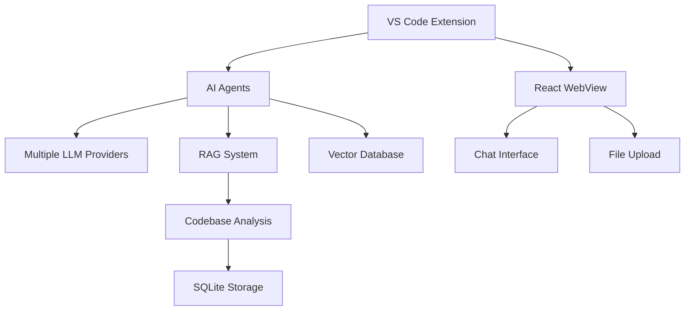
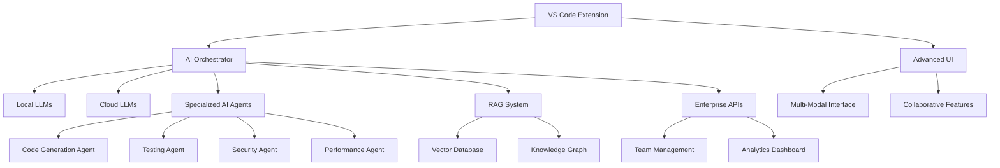

# 🚀 CodeBuddy Future Roadmap: Path to World-Class Coding Assistant

## 🎯 Vision Statement
Transform CodeBuddy from a powerful VS Code extension into the **definitive AI-powered development companion** that rivals GitHub Copilot, Cursor, and other market leaders while providing unique value through deep codebase understanding, comprehensive testing capabilities, and advanced development workflow automation.

---

## 📊 Current State Analysis

### ✅ **Strong Foundation (Version 3.4.4)**

#### Core Strengths
- **Multi-AI Provider Support**: Gemini, Anthropic Claude, Groq, DeepSeek, XGrok
- **RAG-Powered Codebase Understanding**: Deep architectural analysis with vector embeddings
- **AI Agent Orchestration**: Sophisticated multi-agent system for complex tasks
- **Context-Aware Code Completion**: Copilot-style inline suggestions
- **Comprehensive Documentation Generation**: Automated README and API docs
- **Modern React UI**: Beautiful, responsive chat interface
- **Robust Security**: Input validation, XSS protection, prompt injection prevention
- **Performance Optimizations**: Intelligent caching system
- **Enterprise-Ready**: SQLite storage, file upload, real-time data access

#### Current Capabilities
- **15+ Commands**: Code review, refactoring, optimization, explanation, etc.
- **File Format Support**: PDF, DOCX, CSV, JSON, TXT uploads
- **Web Search Integration**: Real-time external data access
- **Git Integration**: PR review, commit message generation
- **Pattern Recognition**: Learn from user codebase patterns

---

## 🚧 Critical Gaps & Missing Features

### 🔴 **High Priority Missing Features**

#### 1. **Advanced Code Generation**
- **Issue**: Limited code scaffolding and boilerplate generation
- **Current**: Basic code completion and explanations
- **Gap**: No full component/class/API endpoint generation from natural language

#### 2. **Multi-Language Support**
- **Issue**: Primarily TypeScript/JavaScript focused
- **Current**: Basic support for other languages
- **Gap**: Missing Python, Java, Go, Rust, C#, PHP specialized features

#### 3. **Real-Time Collaborative Features**
- **Issue**: Single-user experience only
- **Current**: Local workspace analysis
- **Gap**: No team sharing, collaborative contexts, or shared knowledge bases

#### 4. **Advanced Testing & Quality Assurance**
- **Issue**: Basic unit test generation
- **Current**: Simple test scaffolding
- **Gap**: Missing E2E testing, visual regression, performance testing, and test maintenance

#### 5. **Local LLM Support**
- **Issue**: Dependency on cloud AI services
- **Current**: 5 cloud providers only
- **Gap**: No Ollama, Local Llama, or edge computing support

### 🟡 **Medium Priority Gaps**

#### 6. **Advanced Debugging Capabilities**
- **Issue**: No integrated debugging assistance
- **Current**: Code explanation and error fixing
- **Gap**: Real-time debugging, log analysis, performance profiling

#### 7. **Project Templates & Scaffolding**
- **Issue**: No project initialization features
- **Current**: Document generation only
- **Gap**: Missing framework-specific project setup, best practices enforcement

#### 8. **CI/CD Integration**
- **Issue**: Limited DevOps workflow support
- **Current**: Git PR review only
- **Gap**: No GitHub Actions, pipeline optimization, deployment assistance

---

## 🎯 2024-2025 Development Roadmap

### 🚀 **Phase 1: Advanced Code Intelligence (Q4 2024 - Q1 2025)**

#### **1.1 Next-Generation Code Generation**
```typescript
// Target Capability
interface CodeGenerationEngine {
  generateFullComponent(description: string, framework: Framework): ComponentSpec;
  createAPIEndpoints(specification: OpenAPISpec): EndpointCollection;
  scaffoldProject(type: ProjectType, requirements: Requirements): ProjectStructure;
  generateTestSuites(codebase: CodebaseAnalysis): TestSuite[];
  createMigrations(schemaChanges: SchemaAnalysis): Migration[];
}
```

**Features:**
- **Smart Component Generation**: Full React/Vue/Angular components from descriptions
- **API Endpoint Scaffolding**: Complete REST/GraphQL endpoints with validation
- **Database Schema Generation**: Tables, relationships, migrations from requirements
- **Configuration File Generation**: Docker, Kubernetes, CI/CD configs from project analysis

**Implementation:**
- Extend current AI agents with specialized code generation tools
- Add template system with framework-specific scaffolding
- Implement code validation and best practices enforcement
- Create interactive generation wizard with preview capabilities

#### **1.2 Multi-Language Excellence**
```typescript
interface LanguageSupport {
  python: PythonAnalyzer & PythonGenerator & PythonTestRunner;
  java: JavaAnalyzer & SpringBootSupport & MavenGradleSupport;
  go: GoAnalyzer & GoModSupport & GoroutineAnalysis;
  rust: RustAnalyzer & CargoSupport & OwnershipAnalysis;
  csharp: CSharpAnalyzer & NETCoreSupport & NuGetSupport;
}
```

**Features:**
- **Language-Specific Analysis**: Framework detection, dependency analysis, best practices
- **Ecosystem Integration**: Package managers, build tools, testing frameworks
- **Cross-Language Recommendations**: Polyglot project support, technology selection advice
- **Migration Assistance**: Language-to-language code translation and modernization

**Implementation:**
- Create language-specific analyzer plugins
- Implement Abstract Syntax Tree (AST) parsing for each language
- Build framework-specific knowledge bases
- Add language-specific code completion and generation

#### **1.3 Local LLM Integration**
```typescript
interface LocalLLMSupport {
  ollama: OllamaProvider;
  llamaCpp: LlamaCppProvider;
  localModels: LocalModelRegistry;
  offlineMode: OfflineCapabilities;
}
```

**Features:**
- **Ollama Integration**: Seamless local model deployment and management
- **Model Selection**: Choose from Llama 2/3, Mistral, CodeLlama, etc.
- **Offline Capabilities**: Full functionality without internet connection
- **Privacy-First Mode**: Keep sensitive code completely local

**Implementation:**
- Extend LLM provider architecture to support local models
- Add model downloading and management interface
- Implement performance optimization for local inference
- Create fallback mechanisms between local and cloud models

### 🔧 **Phase 2: Advanced Development Workflow (Q2 2025 - Q3 2025)**

#### **2.1 Comprehensive Testing Ecosystem**
```typescript
interface TestingEcosystem {
  unitTesting: UnitTestGenerator & TestMaintenance;
  e2eTesting: E2ETestGenerator & PlaywrightSupport & CypressSupport;
  visualTesting: VisualRegressionTesting;
  performanceTesting: PerformanceTestGenerator & BenchmarkAnalysis;
  testMaintenance: TestUpdateManager & TestOptimizer;
}
```

**Features:**
- **Intelligent E2E Test Generation**: Create Playwright/Cypress tests from user flows
- **Visual Regression Testing**: Automated screenshot comparison and analysis
- **Performance Test Generation**: Load testing, stress testing, benchmark suites
- **Test Maintenance**: Automatic test updates when code changes
- **Test Coverage Analysis**: Identify untested code paths and suggest tests
- **Mutation Testing**: Generate mutants to verify test quality

**Implementation:**
- Integrate with popular testing frameworks (Jest, Vitest, Playwright, Cypress)
- Build test flow recording and analysis capabilities
- Create visual diff algorithms for UI testing
- Implement performance profiling and bottleneck detection

#### **2.2 Advanced Debugging & Profiling**
```typescript
interface DebuggingSupport {
  errorAnalysis: ErrorAnalyzer & StackTraceAnalysis;
  performanceProfiling: PerformanceProfiler & BottleneckDetector;
  logAnalysis: LogAnalyzer & PatternDetection;
  realTimeDebugging: LiveDebuggingAssistant;
}
```

**Features:**
- **Intelligent Error Analysis**: Analyze stack traces, suggest fixes, find related issues
- **Performance Profiling**: Memory leaks, CPU bottlenecks, database query optimization
- **Log Analysis**: Pattern detection, anomaly detection, correlation analysis
- **Real-Time Debugging**: Step-through assistance, variable inspection, breakpoint suggestions

**Implementation:**
- Integrate with VS Code debugging API
- Build performance monitoring and analysis tools
- Create log parsing and analysis algorithms
- Implement real-time code execution monitoring

#### **2.3 Project Templates & Scaffolding**
```typescript
interface ProjectScaffolding {
  templates: ProjectTemplateRegistry;
  bestPractices: BestPracticesEngine;
  architectureGuidance: ArchitecturalRecommendations;
  setupAutomation: ProjectSetupAutomation;
}
```

**Features:**
- **Framework Templates**: Next.js, React, Vue, Angular, Express, FastAPI, Spring Boot, etc.
- **Architecture Templates**: Microservices, monoliths, serverless, event-driven architectures
- **Best Practices Enforcement**: ESLint rules, prettier configs, Git hooks, CI/CD templates
- **Dependency Management**: Automated dependency selection and security updates

**Implementation:**
- Build comprehensive template system with customization options
- Create architecture analysis and recommendation engine
- Implement automated project setup and configuration
- Add dependency vulnerability scanning and update suggestions

### 🌐 **Phase 3: Collaborative & Enterprise Features (Q4 2025 - Q1 2026)**

#### **3.1 Team Collaboration & Knowledge Sharing**
```typescript
interface CollaborativeFeatures {
  teamContexts: SharedContextManager;
  knowledgeBase: TeamKnowledgeBase;
  codeReviews: AIEnhancedCodeReviews;
  teamInsights: TeamProductivityAnalytics;
}
```

**Features:**
- **Shared Context Repositories**: Team-wide code understanding and documentation
- **Collaborative AI Training**: Learn from team coding patterns and decisions
- **Enhanced Code Reviews**: AI-powered review suggestions, security analysis, best practices
- **Team Analytics**: Productivity insights, code quality metrics, knowledge gaps analysis
- **Onboarding Assistance**: Automated new team member guidance and code navigation

**Implementation:**
- Build secure cloud infrastructure for team data sharing
- Create team workspace synchronization mechanisms
- Implement role-based access control and permissions
- Add team analytics dashboard and reporting

#### **3.2 Advanced CI/CD Integration**
```typescript
interface CICDIntegration {
  pipelineOptimization: PipelineAnalyzer & OptimizationSuggestions;
  deploymentAssistance: DeploymentStrategyAdviser;
  securityScanning: SecurityVulnerabilityAnalysis;
  performanceMonitoring: DeploymentPerformanceTracking;
}
```

**Features:**
- **Pipeline Analysis**: Optimize build times, identify bottlenecks, suggest improvements
- **Deployment Strategy Guidance**: Blue-green, canary, rolling deployments based on project analysis
- **Security Integration**: SAST, DAST, dependency scanning integration
- **Infrastructure as Code**: Generate Terraform, CloudFormation, Kubernetes manifests

**Implementation:**
- Integrate with major CI/CD platforms (GitHub Actions, Jenkins, GitLab CI)
- Build pipeline analysis and optimization algorithms
- Create security scanning and reporting capabilities
- Implement infrastructure template generation

#### **3.3 Enterprise Security & Compliance**
```typescript
interface EnterpriseFeatures {
  securityCompliance: ComplianceChecker & SecurityAudit;
  dataGovernance: DataPrivacyManager & AuditTrail;
  ssoIntegration: SingleSignOnSupport;
  enterpriseDeployment: OnPremiseDeployment & AirGappedSupport;
}
```

**Features:**
- **Compliance Checking**: SOC2, GDPR, HIPAA, PCI-DSS compliance analysis
- **Security Auditing**: Code security analysis, vulnerability assessment, penetration testing insights
- **Data Privacy**: Sensitive data detection, privacy impact analysis, data flow mapping
- **Enterprise Deployment**: On-premise installation, air-gapped environments, corporate proxies

### 🚀 **Phase 4: Next-Generation AI Features (Q2 2026+)**

#### **4.1 Advanced AI Capabilities**
```typescript
interface NextGenAI {
  multiModalAI: ImageAnalysis & VideoProcessing & DiagramGeneration;
  codeEvolution: AutomaticRefactoring & TechnicalDebtReduction;
  predictiveAnalysis: BugPrediction & PerformancePrediction;
  naturalLanguageProgramming: ConversationalCoding;
}
```

**Features:**
- **Multi-Modal AI**: Analyze screenshots, generate diagrams, process design mockups
- **Predictive Bug Detection**: ML models trained on code patterns to predict issues
- **Automatic Refactoring**: Large-scale codebase modernization and technical debt reduction
- **Natural Language Programming**: Write code through conversation, explain requirements in plain English

#### **4.2 Advanced Analytics & Insights**
```typescript
interface AdvancedAnalytics {
  codeHealthMetrics: CodeQualityAnalytics & TechnicalDebtTracking;
  productivityInsights: DeveloperProductivityAnalysis;
  projectPredictions: TimelineEstimation & RiskAssessment;
  ecosystemAnalysis: DependencyHealthAnalysis & UpgradeRecommendations;
}
```

**Features:**
- **Code Health Dashboard**: Real-time code quality metrics, technical debt tracking
- **Productivity Analytics**: Development velocity analysis, bottleneck identification
- **Project Predictions**: Accurate timeline estimation, risk assessment, resource planning
- **Ecosystem Analysis**: Dependency health, security vulnerabilities, upgrade paths

---

## 🛠 Technical Implementation Strategy

### **Architecture Evolution**

#### **Current Architecture Strengths**


#### **Target Architecture (2026)**


### **Technology Stack Recommendations**

#### **Backend Extensions**
- **Local LLM**: Ollama, Llama.cpp, GGML models
- **Vector Database**: Upgrade to Chroma, Pinecone, or Weaviate for better performance
- **Knowledge Graph**: Neo4j or Amazon Neptune for complex relationship mapping
- **Message Queue**: Redis or RabbitMQ for agent coordination
- **Analytics**: ClickHouse or TimescaleDB for metrics storage

#### **Frontend Enhancements**
- **Advanced UI**: React with TypeScript, Zustand for state management
- **Visualization**: D3.js, Mermaid, PlantUML integration
- **Real-Time Updates**: WebSocket connections for live collaboration
- **Offline Support**: Service Workers for offline-first experience

#### **Development Tools**
- **Testing**: Comprehensive test suite with Jest, Playwright, and custom testing tools
- **Performance**: Monitoring with Prometheus, Grafana dashboards
- **Security**: SAST tools integration, dependency scanning
- **Documentation**: Auto-generated API docs, interactive tutorials

---

## 💡 Innovative Features That Set CodeBuddy Apart

### **1. Code Evolution Assistant**
- **Automatic Modernization**: Upgrade codebases to latest framework versions
- **Technical Debt Radar**: Continuously monitor and suggest debt reduction
- **Migration Paths**: Guided migrations between technologies (React to Vue, REST to GraphQL)

### **2. AI-Powered Code Reviews**
- **Context-Aware Reviews**: Understand business logic and architectural decisions
- **Learning from Team Patterns**: Adapt to team coding styles and preferences
- **Automated Review Scheduling**: Smart batching and prioritization of review requests

### **3. Predictive Development**
- **Bug Prediction**: ML models trained on historical data to predict likely bugs
- **Performance Prediction**: Estimate performance impact of code changes
- **Timeline Prediction**: Accurate development time estimates based on code analysis

### **4. Natural Language Codebase Interaction**
- **Conversational Querying**: "Show me all authentication-related code" → Interactive results
- **Natural Language Modifications**: "Make this component responsive" → Automatic implementation
- **Documentation Generation**: Convert comments to comprehensive documentation automatically

### **5. Advanced Security Intelligence**
- **Real-Time Vulnerability Detection**: Monitor for new security issues in dependencies
- **Privacy Impact Analysis**: Analyze code for potential privacy violations
- **Compliance Automation**: Ensure code meets industry standards (GDPR, HIPAA, SOC2)

---

## 📈 Success Metrics & KPIs

### **Developer Productivity**
- **Code Generation Speed**: 10x faster boilerplate creation
- **Bug Detection Rate**: 80% of bugs caught before production
- **Test Coverage**: Automated achievement of 90%+ test coverage
- **Documentation Coverage**: 95% of functions and modules documented

### **Code Quality**
- **Technical Debt Reduction**: 60% reduction in technical debt over 6 months
- **Code Review Efficiency**: 50% faster code review cycles
- **Security Vulnerability Detection**: 95% of security issues caught during development
- **Performance Optimization**: 40% improvement in application performance metrics

### **User Adoption**
- **Daily Active Users**: 100K+ developers using CodeBuddy daily
- **Feature Adoption**: 80% of users using advanced features within 30 days
- **Customer Satisfaction**: 4.8/5.0 average rating in VS Code marketplace
- **Enterprise Adoption**: 500+ enterprise customers using team features

---

## 🎯 Competitive Positioning

### **vs GitHub Copilot**
- **Advantage**: Deeper codebase understanding, multi-modal AI, local LLM support
- **Differentiation**: Focus on entire development workflow, not just code completion

### **vs Cursor**
- **Advantage**: More comprehensive testing features, better enterprise support
- **Differentiation**: Specialized agents for different development tasks

### **vs Tabnine**
- **Advantage**: Advanced project scaffolding, collaborative features
- **Differentiation**: Full development lifecycle support beyond code completion

### **vs Amazon CodeWhisperer**
- **Advantage**: Multi-cloud support, better framework integration
- **Differentiation**: Open-source LLM support, privacy-first approach

---

## 🚀 Implementation Timeline

### **2024 Q4**
- ✅ Local LLM integration (Ollama)
- ✅ Advanced code generation engine
- ✅ Multi-language support (Python, Java, Go)

### **2025 Q1**
- ✅ Comprehensive testing ecosystem
- ✅ Project template system
- ✅ Advanced debugging capabilities

### **2025 Q2**
- ✅ Team collaboration features
- ✅ Enhanced CI/CD integration
- ✅ Performance profiling tools

### **2025 Q3**
- ✅ Enterprise security features
- ✅ Advanced analytics dashboard
- ✅ Natural language programming

### **2025 Q4**
- ✅ Multi-modal AI capabilities
- ✅ Predictive development features
- ✅ Advanced code evolution tools

### **2026+**
- 🔮 Next-generation AI features
- 🔮 Global developer community platform
- 🔮 AI-powered development methodology

---

## 💼 Business Impact

### **Revenue Opportunities**
- **Pro Tier**: Advanced features, priority support ($19/month)
- **Team Tier**: Collaborative features, team analytics ($39/user/month)
- **Enterprise Tier**: On-premise, compliance, custom integrations ($99/user/month)
- **Consulting Services**: Custom AI model training, enterprise integration

### **Market Positioning**
- **Target Market**: 50M+ developers worldwide
- **Addressable Market**: $30B+ developer tools market
- **Growth Strategy**: Community-first approach, open-source contributions, developer advocacy

---

## 🔮 Long-term Vision (2030)

### **The Ultimate Development Companion**
CodeBuddy will become the **primary interface between developers and code**, transforming how software is built:

- **AI-First Development**: Natural language requirements → Working applications
- **Zero-Bug Development**: AI catches and fixes issues before they reach production
- **Collaborative Intelligence**: Teams work with AI as a senior developer partner
- **Universal Code Understanding**: Support for every programming language and framework
- **Predictive Development**: AI predicts and prevents technical problems before they occur

### **Developer Ecosystem**
- **CodeBuddy Cloud**: Centralized platform for team collaboration and AI model sharing
- **Community Marketplace**: Developers share custom agents, templates, and best practices
- **Education Platform**: AI-powered coding tutorials and mentorship
- **Research Initiatives**: Advancing the state of AI in software development

---

## 🏁 Getting Started

### **Immediate Actions (Next 30 Days)**
1. **Conduct User Research**: Survey current users about most needed features
2. **Technical Feasibility Study**: Evaluate local LLM integration options
3. **Competitive Analysis**: Deep dive into competing products and features
4. **Team Expansion**: Hire AI/ML engineers and frontend developers
5. **Partnership Exploration**: Engage with Ollama, Hugging Face, and other AI platform providers

### **Development Priorities**
1. **Local LLM Support** - Critical for privacy and offline usage
2. **Multi-Language Support** - Essential for broader developer adoption
3. **Advanced Testing Features** - High-value differentiator from competitors
4. **Team Collaboration** - Key for enterprise market penetration

---

## 📞 Next Steps

This roadmap represents an ambitious but achievable vision for CodeBuddy's evolution into a world-class coding assistant. The key to success will be:

1. **User-Centric Development**: Continuously gather feedback and iterate based on real developer needs
2. **Technical Excellence**: Maintain high code quality and performance standards
3. **Community Building**: Foster an active community of developers and contributors
4. **Strategic Partnerships**: Collaborate with AI providers, cloud platforms, and development tool vendors
5. **Innovation Focus**: Stay at the forefront of AI and developer tooling advances

**CodeBuddy is positioned to become the definitive AI-powered development companion that every developer relies on to write better code faster.**

---

*This roadmap is a living document that should be updated quarterly based on market feedback, technical developments, and strategic priorities.*