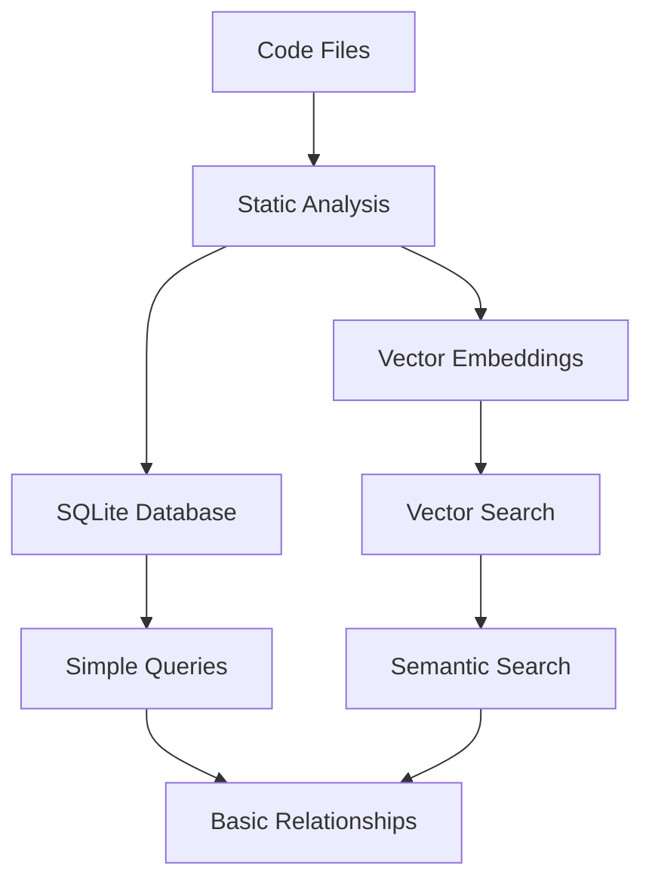
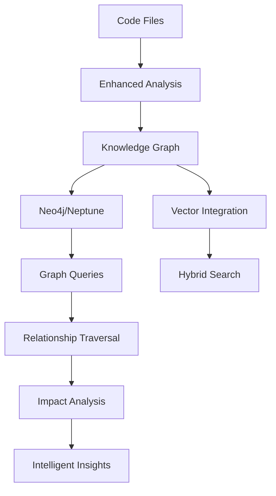

# 🕸️ Knowledge Graph Implementation for CodeBuddy

## 🎯 Overview

A Knowledge Graph system will transform CodeBuddy's codebase understanding from flat analysis to rich, interconnected relationship mapping. This will enable advanced features like dependency visualization, impact analysis, and intelligent code navigation.

---

## 🏗️ Architecture Comparison

### **Current Architecture (SQLite + Vector Embeddings)**


**Limitations:**
- ❌ Flat relationship storage
- ❌ Limited querying capabilities  
- ❌ No graph traversal
- ❌ Difficult impact analysis
- ❌ No complex relationship inference

### **Target Architecture (Knowledge Graph)**


**Advantages:**
- ✅ Rich relationship modeling
- ✅ Complex graph traversal
- ✅ Advanced pattern detection
- ✅ Impact analysis
- ✅ Relationship inference

---

## 📊 Knowledge Graph Schema Design

### **Core Node Types**

#### **1. Code Structure Nodes**
```cypher
// File Node
CREATE (f:File {
  path: "/src/services/user.service.ts",
  name: "user.service.ts",
  type: "TypeScript",
  size: 1024,
  lastModified: "2025-08-20T10:30:00Z",
  complexity: 15,
  testCoverage: 85
})

// Class Node
CREATE (c:Class {
  name: "UserService",
  filePath: "/src/services/user.service.ts",
  lineStart: 10,
  lineEnd: 150,
  isAbstract: false,
  isExported: true,
  accessModifier: "public"
})

// Method Node
CREATE (m:Method {
  name: "createUser",
  className: "UserService",
  returnType: "Promise<User>",
  parameters: ["userData: CreateUserDto"],
  complexity: 8,
  isAsync: true,
  isStatic: false,
  visibility: "public"
})

// Property Node
CREATE (p:Property {
  name: "database",
  className: "UserService",
  type: "DatabaseService",
  isPrivate: true,
  isReadonly: true
})

// Interface Node
CREATE (i:Interface {
  name: "User",
  filePath: "/src/interfaces/user.interface.ts",
  properties: ["id", "name", "email", "createdAt"],
  isExported: true
})
```

#### **2. Dependency Nodes**
```cypher
// Package Node
CREATE (pkg:Package {
  name: "express",
  version: "4.18.0",
  type: "dependency",
  isDevDependency: false,
  source: "npm"
})

// Import Node
CREATE (imp:Import {
  from: "/src/services/user.service.ts",
  module: "express",
  importedItems: ["Router", "Request", "Response"],
  isDefault: false,
  isNamespace: false
})
```

#### **3. Business Logic Nodes**
```cypher
// API Endpoint Node
CREATE (api:Endpoint {
  path: "/api/users",
  method: "POST",
  handler: "UserController.createUser",
  middleware: ["auth", "validation"],
  responseType: "User",
  isAuthenticated: true
})

// Database Entity Node
CREATE (entity:Entity {
  name: "User",
  tableName: "users",
  schema: "public",
  primaryKey: "id",
  columns: ["id", "name", "email", "created_at"],
  indexes: ["email"]
})

// Configuration Node
CREATE (config:Config {
  name: "database",
  type: "connection",
  environment: "development",
  sensitive: true,
  usedBy: ["UserService", "AuthService"]
})
```

### **Relationship Types**

#### **1. Structural Relationships**
```cypher
// File contains Class
(file:File)-[:CONTAINS]->(class:Class)

// Class has Method
(class:Class)-[:HAS_METHOD]->(method:Method)

// Class has Property
(class:Class)-[:HAS_PROPERTY]->(property:Property)

// Class implements Interface
(class:Class)-[:IMPLEMENTS]->(interface:Interface)

// Class extends Class
(childClass:Class)-[:EXTENDS]->(parentClass:Class)
```

#### **2. Dependency Relationships**
```cypher
// File imports from Package
(file:File)-[:IMPORTS {items: ["Router"]}]->(package:Package)

// Method calls Method
(caller:Method)-[:CALLS {frequency: 5}]->(callee:Method)

// Class depends on Class
(dependent:Class)-[:DEPENDS_ON {type: "injection"}]->(dependency:Class)

// Method uses Entity
(method:Method)-[:USES {operation: "CREATE"}]->(entity:Entity)
```

#### **3. Business Relationships**
```cypher
// Endpoint handled by Method
(endpoint:Endpoint)-[:HANDLED_BY]->(method:Method)

// Method accesses Config
(method:Method)-[:ACCESSES]->(config:Config)

// Entity maps to Interface
(entity:Entity)-[:MAPS_TO]->(interface:Interface)

// Test covers Method
(test:Test)-[:COVERS]->(method:Method)
```

---

## 🛠️ Implementation Options

### **Option 1: Neo4j (Recommended for Development)**

#### **Advantages:**
- ✅ Native graph database
- ✅ Powerful Cypher query language
- ✅ Excellent developer tools (Neo4j Browser)
- ✅ Rich graph algorithms library
- ✅ Strong community support
- ✅ Easy local development

#### **Implementation:**

##### **1. Neo4j Service Layer**
```typescript
// src/services/neo4j.service.ts
import neo4j, { Driver, Session, Result } from 'neo4j-driver';
import { Logger } from '../infrastructure/logger/logger';

export interface GraphNode {
  id?: string;
  labels: string[];
  properties: Record<string, any>;
}

export interface GraphRelationship {
  type: string;
  from: string;
  to: string;
  properties?: Record<string, any>;
}

export class Neo4jService {
  private driver: Driver;
  private logger: Logger;

  constructor() {
    this.driver = neo4j.driver(
      process.env.NEO4J_URI || 'bolt://localhost:7687',
      neo4j.auth.basic(
        process.env.NEO4J_USERNAME || 'neo4j',
        process.env.NEO4J_PASSWORD || 'password'
      )
    );
    
    this.logger = Logger.initialize('Neo4jService');
  }

  async createNode(node: GraphNode): Promise<string> {
    const session = this.driver.session();
    try {
      const labels = node.labels.join(':');
      const query = `
        CREATE (n:${labels} $properties)
        RETURN elementId(n) as id
      `;
      
      const result = await session.run(query, { properties: node.properties });
      return result.records[0].get('id');
    } finally {
      await session.close();
    }
  }

  async createRelationship(rel: GraphRelationship): Promise<void> {
    const session = this.driver.session();
    try {
      const query = `
        MATCH (a), (b)
        WHERE elementId(a) = $fromId AND elementId(b) = $toId
        CREATE (a)-[r:${rel.type} $properties]->(b)
        RETURN r
      `;
      
      await session.run(query, {
        fromId: rel.from,
        toId: rel.to,
        properties: rel.properties || {}
      });
    } finally {
      await session.close();
    }
  }

  async executeQuery(query: string, parameters: Record<string, any> = {}): Promise<Result> {
    const session = this.driver.session();
    try {
      return await session.run(query, parameters);
    } finally {
      await session.close();
    }
  }

  async findImpactAnalysis(nodeId: string, depth: number = 3): Promise<any[]> {
    const query = `
      MATCH path = (start)-[*1..${depth}]-(affected)
      WHERE elementId(start) = $nodeId
      RETURN path, affected
      ORDER BY length(path) ASC
    `;
    
    const result = await this.executeQuery(query, { nodeId });
    return result.records.map(record => ({
      path: record.get('path'),
      affected: record.get('affected').properties
    }));
  }

  async findDependencyChain(startNode: string, endNode: string): Promise<any[]> {
    const query = `
      MATCH path = shortestPath((start)-[*]-(end))
      WHERE elementId(start) = $startNode AND elementId(end) = $endNode
      RETURN path
    `;
    
    const result = await this.executeQuery(query, { startNode, endNode });
    return result.records.map(record => record.get('path'));
  }
}
```

##### **2. Code Analysis to Graph Mapper**
```typescript
// src/services/code-graph-mapper.service.ts
import { Neo4jService, GraphNode, GraphRelationship } from './neo4j.service';
import { CodebaseUnderstandingService } from './codebase-understanding.service';

export interface CodeAnalysisResult {
  files: FileNode[];
  classes: ClassNode[];
  methods: MethodNode[];
  dependencies: DependencyEdge[];
  imports: ImportEdge[];
}

export class CodeGraphMapperService {
  private neo4j: Neo4jService;
  private codebaseService: CodebaseUnderstandingService;

  constructor() {
    this.neo4j = new Neo4jService();
    this.codebaseService = CodebaseUnderstandingService.getInstance();
  }

  async buildKnowledgeGraph(): Promise<void> {
    // 1. Analyze codebase
    const analysis = await this.analyzeCodebase();
    
    // 2. Create nodes
    await this.createNodes(analysis);
    
    // 3. Create relationships
    await this.createRelationships(analysis);
    
    // 4. Add semantic relationships
    await this.inferSemanticRelationships();
  }

  private async analyzeCodebase(): Promise<CodeAnalysisResult> {
    // Enhanced analysis with AST parsing
    const workspaceFiles = await this.codebaseService.getAllFiles();
    const analysis: CodeAnalysisResult = {
      files: [],
      classes: [],
      methods: [],
      dependencies: [],
      imports: []
    };

    for (const file of workspaceFiles) {
      const fileAnalysis = await this.analyzeFile(file);
      analysis.files.push(fileAnalysis.file);
      analysis.classes.push(...fileAnalysis.classes);
      analysis.methods.push(...fileAnalysis.methods);
      analysis.imports.push(...fileAnalysis.imports);
    }

    return analysis;
  }

  private async createNodes(analysis: CodeAnalysisResult): Promise<void> {
    // Create File nodes
    for (const file of analysis.files) {
      const node: GraphNode = {
        labels: ['File'],
        properties: {
          path: file.path,
          name: file.name,
          type: file.extension,
          size: file.size,
          complexity: file.complexity
        }
      };
      await this.neo4j.createNode(node);
    }

    // Create Class nodes
    for (const cls of analysis.classes) {
      const node: GraphNode = {
        labels: ['Class'],
        properties: {
          name: cls.name,
          filePath: cls.filePath,
          isAbstract: cls.isAbstract,
          isExported: cls.isExported
        }
      };
      await this.neo4j.createNode(node);
    }

    // Create Method nodes
    for (const method of analysis.methods) {
      const node: GraphNode = {
        labels: ['Method'],
        properties: {
          name: method.name,
          className: method.className,
          returnType: method.returnType,
          parameters: method.parameters,
          complexity: method.complexity
        }
      };
      await this.neo4j.createNode(node);
    }
  }

  async findRelatedCode(query: string): Promise<any[]> {
    const cypher = `
      MATCH (n)
      WHERE n.name CONTAINS $query OR n.description CONTAINS $query
      MATCH path = (n)-[*1..2]-(related)
      RETURN n, related, path
      LIMIT 20
    `;
    
    const result = await this.neo4j.executeQuery(cypher, { query });
    return result.records.map(record => ({
      source: record.get('n').properties,
      related: record.get('related').properties,
      relationship: record.get('path')
    }));
  }
}
```

##### **3. Graph Query Service**
```typescript
// src/services/graph-query.service.ts
export class GraphQueryService {
  private neo4j: Neo4jService;

  constructor() {
    this.neo4j = new Neo4jService();
  }

  async findCircularDependencies(): Promise<any[]> {
    const query = `
      MATCH path = (n)-[:DEPENDS_ON*2..10]->(n)
      RETURN path, nodes(path) as cycle
    `;
    
    const result = await this.neo4j.executeQuery(query);
    return result.records.map(record => ({
      cycle: record.get('cycle').map((node: any) => node.properties.name)
    }));
  }

  async findUnusedCode(): Promise<any[]> {
    const query = `
      MATCH (n:Method)
      WHERE NOT exists((n)<-[:CALLS]-())
      AND NOT n.isEntryPoint = true
      RETURN n.name as method, n.className as class
    `;
    
    const result = await this.neo4j.executeQuery(query);
    return result.records.map(record => ({
      method: record.get('method'),
      class: record.get('class')
    }));
  }

  async findHighCouplingComponents(): Promise<any[]> {
    const query = `
      MATCH (n:Class)
      MATCH (n)-[:DEPENDS_ON]->(dependency)
      WITH n, count(dependency) as dependencyCount
      WHERE dependencyCount > 10
      RETURN n.name as className, dependencyCount
      ORDER BY dependencyCount DESC
    `;
    
    const result = await this.neo4j.executeQuery(query);
    return result.records.map(record => ({
      className: record.get('className'),
      dependencyCount: record.get('dependencyCount').toNumber()
    }));
  }

  async suggestRefactoring(className: string): Promise<any[]> {
    const query = `
      MATCH (target:Class {name: $className})
      MATCH (target)-[:HAS_METHOD]->(method:Method)
      MATCH (method)-[:CALLS]->(calledMethod:Method)
      MATCH (calledMethod)<-[:HAS_METHOD]-(calledClass:Class)
      WITH calledClass, count(calledMethod) as callCount
      WHERE callCount > 3 AND calledClass.name <> $className
      RETURN calledClass.name as suggestedInterface, callCount
      ORDER BY callCount DESC
    `;
    
    const result = await this.neo4j.executeQuery(query, { className });
    return result.records.map(record => ({
      suggestedInterface: record.get('suggestedInterface'),
      callCount: record.get('callCount').toNumber()
    }));
  }
}
```

### **Option 2: Amazon Neptune (Recommended for Production)**

#### **Advantages:**
- ✅ Fully managed AWS service
- ✅ Automatic scaling
- ✅ Built-in security
- ✅ Supports both Gremlin and SPARQL
- ✅ Integration with AWS ecosystem
- ✅ High availability

#### **Implementation:**

##### **1. Neptune Service Layer**
```typescript
// src/services/neptune.service.ts
import { DriverRemoteConnection, GraphTraversalSource } from 'gremlin';
import { AnonymousTraversalSource } from 'gremlin/lib/process/anonymous-traversal';

export class NeptuneService {
  private g: GraphTraversalSource;
  private connection: DriverRemoteConnection;

  constructor() {
    this.connection = new DriverRemoteConnection(
      process.env.NEPTUNE_ENDPOINT || 'wss://your-neptune-cluster.cluster-ro-123456.us-east-1.neptune.amazonaws.com:8182/gremlin'
    );
    
    this.g = AnonymousTraversalSource.traversal().withRemote(this.connection);
  }

  async addVertex(label: string, properties: Record<string, any>): Promise<any> {
    let traversal = this.g.addV(label);
    
    for (const [key, value] of Object.entries(properties)) {
      traversal = traversal.property(key, value);
    }
    
    return await traversal.next();
  }

  async addEdge(fromId: string, toId: string, label: string, properties: Record<string, any> = {}): Promise<any> {
    let traversal = this.g.V(fromId).addE(label).to(this.g.V(toId));
    
    for (const [key, value] of Object.entries(properties)) {
      traversal = traversal.property(key, value);
    }
    
    return await traversal.next();
  }

  async findImpactAnalysis(vertexId: string, maxDepth: number = 3): Promise<any[]> {
    const result = await this.g
      .V(vertexId)
      .repeat(this.g.both().simplePath())
      .times(maxDepth)
      .path()
      .toList();
    
    return result;
  }

  async findShortestPath(fromId: string, toId: string): Promise<any> {
    const result = await this.g
      .V(fromId)
      .shortestPath()
      .to(this.g.V(toId))
      .next();
    
    return result.value;
  }

  async close(): Promise<void> {
    await this.connection.close();
  }
}
```

---

## 📈 Advanced Features Enabled by Knowledge Graph

### **1. Impact Analysis**
```typescript
// src/services/impact-analysis.service.ts
export class ImpactAnalysisService {
  private graphQuery: GraphQueryService;

  async analyzeChangeImpact(filePath: string): Promise<ImpactAnalysis> {
    const query = `
      MATCH (file:File {path: $filePath})
      MATCH (file)-[:CONTAINS]->(class:Class)
      MATCH (class)-[:HAS_METHOD]->(method:Method)
      MATCH (method)<-[:CALLS]-(dependent:Method)
      MATCH (dependent)<-[:HAS_METHOD]-(dependentClass:Class)
      MATCH (dependentClass)<-[:CONTAINS]-(dependentFile:File)
      
      RETURN DISTINCT dependentFile.path as affectedFile,
             dependentClass.name as affectedClass,
             dependent.name as affectedMethod,
             method.name as changedMethod
    `;

    const result = await this.graphQuery.executeQuery(query, { filePath });
    
    return {
      changedFile: filePath,
      affectedFiles: result.records.map(record => ({
        file: record.get('affectedFile'),
        class: record.get('affectedClass'),
        method: record.get('affectedMethod'),
        reason: `Calls ${record.get('changedMethod')}`
      })),
      riskLevel: this.calculateRiskLevel(result.records.length)
    };
  }
}
```

### **2. Architectural Insights**
```typescript
// src/services/architectural-insights.service.ts
export class ArchitecturalInsightsService {
  async detectAntiPatterns(): Promise<AntiPattern[]> {
    const patterns: AntiPattern[] = [];

    // God Class Detection
    const godClasses = await this.findGodClasses();
    patterns.push(...godClasses);

    // Circular Dependencies
    const circularDeps = await this.findCircularDependencies();
    patterns.push(...circularDeps);

    // Dead Code
    const deadCode = await this.findDeadCode();
    patterns.push(...deadCode);

    return patterns;
  }

  private async findGodClasses(): Promise<AntiPattern[]> {
    const query = `
      MATCH (c:Class)-[:HAS_METHOD]->(m:Method)
      WITH c, count(m) as methodCount
      WHERE methodCount > 20
      RETURN c.name as className, c.filePath as filePath, methodCount
    `;

    const result = await this.graphQuery.executeQuery(query);
    return result.records.map(record => ({
      type: 'GodClass',
      location: {
        class: record.get('className'),
        file: record.get('filePath')
      },
      severity: 'HIGH',
      description: `Class has ${record.get('methodCount')} methods (recommended: < 20)`,
      suggestion: 'Consider breaking this class into smaller, focused classes'
    }));
  }
}
```

### **3. Code Navigation Enhancement**
```typescript
// src/services/smart-navigation.service.ts
export class SmartNavigationService {
  async findRelatedCode(currentFile: string, context: string): Promise<RelatedCode[]> {
    const query = `
      MATCH (current:File {path: $currentFile})
      MATCH (current)-[:CONTAINS]->(currentClass:Class)
      
      // Find semantically related classes
      MATCH (relatedClass:Class)
      WHERE relatedClass.name CONTAINS $context
         OR relatedClass.description CONTAINS $context
      
      MATCH (relatedClass)<-[:CONTAINS]-(relatedFile:File)
      
      // Calculate relationship strength
      OPTIONAL MATCH path = (currentClass)-[*1..3]-(relatedClass)
      
      RETURN DISTINCT relatedFile.path as file,
             relatedClass.name as class,
             length(path) as relationshipDistance,
             CASE 
               WHEN path IS NULL THEN 0
               ELSE 10 - length(path)
             END as relevanceScore
      
      ORDER BY relevanceScore DESC
      LIMIT 10
    `;

    const result = await this.graphQuery.executeQuery(query, {
      currentFile,
      context
    });

    return result.records.map(record => ({
      file: record.get('file'),
      class: record.get('class'),
      relevanceScore: record.get('relevanceScore'),
      relationshipDistance: record.get('relationshipDistance')
    }));
  }
}
```

---

## 🚀 Integration with Existing CodeBuddy Features

### **1. Enhanced Chat Interface**
```typescript
// Enhanced codebase understanding for chat
export class EnhancedCodebaseUnderstanding {
  async getContextualAnswer(question: string): Promise<string> {
    // Use graph queries to find relevant code
    const relatedNodes = await this.graphQuery.findRelatedCode(question);
    
    // Combine with existing RAG system
    const vectorResults = await this.contextRetriever.retrieveContext(question);
    
    // Merge graph relationships with vector similarity
    const enhancedContext = this.mergeGraphAndVector(relatedNodes, vectorResults);
    
    return this.generateAnswer(question, enhancedContext);
  }
}
```

### **2. Improved Documentation Generation**
```typescript
// Generate architecture diagrams from graph
export class DocumentationGenerator {
  async generateArchitectureDiagram(): Promise<string> {
    const components = await this.graphQuery.findComponents();
    const relationships = await this.graphQuery.findComponentRelationships();
    
    return this.generateMermaidDiagram(components, relationships);
  }
}
```

### **3. Advanced Code Review**
```typescript
// Use graph for intelligent code review
export class GraphEnhancedCodeReview {
  async reviewChanges(changedFiles: string[]): Promise<ReviewInsight[]> {
    const insights: ReviewInsight[] = [];
    
    for (const file of changedFiles) {
      // Analyze impact using graph
      const impact = await this.impactAnalysis.analyzeChangeImpact(file);
      
      // Check for architectural violations
      const violations = await this.architecturalInsights.checkViolations(file);
      
      insights.push({
        file,
        impact,
        violations,
        recommendations: this.generateRecommendations(impact, violations)
      });
    }
    
    return insights;
  }
}
```

---

## 🛠️ Setup and Configuration

### **Neo4j Setup (Development)**

#### **1. Docker Compose Configuration**
```yaml
# docker-compose.yml
version: '3.8'
services:
  neo4j:
    image: neo4j:5.12
    container_name: codebuddy-neo4j
    ports:
      - "7474:7474"  # HTTP
      - "7687:7687"  # Bolt
    environment:
      NEO4J_AUTH: neo4j/codebuddy123
      NEO4J_PLUGINS: '["apoc", "graph-data-science"]'
      NEO4J_apoc_export_file_enabled: true
      NEO4J_apoc_import_file_enabled: true
    volumes:
      - neo4j_data:/data
      - neo4j_logs:/logs
      - neo4j_import:/var/lib/neo4j/import
      - neo4j_plugins:/plugins

volumes:
  neo4j_data:
  neo4j_logs:
  neo4j_import:
  neo4j_plugins:
```

#### **2. VS Code Settings Integration**
```json
// package.json - Add configuration
{
  "configuration": {
    "properties": {
      "codebuddy.graph.enabled": {
        "type": "boolean",
        "default": false,
        "description": "Enable knowledge graph features"
      },
      "codebuddy.graph.provider": {
        "type": "string",
        "enum": ["neo4j", "neptune"],
        "default": "neo4j",
        "description": "Knowledge graph provider"
      },
      "codebuddy.neo4j.uri": {
        "type": "string",
        "default": "bolt://localhost:7687",
        "description": "Neo4j connection URI"
      },
      "codebuddy.neptune.endpoint": {
        "type": "string",
        "description": "Amazon Neptune cluster endpoint"
      }
    }
  }
}
```

### **Neptune Setup (Production)**

#### **1. Infrastructure as Code (CDK)**
```typescript
// infrastructure/neptune-stack.ts
import * as cdk from 'aws-cdk-lib';
import * as neptune from 'aws-cdk-lib/aws-neptune';
import * as ec2 from 'aws-cdk-lib/aws-ec2';

export class NeptuneStack extends cdk.Stack {
  constructor(scope: Construct, id: string, props?: cdk.StackProps) {
    super(scope, id, props);

    const vpc = new ec2.Vpc(this, 'CodebuddyVPC');

    const neptuneCluster = new neptune.DatabaseCluster(this, 'CodebuddyGraph', {
      engine: neptune.DatabaseEngine.NEPTUNE,
      instanceType: neptune.InstanceType.R5_LARGE,
      vpc,
      instances: 2,
      storageEncrypted: true,
      deletionProtection: true,
    });

    new cdk.CfnOutput(this, 'NeptuneEndpoint', {
      value: neptuneCluster.clusterEndpoint.socketAddress,
    });
  }
}
```

---

## 📊 Performance Considerations

### **Data Volume Estimates**
```typescript
interface GraphMetrics {
  // For a typical medium project (100k LOC)
  estimatedNodes: {
    files: 500;
    classes: 1000;
    methods: 5000;
    properties: 2000;
    interfaces: 300;
    endpoints: 100;
    entities: 50;
  };
  
  estimatedRelationships: {
    contains: 6500;        // File contains Class/Method
    dependencies: 3000;    // Class depends on Class
    calls: 15000;         // Method calls Method
    implements: 500;       // Class implements Interface
    uses: 2000;           // Method uses Entity
  };
  
  totalNodes: 8950;
  totalRelationships: 27000;
  estimatedSize: "~500MB"; // Including indexes
}
```

### **Query Optimization**
```cypher
-- Create indexes for performance
CREATE INDEX file_path_index FOR (f:File) ON (f.path);
CREATE INDEX class_name_index FOR (c:Class) ON (c.name);
CREATE INDEX method_name_index FOR (m:Method) ON (m.name);

-- Composite indexes for complex queries
CREATE INDEX class_file_index FOR (c:Class) ON (c.name, c.filePath);
```

### **Caching Strategy**
```typescript
export class GraphCacheService {
  private cache = new Map<string, any>();
  private ttl = 30 * 60 * 1000; // 30 minutes

  async getCachedQuery(queryKey: string, queryFn: () => Promise<any>): Promise<any> {
    const cached = this.cache.get(queryKey);
    if (cached && Date.now() - cached.timestamp < this.ttl) {
      return cached.data;
    }

    const result = await queryFn();
    this.cache.set(queryKey, {
      data: result,
      timestamp: Date.now()
    });

    return result;
  }
}
```

---

## 🎯 Implementation Roadmap

### **Phase 1: Foundation (4-6 weeks)**
- ✅ Neo4j service layer implementation
- ✅ Basic code analysis to graph mapping
- ✅ Core node and relationship types
- ✅ Simple graph queries (find dependencies, find calls)

### **Phase 2: Core Features (6-8 weeks)**
- ✅ Impact analysis service
- ✅ Circular dependency detection
- ✅ Dead code identification
- ✅ Integration with existing codebase understanding

### **Phase 3: Advanced Analytics (8-10 weeks)**
- ✅ Architectural insights and anti-pattern detection
- ✅ Smart code navigation
- ✅ Graph-enhanced code review
- ✅ Performance optimization recommendations

### **Phase 4: Production Features (6-8 weeks)**
- ✅ Neptune integration for cloud deployment
- ✅ Advanced caching and performance optimization
- ✅ Graph visualization in VS Code
- ✅ Team collaboration features with shared graphs

### **Phase 5: AI Enhancement (4-6 weeks)**
- ✅ Graph neural networks for pattern recognition
- ✅ Predictive analysis (code smell prediction)
- ✅ Automated refactoring suggestions
- ✅ Intelligent code generation based on graph patterns

---

## 🌟 Unique Value Propositions

### **1. Holistic Code Understanding**
- **Before**: "What does this function do?"
- **After**: "What does this function do, what depends on it, what would break if changed, and what patterns does it follow?"

### **2. Intelligent Impact Analysis**
- **Before**: Manual code review and testing
- **After**: Automated impact analysis showing exactly what will be affected by changes

### **3. Architectural Evolution Tracking**
- **Before**: Static documentation that gets outdated
- **After**: Live architectural insights that evolve with the code

### **4. Predictive Code Quality**
- **Before**: Reactive bug fixing
- **After**: Predictive identification of code that's likely to cause issues

---

## 💰 Cost Analysis

### **Development Costs**
- **Neo4j Development**: 20-24 weeks of development
- **Neptune Production**: Additional 4-6 weeks for cloud integration
- **Infrastructure**: $200-500/month for Neptune (depending on usage)

### **ROI Benefits**
- **Reduced Debug Time**: 40-60% reduction in time spent understanding code relationships
- **Faster Onboarding**: New team members understand codebase 70% faster
- **Better Architecture**: Proactive identification of architectural issues
- **Reduced Technical Debt**: Automated detection and suggestions for improvement

---

## 🏁 Conclusion

The Knowledge Graph implementation would transform CodeBuddy from a code analysis tool to an **intelligent code companion** that understands not just what code does, but how everything connects, what depends on what, and how changes will propagate through the system.

This feature would position CodeBuddy as a unique player in the AI coding assistant space, offering capabilities that neither GitHub Copilot nor other competitors currently provide.

**Next Steps:**
1. **Proof of Concept**: Implement basic Neo4j integration with simple graph queries
2. **User Feedback**: Test with real codebases to validate value proposition  
3. **Production Planning**: Design Neptune architecture for scalable deployment
4. **Feature Prioritization**: Identify which graph features provide the most immediate value

The knowledge graph represents the next evolution in code understanding – from flat analysis to rich, interconnected intelligence.