# 🚀 CodeBuddy MCP + A2A Integration Roadmap

## 📋 Executive Summary

This roadmap outlines the strategic implementation of Model Context Protocol (MCP) and Agent-to-Agent (A2A) integration into CodeBuddy, transforming it from an AI-powered VS Code extension into a comprehensive, intelligent development ecosystem. Based on thorough analysis of official MCP and A2A specifications, this roadmap ensures 100% compliance with architectural patterns while prioritizing security as the foundational requirement.

**Strategic Goal**: Transform CodeBuddy into the definitive AI development platform through:

- **Single MCP Server** hosting all development tools (official MCP pattern)
- **Specialized A2A Agent Servers** for intelligent task coordination
- **Comprehensive LLM Management** with multi-provider support and intelligent reasoning
- **Complete Request Flow** from user input to AI-generated responses
- **Security-Hardened Multi-Agent System** protecting against untrusted agent threats
- **Human-in-the-Loop Orchestration** maintaining developer control

## 🏗️ Architecture Foundation

### **Official Patterns Alignment**

#### **MCP Architecture (Official Specification)**

```
CodeBuddy VS Code Extension (MCP Host)
    ↓
Multiple MCP Clients (one per specialized agent)
    ↓
Single CodeBuddy MCP Server (hosts ALL tools)
    ↓
Filtered Tool Access (agents use domain-specific tools)
```

#### **A2A Architecture (Official @a2a-js/sdk Pattern)**

```
CodeBuddy A2A Orchestrator (A2A Client)
    ↓
Agent Servers (Express.js + A2AExpressApp)
    ↓
Agent Executors (implement AgentExecutor interface)
    ↓
Task-Based Coordination (rich state + artifacts + streaming)
```

#### **Combined Architecture**

```mermaid
graph TB
    subgraph "CodeBuddy Extension (MCP Host + A2A Client)"
        CE[VS Code Extension]
        A2AO[A2A Orchestrator]
        UI[React Chat UI]
        DB[(SQLite Cache)]
    end

    subgraph "Specialized A2A Agent Servers"
        subgraph "Database Agent (:4001)"
            DAS[A2A Express Server]
            DAE[Database Agent Executor]
            DAM[MCP Client Connection]
        end

        subgraph "Git Agent (:4002)"
            GAS[A2A Express Server]
            GAE[Git Agent Executor]
            GAM[MCP Client Connection]
        end

        subgraph "Code Agent (:4003)"
            CAS[A2A Express Server]
            CAE[Code Agent Executor]
            CAM[MCP Client Connection]
        end

        subgraph "File Agent (:4004)"
            FAS[A2A Express Server]
            FAE[File Agent Executor]
            FAM[MCP Client Connection]
        end
    end

    subgraph "LLM Management Layer"
        LLM[LLM Manager Service]
        subgraph "Multi-Provider Support"
            ANTH[Anthropic/Claude]
            OPENAI[OpenAI/GPT]
            GEM[Google/Gemini]
            GROQ[Groq/Mixtral]
            DEEP[DeepSeek]
        end
    end

    subgraph "Single CodeBuddy MCP Server"
        MCP[MCP Server]

        subgraph "All Development Tools"
            DBT[Database Tools:<br/>• execute_query<br/>• get_schema<br/>• optimize_query<br/>• analyze_performance]
            GT[Git Tools:<br/>• git_status<br/>• git_log<br/>• create_branch<br/>• analyze_commits]
            FT[File Tools:<br/>• read_file<br/>• write_file<br/>• list_directory<br/>• analyze_structure]
            CT[Code Tools:<br/>• parse_ast<br/>• analyze_quality<br/>• generate_docs<br/>• refactor_code]
        end
    end

    CE --> A2AO
    CE --> UI
    CE --> DB

    A2AO -.-> DAS
    A2AO -.-> GAS
    A2AO -.-> CAS
    A2AO -.-> FAS

    DAS --> DAE --> DAM
    GAS --> GAE --> GAM
    CAS --> CAE --> CAM
    FAS --> FAE --> FAM

    DAM --> MCP["MCP Client (DB tools only)"]
    GAM --> MCP["MCP Client (Git tools only)"]
    CAM --> MCP["MCP Client (Code tools only)"]
    FAM --> MCP["MCP Client (File tools only)"]

    MCP --> DBT
    MCP --> GT
    MCP --> FT
    MCP --> CT

    DAE --> LLM
    GAE --> LLM
    CAE --> LLM
    FAE --> LLM
    A2AO --> LLM

    LLM --> ANTH
    LLM --> OPENAI
    LLM --> GEM
    LLM --> GROQ
    LLM --> DEEP
```



## � Pre-Phase: Complete Request Flow Architecture

### **User Request Journey Implementation**

```mermaid
sequenceDiagram
    participant User as 🧑‍💻 User
    participant UI as 🖥️ VS Code UI
    participant Ext as 🔌 Extension
    participant LLM as 🤖 LLM Manager
    participant Orch as 🎯 Orchestrator
    participant Agent as 🤖 Specialized Agent
    participant MCP as ⚡ MCP Server
    participant A2A as 🔗 A2A Client

    User->>UI: Types request in chat
    UI->>Ext: Forward user input + VS Code context
    Ext->>LLM: Analyze request intent
    LLM-->>Ext: Required capabilities & complexity

    Ext->>Orch: Process request with analysis

    alt Complex Multi-Agent Task
        Orch->>A2A: Discover available agents
        A2A-->>Orch: Agent capabilities list
        Orch->>Agent: Coordinate task via A2A
        Agent->>MCP: Request tools & real-time data
        MCP-->>Agent: Tool results
        Agent->>LLM: Generate response with MCP context
        LLM-->>Agent: AI-generated response
        Agent-->>Orch: Task completion + artifacts
        Orch->>LLM: Synthesize final response
        LLM-->>Orch: Coordinated response
    else Simple Single-Agent Task
        Orch->>MCP: Gather context directly
        MCP-->>Orch: System data
        Orch->>LLM: Generate direct response
        LLM-->>Orch: Single-agent response
    end

    Orch-->>Ext: Complete response + usage stats
    Ext-->>UI: Stream response to user
    UI-->>User: Display final answer
```



### **Critical Implementation Requirements**

#### **LLM Configuration Management**
```typescript
// VS Code Extension Settings (package.json)
"codebuddy.llm.provider": {
  "type": "string",
  "enum": ["anthropic", "openai", "gemini", "groq", "deepseek"],
  "default": "anthropic"
},
"codebuddy.llm.model": {
  "type": "string",
  "default": "claude-3-5-sonnet-20241022"
},
"codebuddy.llm.apiKey": {
  "type": "string",
  "description": "Encrypted API key storage"
}
```

#### **Complete Context Flow**
```typescript
// Context flows through entire system:
// VS Code Context → LLM Analysis → Agent Selection → MCP Tools → LLM Response → User
export interface AgentContext {
  // VS Code Environment
  activeFileContent?: string;
  workspaceRoot?: string;
  selectedText?: string;
  cursorPosition?: vscode.Position;
  openFiles?: string[];
  
  // MCP Real-time Data
  mcpData?: Record<string, any>;
  
  // Conversation Memory
  conversationHistory?: Message[];
  
  // Agent Coordination
  coordinationUsed?: boolean;
  agentsInvolved?: string[];
}
```

## �🔒 Phase 0: Security-First Foundation (CRITICAL - Weeks 1-2)

> **⚠️ SECURITY ALERT**: This phase is MANDATORY and must be completed FIRST. All external agent data must be treated as untrusted input.

### **🛡️ Priority 1: Input Sanitization Framework**

#### **Implementation Requirements**

```typescript
// CRITICAL: Complete input sanitization service
export class A2AInputSanitizer {
  // Sanitize ALL agent card data
  static sanitizeAgentCard(card: any): SanitizedAgentCard;
  // Sanitize ALL message content
  static sanitizeMessage(message: any): SanitizedMessage;
  // Sanitize ALL task artifacts
  static sanitizeArtifact(artifact: any): SanitizedArtifact;
  // Validate and sanitize URLs
  static validateAndSanitizeURL(url: string): string;
}
```

**Deliverables:**

- [ ] `A2AInputSanitizer` service with comprehensive pattern filtering
- [ ] `SecurityError` class for security violation handling
- [ ] Input validation for all 15+ attack vector patterns
- [ ] Length limits and content type validation
- [ ] URL safety validation (block internal/private networks)

### **🛡️ Priority 2: Agent Trust Management**

#### **Implementation Requirements**

```typescript
// CRITICAL: Agent verification and quarantine system
export class AgentTrustManager {
  // Verify agent before any interaction
  async validateAgent(agentId: string, agentCard: any): Promise<boolean>;
  // Record and analyze agent interactions
  recordInteraction(agentId: string, interaction: AgentInteraction): void;
  // Quarantine suspicious agents
  quarantineAgent(agentId: string, reason: string): void;
  // Calculate agent security scores
  private async calculateAgentSecurityScore(agentId: string, card: any): Promise<number>;
}
```

**Deliverables:**

- [ ] Agent verification system with security scoring
- [ ] Quarantine mechanism for malicious agents
- [ ] Interaction monitoring and pattern detection
- [ ] Trust reputation system with persistence
- [ ] Security event logging and alerting

### **🛡️ Priority 3: Rate Limiting & DoS Protection**

#### **Implementation Requirements**

```typescript
// CRITICAL: Protect against DoS attacks
export class AgentRateLimiter {
  checkRateLimit(agentId: string, payloadSize: number): boolean;
  releaseRequest(agentId: string): void;
}
```

**Deliverables:**

- [ ] Request rate limiting (60/minute, 1000/hour per agent)
- [ ] Payload size limits (1MB maximum)
- [ ] Concurrent request limits (5 simultaneous per agent)
- [ ] Memory-based tracking with cleanup
- [ ] Rate limit violation handling

### **🛡️ Priority 4: Prompt Injection Protection**

#### **Implementation Requirements**

```typescript
// CRITICAL: Prevent LLM manipulation
export class PromptInjectionGuard {
  static sanitizeForLLM(input: string): string;
  static validatePromptSafety(prompt: string): boolean;
  static createSecurePromptTemplate(userInput: string, context: string): string;
}
```

**Deliverables:**

- [ ] LLM input sanitization with advanced pattern detection
- [ ] Template-based prompt construction
- [ ] Context isolation between user and agent data
- [ ] Injection attempt detection and logging
- [ ] Secure prompt formatting utilities

### **🛡️ Security Testing Requirements**

**Critical Test Scenarios:**

- [ ] Prompt injection via crafted Agent Cards
- [ ] Data exfiltration attempts through messages
- [ ] Code injection via malicious artifacts
- [ ] Rate limit exhaustion attacks
- [ ] URL-based attacks (SSRF, path traversal)
- [ ] Social engineering scenarios
- [ ] Nested injection attempts
- [ ] Unicode and encoding-based bypasses

**Security Validation:**

- [ ] Penetration testing against all attack vectors
- [ ] Load testing with malicious payloads
- [ ] Agent Card fuzzing
- [ ] Message content fuzzing
- [ ] Artifact safety validation

## 🏗️ Phase 1: Core Infrastructure & LLM Management (Weeks 3-4)

### **🔧 Task 1.0: LLM Manager Service (NEW - Critical Foundation)**

#### **Multi-Provider LLM Management**

```typescript
export class LLMManagerService {
  // Support all major LLM providers
  private llmInstances = new Map<string, BaseLLM>();
  
  // Core LLM operations
  async generateAgentResponse(request: LLMRequest): Promise<LLMResponse>;
  async analyzeIntent(userInput: string, context?: any): Promise<IntentAnalysis>;
  async synthesizeResponse(agentResults: any[], originalRequest: string): Promise<string>;
  
  // Provider management
  async switchProvider(provider: string, model?: string): Promise<void>;
  getUsageStats(): LLMUsageStats;
}

interface LLMRequest {
  prompt: string;
  context?: any;
  mcpData?: Record<string, any>;  // Real-time system data
  agentSpecialization?: string;    // Domain-specific prompting
  temperature?: number;
  maxTokens?: number;
}

interface IntentAnalysis {
  intent: string;
  requiredCapabilities: string[];
  complexity: "simple" | "complex";
  confidence: number;
  suggestedAgents: string[];
}
```

**Provider Implementations:**
- [ ] **Anthropic Claude** (primary): Advanced reasoning and code analysis
- [ ] **OpenAI GPT** (fallback): Reliable general-purpose responses
- [ ] **Google Gemini** (specialized): Multimodal and large context windows
- [ ] **Groq Mixtral** (speed): Fast responses for simple queries
- [ ] **DeepSeek** (code): Specialized for programming tasks

**Deliverables:**
- [ ] Multi-provider LLM abstraction layer
- [ ] Intelligent intent analysis for request routing
- [ ] Domain-specific system prompts for each agent type
- [ ] Response synthesis from multiple agent outputs
- [ ] Caching and performance optimization
- [ ] Usage tracking and cost management
- [ ] Fallback provider switching on failures
- [ ] Security validation for LLM inputs

### **🔧 Task 1.1: Single CodeBuddy MCP Server**

Following **official MCP specification** (single server pattern):

#### **Implementation Requirements**

```typescript
export class CodeBuddyMCPServer {
  // Host ALL tools from all domains in single server
  private allTools: MCPTool[];
  // Support tool filtering by agent specialization
  private filterToolsByAgent(agentType: string): MCPTool[];
  // Handle all tool execution in one place
  private executeTool(toolName: string, args: any): Promise<any>;
}
```

**Tool Categories (Hosted in Single Server):**

- **Database Tools**: `execute_query`, `get_schema`, `optimize_query`, `analyze_performance`
- **Git Tools**: `git_status`, `git_log`, `create_branch`, `analyze_commits`
- **File Tools**: `read_file`, `write_file`, `list_directory`, `analyze_structure`
- **Code Tools**: `parse_ast`, `analyze_quality`, `generate_docs`, `refactor_code`

**Deliverables:**

- [ ] Single MCP server hosting 16+ development tools
- [ ] JSON-RPC 2.0 compliant request/response handling
- [ ] Tool filtering by agent specialization
- [ ] Resource management for live data (schema, git status, etc.)
- [ ] Prompt templates for development workflows
- [ ] Lifecycle management (initialize, capabilities, shutdown)

### **🔧 Task 1.2: MCP Client Service**

#### **Implementation Requirements**

```typescript
export class MCPClientService {
  // Connect to single MCP server
  async connect(config: MCPServerConfig): Promise<MCPConnection>;
  // Execute requests with security validation
  async executeRequest(serverId: string, method: string, params?: any): Promise<any>;
  // List available tools (with agent filtering)
  async listTools(serverId: string, agentType?: string): Promise<any[]>;
}
```

**Deliverables:**

- [ ] MCP client implementation with stdio transport support
- [ ] Connection management and health monitoring
- [ ] Request routing and response handling
- [ ] Error handling and retry logic
- [ ] Security integration with validation service

### **🔧 Task 1.3: Complete VS Code Extension Integration**

#### **Full Request Processing Implementation**

```typescript
export class CodeBuddyExtension {
  private orchestrator: ConversationalOrchestrator;
  private llmManager: LLMManagerService;
  private mcpManager: MCPExtensionManager;
  private chatProvider: ChatProvider;

  async initializeServices(): Promise<void> {
    // Initialize all core services
    this.llmManager = new LLMManagerService();
    this.mcpManager = new MCPExtensionManager();
    this.orchestrator = new ConversationalOrchestrator();
    
    // Register VS Code Chat Provider
    this.chatProvider = new ChatProvider(this.orchestrator);
    const chat = vscode.chat.createChatParticipant("codebuddy", this.chatProvider.handleChatRequest);
    
    // Start agent discovery server
    await this.agentCardService.startDiscoveryServer(4000);
  }
}

// Complete Chat Integration
class ChatProvider {
  async handleChatRequest(
    request: vscode.ChatRequest,
    context: vscode.ChatContext,
    stream: vscode.ChatResponseStream,
    token: vscode.CancellationToken
  ): Promise<void> {
    // Build VS Code context
    const agentContext = await this.buildVSCodeContext();
    
    // Process through complete orchestration flow
    const response = await this.orchestrator.processUserRequest(
      request.prompt, 
      agentContext
    );
    
    // Stream response with coordination info
    if (response.coordinationUsed) {
      stream.markdown(`🔄 **Multi-Agent Coordination Used**\n`);
      stream.markdown(`👥 **Agents**: ${response.agentsInvolved?.join(", ")}\n\n`);
    }
    
    stream.markdown(response.content);
    
    // Show usage statistics
    if (response.usage) {
      stream.markdown(`\n*Tokens: ${response.usage.totalTokens}*`);
    }
  }

  private async buildVSCodeContext(): Promise<AgentContext> {
    const editor = vscode.window.activeTextEditor;
    return {
      activeFileContent: editor?.document.getText(),
      workspaceRoot: vscode.workspace.workspaceFolders?.[0]?.uri.fsPath,
      selectedText: editor?.document.getText(editor.selection),
      cursorPosition: editor?.selection.active,
      openFiles: vscode.workspace.textDocuments.map(doc => doc.fileName),
      language: editor?.document.languageId
    };
  }
}
```

**Enhanced Deliverables:**

- [ ] Complete LLM configuration in extension settings
- [ ] VS Code Chat API integration with streaming responses
- [ ] Real-time context building from VS Code environment
- [ ] Multi-agent coordination status indicators
- [ ] Usage statistics and performance metrics display
- [ ] MCP server process management and health monitoring
- [ ] Agent discovery server initialization
- [ ] Error handling with user-friendly messages
- [ ] Conversation memory and context persistence

## 🤖 Phase 2: A2A Agent Infrastructure (Weeks 5-6)

### **🔧 Task 2.1: A2A Agent Servers (Official @a2a-js/sdk Pattern)**

Following **official A2A specification** (agents as Express servers):

#### **Database Agent Server Implementation**

```typescript
export class DatabaseAgentServer {
  private server: Express;
  private agentExecutor: DatabaseAgentExecutor;
  private mcpClient: MCPClientService;
  private llmManager: LLMManagerService;  // NEW: LLM integration
  private agentCard: AgentCard;

  constructor() {
    // Initialize core services
    this.llmManager = new LLMManagerService();
    this.mcpClient = new MCPClientService("database-agent");
    
    // Setup A2A Express server with agent card
    this.setupA2AServer();
    // Connect to CodeBuddy MCP server as client
    this.connectToMCPServer();
  }

  // AgentExecutor implementation with LLM reasoning
  async execute(requestContext: RequestContext, eventBus: ExecutionEventBus): Promise<void> {
    const userRequest = requestContext.message?.parts?.[0]?.text || "";
    
    // Step 1: Use LLM to analyze user intent
    const intent = await this.llmManager.analyzeIntent(userRequest, {
      agentType: "database",
      availableTools: this.availableTools
    });

    // Step 2: Gather MCP context based on intent
    const mcpContext = await this.gatherDatabaseContext(intent);

    // Step 3: Generate specialized response using LLM + MCP data
    const response = await this.llmManager.generateAgentResponse({
      prompt: this.createDatabasePrompt(userRequest, intent),
      mcpData: mcpContext,
      agentSpecialization: "database"
    });

    // Step 4: Execute required database operations
    const executionResults = await this.executeRequiredOperations(intent, mcpContext);

    // Publish results as artifacts
    eventBus.publish({
      kind: "artifact-update",
      taskId: requestContext.taskId,
      contextId: requestContext.contextId,
      artifact: {
        artifactId: uuidv4(),
        name: "database-analysis-result",
        parts: [{ kind: "text", text: JSON.stringify({ response: response.content, executionResults }, null, 2) }]
      }
    });
  }

  private createDatabasePrompt(userRequest: string, intent: any): string {
    return `
As a database specialist AI agent, help with this database request:

User Request: "${userRequest}"
Analyzed Intent: ${JSON.stringify(intent, null, 2)}

Provide comprehensive database assistance including:
1. Direct answers to the request
2. SQL examples if applicable
3. Performance considerations
4. Security best practices
5. Actionable recommendations

Response:
`;
  }
}
```

**Agent Specifications:**

- **Database Agent** (`:4001`): SQL execution, schema analysis, query optimization
- **Git Agent** (`:4002`): Repository operations, branch management, commit analysis
- **Code Agent** (`:4003`): AST parsing, quality analysis, documentation generation
- **File Agent** (`:4004`): File operations, directory management, content analysis

**Deliverables:**

- [ ] 4 independent A2A agent servers (Express.js + A2AExpressApp)
- [ ] Agent card endpoints (`.well-known/agent-card.json`)
- [ ] AgentExecutor implementations for each specialization
- [ ] MCP client connections (each agent connects to single MCP server)
- [ ] Tool filtering (agents use only relevant MCP tools)
- [ ] Task-based communication with state management
- [ ] Security integration (all agent data sanitized)

### **🔧 Task 2.2: A2A Orchestrator (Client Implementation)**

Following **official A2A client pattern**:

#### **Implementation Requirements**

```typescript
export class A2AOrchestrator {
  private agentClients = new Map<string, A2AClient>();

  async initializeAgentClients(): Promise<void> {
    // Connect to each agent via A2AClient.fromCardUrl()
    const configs = [
      { name: "database-agent", url: "http://localhost:4001/.well-known/agent-card.json" },
      { name: "git-agent", url: "http://localhost:4002/.well-known/agent-card.json" },
      { name: "code-agent", url: "http://localhost:4003/.well-known/agent-card.json" },
      { name: "file-agent", url: "http://localhost:4004/.well-known/agent-card.json" },
    ];

    for (const config of configs) {
      const client = await A2AClient.fromCardUrl(config.url);
      this.agentClients.set(config.name, client);
    }
  }

  async handleComplexTask(userMessage: string): Promise<TaskResult> {
    // 1. Analyze task requirements (which agents needed)
    const requiredAgents = this.analyzeTaskRequirements(userMessage);

    // 2. Coordinate multi-agent workflow
    const results = await this.executeCoordinatedWorkflow(userMessage, requiredAgents);

    // 3. Correlate and aggregate results
    return this.correlateResults(results);
  }
}
```

**Deliverables:**

- [ ] A2A client orchestrator with agent discovery
- [ ] Task requirement analysis (determine needed agents)
- [ ] Multi-agent workflow coordination
- [ ] Result correlation and aggregation
- [ ] Streaming support for real-time updates
- [ ] Task cancellation and error handling
- [ ] Security validation for all agent communications

### **🔧 Task 2.3: Enhanced Conversational Orchestrator**

#### **Implementation Requirements**

```typescript
export class ConversationalOrchestrator {
  private a2aOrchestrator: A2AOrchestrator;
  private llmManager: LLMManagerService;  // NEW: Central LLM management
  private mcpClientService: MCPClientService;
  private conversationMemory: Map<string, Message[]> = new Map();

  /**
   * Complete user request processing with LLM-powered orchestration
   */
  async processUserRequest(
    userInput: string, 
    context: AgentContext, 
    conversationId?: string
  ): Promise<AgentResponse> {
    // Step 1: Use LLM to analyze intent and determine approach
    const intentAnalysis = await this.llmManager.analyzeIntent(userInput, context);
    
    // Step 2: Route based on complexity
    if (intentAnalysis.complexity === "complex" || intentAnalysis.suggestedAgents.length > 1) {
      return await this.processComplexRequest(userInput, context, intentAnalysis);
    } else {
      return await this.processSimpleRequest(userInput, context, intentAnalysis);
    }
  }

  private async processComplexRequest(
    userInput: string, 
    context: AgentContext, 
    intentAnalysis: any
  ): Promise<AgentResponse> {
    // Multi-agent coordination via A2A
    const coordinationResult = await this.a2aOrchestrator.handleComplexTask(userInput);

    // Synthesize final response using LLM
    const synthesizedResponse = await this.llmManager.synthesizeResponse(
      coordinationResult.results,
      userInput,
      context
    );

    return {
      content: synthesizedResponse,
      context,
      coordinationUsed: true,
      agentsInvolved: coordinationResult.agentsUsed,
      artifacts: coordinationResult.artifacts,
      timestamp: new Date()
    };
  }

  private async processSimpleRequest(
    userInput: string, 
    context: AgentContext, 
    intentAnalysis: any
  ): Promise<AgentResponse> {
    const suggestedAgent = intentAnalysis.suggestedAgents[0];
    
    if (suggestedAgent && suggestedAgent !== "orchestrator") {
      // Use specialized agent via A2A
      const agentResponse = await this.a2aOrchestrator.requestAgentAction(
        suggestedAgent,
        "process_user_request",
        { request: userInput, context }
      );

      return {
        content: this.formatAgentResponse(agentResponse),
        context,
        coordinationUsed: false,
        agentsInvolved: [suggestedAgent],
        timestamp: new Date()
      };
    } else {
      // Handle directly with orchestrator LLM
      return await this.processDirectly(userInput, context, intentAnalysis);
    }
  }

  private async processDirectly(
    userInput: string, 
    context: AgentContext, 
    intentAnalysis: any
  ): Promise<AgentResponse> {
    // Gather MCP context
    const mcpContext = await this.gatherOrchestratorContext(userInput, intentAnalysis);

    // Generate response using LLM with full context
    const response = await this.llmManager.generateAgentResponse({
      prompt: this.createOrchestratorPrompt(userInput, context),
      mcpData: mcpContext,
      agentSpecialization: "orchestration",
      context: { intentAnalysis, workspaceContext: context }
    });

    return {
      content: response.content,
      context,
      mcpData: mcpContext,
      usage: response.usage,
      timestamp: new Date()
    };
  }
}
```

**Deliverables:**

- [ ] Integration with A2A orchestrator
- [ ] Task complexity analysis
- [ ] Fallback to base agent functionality
- [ ] Response formatting for multi-agent results
- [ ] Context enhancement with MCP data
- [ ] Human-in-the-loop decision points

## 🔗 Phase 3: Integration & Coordination (Weeks 7-8)

### **🔧 Task 3.1: Agent Coordination Workflows**

#### **Cross-Agent Communication Patterns**

```typescript
// Example: Database optimization with Git context
async optimizeQueryWithGitContext(query: string): Promise<OptimizationResult> {
  // 1. Database agent analyzes query via MCP tools
  const dbAnalysis = await this.databaseAgent.optimizeQuery(query)

  // 2. Request schema change history from Git agent via A2A
  const schemaHistory = await this.a2aOrchestrator.requestFromAgent("git-agent", {
    task: "get-schema-changes",
    params: { timeframe: "30d", files: ["**/schema.sql", "**/migrations/*.sql"] }
  })

  // 3. Code agent reviews optimization impact via A2A + MCP
  const impactAnalysis = await this.a2aOrchestrator.requestFromAgent("code-agent", {
    task: "analyze-query-impact",
    params: { originalQuery: query, optimizedQuery: dbAnalysis.optimized, schema: schemaHistory }
  })

  // 4. Aggregate results
  return { dbAnalysis, schemaHistory, impactAnalysis }
}
```

**Coordination Patterns:**

- **Sequential**: Database → Git → Code → File (dependency chain)
- **Parallel**: All agents work simultaneously on independent aspects
- **Hierarchical**: Primary agent delegates subtasks to specialists
- **Collaborative**: Agents share context and build on each other's results

**Deliverables:**

- [ ] Multi-agent workflow templates
- [ ] Task dependency resolution
- [ ] Context sharing mechanisms
- [ ] Result aggregation strategies
- [ ] Error propagation and recovery
- [ ] Performance optimization

### **🔧 Task 3.2: Streaming & Real-Time Updates**

#### **Implementation Requirements**

```typescript
export class StreamingCoordinator {
  async streamCoordinatedTask(query: string): AsyncGenerator<TaskEvent> {
    // Stream updates from multiple agents simultaneously
    const agentStreams = new Map<string, AsyncGenerator<TaskEvent>>();

    // Start streams from all required agents
    for (const agentId of requiredAgents) {
      const stream = this.startAgentStream(agentId, query);
      agentStreams.set(agentId, stream);
    }

    // Multiplex all streams into unified output
    yield * this.multiplexStreams(agentStreams);
  }
}
```

**Deliverables:**

- [ ] Server-Sent Events (SSE) support for real-time updates
- [ ] Multi-agent stream multiplexing
- [ ] Task progress tracking across agents
- [ ] Cancellation support for long-running tasks
- [ ] WebSocket fallback for older browsers
- [ ] Stream error handling and recovery

### **🔧 Task 3.3: Enhanced UI Integration**

#### **React UI Components**

```typescript
// Multi-agent task visualization
export const MultiAgentTaskView: React.FC<{task: CoordinatedTask}> = ({task}) => {
  return (
    <div className="multi-agent-task">
      <TaskOverview task={task} />

      {task.agents.map(agent => (
        <AgentProgress key={agent.id} agent={agent} />
      ))}

      <ResultAggregation results={task.results} />
    </div>
  )
}

// Real-time agent status indicators
export const AgentStatusIndicator: React.FC<{agentId: string}> = ({agentId}) => {
  const status = useAgentStatus(agentId)
  return <StatusBadge status={status} agentId={agentId} />
}
```

**Deliverables:**

- [ ] Multi-agent task visualization components
- [ ] Real-time agent status indicators
- [ ] Stream progress bars and notifications
- [ ] Agent capability discovery UI
- [ ] Task cancellation controls
- [ ] Result correlation display

## 🚀 Phase 4: Advanced Features (Weeks 9-10)

### **🔧 Task 4.1: Intelligent Task Distribution**

#### **AI-Powered Agent Selection**

```typescript
export class IntelligentTaskDistributor {
  async analyzeTask(query: string, context: AgentContext): Promise<TaskPlan> {
    // Use LLM to analyze task requirements
    const requirements = await this.llm.analyze(`
      Analyze this development task and determine which specialized agents are needed:
      Task: ${query}
      Context: ${JSON.stringify(context)}
      
      Available agents:
      - Database Agent: SQL, schema analysis, query optimization
      - Git Agent: version control, branch analysis, commit history
      - Code Agent: AST parsing, quality analysis, refactoring
      - File Agent: file operations, directory management
      
      Return: Required agents, execution order, dependencies, estimated duration
    `);

    return this.parseTaskPlan(requirements);
  }
}
```

**Deliverables:**

- [ ] LLM-powered task analysis
- [ ] Automatic agent selection and prioritization
- [ ] Dependency resolution and execution ordering
- [ ] Load balancing across agent instances
- [ ] Performance prediction and optimization
- [ ] Cost estimation for complex workflows

### **🔧 Task 4.2: Context-Aware Agent Communication**

#### **Smart Context Sharing**

```typescript
export class ContextAwareCoordinator {
  async shareContextBetweenAgents(sourceAgent: string, targetAgent: string, contextType: string): Promise<void> {
    // Determine what context is relevant for the target agent
    const relevantContext = await this.filterRelevantContext(sourceAgent, targetAgent, contextType);

    // Sanitize context before sharing (SECURITY)
    const sanitizedContext = A2AInputSanitizer.sanitizeContext(relevantContext);

    // Send context via A2A protocol
    await this.a2aOrchestrator.sendContext(targetAgent, sanitizedContext);
  }
}
```

**Deliverables:**

- [ ] Intelligent context filtering and sharing
- [ ] Agent memory and state persistence
- [ ] Cross-task context carryover
- [ ] Context relevance scoring
- [ ] Privacy and security controls
- [ ] Context compression for large datasets

### **🔧 Task 4.3: Performance Monitoring & Analytics**

#### **Comprehensive Metrics Collection**

```typescript
export class PerformanceMonitor {
  trackAgentPerformance(agentId: string, metrics: AgentMetrics): void;
  trackTaskExecution(taskId: string, metrics: TaskMetrics): void;
  trackMCPServerPerformance(metrics: MCPMetrics): void;
  generatePerformanceReport(): PerformanceReport;
}

interface AgentMetrics {
  responseTime: number;
  successRate: number;
  resourceUsage: ResourceUsage;
  errorRate: number;
}
```

**Deliverables:**

- [ ] Real-time performance monitoring dashboard
- [ ] Agent health metrics and alerting
- [ ] Task execution analytics
- [ ] MCP server performance tracking
- [ ] Bottleneck identification and optimization
- [ ] Historical performance trends

## 🔧 Phase 5: Production Readiness (Weeks 11-12)

### **🔧 Task 5.1: Error Handling & Recovery**

#### **Resilient Architecture**

```typescript
export class ErrorRecoveryManager {
  async handleAgentFailure(agentId: string, error: Error): Promise<RecoveryAction> {
    // Attempt graceful recovery
    const recovery = await this.determineRecoveryAction(agentId, error);

    switch (recovery.type) {
      case "restart":
        return await this.restartAgent(agentId);
      case "failover":
        return await this.failoverToBackupAgent(agentId);
      case "degrade":
        return await this.degradeToFallbackService(agentId);
      default:
        return await this.escalateToHuman(agentId, error);
    }
  }
}
```

**Deliverables:**

- [ ] Circuit breaker patterns for agent failures
- [ ] Automatic agent restart and recovery
- [ ] Graceful degradation to fallback services
- [ ] Comprehensive error logging and monitoring
- [ ] User-friendly error messages and guidance
- [ ] Rollback mechanisms for failed operations

### **🔧 Task 5.2: Configuration & Deployment**

#### **Production Configuration**

```typescript
interface ProductionConfig {
  mcp: {
    server: { port: number; maxConnections: number };
    client: { timeout: number; retryCount: number };
  };
  a2a: {
    agents: AgentConfig[];
    orchestrator: { maxConcurrentTasks: number };
  };
  security: {
    inputSanitization: { enabled: boolean; strictMode: boolean };
    rateLimiting: { enabled: boolean; limits: RateLimits };
    agentTrust: { enabled: boolean; quarantineThreshold: number };
  };
}
```

**Deliverables:**

- [ ] Production-ready configuration management
- [ ] Environment-specific settings (dev/staging/prod)
- [ ] Docker containerization for agents
- [ ] Health check endpoints for monitoring
- [ ] Graceful shutdown procedures
- [ ] Process management and supervision

### **🔧 Task 5.3: Documentation & Testing**

#### **Comprehensive Documentation**

- [ ] Architecture documentation with diagrams
- [ ] API documentation for all interfaces
- [ ] Developer guide for extending agents
- [ ] Security guidelines and best practices
- [ ] Troubleshooting guide and FAQ
- [ ] Performance tuning recommendations

#### **Testing Coverage**

- [ ] Unit tests for all components (>90% coverage)
- [ ] Integration tests for MCP and A2A protocols
- [ ] End-to-end tests for complex workflows
- [ ] Security penetration testing
- [ ] Performance and load testing
- [ ] Chaos engineering for resilience testing

## 📊 Success Metrics & Validation

### **Technical Metrics**

- [ ] **MCP Compliance**: 100% adherence to official specification
- [ ] **A2A Compliance**: 100% adherence to @a2a-js/sdk patterns
- [ ] **LLM Integration**: Multi-provider support with seamless switching
- [ ] **Intent Analysis**: >95% accuracy in request classification
- [ ] **Response Quality**: >90% user satisfaction with AI responses
- [ ] **Security Coverage**: All 15+ attack vectors mitigated
- [ ] **Performance**: <2s for simple tasks, <5s for complex multi-agent coordination
- [ ] **Reliability**: >99.5% uptime for agent services
- [ ] **Scalability**: Support for 10+ concurrent complex tasks
- [ ] **Token Efficiency**: <4K tokens average per complex request
- [ ] **Provider Fallback**: <1s switching time between LLM providers

### **User Experience Metrics**

- [ ] **Task Success Rate**: >95% for coordinated multi-agent tasks
- [ ] **Developer Productivity**: 40-60% improvement in debugging time
- [ ] **Context Accuracy**: >90% relevance in agent responses
- [ ] **Error Recovery**: <30 seconds for automatic error recovery
- [ ] **Learning Curve**: <2 hours for developers to understand new features

### **Security Metrics**

- [ ] **Zero Security Incidents**: No successful prompt injection or data exfiltration
- [ ] **Threat Detection**: >99% accuracy in malicious agent detection
- [ ] **Input Sanitization**: 100% coverage for untrusted agent data
- [ ] **Rate Limiting**: Effective protection against DoS attacks
- [ ] **Audit Trail**: Complete logging of all security events

## 🚨 Risk Management & Mitigation

### **High-Risk Areas**

#### **1. Security Vulnerabilities**

**Risk**: Prompt injection, data exfiltration, code injection from malicious agents
**Mitigation**:

- [ ] Mandatory security-first implementation (Phase 0)
- [ ] Comprehensive input sanitization
- [ ] Agent trust management and quarantine
- [ ] Regular security audits and penetration testing

#### **2. Performance Degradation**

**Risk**: Complex multi-agent workflows may introduce latency
**Mitigation**:

- [ ] Performance monitoring from day one
- [ ] Caching strategies for MCP tool results
- [ ] Agent load balancing and scaling
- [ ] Graceful fallback to single-agent execution

#### **3. Integration Complexity**

**Risk**: Multiple protocols (MCP + A2A) may create integration issues  
**Mitigation**:

- [ ] Thorough adherence to official specifications
- [ ] Comprehensive integration testing
- [ ] Modular architecture with clear boundaries
- [ ] Fallback mechanisms for protocol failures

### **Medium-Risk Areas**

#### **4. Agent Coordination Failures**

**Risk**: Agents may fail to coordinate effectively or provide conflicting results
**Mitigation**:

- [ ] Robust error handling and recovery
- [ ] Result validation and conflict resolution
- [ ] Human-in-the-loop decision points
- [ ] Clear agent responsibility boundaries

#### **5. Resource Consumption**

**Risk**: Multiple agent processes may consume excessive system resources
**Mitigation**:

- [ ] Resource monitoring and limits
- [ ] Efficient agent lifecycle management
- [ ] On-demand agent spawning
- [ ] Resource pooling and sharing

## 🎯 Competitive Advantages

### **Immediate Advantages (Post-Implementation)**

1. **First-Mover**: Only VS Code extension with full MCP + A2A integration
2. **Official Compliance**: 100% adherent to official specifications
3. **Security-Hardened**: Industry-leading protection against malicious agents
4. **Intelligent Coordination**: Unprecedented AI agent collaboration
5. **Developer Productivity**: 40-60% improvement in complex development tasks

### **Long-Term Advantages**

1. **Ecosystem Integration**: Compatible with all MCP and A2A compliant tools
2. **Extensibility**: Easy addition of new agents and capabilities
3. **Community Growth**: Platform for third-party agent development
4. **Enterprise Adoption**: Security and reliability suitable for production use
5. **AI Innovation**: Foundation for next-generation development tools

## 🔮 Future Evolution (Post-Launch)

### **Phase 6: Ecosystem Expansion (Months 13-18)**

- [ ] **Third-Party Agent Marketplace**: Allow community-developed agents
- [ ] **Enterprise Agent Gallery**: Curated agents for specific industries
- [ ] **Cross-IDE Integration**: Extend beyond VS Code to other editors
- [ ] **Cloud Agent Hosting**: Scalable cloud-based agent infrastructure

### **Phase 7: AI Advancement (Months 19-24)**

- [ ] **Self-Improving Agents**: Agents that learn from interactions
- [ ] **Predictive Development**: AI predicts and prevents issues
- [ ] **Autonomous Code Generation**: Full feature implementation from requirements
- [ ] **Cross-Project Intelligence**: Agents learn from multiple codebases

### **Phase 8: Platform Evolution (Years 2-3)**

- [ ] **Visual Agent Builder**: No-code agent creation interface
- [ ] **Enterprise Management Console**: Advanced monitoring and governance
- [ ] **Global Agent Network**: Distributed agent communication
- [ ] **AI Development Copilot**: Complete AI-driven development workflow

## ✅ Phase Completion Checklist

### **Phase 0 - Security Foundation ✓/❌**

- [ ] Input sanitization service (100% coverage)
- [ ] Agent trust management system
- [ ] Rate limiting and DoS protection
- [ ] Prompt injection protection
- [ ] Security testing and validation

### **Phase 1 - Core Infrastructure & LLM Management ✓/❌**

- [ ] **LLM Manager Service** with multi-provider support
- [ ] **Intent analysis** and complexity determination
- [ ] **Response synthesis** from multiple agent outputs
- [ ] **Domain-specific prompting** for each agent type
- [ ] Single MCP server with all tools
- [ ] MCP client service implementation
- [ ] **Complete VS Code extension integration** with Chat API
- [ ] **Real-time context building** from VS Code environment
- [ ] Tool filtering by agent type
- [ ] Resource and prompt management
- [ ] **Conversation memory** and context persistence
- [ ] **Usage tracking** and performance monitoring

### **Phase 2 - A2A Agents ✓/❌**

- [ ] 4 specialized A2A agent servers
- [ ] A2A orchestrator implementation
- [ ] Enhanced conversational orchestrator
- [ ] Agent card endpoints
- [ ] Task-based coordination

### **Phase 3 - Integration ✓/❌**

- [ ] Agent coordination workflows
- [ ] Streaming and real-time updates
- [ ] Enhanced UI integration
- [ ] Multi-agent task visualization
- [ ] Result correlation and aggregation

### **Phase 4 - Advanced Features ✓/❌**

- [ ] Intelligent task distribution
- [ ] Context-aware agent communication
- [ ] Performance monitoring and analytics
- [ ] Load balancing and optimization
- [ ] Advanced workflow patterns

### **Phase 5 - Production Readiness ✓/❌**

- [ ] Error handling and recovery
- [ ] Configuration and deployment
- [ ] Documentation and testing
- [ ] Security audit and validation
- [ ] Performance benchmarking

## 🎉 Expected Outcomes

Upon successful completion of this roadmap, CodeBuddy will achieve:

### **Technical Transformation**

- **Industry-First Integration**: Only platform with complete MCP + A2A + Multi-LLM implementation
- **Intelligence Leadership**: Advanced AI reasoning with multi-provider LLM management
- **Complete Request Flow**: Seamless user input to AI-generated response pipeline
- **Context Mastery**: Real-time system data integration with intelligent reasoning
- **Security Leadership**: Most secure multi-agent development platform
- **Performance Excellence**: <2s response times with intelligent caching and optimization
- **Reliability Standard**: 99.5%+ uptime with automatic error recovery and provider fallbacks

### **User Experience Revolution**

- **Productivity Multiplier**: 40-60% improvement in development efficiency
- **Intelligence Amplification**: AI agents that truly understand development context
- **Seamless Workflows**: Natural multi-agent collaboration without complexity
- **Continuous Learning**: Platform that improves with every interaction

### **Market Position**

- **Technology Leadership**: Setting the standard for AI development tools
- **Ecosystem Catalyst**: Enabling a new generation of development agents
- **Enterprise Adoption**: Trust and reliability for production environments
- **Developer Community**: Central platform for AI-enhanced development

---

**🔥 This roadmap transforms CodeBuddy from an AI assistant into the definitive platform for AI-driven software development. The future of programming is multi-agent, intelligent, and secure - and CodeBuddy will lead that future.**
