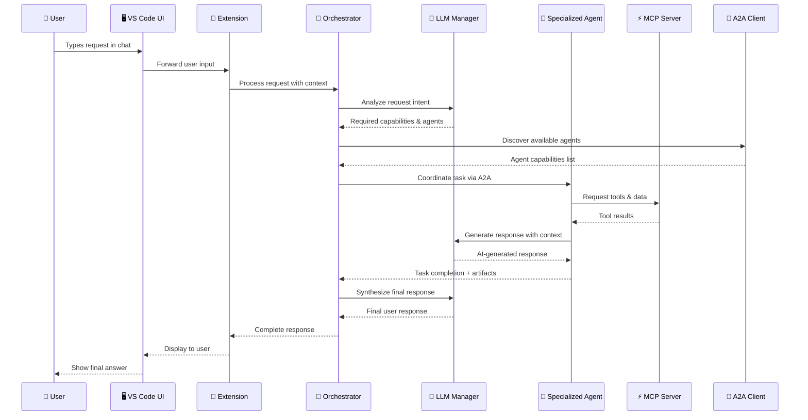
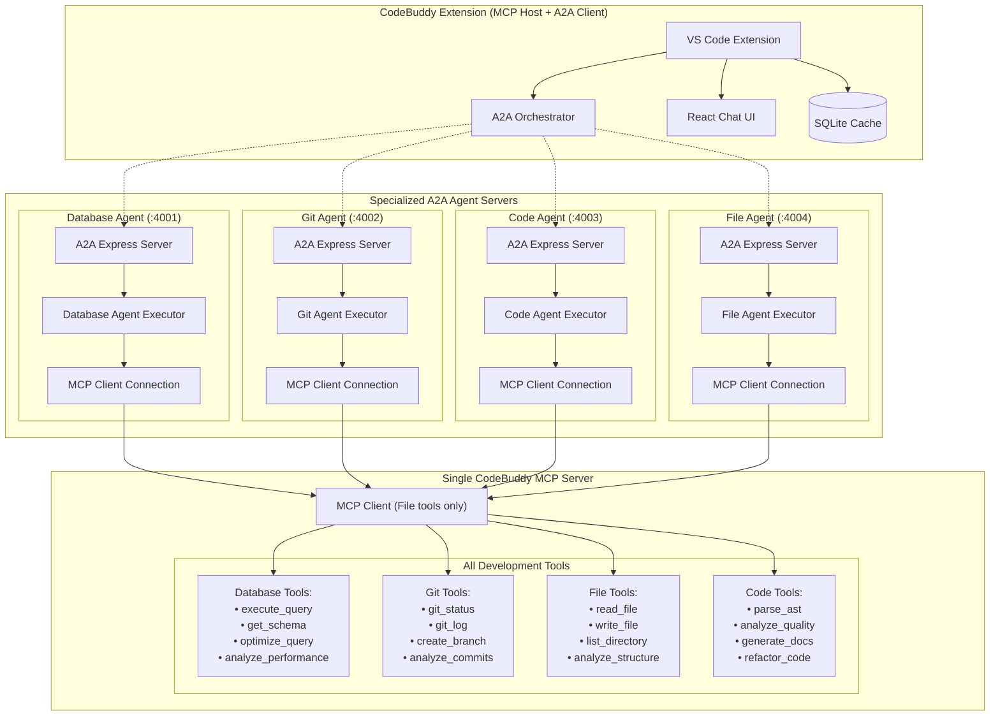

# MCP Technical Implementation Guide for CodeBuddy

## 🏗️ Technical Architecture Deep Dive

### Overview

This document provides detailed technical specifications for integrating Model Context Protocol (MCP) into CodeBuddy, following the official MCP architecture patterns and integrating with Agent-to-Agent (A2A) protocol for intelligent agent coordination.

### Architecture Alignment

**Official MCP Architecture Principles:**

- **Single MCP Server**: One server hosts multiple tools and capabilities
- **Multiple MCP Clients**: CodeBuddy's specialized agents act as MCP clients
- **Client-Server Pattern**: Each agent maintains dedicated connection to MCP server
- **Capability Negotiation**: Dynamic discovery and execution of available tools

**A2A Protocol Integration:**

- **Agent Coordination**: Specialized agents communicate via @a2a-js/sdk
- **Task Distribution**: Orchestrator assigns tasks based on agent specializations
- **Knowledge Sharing**: Agents share context and results across the network
- **Autonomous Workflows**: Multi-agent collaboration for complex development tasks

**🔒 Security-First Design:**

- **Untrusted Agent Input**: All external agent data treated as potentially malicious
- **Input Sanitization**: Aggressive filtering and validation before LLM processing
- **Agent Trust Management**: Verification and quarantine systems for suspicious agents
- **Prompt Injection Protection**: Advanced sanitization prevents LLM manipulation
- **Access Control**: Strict boundaries prevent agents from accessing internal systems
- **Rate Limiting**: Protection against DoS attacks via excessive requests
- **Audit Trail**: Complete logging of all agent interactions for security analysis

## 📋 Prerequisites and Dependencies

### Core Dependencies

```json
{
  "dependencies": {
    "@modelcontextprotocol/sdk": "^0.5.0",
    "@a2a-js/sdk": "^0.2.0",
    "ws": "^8.14.0",
    "uuid": "^9.0.0",
    "zod": "^3.22.0",
    "dompurify": "^3.0.0",
    "validator": "^13.11.0",
    "express-rate-limit": "^7.1.0",
    "helmet": "^7.1.0"
  },
  "devDependencies": {
    "@types/ws": "^8.5.0",
    "@types/uuid": "^9.0.0",
    "@types/validator": "^13.11.0",
    "@types/dompurify": "^3.0.0"
  }
}
```

### VS Code Extension Manifest Updates

```json
{
  "contributes": {
    "configuration": {
      "properties": {
        "codebuddy.mcp.enabled": {
          "type": "boolean",
          "default": true,
          "description": "Enable Model Context Protocol integration"
        },
        "codebuddy.mcp.servers": {
          "type": "array",
          "default": [],
          "description": "Configured MCP servers"
        },
        "codebuddy.mcp.security.strictMode": {
          "type": "boolean",
          "default": true,
          "description": "Enable strict security mode for MCP connections"
        },
        "codebuddy.a2a.security.trustedAgentsOnly": {
          "type": "boolean",
          "default": true,
          "description": "Only allow connections to verified trusted agents"
        },
        "codebuddy.a2a.security.inputSanitization": {
          "type": "boolean",
          "default": true,
          "description": "Enable aggressive input sanitization for agent data"
        },
        "codebuddy.a2a.security.maxAgentConnections": {
          "type": "number",
          "default": 10,
          "description": "Maximum number of concurrent agent connections"
        },
        "codebuddy.a2a.security.agentTimeout": {
          "type": "number",
          "default": 30000,
          "description": "Agent request timeout in milliseconds"
        },
        "codebuddy.llm.provider": {
          "type": "string",
          "enum": ["anthropic", "openai", "gemini", "groq", "deepseek"],
          "default": "anthropic",
          "description": "Primary LLM provider for agent reasoning"
        },
        "codebuddy.llm.model": {
          "type": "string",
          "default": "claude-3-5-sonnet-20241022",
          "description": "LLM model to use for agent processing"
        },
        "codebuddy.llm.apiKey": {
          "type": "string",
          "default": "",
          "description": "API key for LLM provider (encrypted storage)"
        },
        "codebuddy.llm.temperature": {
          "type": "number",
          "default": 0.3,
          "minimum": 0,
          "maximum": 1,
          "description": "LLM temperature for response generation"
        },
        "codebuddy.llm.maxTokens": {
          "type": "number",
          "default": 4096,
          "description": "Maximum tokens for LLM responses"
        },
        "codebuddy.llm.contextWindow": {
          "type": "number",
          "default": 200000,
          "description": "LLM context window size for planning"
        }
      }
    },
    "commands": [
      {
        "command": "codebuddy.mcp.connectServer",
        "title": "CodeBuddy: Connect MCP Server"
      },
      {
        "command": "codebuddy.mcp.listConnections",
        "title": "CodeBuddy: List MCP Connections"
      },
      {
        "command": "codebuddy.mcp.serverStatus",
        "title": "CodeBuddy: MCP Server Status"
      }
    ]
  }
}
```

## 🔄 Complete Request Flow Architecture

### User Request Journey: From Input to Response



### Request Processing Phases

1. **Input Analysis** (Orchestrator + LLM)

   - Parse user intent and extract requirements
   - Determine complexity (single vs multi-agent)
   - Identify required capabilities and tools

2. **Agent Discovery** (A2A Protocol)

   - Query available agents via `.well-known/agent-card.json`
   - Match agent capabilities to requirements
   - Health check and availability verification

3. **Task Coordination** (Orchestrator)

   - Design workflow based on available agents
   - Coordinate agent communication via A2A
   - Monitor task progress and handle errors

4. **Tool Execution** (Agents + MCP)

   - Agents connect to MCP server for tools
   - Execute domain-specific operations
   - Collect real-time system data

5. **Response Generation** (LLM Integration)

   - Each agent uses LLM for reasoning and response generation
   - Context from MCP tools enriches LLM prompts
   - Final orchestrator synthesis creates coherent response

6. **Response Delivery** (VS Code Extension)
   - Stream responses back to user interface
   - Handle errors and provide fallback responses
   - Update context for follow-up conversations

## 🏗️ Corrected Architecture



**Key Principles:**

1. **Single MCP Server** - Hosts all development tools and capabilities
2. **Agents as A2A Servers** - Each agent runs as independent A2A server (Express.js)
3. **Agents as MCP Clients** - Each agent connects to MCP server for tool access
4. **A2A Client Orchestration** - CodeBuddy orchestrator uses A2A clients to coordinate agents
5. **Task-Based Communication** - Rich task management with state, artifacts, and streaming
6. **Agent Card Discovery** - Agents discoverable via .well-known/agent-card.json endpoints
7. **Tool Specialization** - Agents filter and use domain-specific MCP tools

## 🔧 Core Implementation

### 1. CodeBuddy MCP Server (Single Server)

```typescript
// src/mcp-server/codebuddy-mcp-server.ts
import { Server } from "@modelcontextprotocol/sdk/server.js";
import { StdioServerTransport } from "@modelcontextprotocol/sdk/server/stdio.js";

export class CodeBuddyMCPServer {
  private server: Server;
  private allTools: MCPTool[];

  constructor() {
    this.server = new Server(
      {
        name: "codebuddy-mcp-server",
        version: "1.0.0",
      },
      {
        capabilities: {
          tools: { listChanged: true },
          resources: { listChanged: true },
          prompts: {},
        },
      }
    );

    this.initializeAllTools();
    this.setupRequestHandlers();
  }

  private initializeAllTools(): void {
    this.allTools = [
      // Database tools
      {
        name: "execute_query",
        description: "Execute SQL query",
        category: "database",
        inputSchema: {
          type: "object",
          properties: {
            sql: { type: "string" },
            database: { type: "string" },
          },
          required: ["sql"],
        },
      },
      {
        name: "get_schema",
        description: "Get database schema",
        category: "database",
        inputSchema: {
          type: "object",
          properties: {
            database: { type: "string" },
          },
        },
      },
      {
        name: "optimize_query",
        description: "Optimize SQL query performance",
        category: "database",
        inputSchema: {
          type: "object",
          properties: {
            query: { type: "string" },
            database: { type: "string" },
          },
          required: ["query"],
        },
      },
      // Git tools
      {
        name: "git_status",
        description: "Get git repository status",
        category: "git",
        inputSchema: {
          type: "object",
          properties: {
            path: { type: "string" },
          },
        },
      },
      {
        name: "git_log",
        description: "Get commit history",
        category: "git",
        inputSchema: {
          type: "object",
          properties: {
            path: { type: "string" },
            limit: { type: "number" },
          },
        },
      },
      // File tools
      {
        name: "read_file",
        description: "Read file contents",
        category: "file",
        inputSchema: {
          type: "object",
          properties: {
            path: { type: "string" },
            encoding: { type: "string" },
          },
          required: ["path"],
        },
      },
      {
        name: "write_file",
        description: "Write content to file",
        category: "file",
        inputSchema: {
          type: "object",
          properties: {
            path: { type: "string" },
            content: { type: "string" },
            encoding: { type: "string" },
          },
          required: ["path", "content"],
        },
      },
      // Code tools
      {
        name: "parse_ast",
        description: "Parse code into Abstract Syntax Tree",
        category: "code",
        inputSchema: {
          type: "object",
          properties: {
            code: { type: "string" },
            language: { type: "string" },
          },
          required: ["code"],
        },
      },
      {
        name: "analyze_quality",
        description: "Analyze code quality and suggest improvements",
        category: "code",
        inputSchema: {
          type: "object",
          properties: {
            code: { type: "string" },
            language: { type: "string" },
          },
          required: ["code"],
        },
      },
    ];
  }

  private setupRequestHandlers(): void {
    // Handle tools/list with optional filtering by agent type
    this.server.setRequestHandler("tools/list", async (request) => {
      const agentType = request.params?.agentType as string;

      let filteredTools = this.allTools;

      // Filter tools by agent specialization
      if (agentType) {
        filteredTools = this.allTools.filter(tool => {
          switch (agentType) {
            case "database-agent":
              return tool.category === "database";
            case "git-agent":
              return tool.category === "git";
            case "file-agent":
              return tool.category === "file";
            case "code-agent":
              return tool.category === "code";
            default:
              return true; // Return all tools for unknown agent types
          }
        });
      }

      return {
        tools: filteredTools.map(({ category, ...tool }) => tool) // Remove category from response
      };
    });

    // Handle tools/call
    this.server.setRequestHandler("tools/call", async (request) => {
      const { name, arguments: args } = request.params;

      const tool = this.allTools.find(t => t.name === name);
      if (!tool) {
        throw new Error(`Tool '${name}' not found`);
      }

      // Route to appropriate tool implementation
      return await this.executeTool(name, args);
    });
  }

  private async executeTool(toolName: string, args: any): Promise<any> {
    // Tool execution logic would be implemented here
    switch (toolName) {
      case "execute_query":
        return await this.executeDatabaseQuery(args.sql, args.database);
      case "get_schema":
        return await this.getDatabaseSchema(args.database);
      case "optimize_query":
        return await this.optimizeQuery(args.query, args.database);
      case "git_status":
        return await this.getGitStatus(args.path);
      case "git_log":
        return await this.getGitLog(args.path, args.limit);
      case "read_file":
        return await this.readFile(args.path, args.encoding);
      case "write_file":
        return await this.writeFile(args.path, args.content, args.encoding);
      case "parse_ast":
        return await this.parseAST(args.code, args.language);
      case "analyze_quality":
        return await this.analyzeCodeQuality(args.code, args.language);
      default:
        throw new Error(`Tool implementation not found: ${toolName}`);
    }
  }

  // Tool implementation stubs (these would contain actual logic)
  private async executeDatabaseQuery(sql: string, database?: string): Promise<any> {
    // Implementation would connect to actual database
    return { message: `Executed: ${sql}`, rows: [], database };
  }

  private async getDatabaseSchema(database?: string): Promise<any> {
    // Implementation would fetch actual schema
    return { schema: "sample_schema", tables: [], database };
  }

  private async optimizeQuery(query: string, database?: string): Promise<any> {
    // Implementation would perform actual optimization
    return { originalQuery: query, optimizedQuery: query, suggestions: [] };
  }

  private async getGitStatus(path?: string): Promise<any> {
    // Implementation would use git commands
    return { branch: "main", changes: [], path };
  }

  private async getGitLog(path?: string, limit?: number): Promise<any> {
    // Implementation would fetch git log
    return { commits: [], path, limit };
  }

  private async readFile(path: string, encoding?: string): Promise<any> {
    // Implementation would read actual file
    return { path, content: "file content", encoding: encoding || "utf8" };
  }

  private async writeFile(path: string, content: string, encoding?: string): Promise<any> {
    // Implementation would write actual file
    return { path, bytesWritten: content.length, encoding: encoding || "utf8" };
  }

  private async parseAST(code: string, language?: string): Promise<any> {
    // Implementation would parse actual code
    return { ast: {}, language, codeLength: code.length };
  }

  private async analyzeCodeQuality(code: string, language?: string): Promise<any> {
    // Implementation would perform actual analysis
    return { quality: "good", issues: [], suggestions: [], language };
  }

  async start(): Promise<void> {
    const transport = new StdioServerTransport();
    await this.server.connect(transport);
    console.log("🚀 CodeBuddy MCP Server started");
  }
}

// MCP Tool interface
interface MCPTool {
  name: string;
  description: string;
  category: string;
  inputSchema: {
    type: "object";
    properties: Record<string, any>;
    required?: string[];
  };
}

// Enhanced MCP Client Service
export class MCPClientService {
  private client: Client;
  private connection: ClientConnection | null = null;
  private agentType: string;

  constructor(agentType: string = "generic") {
    this.agentType = agentType;
    this.client = new Client({
      name: `codebuddy-${agentType}`,
      version: "1.0.0",
    }, {
      capabilities: {
        sampling: {},
      },
    });
  }

  async connect(config: MCPServerConfig): Promise<void> {
    const transport = new StdioClientTransport({
      command: config.command || "node",
      args: config.args || [],
    });

    this.connection = await this.client.connect(transport);
    console.log(`✅ MCP Client (${this.agentType}) connected to ${config.name}`);
  }

  async listTools(): Promise<any> {
    if (!this.connection) {
      throw new Error("Not connected to MCP server");
    }

    // Request tools filtered by agent type
    return await this.connection.request(
      { method: "tools/list", params: { agentType: this.agentType } },
      null
    );
  }

  async executeRequest(serverId: string, method: string, params: any): Promise<any> {
    if (!this.connection) {
      throw new Error("Not connected to MCP server");
    }

    return await this.connection.request({ method, params }, null);
  }

  async disconnect(): Promise<void> {
    if (this.connection) {
      await this.connection.close();
      this.connection = null;
    }
  }
}

interface MCPServerConfig {
  id: string;
  name: string;
  type: "stdio" | "http";
  command?: string;
  args?: string[];
  url?: string;
            },
          },
        },
        {
          name: "git_log",
          description: "Get git commit history",
          inputSchema: {
            type: "object",
            properties: {
              limit: { type: "number", default: 10 },
              since: { type: "string" },
            },
          },
        },
        // File system tools
        {
          name: "read_file",
          description: "Read file contents",
          inputSchema: {
            type: "object",
            properties: {
              path: { type: "string" },
            },
            required: ["path"],
          },
        },
        // Code analysis tools
        {
          name: "parse_ast",
          description: "Parse code into AST",
          inputSchema: {
            type: "object",
            properties: {
              code: { type: "string" },
              language: { type: "string" },
            },
            required: ["code", "language"],
          },
        },
      ],
    }));

    this.server.setRequestHandler("tools/call", async (request) => {
      const { name, arguments: args } = request.params;

      // Route to appropriate tool implementation
      if (name.startsWith("execute_query") || name.startsWith("get_schema")) {
        return await this.handleDatabaseTool(name, args);
      } else if (name.startsWith("git_")) {
        return await this.handleGitTool(name, args);
      } else if (name === "read_file") {
        return await this.handleFileTool(name, args);
      } else if (name === "parse_ast") {
        return await this.handleCodeTool(name, args);
      } else {
        throw new Error(`Unknown tool: ${name}`);
      }
    });
  }

  private async handleDatabaseTool(name: string, args: any): Promise<any> {
    // Database tool implementations
    switch (name) {
      case "execute_query":
        return { result: "Query executed", rows: [] };
      case "get_schema":
        return { schema: {}, database: args.database };
      default:
        throw new Error(`Unknown database tool: ${name}`);
    }
  }

  private async handleGitTool(name: string, args: any): Promise<any> {
    // Git tool implementations
    switch (name) {
      case "git_status":
        return { files: [], branch: "main" };
      case "git_log":
        return { commits: [] };
      default:
        throw new Error(`Unknown git tool: ${name}`);
    }
  }

  private async handleFileTool(name: string, args: any): Promise<any> {
    // File system tool implementations
    return { content: "File content" };
  }

  private async handleCodeTool(name: string, args: any): Promise<any> {
    // Code analysis tool implementations
    return { ast: {} };
  }

  async start(): Promise<void> {
    const transport = new StdioServerTransport();
    await this.server.connect(transport);
    console.error("CodeBuddy MCP Server started");
  }
}
```

### 2. MCP Client Service

```typescript
// src/services/mcp-client.service.ts
import { Client } from "@modelcontextprotocol/sdk/client.js";
import { StdioClientTransport } from "@modelcontextprotocol/sdk/client/stdio.js";
import * as vscode from "vscode";
import { Logger } from "../infrastructure/logger/logger";
import { SecurityManager } from "./mcp-security.service";

export interface MCPServerConfig {
  id: string;
  name: string;
  type: "websocket" | "stdio" | "http";
  uri: string;
  capabilities?: string[];
  credentials?: {
    apiKey?: string;
    token?: string;
    username?: string;
    password?: string;
  };
  security?: {
    allowedMethods?: string[];
    requireAuth?: boolean;
    timeout?: number;
  };
}

export interface MCPConnection {
  id: string;
  client: Client;
  config: MCPServerConfig;
  status: "connected" | "disconnected" | "connecting" | "error";
  lastActivity: Date;
  capabilities: string[];
}

export class MCPClientService {
  private connections = new Map<string, MCPConnection>();
  private logger: Logger;
  private securityManager: SecurityManager;
  private eventEmitter = new vscode.EventEmitter<{
    type: "connection" | "disconnection" | "error" | "response";
    serverId: string;
    data?: any;
  }>();

  constructor() {
    this.logger = Logger.initialize("MCPClientService");
    this.securityManager = new SecurityManager();
  }

  /**
   * Connect to an MCP server
   */
  async connect(config: MCPServerConfig): Promise<MCPConnection> {
    this.logger.info(`Connecting to MCP server: ${config.name}`);

    try {
      // Validate security settings
      await this.securityManager.validateServerConfig(config);

      // Create transport (stdio only for local server)
      const transport = new StdioClientTransport({
        command: "node",
        args: ["dist/mcp-server/codebuddy-mcp-server.js"],
      });

      // Create client with proper initialization
      const client = new Client(
        {
          name: "CodeBuddy",
          version: vscode.extensions.getExtension("fiatinnovations.ola-code-buddy")?.packageJSON.version || "1.0.0",
        },
        {
          capabilities: {
            sampling: {},
            elicitation: {},
          },
        }
      );

      // Connect following MCP lifecycle
      await client.connect(transport);

      // Get server capabilities
      const capabilities = await this.getServerCapabilities(client);

      const connection: MCPConnection = {
        id: config.id,
        client,
        config,
        status: "connected",
        lastActivity: new Date(),
        capabilities,
      };

      this.connections.set(config.id, connection);

      this.eventEmitter.fire({
        type: "connection",
        serverId: config.id,
        data: { capabilities },
      });

      this.logger.info(`Successfully connected to MCP server: ${config.name}`);
      return connection;
    } catch (error) {
      this.logger.error(`Failed to connect to MCP server ${config.name}:`, error);
      throw new Error(`MCP connection failed: ${error instanceof Error ? error.message : "Unknown error"}`);
    }
  }

  /**
   * Disconnect from an MCP server
   */
  async disconnect(serverId: string): Promise<void> {
    const connection = this.connections.get(serverId);
    if (!connection) {
      throw new Error(`No connection found for server: ${serverId}`);
    }

    try {
      await connection.client.close();
      connection.status = "disconnected";
      this.connections.delete(serverId);

      this.eventEmitter.fire({
        type: "disconnection",
        serverId,
      });

      this.logger.info(`Disconnected from MCP server: ${serverId}`);
    } catch (error) {
      this.logger.error(`Error disconnecting from MCP server ${serverId}:`, error);
      throw error;
    }
  }

  /**
   * Execute a request on an MCP server
   */
  async executeRequest(serverId: string, method: string, params?: any): Promise<any> {
    const connection = this.connections.get(serverId);
    if (!connection || connection.status !== "connected") {
      throw new Error(`No active connection to server: ${serverId}`);
    }

    try {
      // Security validation
      await this.securityManager.validateRequest(connection.config, method, params);

      // Update activity
      connection.lastActivity = new Date();

      // Execute request based on method type
      let response;
      if (method.startsWith("tools/")) {
        response = await this.executeTool(connection, method, params);
      } else if (method.startsWith("resources/")) {
        response = await this.getResource(connection, method, params);
      } else if (method.startsWith("prompts/")) {
        response = await this.getPrompt(connection, method, params);
      } else {
        // Generic request
        response = await connection.client.request({ method, params });
      }

      this.eventEmitter.fire({
        type: "response",
        serverId,
        data: { method, response },
      });

      return response;
    } catch (error) {
      this.logger.error(`MCP request failed for ${serverId}.${method}:`, error);

      this.eventEmitter.fire({
        type: "error",
        serverId,
        data: { method, error: error instanceof Error ? error.message : "Unknown error" },
      });

      throw error;
    }
  }

  /**
   * List available tools from a server
   */
  async listTools(serverId: string): Promise<any[]> {
    const response = await this.executeRequest(serverId, "tools/list");
    return response.tools || [];
  }

  /**
   * List available resources from a server
   */
  async listResources(serverId: string): Promise<any[]> {
    const response = await this.executeRequest(serverId, "resources/list");
    return response.resources || [];
  }

  /**
   * Get connection status
   */
  getConnectionStatus(serverId: string): MCPConnection | undefined {
    return this.connections.get(serverId);
  }

  /**
   * Get all connections
   */
  getAllConnections(): MCPConnection[] {
    return Array.from(this.connections.values());
  }

  /**
   * Health check for all connections
   */
  async healthCheck(): Promise<Map<string, boolean>> {
    const health = new Map<string, boolean>();

    for (const [serverId, connection] of this.connections) {
      try {
        await connection.client.request({ method: "ping" });
        health.set(serverId, true);
      } catch (error) {
        health.set(serverId, false);
        this.logger.warn(`Health check failed for server ${serverId}:`, error);
      }
    }

    return health;
  }

  private createTransport(config: MCPServerConfig) {
    switch (config.type) {
      case "websocket":
        return new WebSocketTransport(config.uri);
      case "stdio":
        return new StdioClientTransport({
          command: config.uri.split(" ")[0],
          args: config.uri.split(" ").slice(1),
        });
      default:
        throw new Error(`Unsupported transport type: ${config.type}`);
    }
  }

  private async getServerCapabilities(client: Client): Promise<string[]> {
    try {
      const response = await client.request({ method: "initialize" });
      return response.capabilities ? Object.keys(response.capabilities) : [];
    } catch (error) {
      this.logger.warn("Failed to get server capabilities:", error);
      return [];
    }
  }

  private async executeTool(connection: MCPConnection, method: string, params: any): Promise<any> {
    const toolName = method.replace("tools/", "").replace("/call", "");
    return await connection.client.request({
      method: "tools/call",
      params: {
        name: toolName,
        arguments: params,
      },
    });
  }

  private async getResource(connection: MCPConnection, method: string, params: any): Promise<any> {
    const resourceUri = method.replace("resources/", "").replace("/read", "");
    return await connection.client.request({
      method: "resources/read",
      params: {
        uri: resourceUri,
        ...params,
      },
    });
  }

  private async getPrompt(connection: MCPConnection, method: string, params: any): Promise<any> {
    const promptName = method.replace("prompts/", "").replace("/get", "");
    return await connection.client.request({
      method: "prompts/get",
      params: {
        name: promptName,
        arguments: params,
      },
    });
  }

  dispose(): void {
    // Close all connections
    for (const connection of this.connections.values()) {
      try {
        connection.client.close();
      } catch (error) {
        this.logger.warn("Error closing MCP connection:", error);
      }
    }
    this.connections.clear();
    this.eventEmitter.dispose();
  }
}
```

### 3. LLM Manager Service

```typescript
// src/services/llm-manager.service.ts
import * as vscode from "vscode";
import { Logger } from "../infrastructure/logger/logger";
import { SecurityManager } from "./mcp-security.service";
import { AnthropicLLM } from "../llms/anthropic/anthropic";
import { OpenAILLM } from "../llms/openai/openai";
import { GeminiLLM } from "../llms/gemini/gemini";
import { GroqLLM } from "../llms/groq/groq";
import { DeepSeekLLM } from "../llms/deepseek/deepseek";
import { BaseLLM } from "../llms/base";

export interface LLMConfig {
  provider: "anthropic" | "openai" | "gemini" | "groq" | "deepseek";
  model: string;
  apiKey: string;
  temperature: number;
  maxTokens: number;
  contextWindow: number;
  systemPrompt?: string;
  agentRole?: string;
}

export interface LLMRequest {
  prompt: string;
  context?: any;
  mcpData?: Record<string, any>;
  agentSpecialization?: string;
  temperature?: number;
  maxTokens?: number;
  systemPrompt?: string;
}

export interface LLMResponse {
  content: string;
  usage: {
    inputTokens: number;
    outputTokens: number;
    totalTokens: number;
  };
  model: string;
  provider: string;
  timestamp: string;
  processingTime: number;
}

export class LLMManagerService {
  private llmInstances = new Map<string, BaseLLM>();
  private logger: Logger;
  private securityManager: SecurityManager;
  private config: LLMConfig;
  private requestCache = new Map<string, LLMResponse>();

  constructor() {
    this.logger = Logger.initialize("LLMManagerService");
    this.securityManager = new SecurityManager();
    this.config = this.loadLLMConfig();
    this.initializeLLMProviders();
  }

  private loadLLMConfig(): LLMConfig {
    const config = vscode.workspace.getConfiguration("codebuddy.llm");

    return {
      provider: config.get("provider", "anthropic"),
      model: config.get("model", "claude-3-5-sonnet-20241022"),
      apiKey: config.get("apiKey", ""),
      temperature: config.get("temperature", 0.3),
      maxTokens: config.get("maxTokens", 4096),
      contextWindow: config.get("contextWindow", 200000),
    };
  }

  private initializeLLMProviders(): void {
    try {
      // Initialize all supported LLM providers
      this.llmInstances.set(
        "anthropic",
        new AnthropicLLM({
          apiKey: this.config.apiKey,
          model: this.config.model,
          temperature: this.config.temperature,
          maxTokens: this.config.maxTokens,
        })
      );

      this.llmInstances.set(
        "openai",
        new OpenAILLM({
          apiKey: this.config.apiKey,
          model: this.config.model || "gpt-4",
          temperature: this.config.temperature,
          maxTokens: this.config.maxTokens,
        })
      );

      this.llmInstances.set(
        "gemini",
        new GeminiLLM({
          apiKey: this.config.apiKey,
          model: this.config.model || "gemini-pro",
          temperature: this.config.temperature,
          maxTokens: this.config.maxTokens,
        })
      );

      this.llmInstances.set(
        "groq",
        new GroqLLM({
          apiKey: this.config.apiKey,
          model: this.config.model || "mixtral-8x7b-32768",
          temperature: this.config.temperature,
          maxTokens: this.config.maxTokens,
        })
      );

      this.llmInstances.set(
        "deepseek",
        new DeepSeekLLM({
          apiKey: this.config.apiKey,
          model: this.config.model || "deepseek-chat",
          temperature: this.config.temperature,
          maxTokens: this.config.maxTokens,
        })
      );

      this.logger.info(`LLM providers initialized. Active provider: ${this.config.provider}`);
    } catch (error) {
      this.logger.error("Failed to initialize LLM providers:", error);
      throw error;
    }
  }

  /**
   * Generate response for agent reasoning and planning
   */
  async generateAgentResponse(request: LLMRequest): Promise<LLMResponse> {
    const startTime = Date.now();

    try {
      // Security validation
      await this.securityManager.validateLLMRequest(request);

      // Check cache
      const cacheKey = this.generateCacheKey(request);
      const cached = this.requestCache.get(cacheKey);
      if (cached && this.isCacheValid(cached)) {
        return cached;
      }

      // Get active LLM provider
      const llm = this.llmInstances.get(this.config.provider);
      if (!llm) {
        throw new Error(`LLM provider not available: ${this.config.provider}`);
      }

      // Prepare specialized prompt
      const enhancedPrompt = this.createSpecializedPrompt(request);

      // Execute LLM request
      const response = await llm.generateResponse({
        prompt: enhancedPrompt,
        temperature: request.temperature || this.config.temperature,
        maxTokens: request.maxTokens || this.config.maxTokens,
        systemPrompt: request.systemPrompt || this.getAgentSystemPrompt(request.agentSpecialization),
      });

      const llmResponse: LLMResponse = {
        content: response.content,
        usage: response.usage,
        model: this.config.model,
        provider: this.config.provider,
        timestamp: new Date().toISOString(),
        processingTime: Date.now() - startTime,
      };

      // Cache response
      this.requestCache.set(cacheKey, llmResponse);

      this.logger.debug(`LLM response generated in ${llmResponse.processingTime}ms`);
      return llmResponse;
    } catch (error) {
      this.logger.error("LLM request failed:", error);
      throw new Error(`LLM generation failed: ${error instanceof Error ? error.message : "Unknown error"}`);
    }
  }

  /**
   * Generate response for intent analysis and orchestration
   */
  async analyzeIntent(
    userInput: string,
    context?: any
  ): Promise<{
    intent: string;
    requiredCapabilities: string[];
    complexity: "simple" | "complex";
    confidence: number;
    suggestedAgents: string[];
  }> {
    const analysisPrompt = `
Analyze this user request and determine:
1. Primary intent
2. Required capabilities
3. Task complexity (simple/complex)
4. Confidence level (0-1)
5. Suggested agents to handle this

User Request: "${userInput}"

Context: ${JSON.stringify(context, null, 2)}

Provide response in JSON format:
{
  "intent": "brief description of what user wants",
  "requiredCapabilities": ["capability1", "capability2"],
  "complexity": "simple" | "complex",
  "confidence": 0.95,
  "suggestedAgents": ["agent-id1", "agent-id2"]
}
`;

    const response = await this.generateAgentResponse({
      prompt: analysisPrompt,
      agentSpecialization: "orchestration",
      temperature: 0.1, // Low temperature for analysis
      maxTokens: 1000,
    });

    try {
      return JSON.parse(response.content);
    } catch (error) {
      // Fallback analysis
      return this.fallbackIntentAnalysis(userInput);
    }
  }

  /**
   * Generate final synthesized response from agent results
   */
  async synthesizeResponse(agentResults: any[], originalRequest: string, context?: any): Promise<string> {
    const synthesisPrompt = `
Synthesize a comprehensive response to the user based on the results from specialized agents.

Original User Request: "${originalRequest}"

Agent Results:
${JSON.stringify(agentResults, null, 2)}

Additional Context:
${JSON.stringify(context, null, 2)}

Provide a clear, helpful response that:
1. Directly answers the user's question
2. Incorporates insights from all agent results
3. Is well-structured and easy to understand
4. Includes actionable recommendations if applicable
5. Maintains a helpful, professional tone

Response:
`;

    const response = await this.generateAgentResponse({
      prompt: synthesisPrompt,
      agentSpecialization: "synthesis",
      temperature: 0.4,
      maxTokens: 2048,
    });

    return response.content;
  }

  private createSpecializedPrompt(request: LLMRequest): string {
    let prompt = request.prompt;

    // Add MCP data context if available
    if (request.mcpData && Object.keys(request.mcpData).length > 0) {
      prompt += "\n\nReal-time System Data:\n";
      for (const [source, data] of Object.entries(request.mcpData)) {
        if (data && !data.error) {
          prompt += `\n${source}:\n${JSON.stringify(data, null, 2)}\n`;
        }
      }
    }

    // Add general context
    if (request.context) {
      prompt += "\n\nAdditional Context:\n";
      prompt += JSON.stringify(request.context, null, 2);
    }

    return prompt;
  }

  private getAgentSystemPrompt(agentSpecialization?: string): string {
    const basePrompt = "You are an intelligent AI agent specialized in software development assistance.";

    switch (agentSpecialization) {
      case "database":
        return (
          basePrompt +
          " You specialize in database operations, SQL queries, schema design, and performance optimization. Always prioritize data safety and provide clear explanations for database operations."
        );

      case "git":
        return (
          basePrompt +
          " You specialize in version control, Git operations, branch management, and code collaboration. Focus on best practices and clear Git workflows."
        );

      case "code":
        return (
          basePrompt +
          " You specialize in code analysis, quality assessment, refactoring, and architectural improvements. Provide actionable code improvement suggestions."
        );

      case "file":
        return (
          basePrompt +
          " You specialize in file system operations, project organization, and file management. Focus on efficient file handling and project structure."
        );

      case "orchestration":
        return (
          basePrompt +
          " You coordinate multiple specialized agents to handle complex development tasks. Focus on task analysis, agent coordination, and workflow optimization."
        );

      case "synthesis":
        return (
          basePrompt +
          " You synthesize results from multiple agents into coherent, helpful responses. Focus on clarity, completeness, and actionability."
        );

      default:
        return basePrompt + " Provide helpful, accurate, and actionable assistance for software development tasks.";
    }
  }

  private fallbackIntentAnalysis(userInput: string): any {
    const capabilities: string[] = [];
    let complexity = "simple";
    const suggestedAgents: string[] = [];

    // Basic keyword analysis
    if (/\b(database|sql|query|schema)\b/i.test(userInput)) {
      capabilities.push("sql-execution", "schema-analysis");
      suggestedAgents.push("database-agent");
    }

    if (/\b(git|commit|branch|merge)\b/i.test(userInput)) {
      capabilities.push("version-control");
      suggestedAgents.push("git-agent");
    }

    if (/\b(file|directory|read|write)\b/i.test(userInput)) {
      capabilities.push("file-operations");
      suggestedAgents.push("file-agent");
    }

    if (/\b(analyze|refactor|optimize)\b/i.test(userInput)) {
      capabilities.push("code-analysis");
      suggestedAgents.push("code-agent");
    }

    if (suggestedAgents.length > 1) {
      complexity = "complex";
    }

    return {
      intent: "User development assistance request",
      requiredCapabilities: capabilities,
      complexity,
      confidence: 0.7,
      suggestedAgents,
    };
  }

  private generateCacheKey(request: LLMRequest): string {
    const key = {
      prompt: request.prompt.substring(0, 100), // First 100 chars
      agentSpecialization: request.agentSpecialization,
      temperature: request.temperature,
      model: this.config.model,
    };
    return Buffer.from(JSON.stringify(key)).toString("base64");
  }

  private isCacheValid(cached: LLMResponse): boolean {
    const cacheAgeMs = Date.now() - new Date(cached.timestamp).getTime();
    const maxCacheAgeMs = 5 * 60 * 1000; // 5 minutes
    return cacheAgeMs < maxCacheAgeMs;
  }

  /**
   * Switch LLM provider at runtime
   */
  async switchProvider(provider: string, model?: string): Promise<void> {
    if (!this.llmInstances.has(provider)) {
      throw new Error(`Unsupported LLM provider: ${provider}`);
    }

    this.config.provider = provider as any;
    if (model) {
      this.config.model = model;
    }

    // Update VS Code configuration
    const config = vscode.workspace.getConfiguration("codebuddy.llm");
    await config.update("provider", provider, vscode.ConfigurationTarget.Global);
    if (model) {
      await config.update("model", model, vscode.ConfigurationTarget.Global);
    }

    this.logger.info(`Switched to LLM provider: ${provider} with model: ${this.config.model}`);
  }

  /**
   * Get LLM usage statistics
   */
  getUsageStats(): {
    totalRequests: number;
    totalTokens: number;
    averageResponseTime: number;
    cacheHitRate: number;
  } {
    // Implementation would track actual usage stats
    return {
      totalRequests: 0,
      totalTokens: 0,
      averageResponseTime: 0,
      cacheHitRate: 0,
    };
  }

  dispose(): void {
    this.requestCache.clear();
    for (const llm of this.llmInstances.values()) {
      if (llm.dispose) {
        llm.dispose();
      }
    }
    this.llmInstances.clear();
  }
}
```

### 2. Security Manager

```typescript
// src/services/mcp-security.service.ts
import * as vscode from "vscode";
import { Logger } from "../infrastructure/logger/logger";
import { MCPServerConfig } from "./mcp-client.service";

export interface SecurityPolicy {
  allowedServers: string[];
  blockedMethods: string[];
  maxRequestSize: number;
  timeoutMs: number;
  requireAuthentication: boolean;
  auditRequests: boolean;
}

export class SecurityManager {
  private logger: Logger;
  private policy: SecurityPolicy;

  constructor() {
    this.logger = Logger.initialize("MCPSecurityManager");
    this.policy = this.loadSecurityPolicy();
  }

  async validateServerConfig(config: MCPServerConfig): Promise<void> {
    // Check if server is in allow list
    if (this.policy.allowedServers.length > 0 && !this.policy.allowedServers.includes(config.id)) {
      throw new Error(`Server ${config.id} is not in the allowed list`);
    }

    // Validate URI format
    if (!this.isValidUri(config.uri)) {
      throw new Error(`Invalid URI format: ${config.uri}`);
    }

    // Check authentication requirements
    if (this.policy.requireAuthentication && !config.credentials) {
      throw new Error(`Authentication required for server ${config.id}`);
    }

    this.logger.info(`Security validation passed for server: ${config.id}`);
  }

  async validateRequest(config: MCPServerConfig, method: string, params?: any): Promise<void> {
    // Check blocked methods
    if (this.policy.blockedMethods.includes(method)) {
      throw new Error(`Method ${method} is blocked by security policy`);
    }

    // Check request size
    const requestSize = JSON.stringify(params || {}).length;
    if (requestSize > this.policy.maxRequestSize) {
      throw new Error(`Request size ${requestSize} exceeds maximum ${this.policy.maxRequestSize}`);
    }

    // Audit request if enabled
    if (this.policy.auditRequests) {
      this.auditRequest(config.id, method, params);
    }

    this.logger.debug(`Security validation passed for request: ${config.id}.${method}`);
  }

  private loadSecurityPolicy(): SecurityPolicy {
    const config = vscode.workspace.getConfiguration("codebuddy.mcp.security");

    return {
      allowedServers: config.get("allowedServers", []),
      blockedMethods: config.get("blockedMethods", ["system/", "file/write", "process/"]),
      maxRequestSize: config.get("maxRequestSize", 1024 * 1024), // 1MB
      timeoutMs: config.get("timeoutMs", 30000), // 30 seconds
      requireAuthentication: config.get("requireAuthentication", false),
      auditRequests: config.get("auditRequests", true),
    };
  }

  private isValidUri(uri: string): boolean {
    try {
      new URL(uri);
      return true;
    } catch {
      // Check if it's a command for stdio transport
      return /^[\w\-./]+(\s+[\w\-./]+)*$/.test(uri);
    }
  }

  private auditRequest(serverId: string, method: string, params?: any): void {
    const auditEntry = {
      timestamp: new Date().toISOString(),
      serverId,
      method,
      paramsHash: params ? this.hashParams(params) : null,
    };

    this.logger.info("MCP Request Audit:", auditEntry);
  }

  private hashParams(params: any): string {
    // Simple hash for audit purposes
    return Buffer.from(JSON.stringify(params)).toString("base64").substring(0, 32);
  }
}
```

### 3. Agent Card Discovery Implementation

Before implementing the specialized agents, we need to establish the Agent Card Discovery mechanism that allows agents to discover each other via the `.well-known/agent-card.json` endpoints as specified in the A2A protocol.

```typescript
// src/agents/agent-card.service.ts
import { AgentCard } from "@a2a-js/sdk";
import express from "express";
import { v4 as uuidv4 } from "uuid";

export interface CodeBuddyAgentCard extends AgentCard {
  specialization: string;
  mcpCapabilities: string[];
  trustLevel: "trusted" | "verified" | "unverified";
}

export class AgentCardService {
  private agentCards = new Map<string, CodeBuddyAgentCard>();
  private discoveryServer: express.Application;

  constructor() {
    this.discoveryServer = express();
    this.setupDiscoveryEndpoints();
    this.initializeBuiltInAgents();
  }

  private setupDiscoveryEndpoints(): void {
    // Standard A2A agent card discovery endpoint
    this.discoveryServer.get("/.well-known/agent-card.json", (req, res) => {
      const agentId = req.query.agent as string;

      if (!agentId) {
        // Return orchestrator agent card by default
        res.json(this.getOrchestratorCard());
        return;
      }

      const agentCard = this.agentCards.get(agentId);
      if (!agentCard) {
        res.status(404).json({ error: "Agent not found" });
        return;
      }

      res.json(agentCard);
    });

    // List all available agents
    this.discoveryServer.get("/agents", (req, res) => {
      const agents = Array.from(this.agentCards.values()).map((card) => ({
        id: card.name.toLowerCase().replace(/\s+/g, "-"),
        name: card.name,
        description: card.description,
        specialization: card.specialization,
        capabilities: card.skills.map((skill) => skill.id),
        url: card.url,
      }));

      res.json({ agents });
    });

    // Agent health check endpoint
    this.discoveryServer.get("/health/:agentId", (req, res) => {
      const agentId = req.params.agentId;
      const agent = this.agentCards.get(agentId);

      if (!agent) {
        res.status(404).json({ error: "Agent not found" });
        return;
      }

      // Check if agent server is reachable
      this.checkAgentHealth(agent.url)
        .then((isHealthy) => {
          res.json({
            agentId,
            status: isHealthy ? "healthy" : "unhealthy",
            timestamp: new Date().toISOString(),
          });
        })
        .catch(() => {
          res.json({
            agentId,
            status: "unreachable",
            timestamp: new Date().toISOString(),
          });
        });
    });
  }

  private initializeBuiltInAgents(): void {
    // Database Agent Card
    this.registerAgent({
      name: "Database Agent",
      description: "Specialized agent for database operations, schema management, and query optimization",
      protocolVersion: "0.3.0",
      version: "1.0.0",
      url: "http://localhost:4001/",
      specialization: "database",
      mcpCapabilities: ["execute_query", "get_schema", "optimize_query", "analyze_performance"],
      trustLevel: "trusted",
      skills: [
        {
          id: "sql-execution",
          name: "SQL Query Execution",
          description: "Execute SQL queries safely",
          tags: ["database", "sql"],
        },
        {
          id: "schema-analysis",
          name: "Schema Analysis",
          description: "Analyze database schemas",
          tags: ["database", "schema"],
        },
        {
          id: "query-optimization",
          name: "Query Optimization",
          description: "Optimize SQL queries for performance",
          tags: ["database", "performance"],
        },
        {
          id: "migration-support",
          name: "Migration Support",
          description: "Database migration assistance",
          tags: ["database", "migration"],
        },
      ],
      capabilities: {
        streaming: true,
        pushNotifications: false,
        stateTransitionHistory: true,
      },
    });

    // Git Agent Card
    this.registerAgent({
      name: "Git Agent",
      description: "Version control specialist for Git operations, branch management, and code history analysis",
      protocolVersion: "0.3.0",
      version: "1.0.0",
      url: "http://localhost:4002/",
      specialization: "git",
      mcpCapabilities: ["git_status", "git_log", "git_diff", "create_branch", "analyze_commits"],
      trustLevel: "trusted",
      skills: [
        {
          id: "version-control",
          name: "Version Control",
          description: "Git repository management",
          tags: ["git", "vcs"],
        },
        {
          id: "branch-management",
          name: "Branch Management",
          description: "Create and manage Git branches",
          tags: ["git", "branches"],
        },
        {
          id: "commit-analysis",
          name: "Commit Analysis",
          description: "Analyze commit history and changes",
          tags: ["git", "analysis"],
        },
        {
          id: "merge-support",
          name: "Merge Support",
          description: "Assist with merge conflicts and PRs",
          tags: ["git", "merge"],
        },
      ],
      capabilities: {
        streaming: true,
        pushNotifications: false,
        stateTransitionHistory: true,
      },
    });

    // Code Agent Card
    this.registerAgent({
      name: "Code Agent",
      description: "Code analysis specialist for AST parsing, quality analysis, and refactoring suggestions",
      protocolVersion: "0.3.0",
      version: "1.0.0",
      url: "http://localhost:4003/",
      specialization: "code",
      mcpCapabilities: ["parse_ast", "analyze_quality", "generate_docs", "refactor_code"],
      trustLevel: "trusted",
      skills: [
        {
          id: "ast-parsing",
          name: "AST Parsing",
          description: "Parse code into Abstract Syntax Trees",
          tags: ["code", "parsing"],
        },
        {
          id: "quality-analysis",
          name: "Quality Analysis",
          description: "Analyze code quality and suggest improvements",
          tags: ["code", "quality"],
        },
        {
          id: "refactoring",
          name: "Code Refactoring",
          description: "Suggest and implement code refactoring",
          tags: ["code", "refactoring"],
        },
        {
          id: "documentation",
          name: "Code Documentation",
          description: "Generate code documentation",
          tags: ["code", "docs"],
        },
      ],
      capabilities: {
        streaming: true,
        pushNotifications: false,
        stateTransitionHistory: true,
      },
    });

    // File Agent Card
    this.registerAgent({
      name: "File Agent",
      description: "File system operations specialist for reading, writing, and organizing project files",
      protocolVersion: "0.3.0",
      version: "1.0.0",
      url: "http://localhost:4004/",
      specialization: "file",
      mcpCapabilities: ["read_file", "write_file", "list_directory", "analyze_structure"],
      trustLevel: "trusted",
      skills: [
        {
          id: "file-operations",
          name: "File Operations",
          description: "Read, write, and manage files",
          tags: ["file", "filesystem"],
        },
        {
          id: "directory-management",
          name: "Directory Management",
          description: "List and organize directories",
          tags: ["file", "directory"],
        },
        {
          id: "structure-analysis",
          name: "Structure Analysis",
          description: "Analyze project file structure",
          tags: ["file", "analysis"],
        },
        { id: "file-search", name: "File Search", description: "Search and locate files", tags: ["file", "search"] },
      ],
      capabilities: {
        streaming: true,
        pushNotifications: false,
        stateTransitionHistory: true,
      },
    });
  }

  private getOrchestratorCard(): CodeBuddyAgentCard {
    return {
      name: "CodeBuddy Orchestrator",
      description: "Main orchestrator agent coordinating specialized AI agents for development tasks",
      protocolVersion: "0.3.0",
      version: "1.0.0",
      url: "http://localhost:4000/",
      specialization: "orchestration",
      mcpCapabilities: [], // Orchestrator doesn't use MCP tools directly
      trustLevel: "trusted",
      skills: [
        {
          id: "task-coordination",
          name: "Task Coordination",
          description: "Coordinate multiple agents for complex tasks",
          tags: ["orchestration", "coordination"],
        },
        {
          id: "agent-management",
          name: "Agent Management",
          description: "Discover and manage specialized agents",
          tags: ["orchestration", "management"],
        },
        {
          id: "workflow-design",
          name: "Workflow Design",
          description: "Design intelligent multi-agent workflows",
          tags: ["orchestration", "workflow"],
        },
      ],
      capabilities: {
        streaming: true,
        pushNotifications: true,
        stateTransitionHistory: true,
      },
    };
  }

  registerAgent(agentCard: CodeBuddyAgentCard): void {
    const agentId = agentCard.name.toLowerCase().replace(/\s+/g, "-");
    this.agentCards.set(agentId, agentCard);
  }

  async discoverAgents(baseUrl?: string): Promise<CodeBuddyAgentCard[]> {
    const discoveredAgents: CodeBuddyAgentCard[] = [];

    if (baseUrl) {
      try {
        const response = await fetch(`${baseUrl}/agents`);
        if (response.ok) {
          const data = await response.json();
          for (const agent of data.agents) {
            // Fetch full agent card
            const cardResponse = await fetch(`${agent.url}/.well-known/agent-card.json`);
            if (cardResponse.ok) {
              const agentCard = await cardResponse.json();
              discoveredAgents.push(agentCard);
            }
          }
        }
      } catch (error) {
        console.warn(`Failed to discover agents from ${baseUrl}:`, error);
      }
    }

    return discoveredAgents;
  }

  private async checkAgentHealth(agentUrl: string): Promise<boolean> {
    try {
      const response = await fetch(`${agentUrl}/health`, {
        method: "GET",
        timeout: 5000,
      });
      return response.ok;
    } catch {
      return false;
    }
  }

  async startDiscoveryServer(port: number = 4000): Promise<void> {
    return new Promise((resolve) => {
      this.discoveryServer.listen(port, () => {
        console.log(`🔍 Agent Discovery Server started on http://localhost:${port}`);
        console.log(`📋 Agent cards available at http://localhost:${port}/.well-known/agent-card.json`);
        resolve();
      });
    });
  }

  getAgent(agentId: string): CodeBuddyAgentCard | undefined {
    return this.agentCards.get(agentId);
  }

  getAllAgents(): CodeBuddyAgentCard[] {
    return Array.from(this.agentCards.values());
  }
}
```

### 4. Specialized Agents with MCP Client Integration

````typescript
// src/agents/specialized/database-agent.ts
import { A2AExpressApp, AgentExecutor, RequestContext, ExecutionEventBus, DefaultRequestHandler, InMemoryTaskStore } from "@a2a-js/sdk/server";
import { A2AClient } from "@a2a-js/sdk/client";
import { MCPClientService } from "../../services/mcp-client.service";
import { BaseSpecializedAgent } from "./base-specialized-agent";
import { ConversationalOrchestrator } from "../orchestrator";
import { AgentCardService } from "../agent-card.service";
import express from "express";
import { v4 as uuidv4 } from "uuid";

export class DatabaseAgent extends BaseSpecializedAgent implements AgentExecutor {
  private mcpClient: MCPClientService;
  private llmManager: LLMManagerService;
  private a2aServer: express.Application;
  private a2aClient: A2AClient;
  private availableTools: string[] = [];
  private agentCardService: AgentCardService;
  private requestHandler: DefaultRequestHandler;
  private contextCache = new Map<string, any>();

  constructor(orchestrator: ConversationalOrchestrator) {
    super("database-agent", "database", orchestrator);

    // Initialize core services
    this.agentCardService = new AgentCardService();
    this.llmManager = new LLMManagerService();

    // Connect to the single MCP server
    this.mcpClient = new MCPClientService("database-agent");
    this.initializeMCPConnection();

    // Initialize A2A server (this agent runs as an A2A server)
    this.setupA2AServer();

    // Initialize A2A client for connecting to other agents
    this.setupA2AClient();
  }

  private async setupA2AServer(): Promise<void> {
    // Get agent card for this agent
    const agentCard = this.agentCardService.getAgent("database-agent");
    if (!agentCard) {
      throw new Error("Database agent card not found");
    }

    // Setup A2A server components
    const taskStore = new InMemoryTaskStore();
    this.requestHandler = new DefaultRequestHandler(agentCard, taskStore, this);

    // Create Express app with A2A routes
    const appBuilder = new A2AExpressApp(this.requestHandler);
    this.a2aServer = appBuilder.setupRoutes(express());

    // Add agent card discovery endpoint
    this.a2aServer.get("/.well-known/agent-card.json", (req, res) => {
      res.json(agentCard);
    });

    // Add health check endpoint
    this.a2aServer.get("/health", (req, res) => {
      res.json({
        status: "healthy",
        agent: "database-agent",
        timestamp: new Date().toISOString(),
        mcpConnected: this.mcpClient ? true : false,
        availableTools: this.availableTools
      });
    });

    // Start the A2A server
    const port = 4001;
    this.a2aServer.listen(port, () => {
      console.log(`🗄️  Database Agent A2A Server started on http://localhost:${port}`);
      console.log(`📋 Agent card: http://localhost:${port}/.well-known/agent-card.json`);
    });
  }

  private async setupA2AClient(): Promise<void> {
    // Create A2A client for connecting to other agents
    this.a2aClient = await A2AClient.fromCardUrl("http://localhost:4000/.well-known/agent-card.json");
  }

  // AgentExecutor implementation for A2A server
  async execute(requestContext: RequestContext, eventBus: ExecutionEventBus): Promise<void> {
    const { taskId, contextId } = requestContext;

    try {
      // Publish initial task state
      eventBus.publish({
        kind: "task",
        id: taskId,
        contextId,
        status: { state: "working", timestamp: new Date().toISOString() }
      });

      // Process the task using MCP tools
      const result = await this.processTask(requestContext);

      // Publish result as artifact
      eventBus.publish({
        kind: "artifact-update",
        taskId,
        contextId,
        artifact: {
          artifactId: uuidv4(),
          name: "database-analysis-result",
          parts: [{ kind: "text", text: JSON.stringify(result, null, 2) }]
        }
      });

      // Mark task as completed
      eventBus.publish({
        kind: "status-update",
        taskId,
        contextId,
        status: { state: "completed", timestamp: new Date().toISOString() },
        final: true
      });

      eventBus.finished();
    } catch (error) {
      // Handle errors
      eventBus.publish({
        kind: "status-update",
        taskId,
        contextId,
        status: {
          state: "failed",
          timestamp: new Date().toISOString(),
          error: error instanceof Error ? error.message : "Unknown error"
        },
        final: true
      });
      eventBus.finished();
    }
  }

  async cancelTask(taskId: string): Promise<void> {
    // Implementation for task cancellation
    console.log(`Cancelling database task: ${taskId}`);
  }

  private async processTask(requestContext: RequestContext): Promise<any> {
    // Extract task details from context
    const userRequest = requestContext.message?.parts?.[0]?.text || "general";

    try {
      // Step 1: Analyze user intent using LLM
      const intent = await this.llmManager.analyzeIntent(userRequest, {
        agentType: "database",
        availableTools: this.availableTools
      });

      // Step 2: Gather MCP context based on intent
      const mcpContext = await this.gatherDatabaseContext(intent);

      // Step 3: Generate specialized response using LLM + MCP data
      const response = await this.llmManager.generateAgentResponse({
        prompt: this.createDatabasePrompt(userRequest, intent),
        mcpData: mcpContext,
        agentSpecialization: "database",
        context: {
          availableTools: this.availableTools,
          requestId: requestContext.taskId
        }
      });

      // Step 4: Execute any required database operations
      const executionResults = await this.executeRequiredOperations(intent, mcpContext);

      return {
        userRequest,
        intent,
        mcpContext,
        aiResponse: response.content,
        executionResults,
        usage: response.usage,
        timestamp: new Date().toISOString()
      };
    } catch (error) {
      this.logger.error("Database task processing failed:", error);
      return {
        error: error instanceof Error ? error.message : "Database processing failed",
        userRequest,
        timestamp: new Date().toISOString()
      };
    }
  }

  private createDatabasePrompt(userRequest: string, intent: any): string {
    return `
As a database specialist AI agent, help the user with their database-related request.

User Request: "${userRequest}"

Analyzed Intent: ${JSON.stringify(intent, null, 2)}

Your capabilities include:
- SQL query execution and optimization
- Database schema analysis and design
- Performance monitoring and tuning
- Migration assistance
- Security best practices

Based on the real-time database information provided, give a comprehensive response that:
1. Directly addresses the user's request
2. Provides actionable recommendations
3. Includes relevant SQL examples if applicable
4. Considers performance and security implications
5. Suggests next steps or follow-up actions

Response:
`;
  }

  private async gatherDatabaseContext(intent: any): Promise<Record<string, any>> {
    const context: Record<string, any> = {};

    try {
      // Get database schema if needed
      if (intent.requiredCapabilities.includes("schema-analysis")) {
        context.schema = await this.mcpClient.executeRequest(
          "codebuddy-server",
          "tools/call",
          { name: "get_schema", arguments: {} }
        );
      }

      // Get performance stats for optimization requests
      if (intent.requiredCapabilities.includes("query-optimization")) {
        context.performance = await this.mcpClient.executeRequest(
          "codebuddy-server",
          "tools/call",
          { name: "analyze_performance", arguments: {} }
        );
      }

      // Get recent query history if relevant
      if (intent.intent.includes("query") || intent.intent.includes("performance")) {
        context.recentQueries = await this.mcpClient.executeRequest(
          "codebuddy-server",
          "tools/call",
          { name: "get_query_history", arguments: { limit: 10 } }
        );
      }

      return context;
    } catch (error) {
      this.logger.warn("Failed to gather some database context:", error);
      return context;
    }
  }

  private async executeRequiredOperations(intent: any, mcpContext: any): Promise<any> {
    const results: any[] = [];

    // Execute operations based on intent
    for (const capability of intent.requiredCapabilities) {
      switch (capability) {
        case "sql-execution":
          if (intent.extractedQuery) {
            const queryResult = await this.mcpClient.executeRequest(
              "codebuddy-server",
              "tools/call",
              { name: "execute_query", arguments: { sql: intent.extractedQuery } }
            );
            results.push({ operation: "query_execution", result: queryResult });
          }
          break;

        case "query-optimization":
          if (intent.extractedQuery) {
            const optimization = await this.mcpClient.executeRequest(
              "codebuddy-server",
              "tools/call",
              { name: "optimize_query", arguments: { query: intent.extractedQuery } }
            );
            results.push({ operation: "query_optimization", result: optimization });
          }
          break;

        case "schema-analysis":
          // Schema analysis already gathered in context
          results.push({ operation: "schema_analysis", result: "completed" });
          break;
      }
    }

    return results;
  }  private async initializeMCPConnection(): Promise<void> {
    await this.mcpClient.connect({
      id: "codebuddy-server",
      name: "CodeBuddy MCP Server",
      type: "stdio",
      uri: "codebuddy-mcp-server"
    });

    // Get available tools and filter for database-related ones
    const allTools = await this.mcpClient.listTools("codebuddy-server");
    this.availableTools = allTools
      .filter(tool => this.isDatabaseTool(tool.name))
      .map(tool => tool.name);
  }

  private isDatabaseTool(toolName: string): boolean {
    const databaseTools = [
      "execute_query", "get_schema", "optimize_query",
      "generate_migration", "analyze_performance"
    ];
    return databaseTools.includes(toolName);
  }

  private async generalDatabaseAnalysis(): Promise<any> {
    return {
      analysis: "General database analysis completed",
      timestamp: new Date().toISOString(),
      agent: "database-agent"
    };
  }

  async optimizeQuery(query: string): Promise<OptimizationResult> {
    // Use MCP tools that this agent specializes in
    const analysis = await this.mcpClient.executeRequest(
      "codebuddy-server",
      "tools/call",
      {
        name: "execute_query",
        arguments: { sql: `EXPLAIN ANALYZE ${query}` }
      }
    );

    // Coordinate with Git Agent via A2A to get schema history
    const schemaHistory = await this.a2aClient.sendMessage({
      to: "git-agent",
      type: "task-request",
      payload: {
        task: "get-schema-changes",
        params: {
          timeframe: "30d",
          files: ["**/schema.sql", "**/migrations/*.sql"]
        }
      }
    });

    return {
      original: query,
      analysis,
      optimized: this.generateOptimizedQuery(query, analysis),
      schemaContext: schemaHistory
    };
  }

  private async handleTaskRequest(payload: any): Promise<any> {
    switch (payload.task) {
      case "analyze-database-performance":
        return await this.analyzePerformance(payload.params);
      case "validate-schema-changes":
        return await this.validateSchema(payload.params);
      default:
        throw new Error(`Unknown task: ${payload.task}`);
    }
  }
}

// src/agents/specialized/git-agent.ts
export class GitAgent extends BaseSpecializedAgent {
  private mcpClient: MCPClientService;
  private a2aClient: A2AClient;
  private availableTools: string[] = [];

  constructor(orchestrator: ConversationalOrchestrator) {
    super("git-agent", "git", orchestrator);
    this.initializeMCPConnection();

    this.a2aClient = new A2AClient({
      agentId: "git-agent",
      capabilities: this.defineCapabilities()
    });

    this.setupA2AMessageHandlers();
  }

  private async initializeMCPConnection(): Promise<void> {
    await this.mcpClient.connect({
      id: "codebuddy-server",
      name: "CodeBuddy MCP Server",
      type: "stdio",
      uri: "codebuddy-mcp-server"
    });

    // Filter for git-related tools
    const allTools = await this.mcpClient.listTools("codebuddy-server");
    this.availableTools = allTools
      .filter(tool => this.isGitTool(tool.name))
      .map(tool => tool.name);
  }

  private isGitTool(toolName: string): boolean {
    const gitTools = [
      "git_status", "git_log", "git_diff", "create_branch",
      "analyze_commits", "find_schema_changes"
    ];
    return gitTools.includes(toolName);
  }

  private defineCapabilities(): string[] {
    return [
      "version-control",
      "branch-management",
      "commit-analysis",
      "merge-conflict-resolution",
      "code-history-tracking"
    ];
  }

  private setupA2AMessageHandlers(): void {
    this.a2aClient.on("message", async (message) => {
      if (message.type === "task-request" && message.payload.task === "get-schema-changes") {
        const result = await this.getSchemaChanges(message.payload.params);

        await this.a2aClient.sendMessage({
          to: message.from,
          type: "task-response",
          payload: { result }
        });
      }
    });
  }

  async getSchemaChanges(params: any): Promise<SchemaChanges> {
    // Use git MCP tools
    const commits = await this.mcpClient.executeRequest(
      "codebuddy-server",
      "tools/call",
      {
        name: "git_log",
        arguments: {
          since: params.timeframe,
          paths: params.files
        }
      }
    );

    const changes = await this.mcpClient.executeRequest(
      "codebuddy-server",
      "tools/call",
      {
        name: "analyze_commits",
        arguments: { commits: commits.commits }
      }
    );

    return changes;
  }
}

### 5. A2A Orchestrator with Agent Discovery

```typescript
// src/agents/orchestrator/a2a-orchestrator.ts
import { A2AClient } from "@a2a-js/sdk/client";
import { A2AExpressApp, AgentExecutor, RequestContext, ExecutionEventBus, DefaultRequestHandler, InMemoryTaskStore } from "@a2a-js/sdk/server";
import { AgentCardService, CodeBuddyAgentCard } from "../agent-card.service";
import { DatabaseAgent } from "../specialized/database-agent";
import { v4 as uuidv4 } from "uuid";
import express from "express";

export interface TaskResult {
  taskId: string;
  agentsUsed: string[];
  results: AgentResult[];
  artifacts?: TaskArtifact[];
}

export interface AgentResult {
  agentId: string;
  success: boolean;
  data: any;
  summary: string;
  timestamp: string;
}

export interface TaskArtifact {
  name: string;
  description: string;
  content: any;
  mimeType: string;
}

export class A2AOrchestrator implements AgentExecutor {
  private availableAgents = new Map<string, A2AClient>();
  private agentCardService: AgentCardService;
  private a2aServer: express.Application;
  private requestHandler: DefaultRequestHandler;
  private runningTasks = new Map<string, any>();

  constructor() {
    this.agentCardService = new AgentCardService();
    this.setupOrchestratorServer();
    this.discoverAndConnectAgents();
  }

  private async setupOrchestratorServer(): Promise<void> {
    // Get orchestrator agent card
    const orchestratorCard = this.agentCardService.getAgent("codebuddy-orchestrator") ||
                            this.agentCardService['getOrchestratorCard']();

    // Setup A2A server components
    const taskStore = new InMemoryTaskStore();
    this.requestHandler = new DefaultRequestHandler(orchestratorCard, taskStore, this);

    // Create Express app with A2A routes
    const appBuilder = new A2AExpressApp(this.requestHandler);
    this.a2aServer = appBuilder.setupRoutes(express());

    // Add orchestrator-specific endpoints
    this.setupOrchestratorEndpoints();

    // Start the orchestrator server
    await this.agentCardService.startDiscoveryServer(4000);
  }

  private setupOrchestratorEndpoints(): void {
    // Agent discovery endpoint
    this.a2aServer.get("/discover", async (req, res) => {
      const agents = await this.discoverAvailableAgents();
      res.json({
        discovered: agents.length,
        agents: agents.map(agent => ({
          id: agent.name.toLowerCase().replace(/\s+/g, "-"),
          name: agent.name,
          url: agent.url,
          specialization: agent.specialization,
          capabilities: agent.skills.map(skill => skill.id)
        }))
      });
    });

    // Task coordination endpoint
    this.a2aServer.post("/coordinate", async (req, res) => {
      const { task, requiredCapabilities } = req.body;

      try {
        const result = await this.coordinateTask(task, requiredCapabilities);
        res.json(result);
      } catch (error) {
        res.status(500).json({
          error: error instanceof Error ? error.message : "Task coordination failed"
        });
      }
    });

    // Agent health monitoring
    this.a2aServer.get("/health/agents", async (req, res) => {
      const healthStatus = new Map();

      for (const [agentId, client] of this.availableAgents) {
        try {
          // Try to reach the agent
          const response = await fetch(this.getAgentUrl(agentId) + "/health");
          healthStatus.set(agentId, {
            status: response.ok ? "healthy" : "unhealthy",
            lastCheck: new Date().toISOString()
          });
        } catch (error) {
          healthStatus.set(agentId, {
            status: "unreachable",
            lastCheck: new Date().toISOString(),
            error: error instanceof Error ? error.message : "Unknown error"
          });
        }
      }

      res.json(Object.fromEntries(healthStatus));
    });
  }

  private async discoverAndConnectAgents(): Promise<void> {
    console.log("🔍 Discovering available agents...");

    // Get all registered agents from card service
    const registeredAgents = this.agentCardService.getAllAgents();

    for (const agentCard of registeredAgents) {
      if (agentCard.specialization !== "orchestration") {
        try {
          // Connect to agent via A2A
          const client = await A2AClient.fromCardUrl(`${agentCard.url}/.well-known/agent-card.json`);
          const agentId = agentCard.name.toLowerCase().replace(/\s+/g, "-");

          this.availableAgents.set(agentId, client);
          console.log(`✅ Connected to ${agentCard.name} at ${agentCard.url}`);
        } catch (error) {
          console.warn(`❌ Failed to connect to ${agentCard.name}:`, error);
        }
      }
    }

    console.log(`📊 Agent discovery complete. ${this.availableAgents.size} agents available.`);
  }

  private async discoverAvailableAgents(): Promise<CodeBuddyAgentCard[]> {
    // Discover agents from local registry and external sources
    const localAgents = this.agentCardService.getAllAgents();
    const externalAgents = await this.agentCardService.discoverAgents();

    return [...localAgents, ...externalAgents];
  }

  // AgentExecutor implementation for orchestrator A2A server
  async execute(requestContext: RequestContext, eventBus: ExecutionEventBus): Promise<void> {
    const { taskId, contextId } = requestContext;
    const taskDescription = requestContext.message?.parts?.[0]?.text || "Unknown task";

    try {
      // Track running task
      this.runningTasks.set(taskId, { startTime: Date.now(), description: taskDescription });

      // Publish initial task state
      eventBus.publish({
        kind: "task",
        id: taskId,
        contextId,
        status: { state: "working", timestamp: new Date().toISOString() }
      });

      // Analyze task requirements and coordinate agents
      const result = await this.handleComplexTask(taskDescription);

      // Publish coordination result as artifact
      eventBus.publish({
        kind: "artifact-update",
        taskId,
        contextId,
        artifact: {
          artifactId: uuidv4(),
          name: "coordination-result",
          parts: [{
            kind: "text",
            text: JSON.stringify({
              summary: "Task completed through agent coordination",
              agentsUsed: result.agentsUsed,
              results: result.results
            }, null, 2)
          }]
        }
      });

      // Mark task as completed
      eventBus.publish({
        kind: "status-update",
        taskId,
        contextId,
        status: { state: "completed", timestamp: new Date().toISOString() },
        final: true
      });

      eventBus.finished();
    } catch (error) {
      // Handle coordination errors
      eventBus.publish({
        kind: "status-update",
        taskId,
        contextId,
        status: {
          state: "failed",
          timestamp: new Date().toISOString(),
          error: error instanceof Error ? error.message : "Coordination failed"
        },
        final: true
      });
      eventBus.finished();
    } finally {
      this.runningTasks.delete(taskId);
    }
  }

  async cancelTask(taskId: string): Promise<void> {
    console.log(`🛑 Cancelling orchestration task: ${taskId}`);

    const taskInfo = this.runningTasks.get(taskId);
    if (taskInfo) {
      // Cancel task on all involved agents
      for (const [agentId, client] of this.availableAgents) {
        try {
          // Send cancellation message to agent
          await client.sendMessage({
            message: {
              messageId: uuidv4(),
              role: "user",
              parts: [{ kind: "text", text: `cancel_task:${taskId}` }],
              kind: "message"
            }
          });
        } catch (error) {
          console.warn(`Failed to cancel task on agent ${agentId}:`, error);
        }
      }

      this.runningTasks.delete(taskId);
    }
  }

  private async coordinateTask(task: string, requiredCapabilities?: string[]): Promise<TaskResult> {
    // Analyze task and determine required agents
    const analysisResult = await this.analyzeTaskRequirements(task);
    const requiredAgents = requiredCapabilities || analysisResult.requiredCapabilities;

    // Find available agents that match requirements
    const availableAgentIds = Array.from(this.availableAgents.keys());
    const matchingAgents = availableAgentIds.filter(agentId =>
      this.agentSupportsCapabilities(agentId, requiredAgents)
    );

    if (matchingAgents.length === 0) {
      throw new Error(`No agents available with required capabilities: ${requiredAgents.join(", ")}`);
    }

    // Create coordination workflow
    const workflow = await this.designWorkflow(task, matchingAgents);

    // Execute coordinated workflow
    const results: AgentResult[] = [];
    for (const step of workflow) {
      const stepResult = await this.executeWorkflowStep(step, task);
      results.push(stepResult);

      // Broadcast step completion to other agents
      await this.broadcastStepCompletion(step, stepResult);
    }

    return {
      taskId: uuidv4(),
      agentsUsed: matchingAgents,
      results
    };
  }

  async handleComplexTask(task: string): Promise<TaskResult> {
    return await this.coordinateTask(task);
  }

  private async analyzeTaskRequirements(task: string): Promise<{requiredCapabilities: string[], priority: string}> {
    const capabilities: string[] = [];
    let priority = "normal";

    // Database-related tasks
    if (/\b(database|sql|query|schema|migration)\b/i.test(task)) {
      capabilities.push("sql-execution", "schema-analysis");
      if (/\b(critical|urgent|production)\b/i.test(task)) priority = "high";
    }

    // Git-related tasks
    if (/\b(git|commit|branch|merge|pr|pull request)\b/i.test(task)) {
      capabilities.push("version-control", "branch-management");
    }

    // File system tasks
    if (/\b(file|directory|read|write|create)\b/i.test(task)) {
      capabilities.push("file-operations", "directory-management");
    }

    // Code analysis tasks
    if (/\b(analyze|refactor|optimize|review)\b/i.test(task)) {
      capabilities.push("ast-parsing", "quality-analysis");
    }

    return { requiredCapabilities: capabilities, priority };
  }

  private agentSupportsCapabilities(agentId: string, capabilities: string[]): boolean {
    const agentCard = this.agentCardService.getAgent(agentId);
    if (!agentCard) return false;

    const agentCapabilities = agentCard.skills.map(skill => skill.id);
    return capabilities.some(cap => agentCapabilities.includes(cap));
  }

  private async designWorkflow(task: string, availableAgents: string[]): Promise<WorkflowStep[]> {
    const workflow: WorkflowStep[] = [];

    // Example: Database optimization task
    if (availableAgents.includes("database-agent") && availableAgents.includes("git-agent")) {
      workflow.push(
        {
          id: uuidv4(),
          agentId: "git-agent",
          action: "analyze-recent-changes",
          dependencies: [],
          description: "Analyze recent Git changes for context"
        },
        {
          id: uuidv4(),
          agentId: "database-agent",
          action: "analyze-query-performance",
          dependencies: ["git-agent"],
          description: "Analyze database query performance"
        },
        {
          id: uuidv4(),
          agentId: "database-agent",
          action: "generate-optimizations",
          dependencies: ["database-agent"],
          description: "Generate optimization recommendations"
        }
      );
    } else if (availableAgents.includes("database-agent")) {
      // Simple database task
      workflow.push({
        id: uuidv4(),
        agentId: "database-agent",
        action: "execute-database-task",
        dependencies: [],
        description: "Execute database-related task"
      });
    }

    return workflow;
  }

  private async executeWorkflowStep(step: WorkflowStep, originalTask: string): Promise<AgentResult> {
    const client = this.availableAgents.get(step.agentId);
    if (!client) {
      throw new Error(`Agent not available: ${step.agentId}`);
    }

    try {
      const response = await client.sendMessage({
        message: {
          messageId: uuidv4(),
          role: "user",
          parts: [{
            kind: "text",
            text: `Execute: ${step.action}\nContext: ${originalTask}\nDescription: ${step.description}`
          }],
          kind: "message"
        }
      });

      return {
        agentId: step.agentId,
        success: !("error" in response),
        data: response,
        summary: `${step.action} completed`,
        timestamp: new Date().toISOString()
      };
    } catch (error) {
      return {
        agentId: step.agentId,
        success: false,
        data: null,
        summary: `${step.action} failed: ${error instanceof Error ? error.message : "Unknown error"}`,
        timestamp: new Date().toISOString()
      };
    }
  }

  private async broadcastStepCompletion(step: WorkflowStep, result: AgentResult): Promise<void> {
    // Notify all other agents about step completion
    for (const [agentId, client] of this.availableAgents) {
      if (agentId !== step.agentId) {
        try {
          await client.sendMessage({
            message: {
              messageId: uuidv4(),
              role: "user",
              parts: [{
                kind: "text",
                text: `step_completed:${step.id}:${JSON.stringify(result)}`
              }],
              kind: "message"
            }
          });
        } catch (error) {
          console.warn(`Failed to broadcast to agent ${agentId}:`, error);
        }
      }
    }
  }

  private getAgentUrl(agentId: string): string {
    const agentCard = this.agentCardService.getAgent(agentId);
    return agentCard?.url || `http://localhost:400${Array.from(this.availableAgents.keys()).indexOf(agentId) + 1}`;
  }

  // Public API for external coordination requests
  async requestAgentAction(agentId: string, action: string, params: any): Promise<any> {
    const client = this.availableAgents.get(agentId);
    if (!client) {
      throw new Error(`Agent not available: ${agentId}`);
    }

    return await client.sendMessage({
      message: {
        messageId: uuidv4(),
        role: "user",
        parts: [{
          kind: "text",
          text: JSON.stringify({ action, params })
        }],
        kind: "message"
      }
    });
  }

  getAvailableAgents(): string[] {
    return Array.from(this.availableAgents.keys());
  }

  getAgentStatus(agentId: string): { connected: boolean, lastSeen?: string } {
    const isConnected = this.availableAgents.has(agentId);
    return {
      connected: isConnected,
      lastSeen: isConnected ? new Date().toISOString() : undefined
    };
  }
}

interface WorkflowStep {
  id: string;
  agentId: string;
  action: string;
  dependencies: string[];
  description: string;
}

  private async analyzeTaskRequirements(task: string): Promise<string[]> {
    const requiredAgents: string[] = [];

    // Database-related tasks
    if (/\b(database|sql|query|schema|migration)\b/i.test(task)) {
      requiredAgents.push("database-agent");
    }

    // Git-related tasks
    if (/\b(git|commit|branch|merge|pr|pull request)\b/i.test(task)) {
      requiredAgents.push("git-agent");
    }

    // File system tasks
    if (/\b(file|directory|read|write|create)\b/i.test(task)) {
      requiredAgents.push("file-agent");
    }

    // Code analysis tasks
    if (/\b(analyze|refactor|optimize|review)\b/i.test(task)) {
      requiredAgents.push("code-agent");
    }

    return requiredAgents;
  }

  private async designWorkflow(task: string, requiredAgents: string[]): Promise<WorkflowStep[]> {
    // Design intelligent workflow based on task and available agents
    const workflow: WorkflowStep[] = [];

    // Example: Database optimization task
    if (requiredAgents.includes("database-agent") && requiredAgents.includes("git-agent")) {
      workflow.push(
        { agentId: "git-agent", action: "analyze-recent-changes", dependencies: [] },
        { agentId: "database-agent", action: "analyze-query-performance", dependencies: ["git-agent"] },
        { agentId: "database-agent", action: "generate-optimizations", dependencies: ["database-agent"] },
        { agentId: "git-agent", action: "create-optimization-branch", dependencies: ["database-agent"] }
      );
    }

    return workflow;
  }
}
````

### 5. Integration with Conversational Orchestrator

```typescript
// src/agents/orchestrator.ts - Enhanced with MCP + A2A
export class ConversationalOrchestrator {
  private a2aOrchestrator: A2AOrchestrator;

  constructor() {
    this.a2aOrchestrator = new A2AOrchestrator();
  }

  async processComplexQuery(query: string, context: AgentContext): Promise<AgentResponse> {
    try {
      // 1. Determine if this requires multi-agent coordination
      const requiresCoordination = await this.requiresMultiAgentCoordination(query);

      if (requiresCoordination) {
        // 2. Use A2A orchestrator for complex tasks
        const result = await this.a2aOrchestrator.handleComplexTask(query);

        return {
          content: this.formatCoordinatedResponse(result),
          context,
          coordinationUsed: true,
          agentsInvolved: result.agentsUsed,
          timestamp: new Date()
        };
      } else {
        // 3. Use single agent for simple tasks
        return await this.processSingleAgentQuery(query, context);
      }
    } catch (error) {
      // Graceful fallback to base functionality
      return await super.processQuery(query, context);
    }
  }

  private async requiresMultiAgentCoordination(query: string): Promise<boolean> {
    // Analyze if query spans multiple domains
    const domains = this.identifyDomains(query);
    return domains.length > 1;
  }

  private identifyDomains(query: string): string[] {
    const domains: string[] = [];

    if (/\b(database|sql|query|schema)\b/i.test(query)) domains.push("database");
    if (/\b(git|commit|branch|merge)\b/i.test(query)) domains.push("git");
    if (/\b(file|directory|read|write)\b/i.test(query)) domains.push("filesystem");
    if (/\b(analyze|refactor|optimize)\b/i.test(query)) domains.push("code-analysis");

    return domains;
  }

  private formatCoordinatedResponse(result: TaskResult): string {
    let response = "Task completed using coordinated AI agents:\n\n";

    for (const agentResult of result.results) {
      response += `**${agentResult.agentId}**: ${agentResult.summary}\n`;
    }

    if (result.artifacts && result.artifacts.length > 0) {
      response += "\n**Artifacts Generated:**\n";
      for (const artifact of result.artifacts) {
        response += `- ${artifact.name}: ${artifact.description}\n`;
      }
    }

    return response;
  }
}

      // Find available servers with required capabilities
      const availableServers = this.findServersWithCapabilities(requiredCapabilities);

      if (availableServers.length === 0) {
        // Fallback to base agent behavior
        return await super.processQuery(query, context);
      }

      // Gather enhanced context from MCP servers
      const mcpContext = await this.gatherMCPContext(availableServers, query, context);

      // Merge contexts
      const enhancedContext: AgentContext = {
        ...context,
        mcpData: mcpContext,
        capabilities: requiredCapabilities,
      };

      // Process with enhanced context
      return await this.processWithMCPContext(query, enhancedContext);
    } catch (error) {
      this.logger.error("MCP-enhanced processing failed:", error);
      // Graceful fallback to base agent
      return await super.processQuery(query, context);
    }
  }

  private async analyzeQueryRequirements(query: string, context: AgentContext): Promise<string[]> {
    const capabilities: string[] = [];

    // Database-related queries
    if (/\b(database|sql|query|table|schema)\b/i.test(query)) {
      capabilities.push("database");
    }

    // Infrastructure-related queries
    if (/\b(kubernetes|docker|deploy|scale|pods?)\b/i.test(query)) {
      capabilities.push("kubernetes");
    }

    // Git-related queries
    if (/\b(git|commit|branch|merge|pr|pull request)\b/i.test(query)) {
      capabilities.push("git");
    }

    // File system queries
    if (/\b(file|directory|read|write|create)\b/i.test(query)) {
      capabilities.push("filesystem");
    }

    // API-related queries
    if (/\b(api|endpoint|rest|http|request)\b/i.test(query)) {
      capabilities.push("api");
    }

    // Monitoring queries
    if (/\b(logs|metrics|monitoring|performance|errors?)\b/i.test(query)) {
      capabilities.push("monitoring");
    }

    return capabilities;
  }

  private findServersWithCapabilities(requiredCapabilities: string[]): string[] {
    const connections = this.mcpClient.getAllConnections();
    const matchingServers: string[] = [];

    for (const connection of connections) {
      if (connection.status === "connected") {
        const hasRequiredCapabilities = requiredCapabilities.some((capability) =>
          connection.capabilities.includes(capability)
        );

        if (hasRequiredCapabilities) {
          matchingServers.push(connection.id);
        }
      }
    }

    return matchingServers;
  }

  private async gatherMCPContext(
    serverIds: string[],
    query: string,
    context: AgentContext
  ): Promise<Record<string, any>> {
    const mcpContext: Record<string, any> = {};

    const gatherPromises = serverIds.map(async (serverId) => {
      try {
        const contextData = await this.gatherServerContext(serverId, query, context);
        mcpContext[serverId] = contextData;
      } catch (error) {
        this.logger.warn(`Failed to gather context from server ${serverId}:`, error);
        mcpContext[serverId] = { error: error instanceof Error ? error.message : "Unknown error" };
      }
    });

    await Promise.allSettled(gatherPromises);
    return mcpContext;
  }

  private async gatherServerContext(serverId: string, query: string, context: AgentContext): Promise<any> {
    const connection = this.mcpClient.getConnectionStatus(serverId);
    if (!connection) return null;

    // Different strategies based on server capabilities
    if (connection.capabilities.includes("database")) {
      return await this.gatherDatabaseContext(serverId, query, context);
    }

    if (connection.capabilities.includes("kubernetes")) {
      return await this.gatherKubernetesContext(serverId, query, context);
    }

    if (connection.capabilities.includes("git")) {
      return await this.gatherGitContext(serverId, query, context);
    }

    if (connection.capabilities.includes("monitoring")) {
      return await this.gatherMonitoringContext(serverId, query, context);
    }

    // Generic context gathering
    return await this.gatherGenericContext(serverId, query, context);
  }

  private async gatherDatabaseContext(serverId: string, query: string, context: AgentContext): Promise<any> {
    const dbContext: any = {};

    try {
      // Get database schema
      dbContext.schema = await this.mcpClient.executeRequest(serverId, "database/schema");

      // Get recent query performance if query-related
      if (/\b(slow|performance|optimize)\b/i.test(query)) {
        dbContext.performance = await this.mcpClient.executeRequest(serverId, "database/performance");
      }

      // Get table statistics
      dbContext.statistics = await this.mcpClient.executeRequest(serverId, "database/statistics");
    } catch (error) {
      dbContext.error = error instanceof Error ? error.message : "Failed to gather database context";
    }

    return dbContext;
  }

  private async gatherKubernetesContext(serverId: string, query: string, context: AgentContext): Promise<any> {
    const k8sContext: any = {};

    try {
      // Get cluster info
      k8sContext.cluster = await this.mcpClient.executeRequest(serverId, "kubernetes/cluster-info");

      // Get pods status
      k8sContext.pods = await this.mcpClient.executeRequest(serverId, "kubernetes/pods");

      // Get services
      k8sContext.services = await this.mcpClient.executeRequest(serverId, "kubernetes/services");

      // Get recent events if troubleshooting
      if (/\b(error|fail|problem|issue)\b/i.test(query)) {
        k8sContext.events = await this.mcpClient.executeRequest(serverId, "kubernetes/events");
      }
    } catch (error) {
      k8sContext.error = error instanceof Error ? error.message : "Failed to gather Kubernetes context";
    }

    return k8sContext;
  }

  private async gatherGitContext(serverId: string, query: string, context: AgentContext): Promise<any> {
    const gitContext: any = {};

    try {
      // Get current branch and status
      gitContext.status = await this.mcpClient.executeRequest(serverId, "git/status");

      // Get recent commits
      gitContext.commits = await this.mcpClient.executeRequest(serverId, "git/log", { limit: 10 });

      // Get branches
      gitContext.branches = await this.mcpClient.executeRequest(serverId, "git/branches");

      // Get diff if relevant
      if (/\b(diff|change|modify)\b/i.test(query)) {
        gitContext.diff = await this.mcpClient.executeRequest(serverId, "git/diff");
      }
    } catch (error) {
      gitContext.error = error instanceof Error ? error.message : "Failed to gather Git context";
    }

    return gitContext;
  }

  private async gatherMonitoringContext(serverId: string, query: string, context: AgentContext): Promise<any> {
    const monitoringContext: any = {};

    try {
      // Get system metrics
      monitoringContext.metrics = await this.mcpClient.executeRequest(serverId, "monitoring/metrics");

      // Get recent logs if error-related
      if (/\b(error|exception|fail|log)\b/i.test(query)) {
        monitoringContext.logs = await this.mcpClient.executeRequest(serverId, "monitoring/logs", {
          level: "error",
          limit: 50,
        });
      }

      // Get alerts
      monitoringContext.alerts = await this.mcpClient.executeRequest(serverId, "monitoring/alerts");
    } catch (error) {
      monitoringContext.error = error instanceof Error ? error.message : "Failed to gather monitoring context";
    }

    return monitoringContext;
  }

  private async gatherGenericContext(serverId: string, query: string, context: AgentContext): Promise<any> {
    try {
      // Try to get available resources
      const resources = await this.mcpClient.listResources(serverId);
      const tools = await this.mcpClient.listTools(serverId);

      return {
        resources: resources.slice(0, 10), // Limit to avoid overwhelming context
        tools: tools.slice(0, 10),
        capabilities: this.mcpClient.getConnectionStatus(serverId)?.capabilities || [],
      };
    } catch (error) {
      return { error: error instanceof Error ? error.message : "Failed to gather generic context" };
    }
  }

  private async processWithMCPContext(query: string, enhancedContext: AgentContext): Promise<AgentResponse> {
    // Enhanced processing logic with MCP context
    const mcpData = enhancedContext.mcpData || {};

    // Create enriched prompt with MCP context
    const enrichedPrompt = this.createEnrichedPrompt(query, enhancedContext, mcpData);

    // Process with the enhanced prompt
    const response = await this.llm.run(enrichedPrompt);

    return {
      content: response,
      context: enhancedContext,
      mcpData,
      timestamp: new Date(),
    };
  }

  private createEnrichedPrompt(query: string, context: AgentContext, mcpData: Record<string, any>): string {
    let prompt = `User Query: ${query}\n\n`;

    // Add codebase context
    if (context.activeFileContent) {
      prompt += `Current File Context:\n${context.activeFileContent}\n\n`;
    }

    // Add MCP context
    if (Object.keys(mcpData).length > 0) {
      prompt += `Real-time System Context:\n`;

      for (const [serverId, data] of Object.entries(mcpData)) {
        if (data && !data.error) {
          prompt += `\n${serverId} Data:\n${JSON.stringify(data, null, 2)}\n`;
        }
      }
      prompt += "\n";
    }

    prompt += `Please provide a comprehensive response that takes into account both the code context and the real-time system information provided above.`;

    return prompt;
  }
}
```

### 4. MCP Server Examples

```typescript
// src/mcp-servers/database-server.ts
import { Server } from "@modelcontextprotocol/server";
import { z } from "zod";

export class DatabaseMCPServer {
  private server: Server;

  constructor(private databaseConfig: any) {
    this.server = new Server(
      {
        name: "database-server",
        version: "1.0.0",
      },
      {
        capabilities: {
          tools: {},
          resources: {},
        },
      }
    );

    this.setupHandlers();
  }

  private setupHandlers(): void {
    // Tool: Execute Query
    this.server.setRequestHandler("tools/call", async (request) => {
      const { name, arguments: args } = request.params;

      switch (name) {
        case "execute_query":
          return await this.executeQuery(args.sql, args.params);
        case "get_schema":
          return await this.getSchema(args.database);
        case "optimize_query":
          return await this.optimizeQuery(args.query);
        case "get_performance_stats":
          return await this.getPerformanceStats();
        default:
          throw new Error(`Unknown tool: ${name}`);
      }
    });

    // Resource: Database Schema
    this.server.setRequestHandler("resources/read", async (request) => {
      const { uri } = request.params;

      if (uri === "database://schema") {
        return {
          contents: [
            {
              uri,
              mimeType: "application/json",
              text: JSON.stringify(await this.getFullSchema()),
            },
          ],
        };
      }

      throw new Error(`Unknown resource: ${uri}`);
    });

    // List available tools
    this.server.setRequestHandler("tools/list", async () => {
      return {
        tools: [
          {
            name: "execute_query",
            description: "Execute a SQL query",
            inputSchema: {
              type: "object",
              properties: {
                sql: { type: "string" },
                params: { type: "array" },
              },
              required: ["sql"],
            },
          },
          {
            name: "get_schema",
            description: "Get database schema",
            inputSchema: {
              type: "object",
              properties: {
                database: { type: "string" },
              },
            },
          },
          {
            name: "optimize_query",
            description: "Get query optimization suggestions",
            inputSchema: {
              type: "object",
              properties: {
                query: { type: "string" },
              },
              required: ["query"],
            },
          },
        ],
      };
    });
  }

  private async executeQuery(sql: string, params?: any[]): Promise<any> {
    // Implementation depends on your database client
    // This is a placeholder
    try {
      // Execute query with your database client
      const result = await this.databaseConfig.client.query(sql, params);
      return {
        success: true,
        data: result.rows || result,
        rowCount: result.rowCount || result.length,
      };
    } catch (error) {
      return {
        success: false,
        error: error instanceof Error ? error.message : "Query execution failed",
      };
    }
  }

  private async getSchema(database?: string): Promise<any> {
    // Get database schema information
    try {
      const tables = await this.databaseConfig.client.query(
        `
        SELECT table_name, column_name, data_type, is_nullable
        FROM information_schema.columns
        WHERE table_schema = $1
        ORDER BY table_name, ordinal_position
      `,
        [database || "public"]
      );

      const schema = {};
      for (const row of tables.rows) {
        if (!schema[row.table_name]) {
          schema[row.table_name] = [];
        }
        schema[row.table_name].push({
          name: row.column_name,
          type: row.data_type,
          nullable: row.is_nullable === "YES",
        });
      }

      return { schema, database: database || "public" };
    } catch (error) {
      throw new Error(`Failed to get schema: ${error instanceof Error ? error.message : "Unknown error"}`);
    }
  }

  private async optimizeQuery(query: string): Promise<any> {
    try {
      // Get query execution plan
      const plan = await this.databaseConfig.client.query(`EXPLAIN ANALYZE ${query}`);

      // Analyze plan and provide suggestions
      const suggestions = this.analyzeExecutionPlan(plan.rows);

      return {
        original_query: query,
        execution_plan: plan.rows,
        suggestions,
        estimated_improvement: this.calculateImprovementEstimate(suggestions),
      };
    } catch (error) {
      throw new Error(`Query optimization failed: ${error instanceof Error ? error.message : "Unknown error"}`);
    }
  }

  private async getPerformanceStats(): Promise<any> {
    try {
      // Get database performance statistics
      const stats = await this.databaseConfig.client.query(`
        SELECT 
          schemaname,
          tablename,
          seq_scan,
          seq_tup_read,
          idx_scan,
          idx_tup_fetch,
          n_tup_ins,
          n_tup_upd,
          n_tup_del
        FROM pg_stat_user_tables
        ORDER BY seq_scan DESC
        LIMIT 20
      `);

      return {
        table_stats: stats.rows,
        timestamp: new Date().toISOString(),
      };
    } catch (error) {
      throw new Error(`Failed to get performance stats: ${error instanceof Error ? error.message : "Unknown error"}`);
    }
  }

  private analyzeExecutionPlan(planRows: any[]): string[] {
    const suggestions: string[] = [];

    for (const row of planRows) {
      const line = row["QUERY PLAN"];

      if (line.includes("Seq Scan")) {
        suggestions.push("Consider adding an index to avoid sequential scans");
      }

      if (line.includes("cost=") && line.includes("rows=")) {
        const cost = parseFloat(line.match(/cost=[\d.]+\.\.(\d+\.\d+)/)?.[1] || "0");
        if (cost > 1000) {
          suggestions.push("High query cost detected - consider query optimization");
        }
      }

      if (line.includes("Sort") && line.includes("external")) {
        suggestions.push("Sort operation using external storage - consider increasing work_mem");
      }
    }

    return suggestions;
  }

  private calculateImprovementEstimate(suggestions: string[]): string {
    if (suggestions.length === 0) return "No improvements needed";
    if (suggestions.length <= 2) return "10-30% potential improvement";
    if (suggestions.length <= 4) return "30-60% potential improvement";
    return "60%+ potential improvement";
  }

  async start(transport: any): Promise<void> {
    await this.server.connect(transport);
  }

  async stop(): Promise<void> {
    await this.server.close();
  }
}
```

### 5. Configuration Management

```typescript
// src/services/mcp-config.service.ts
import * as vscode from "vscode";
import { MCPServerConfig } from "./mcp-client.service";
import { Logger } from "../infrastructure/logger/logger";

export class MCPConfigService {
  private logger: Logger;
  private configKey = "codebuddy.mcp.servers";

  constructor() {
    this.logger = Logger.initialize("MCPConfigService");
  }

  async getServerConfigs(): Promise<MCPServerConfig[]> {
    const config = vscode.workspace.getConfiguration();
    const servers = config.get<MCPServerConfig[]>(this.configKey, []);

    // Validate configurations
    return servers.filter((server) => this.validateConfig(server));
  }

  async addServerConfig(config: MCPServerConfig): Promise<void> {
    if (!this.validateConfig(config)) {
      throw new Error("Invalid server configuration");
    }

    const servers = await this.getServerConfigs();

    // Check for duplicate IDs
    if (servers.some((s) => s.id === config.id)) {
      throw new Error(`Server with ID ${config.id} already exists`);
    }

    servers.push(config);
    await this.saveServerConfigs(servers);

    this.logger.info(`Added MCP server configuration: ${config.name}`);
  }

  async updateServerConfig(id: string, updates: Partial<MCPServerConfig>): Promise<void> {
    const servers = await this.getServerConfigs();
    const index = servers.findIndex((s) => s.id === id);

    if (index === -1) {
      throw new Error(`Server with ID ${id} not found`);
    }

    servers[index] = { ...servers[index], ...updates };

    if (!this.validateConfig(servers[index])) {
      throw new Error("Updated configuration is invalid");
    }

    await this.saveServerConfigs(servers);
    this.logger.info(`Updated MCP server configuration: ${id}`);
  }

  async removeServerConfig(id: string): Promise<void> {
    const servers = await this.getServerConfigs();
    const filtered = servers.filter((s) => s.id !== id);

    if (filtered.length === servers.length) {
      throw new Error(`Server with ID ${id} not found`);
    }

    await this.saveServerConfigs(filtered);
    this.logger.info(`Removed MCP server configuration: ${id}`);
  }

  private async saveServerConfigs(servers: MCPServerConfig[]): Promise<void> {
    const config = vscode.workspace.getConfiguration();
    await config.update(this.configKey, servers, vscode.ConfigurationTarget.Global);
  }

  private validateConfig(config: MCPServerConfig): boolean {
    if (!config.id || !config.name || !config.type || !config.uri) {
      return false;
    }

    const validTypes = ["websocket", "stdio", "http"];
    if (!validTypes.includes(config.type)) {
      return false;
    }

    return true;
  }

  // Predefined server configurations
  getPresetConfigs(): MCPServerConfig[] {
    return [
      {
        id: "git-server",
        name: "Git Server",
        type: "stdio",
        uri: "mcp-git-server",
        capabilities: ["git", "version-control"],
      },
      {
        id: "filesystem-server",
        name: "File System Server",
        type: "stdio",
        uri: "mcp-filesystem-server",
        capabilities: ["filesystem", "files"],
      },
      {
        id: "database-server",
        name: "Database Server",
        type: "websocket",
        uri: "ws://localhost:8080/mcp",
        capabilities: ["database", "sql"],
        security: {
          requireAuth: true,
          allowedMethods: ["query", "schema", "optimize"],
        },
      },
    ];
  }
}
```

## 🔌 VS Code Integration

### Command Implementations

```typescript
// src/commands/mcp-commands.ts
import * as vscode from "vscode";
import { MCPClientService } from "../services/mcp-client.service";
import { MCPConfigService } from "../services/mcp-config.service";

export class MCPCommands {
  constructor(
    private mcpClient: MCPClientService,
    private configService: MCPConfigService
  ) {}

  async connectServer(): Promise<void> {
    try {
      const configs = await this.configService.getServerConfigs();
      const presets = this.configService.getPresetConfigs();

      const allConfigs = [...configs, ...presets];
      const options = allConfigs.map((config) => ({
        label: config.name,
        description: `${config.type} - ${config.uri}`,
        config,
      }));

      const selected = await vscode.window.showQuickPick(options, {
        placeHolder: "Select an MCP server to connect to",
      });

      if (selected) {
        await vscode.window.withProgress(
          {
            location: vscode.ProgressLocation.Notification,
            title: `Connecting to ${selected.config.name}...`,
            cancellable: false,
          },
          async () => {
            await this.mcpClient.connect(selected.config);
          }
        );

        vscode.window.showInformationMessage(`Connected to ${selected.config.name}`);
      }
    } catch (error) {
      vscode.window.showErrorMessage(`Failed to connect: ${error instanceof Error ? error.message : "Unknown error"}`);
    }
  }

  async listConnections(): Promise<void> {
    const connections = this.mcpClient.getAllConnections();

    if (connections.length === 0) {
      vscode.window.showInformationMessage("No active MCP connections");
      return;
    }

    const panel = vscode.window.createWebviewPanel("mcpConnections", "MCP Connections", vscode.ViewColumn.One, {
      enableScripts: true,
    });

    panel.webview.html = this.generateConnectionsHtml(connections);
  }

  async serverStatus(): Promise<void> {
    try {
      const healthStatus = await this.mcpClient.healthCheck();
      const connections = this.mcpClient.getAllConnections();

      let statusMessage = "**MCP Server Status**\n\n";

      for (const connection of connections) {
        const isHealthy = healthStatus.get(connection.id);
        const status = connection.status;
        const emoji = isHealthy ? "✅" : "❌";

        statusMessage += `${emoji} **${connection.config.name}**\n`;
        statusMessage += `   Status: ${status}\n`;
        statusMessage += `   Type: ${connection.config.type}\n`;
        statusMessage += `   URI: ${connection.config.uri}\n`;
        statusMessage += `   Capabilities: ${connection.capabilities.join(", ")}\n`;
        statusMessage += `   Last Activity: ${connection.lastActivity.toLocaleString()}\n\n`;
      }

      const document = await vscode.workspace.openTextDocument({
        content: statusMessage,
        language: "markdown",
      });

      await vscode.window.showTextDocument(document);
    } catch (error) {
      vscode.window.showErrorMessage(
        `Failed to get server status: ${error instanceof Error ? error.message : "Unknown error"}`
      );
    }
  }

  private generateConnectionsHtml(connections: any[]): string {
    return `
      <!DOCTYPE html>
      <html>
      <head>
        <meta charset="UTF-8">
        <style>
          body { font-family: var(--vscode-font-family); }
          .connection { 
            border: 1px solid var(--vscode-panel-border);
            margin: 10px 0;
            padding: 15px;
            border-radius: 5px;
          }
          .status-connected { border-left: 4px solid #00ff00; }
          .status-disconnected { border-left: 4px solid #ff0000; }
          .capabilities { 
            background: var(--vscode-textCodeBlock-background);
            padding: 5px;
            border-radius: 3px;
            font-family: monospace;
          }
        </style>
      </head>
      <body>
        <h1>MCP Connections</h1>
        ${connections
          .map(
            (conn) => `
          <div class="connection status-${conn.status}">
            <h3>${conn.config.name}</h3>
            <p><strong>Status:</strong> ${conn.status}</p>
            <p><strong>Type:</strong> ${conn.config.type}</p>
            <p><strong>URI:</strong> ${conn.config.uri}</p>
            <p><strong>Capabilities:</strong></p>
            <div class="capabilities">${conn.capabilities.join(", ")}</div>
            <p><strong>Last Activity:</strong> ${conn.lastActivity.toLocaleString()}</p>
          </div>
        `
          )
          .join("")}
      </body>
      </html>
    `;
  }
}
```

## 📊 Testing Strategy

### Unit Tests

```typescript
// src/test/mcp-client.test.ts
import { describe, it, expect, beforeEach, afterEach } from "mocha";
import { MCPClientService, MCPServerConfig } from "../services/mcp-client.service";

describe("MCPClientService", () => {
  let mcpClient: MCPClientService;
  let mockServerConfig: MCPServerConfig;

  beforeEach(() => {
    mcpClient = new MCPClientService();
    mockServerConfig = {
      id: "test-server",
      name: "Test Server",
      type: "websocket",
      uri: "ws://localhost:8080/mcp",
      capabilities: ["test"],
    };
  });

  afterEach(() => {
    mcpClient.dispose();
  });

  describe("connect", () => {
    it("should successfully connect to a valid server", async () => {
      // Mock transport would be needed here
      // const connection = await mcpClient.connect(mockServerConfig);
      // expect(connection.status).to.equal('connected');
    });

    it("should handle connection failures gracefully", async () => {
      const invalidConfig = {
        ...mockServerConfig,
        uri: "invalid://uri",
      };

      try {
        await mcpClient.connect(invalidConfig);
        expect.fail("Should have thrown an error");
      } catch (error) {
        expect(error).to.be.instanceOf(Error);
      }
    });
  });

  describe("executeRequest", () => {
    it("should execute requests on connected servers", async () => {
      // Test implementation
    });

    it("should handle request failures", async () => {
      // Test implementation
    });
  });
});
```

### Integration Tests

```typescript
// src/test/mcp-integration.test.ts
import { describe, it, expect, beforeEach, afterEach } from "mocha";
import { MCPEnhancedAgent } from "../agents/mcp-enhanced-agent";
import { MCPClientService } from "../services/mcp-client.service";

describe("MCP Integration", () => {
  let agent: MCPEnhancedAgent;
  let mcpClient: MCPClientService;

  beforeEach(async () => {
    mcpClient = new MCPClientService();
    agent = new MCPEnhancedAgent(mcpClient, "test-agent");
  });

  afterEach(() => {
    mcpClient.dispose();
  });

  it("should enhance queries with MCP context", async () => {
    // Set up mock MCP server
    // Test query processing with MCP context
  });

  it("should fallback gracefully when MCP is unavailable", async () => {
    // Test graceful degradation
  });
});
```

## 🚀 Deployment and Distribution

### Extension Packaging Updates

```json
{
  "scripts": {
    "package:mcp": "npm run compile && npm run build:webview && node esbuild-mcp.js --production",
    "test:mcp": "npm run compile && npm run test -- --grep 'MCP'",
    "dev:mcp-servers": "concurrently \"npm run dev:db-server\" \"npm run dev:git-server\""
  }
}
```

### Build Configuration

```javascript
// esbuild-mcp.js
const esbuild = require("esbuild");

const production = process.argv.includes("--production");

async function main() {
  const ctx = await esbuild.context({
    entryPoints: ["src/extension.ts", "src/mcp-servers/database-server.ts", "src/mcp-servers/git-server.ts"],
    bundle: true,
    format: "cjs",
    minify: production,
    sourcemap: !production,
    sourcesContent: false,
    platform: "node",
    outdir: "dist",
    external: ["vscode"],
    define: {
      "process.env.NODE_ENV": production ? '"production"' : '"development"',
    },
  });

  if (production) {
    await ctx.rebuild();
    await ctx.dispose();
  } else {
    await ctx.watch();
  }
}

main().catch((e) => {
  console.error(e);
  process.exit(1);
});
```

## 📈 Performance Considerations

### Connection Pooling

```typescript
// src/services/mcp-connection-pool.ts
export class MCPConnectionPool {
  private pools = new Map<string, MCPConnection[]>();
  private maxConnections = 5;

  async getConnection(serverId: string): Promise<MCPConnection> {
    const pool = this.pools.get(serverId) || [];

    // Find available connection
    const available = pool.find((conn) => conn.status === "connected");
    if (available) {
      return available;
    }

    // Create new connection if under limit
    if (pool.length < this.maxConnections) {
      const newConnection = await this.createConnection(serverId);
      pool.push(newConnection);
      this.pools.set(serverId, pool);
      return newConnection;
    }

    throw new Error(`No available connections for server: ${serverId}`);
  }
}
```

### Caching Strategy

```typescript
// src/services/mcp-cache.service.ts
export class MCPCacheService {
  private cache = new Map<string, { data: any; timestamp: number; ttl: number }>();

  get(key: string): any | null {
    const cached = this.cache.get(key);
    if (!cached) return null;

    if (Date.now() - cached.timestamp > cached.ttl) {
      this.cache.delete(key);
      return null;
    }

    return cached.data;
  }

  set(key: string, data: any, ttl: number = 300000): void {
    // 5 minutes default
    this.cache.set(key, {
      data,
      timestamp: Date.now(),
      ttl,
    });
  }
}
```

## 🔧 Monitoring and Observability

### Metrics Collection

```typescript
// src/services/mcp-metrics.service.ts
export class MCPMetricsService {
  private metrics = {
    connectionsTotal: 0,
    requestsTotal: 0,
    errorsTotal: 0,
    requestDuration: new Map<string, number[]>(),
  };

  recordConnection(serverId: string): void {
    this.metrics.connectionsTotal++;
  }

  recordRequest(serverId: string, method: string, duration: number): void {
    this.metrics.requestsTotal++;

    const key = `${serverId}.${method}`;
    if (!this.metrics.requestDuration.has(key)) {
      this.metrics.requestDuration.set(key, []);
    }
    this.metrics.requestDuration.get(key)!.push(duration);
  }

  recordError(serverId: string, error: Error): void {
    this.metrics.errorsTotal++;
  }

  getMetrics(): any {
    return {
      ...this.metrics,
      averageRequestDuration: this.calculateAverages(),
    };
  }

  private calculateAverages(): Record<string, number> {
    const averages: Record<string, number> = {};

    for (const [key, durations] of this.metrics.requestDuration) {
      const sum = durations.reduce((a, b) => a + b, 0);
      averages[key] = sum / durations.length;
    }

    return averages;
  }
}
```

---

This technical implementation guide provides a comprehensive foundation for integrating MCP into CodeBuddy. The modular architecture ensures maintainability and extensibility while the security framework provides enterprise-grade protection. The implementation can be executed in phases, allowing for iterative development and testing.

**Next Steps:**

1. Set up development environment with MCP SDK
2. Implement core MCPClientService
3. Create basic MCP servers (Git, Database)
4. Integrate with existing AI agents
5. Add comprehensive testing
6. Deploy and monitor in production

_This implementation transforms CodeBuddy from a VS Code extension into a comprehensive AI-powered development platform._
