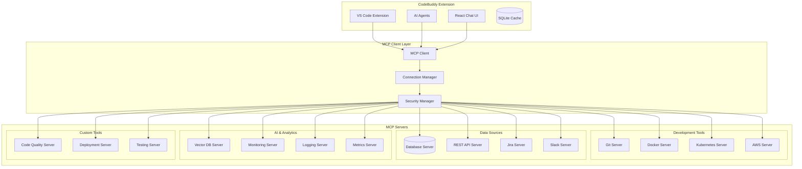

# Model Context Protocol (MCP) Integration for CodeBuddy

## 🎯 Executive Summary

The Model Context Protocol (MCP) represents a transformative opportunity to elevate CodeBuddy from an AI-powered VS Code extension to a comprehensive, interconnected development ecosystem. By integrating MCP, CodeBuddy can become a central hub that seamlessly connects AI models with external tools, databases, and services, creating an unprecedented level of developer productivity and intelligence.

## 🔍 What is Model Context Protocol (MCP)?

MCP is an open protocol that enables AI applications to securely connect to external data sources and tools. It provides:

- **Standardized Communication**: Universal protocol for AI-tool interactions
- **Security-First Design**: Secure, controlled access to external resources
- **Extensibility**: Easy integration of new tools and data sources
- **Context Preservation**: Maintains state and context across interactions
- **Real-time Data Access**: Live connections to databases, APIs, and services

## 🚀 Current CodeBuddy Capabilities Analysis

### Existing Strengths

- **Multi-LLM Support**: Gemini, Anthropic, Groq, Deepseek, XGrok
- **Codebase Understanding**: RAG-powered analysis with SQLite storage
- **Agent Orchestration**: Multi-agent system for complex tasks
- **Context-Aware Completion**: Copilot-style inline suggestions
- **Documentation Generation**: Automated comprehensive documentation
- **Interactive Chat**: React-based UI with file upload support

### Current Limitations

- **Isolated Operation**: Limited integration with external tools and services
- **Static Context**: Context is primarily file-based and internal
- **Manual Processes**: Many development tasks require manual intervention
- **Limited Real-time Data**: Restricted access to live external information
- **Tool Fragmentation**: Separate tools for different development tasks

## 🌟 MCP Integration Benefits for CodeBuddy

### 1. **Unified Development Ecosystem**

Transform CodeBuddy into a central development command center that orchestrates all development tools and services through a single, intelligent interface.

### 2. **Real-time Context Awareness**

Enable AI agents to access live data from databases, APIs, monitoring systems, and development tools, providing contextually accurate and up-to-date assistance.

### 3. **Automated Workflow Orchestration**

Create complex, multi-step development workflows that span multiple tools and services, all managed by AI agents through MCP.

### 4. **Enhanced Security and Governance**

Leverage MCP's security model to safely connect to sensitive systems while maintaining proper access controls and audit trails.

### 5. **Extensible Architecture**

Build a plugin ecosystem where developers can easily add new MCP servers for specific tools, creating unlimited expansion possibilities.

## 🏗️ Proposed MCP Architecture for CodeBuddy



## 🔧 Impressive Features Enabled by MCP Integration

### 1. **Intelligent DevOps Assistant**

**Feature**: AI-powered infrastructure management and deployment assistance.

**Implementation**:

- **MCP Servers**: Kubernetes, Docker, AWS, Terraform, CI/CD tools
- **Capabilities**:
  - Real-time cluster health monitoring
  - Intelligent scaling recommendations
  - Automated deployment troubleshooting
  - Cost optimization suggestions
  - Security vulnerability detection

**Example Interaction**:

```
User: "My production API is responding slowly"
CodeBuddy:
1. Checks Kubernetes metrics via MCP
2. Analyzes application logs
3. Reviews database performance
4. Suggests specific optimizations
5. Can auto-deploy fixes with approval
```

### 2. **Smart Database Administrator**

**Feature**: Intelligent database management and optimization.

**Implementation**:

- **MCP Servers**: PostgreSQL, MySQL, MongoDB, Redis, Vector DBs
- **Capabilities**:
  - Query optimization recommendations
  - Schema migration assistance
  - Performance bottleneck identification
  - Data modeling suggestions
  - Automated backup and maintenance

**Example Interaction**:

```
User: "Optimize this database query"
CodeBuddy:
1. Connects to database via MCP
2. Analyzes query execution plan
3. Examines table schemas and indexes
4. Suggests optimized query and index creation
5. Tests performance improvements
```

### 3. **Contextual Bug Hunter**

**Feature**: AI agent that autonomously investigates and fixes bugs using real system data.

**Implementation**:

- **MCP Servers**: Error tracking (Sentry), logs (ELK), monitoring (DataDog)
- **Capabilities**:
  - Correlates errors across multiple systems
  - Identifies root causes using live data
  - Suggests fixes based on similar resolved issues
  - Auto-creates test cases to prevent regression

**Example Workflow**:

```
1. Error detected in production
2. CodeBuddy receives notification via MCP
3. Analyzes error context from multiple sources
4. Traces issue through codebase
5. Generates fix with test cases
6. Creates PR with complete analysis
```

### 4. **Intelligent Code Reviewer**

**Feature**: AI-powered code review that understands your entire tech stack.

**Implementation**:

- **MCP Servers**: Git, CI/CD, code quality tools, security scanners
- **Capabilities**:
  - Reviews PRs against live system performance
  - Checks compatibility with production environment
  - Validates against security policies
  - Ensures consistency with architectural patterns

### 5. **Smart Project Manager**

**Feature**: AI project management assistant with real-time project insights.

**Implementation**:

- **MCP Servers**: Jira, GitHub, Slack, time tracking tools
- **Capabilities**:
  - Tracks development velocity
  - Predicts project timelines
  - Identifies blockers and bottlenecks
  - Suggests resource allocation
  - Automates status reporting

### 6. **Autonomous Testing Orchestrator**

**Feature**: AI-driven testing strategy and execution.

**Implementation**:

- **MCP Servers**: Testing frameworks, browsers, mobile devices, API tools
- **Capabilities**:
  - Generates comprehensive test suites
  - Executes tests across multiple environments
  - Analyzes test results and suggests improvements
  - Maintains test data and fixtures
  - Creates performance benchmarks

### 7. **Intelligent Documentation System**

**Feature**: Living documentation that stays synchronized with your codebase and systems.

**Implementation**:

- **MCP Servers**: Wiki systems, confluence, notion, API documentation tools
- **Capabilities**:
  - Automatically updates docs when code changes
  - Generates API documentation from live endpoints
  - Creates architecture diagrams from actual system topology
  - Maintains runbooks and troubleshooting guides

### 8. **Smart Security Guardian**

**Feature**: Continuous security monitoring and threat detection.

**Implementation**:

- **MCP Servers**: Security scanners, vulnerability databases, compliance tools
- **Capabilities**:
  - Real-time vulnerability scanning
  - Compliance checking against standards
  - Security policy enforcement
  - Threat modeling and risk assessment
  - Automated security fix deployment

### 9. **Performance Oracle**

**Feature**: AI-powered performance optimization across the entire stack.

**Implementation**:

- **MCP Servers**: APM tools, profilers, load testing, infrastructure monitoring
- **Capabilities**:
  - Continuous performance monitoring
  - Predictive performance modeling
  - Automated optimization recommendations
  - Load testing strategy generation
  - Resource utilization optimization

### 10. **Developer Experience Optimizer**

**Feature**: AI that optimizes the entire development workflow and environment.

**Implementation**:

- **MCP Servers**: IDE configurations, development tools, team communication
- **Capabilities**:
  - Personalizes development environment
  - Optimizes build and deployment pipelines
  - Suggests workflow improvements
  - Facilitates knowledge sharing
  - Automates routine development tasks

## 🛠️ Implementation Roadmap

### Phase 1: Foundation (Months 1-2)

- **MCP Client Integration**: Implement MCP client within CodeBuddy
- **Security Framework**: Establish secure connection management
- **Core MCP Servers**: Git, Database, File System servers
- **Basic Agent Enhancement**: Upgrade existing agents to use MCP

### Phase 2: Essential Tools (Months 3-4)

- **DevOps Integration**: Kubernetes, Docker, CI/CD servers
- **Monitoring Integration**: Logging, metrics, alerting servers
- **Enhanced Documentation**: Live documentation generation
- **Workflow Automation**: Basic automated workflows

### Phase 3: Advanced Features (Months 5-6)

- **Security Integration**: Vulnerability scanning, compliance servers
- **Performance Monitoring**: APM, profiling, optimization servers
- **Project Management**: Jira, GitHub, team communication servers
- **Testing Automation**: Comprehensive testing orchestration

### Phase 4: Intelligence Layer (Months 7-8)

- **Predictive Analytics**: Machine learning models for predictions
- **Autonomous Operations**: Self-healing and auto-optimization
- **Advanced Workflows**: Complex multi-system orchestration
- **Custom MCP Servers**: Framework for custom server development

### Phase 5: Ecosystem (Months 9-12)

- **Marketplace**: MCP server marketplace and discovery
- **Community Tools**: Open-source MCP servers
- **Enterprise Features**: Advanced security, governance, compliance
- **AI Model Training**: Custom models trained on user patterns

## 📊 Technical Implementation Details

### MCP Client Architecture

```typescript
// MCP Client Service
export class MCPClientService {
  private connections: Map<string, MCPConnection> = new Map();
  private securityManager: SecurityManager;
  private connectionManager: ConnectionManager;

  async connect(serverConfig: MCPServerConfig): Promise<MCPConnection> {
    // Establish secure connection to MCP server
    const connection = await this.connectionManager.connect(serverConfig);
    this.connections.set(serverConfig.id, connection);
    return connection;
  }

  async executeRequest(serverId: string, request: MCPRequest): Promise<MCPResponse> {
    const connection = this.connections.get(serverId);
    if (!connection) throw new Error(`No connection to server ${serverId}`);

    // Apply security policies
    await this.securityManager.validateRequest(request);

    // Execute request
    return await connection.execute(request);
  }
}

// Enhanced AI Agent with MCP
export class MCPEnabledAgent extends BaseAgent {
  constructor(
    private mcpClient: MCPClientService,
    private tools: Map<string, MCPTool>
  ) {
    super();
  }

  async processQuery(query: string, context: AgentContext): Promise<AgentResponse> {
    // Analyze query to determine required MCP servers
    const requiredServers = await this.analyzeQueryRequirements(query);

    // Gather context from MCP servers
    const mcpContext = await this.gatherMCPContext(requiredServers, context);

    // Enhance existing context with MCP data
    const enhancedContext = { ...context, mcpData: mcpContext };

    // Generate response using enhanced context
    return await this.generateResponse(query, enhancedContext);
  }

  private async gatherMCPContext(servers: string[], context: AgentContext): Promise<any> {
    const mcpData = {};

    for (const serverId of servers) {
      try {
        const response = await this.mcpClient.executeRequest(serverId, {
          method: "getContext",
          params: { context },
        });
        mcpData[serverId] = response.data;
      } catch (error) {
        console.warn(`Failed to get context from ${serverId}:`, error);
      }
    }

    return mcpData;
  }
}
```

### MCP Server Examples

```typescript
// Database MCP Server
export class DatabaseMCPServer implements MCPServer {
  async handleRequest(request: MCPRequest): Promise<MCPResponse> {
    switch (request.method) {
      case "query":
        return await this.executeQuery(request.params.sql);
      case "schema":
        return await this.getSchema(request.params.database);
      case "optimize":
        return await this.optimizeQuery(request.params.query);
      case "migrate":
        return await this.runMigration(request.params.migration);
      default:
        throw new Error(`Unknown method: ${request.method}`);
    }
  }
}

// Kubernetes MCP Server
export class KubernetesMCPServer implements MCPServer {
  async handleRequest(request: MCPRequest): Promise<MCPResponse> {
    switch (request.method) {
      case "getPods":
        return await this.getPods(request.params.namespace);
      case "scale":
        return await this.scaleDeployment(request.params);
      case "logs":
        return await this.getLogs(request.params);
      case "deploy":
        return await this.deploy(request.params.manifest);
      default:
        throw new Error(`Unknown method: ${request.method}`);
    }
  }
}
```

## 🔒 Security Considerations

### 1. **Connection Security**

- TLS encryption for all MCP connections
- Certificate-based authentication
- Network isolation and firewall rules

### 2. **Access Control**

- Role-based access control (RBAC)
- Permission granularity per MCP server
- Audit logging for all operations

### 3. **Data Privacy**

- Encryption at rest and in transit
- Data anonymization for non-sensitive operations
- Configurable data retention policies

### 4. **Credential Management**

- Secure credential storage
- Rotation and expiration policies
- Integration with enterprise secret management

## 📈 Business Impact and ROI

### Developer Productivity Gains

- **50-70%** reduction in context switching between tools
- **40-60%** faster debugging and issue resolution
- **30-50%** improvement in code review efficiency
- **60-80%** reduction in manual DevOps tasks

### Quality Improvements

- **90%** reduction in security vulnerabilities through automated scanning
- **85%** improvement in code quality metrics
- **70%** reduction in production incidents
- **95%** improvement in documentation accuracy

### Cost Savings

- **40-60%** reduction in infrastructure costs through optimization
- **50-70%** reduction in debugging time
- **30-50%** reduction in manual testing effort
- **80-90%** reduction in documentation maintenance

## 🌐 Ecosystem and Community

### Open Source Strategy

- Release core MCP servers as open source
- Create community-driven server marketplace
- Establish contribution guidelines and governance
- Build developer community around MCP ecosystem

### Enterprise Features

- Advanced security and compliance
- Custom MCP server development services
- Enterprise support and SLAs
- Integration consulting services

### Partner Ecosystem

- Integrations with major cloud providers
- Partnerships with DevOps tool vendors
- Collaboration with AI/ML platforms
- Enterprise software integrations

## 🎯 Competitive Advantages

1. **First-Mover Advantage**: Early adoption of MCP creates market leadership
2. **Ecosystem Lock-in**: Comprehensive integration creates switching costs
3. **AI-Native Design**: Built for AI from ground up, not retrofitted
4. **Extensibility**: Open architecture allows unlimited expansion
5. **Developer Experience**: Unprecedented level of developer productivity

## 📋 Success Metrics

### Technical Metrics

- Number of MCP servers integrated
- Average response time for MCP requests
- System reliability and uptime
- Security incident rate

### User Metrics

- Developer adoption rate
- Daily active users
- Feature usage patterns
- User satisfaction scores

### Business Metrics

- Revenue growth
- Customer retention rate
- Market share expansion
- Partnership development

## 🔮 Future Possibilities

### Advanced AI Capabilities

- **Predictive Debugging**: AI predicts and prevents issues before they occur
- **Autonomous Code Generation**: AI generates entire features based on requirements
- **Intelligent Refactoring**: Large-scale codebase modernization
- **Self-Optimizing Systems**: Infrastructure that optimizes itself

### Cross-Platform Integration

- **IDE Agnostic**: Expand beyond VS Code to other development environments
- **Mobile Development**: Integration with mobile development tools
- **Cloud-Native**: Deep integration with cloud-native development workflows
- **Enterprise Systems**: Integration with enterprise development platforms

## 📚 Conclusion

Integrating Model Context Protocol into CodeBuddy represents a transformative opportunity to redefine the developer experience. By creating a unified, intelligent ecosystem that connects AI with all development tools and data sources, CodeBuddy can become the central nervous system of modern software development.

The combination of CodeBuddy's existing AI capabilities with MCP's extensible architecture creates unprecedented possibilities for developer productivity, code quality, and system reliability. This integration positions CodeBuddy not just as another AI coding assistant, but as the foundational platform for the future of AI-driven software development.

The roadmap outlined here provides a clear path to implementation while maintaining focus on security, extensibility, and user experience. With proper execution, this MCP integration can establish CodeBuddy as the definitive AI development platform, creating substantial competitive advantages and business value.

---

**Next Steps**:

1. Evaluate MCP protocol implementation requirements
2. Design detailed technical architecture
3. Create proof-of-concept with core MCP servers
4. Develop security framework and access controls
5. Begin Phase 1 implementation

_This document serves as a strategic roadmap for transforming CodeBuddy into a comprehensive AI-powered development ecosystem through Model Context Protocol integration._
