# ReAct Agent Command Orchestration

> **Migrating CodeBuddy Commands to an Autonomous ReAct Agent Architecture**

This document outlines the architecture and implementation strategy for transforming CodeBuddy's linear command handlers into an intelligent, self-orchestrating ReAct (Reasoning + Acting) agent using LangChain and LangGraph.

---

## Table of Contents

1. [Executive Summary](#1-executive-summary)
2. [Current Architecture Analysis](#2-current-architecture-analysis)
3. [ReAct Agent Architecture](#3-react-agent-architecture)
4. [Implementation Guide](#4-implementation-guide)
5. [Command-as-Tool Definitions](#5-command-as-tool-definitions)
6. [Orchestration Scenarios](#6-orchestration-scenarios)
7. [Advanced Patterns](#7-advanced-patterns)
8. [Migration Strategy](#8-migration-strategy)

---

## 1. Executive Summary

### The Vision

Transform CodeBuddy from a **command executor** into an **intelligent code assistant** that can:

- **Chain commands autonomously**: "Review this code and fix any issues" → Review → Identify problems → Refactor → Optimize → Done
- **Make intelligent decisions**: Choose the right tool based on context
- **Maintain conversation context**: Remember what was done and why
- **Self-correct**: If one approach fails, try another

### Before vs After

```
┌─────────────────────────────────────────────────────────────────────────────┐
│ BEFORE: Linear Command Execution                                             │
├─────────────────────────────────────────────────────────────────────────────┤
│                                                                              │
│   User: "Review my code"                                                     │
│         ↓                                                                    │
│   ReviewCode.execute()                                                       │
│         ↓                                                                    │
│   LLM → Response                                                             │
│         ↓                                                                    │
│   Done (User must manually run next command)                                 │
│                                                                              │
└─────────────────────────────────────────────────────────────────────────────┘

┌─────────────────────────────────────────────────────────────────────────────┐
│ AFTER: ReAct Agent Orchestration                                             │
├─────────────────────────────────────────────────────────────────────────────┤
│                                                                              │
│   User: "Review my code and fix any critical issues"                         │
│         ↓                                                                    │
│   ┌─────────────────────────────────────────────────────────────────┐       │
│   │  AGENT LOOP                                                      │       │
│   │  ┌────────────────────────────────────────────────────────────┐ │       │
│   │  │ 1. REASON: "I need to review the code first"               │ │       │
│   │  │ 2. ACT: Call review_code tool                              │ │       │
│   │  │ 3. OBSERVE: "Found SQL injection on line 45"               │ │       │
│   │  │ 4. REASON: "Critical issue found, need to fix it"          │ │       │
│   │  │ 5. ACT: Call refactor_code tool with fix instructions      │ │       │
│   │  │ 6. OBSERVE: "Code refactored with parameterized queries"   │ │       │
│   │  │ 7. REASON: "Should verify the fix is optimal"              │ │       │
│   │  │ 8. ACT: Call optimize_code tool                            │ │       │
│   │  │ 9. OBSERVE: "No further optimizations needed"              │ │       │
│   │  │ 10. REASON: "Task complete, ready to respond"              │ │       │
│   │  └────────────────────────────────────────────────────────────┘ │       │
│   └─────────────────────────────────────────────────────────────────┘       │
│         ↓                                                                    │
│   Final Response: "I reviewed your code, found a SQL injection              │
│                    vulnerability, and fixed it using parameterized          │
│                    queries. Here's the improved code..."                    │
│                                                                              │
└─────────────────────────────────────────────────────────────────────────────┘
```

---

## 2. Current Architecture Analysis

### Existing Command Structure

```typescript
// src/commands/handler.ts - Base class pattern
abstract class CodeCommandHandler {
  // Multi-LLM support: Gemini, Anthropic, Groq, Deepseek, XGrok
  protected createModel(): { generativeAi: string; model: any; modelName: string };
  
  // Entry point - gets selected code, sends to LLM
  async execute(): Promise<void>;
  
  // Generate response using configured LLM
  protected async generateResponse(prompt: string): Promise<string>;
  
  // Abstract methods each command implements
  abstract formatResponse(comment: string): string;
  abstract createPrompt(text?: string): any;
}
```

### Current Commands Inventory

| Command | File | Capability |
|---------|------|------------|
| `ReviewCode` | `review.ts` | Security, performance, architecture analysis |
| `RefactorCode` | `refactor.ts` | Clean code, SOLID principles, design patterns |
| `OptimizeCode` | `optimize.ts` | Performance optimization, complexity reduction |
| `Comments` | `comment.ts` | JSDoc generation, code documentation |
| `ExplainCode` | `explain.ts` | Educational breakdowns, logic explanation |
| `FixError` | `fixError.ts` | Error diagnosis, defensive programming |
| `GenerateUnitTest` | `generate-unit-test.ts` | Test suite generation, mocking strategies |
| `InterviewMe` | `interview-me.ts` | Technical interview preparation |
| `GenerateCommitMessage` | `generate-commit-message.ts` | Git commit message generation |
| `GenerateCodeChart` | `generate-code-chart.ts` | Mermaid diagram generation |

### Limitations of Current Approach

1. **No Command Chaining**: User must manually trigger each command
2. **No Context Sharing**: Each command runs in isolation
3. **No Decision Making**: Cannot autonomously decide next steps
4. **No Self-Correction**: Cannot retry with different approaches

---

## 3. ReAct Agent Architecture

### Core Concepts

```mermaid
flowchart TB
    subgraph ReActLoop["🔄 ReAct Loop"]
        Reason["🧠 REASON<br/>Analyze situation,<br/>decide next action"]
        Act["⚡ ACT<br/>Execute chosen<br/>tool/command"]
        Observe["👁️ OBSERVE<br/>Process tool<br/>output"]
    end
    
    Input["📥 User Input"] --> Reason
    Reason --> |"Tool Call"| Act
    Act --> Observe
    Observe --> |"More work needed"| Reason
    Observe --> |"Task complete"| Output["📤 Final Response"]
    
    subgraph Tools["🔧 Command Tools"]
        Review["review_code"]
        Refactor["refactor_code"]
        Optimize["optimize_code"]
        Comment["add_comments"]
        Explain["explain_code"]
        FixError["fix_error"]
        Test["generate_tests"]
        Diagram["generate_diagram"]
    end
    
    Act --> Tools
    Tools --> Observe
```



### LangGraph State Machine


### State Definition

```typescript
// src/agents/langgraph/state/command-agent-state.ts

import { Annotation, MessagesAnnotation } from "@langchain/langgraph";
import { BaseMessage } from "@langchain/core/messages";

export const CommandAgentState = Annotation.Root({
  // Conversation history (extends MessagesAnnotation)
  messages: Annotation<BaseMessage[]>({
    reducer: (current, update) => [...current, ...update],
    default: () => [],
  }),
  
  // Current code context
  selectedCode: Annotation<string>({
    reducer: (_, update) => update,
    default: () => "",
  }),
  
  // File context
  activeFile: Annotation<string>({
    reducer: (_, update) => update,
    default: () => "",
  }),
  
  // Chain of executed commands
  executedCommands: Annotation<string[]>({
    reducer: (current, update) => [...current, ...update],
    default: () => [],
  }),
  
  // Accumulated findings/issues
  findings: Annotation<CommandFinding[]>({
    reducer: (current, update) => [...current, ...update],
    default: () => [],
  }),
  
  // Current task status
  status: Annotation<"reasoning" | "acting" | "complete" | "error">({
    reducer: (_, update) => update,
    default: () => "reasoning",
  }),
});

interface CommandFinding {
  type: "security" | "performance" | "quality" | "bug" | "suggestion";
  severity: "critical" | "high" | "medium" | "low";
  description: string;
  location?: string;
  fixed: boolean;
}
```

---

## 4. Implementation Guide

### Step 1: Create the Command Tools Factory

```typescript
// src/agents/langgraph/tools/command-tools.ts

import { DynamicStructuredTool } from "@langchain/core/tools";
import { z } from "zod";
import * as vscode from "vscode";

// Shared schema for code input
const CodeInputSchema = z.object({
  code: z.string().describe("The source code to analyze"),
  context: z.string().optional().describe("Additional context about the code"),
  focus: z.string().optional().describe("Specific aspect to focus on"),
});

export class CommandToolsFactory {
  constructor(private readonly context: vscode.ExtensionContext) {}

  createReviewTool(): DynamicStructuredTool {
    return new DynamicStructuredTool({
      name: "review_code",
      description: `Perform a comprehensive code review analyzing:
        - Security vulnerabilities (SQL injection, XSS, auth issues)
        - Performance problems (N+1 queries, memory leaks, complexity)
        - Architecture concerns (SOLID violations, coupling)
        - Code quality (readability, maintainability)
        Returns structured findings with severity levels.`,
      schema: CodeInputSchema,
      func: async ({ code, context, focus }) => {
        const prompt = this.buildReviewPrompt(code, context, focus);
        const response = await this.invokeLLM(prompt);
        return this.parseReviewResponse(response);
      },
    });
  }

  createRefactorTool(): DynamicStructuredTool {
    return new DynamicStructuredTool({
      name: "refactor_code",
      description: `Refactor code to improve quality. Can:
        - Fix identified issues from code review
        - Apply design patterns
        - Improve naming and structure
        - Reduce complexity
        - Apply SOLID principles
        Specify the issues to fix or improvements to make.`,
      schema: z.object({
        code: z.string().describe("The source code to refactor"),
        issues: z.array(z.string()).describe("Specific issues to address"),
        targetPatterns: z.array(z.string()).optional()
          .describe("Design patterns to apply (e.g., 'Strategy', 'Factory')"),
      }),
      func: async ({ code, issues, targetPatterns }) => {
        const prompt = this.buildRefactorPrompt(code, issues, targetPatterns);
        return await this.invokeLLM(prompt);
      },
    });
  }

  createOptimizeTool(): DynamicStructuredTool {
    return new DynamicStructuredTool({
      name: "optimize_code",
      description: `Optimize code for performance. Analyzes:
        - Time complexity (Big O)
        - Space complexity
        - Database query efficiency
        - Caching opportunities
        - Async/parallel execution potential
        Returns optimized code with performance annotations.`,
      schema: z.object({
        code: z.string().describe("The source code to optimize"),
        targetMetric: z.enum(["speed", "memory", "both"]).default("both")
          .describe("Primary optimization target"),
        constraints: z.string().optional()
          .describe("Constraints to maintain (e.g., 'must keep same API')"),
      }),
      func: async ({ code, targetMetric, constraints }) => {
        const prompt = this.buildOptimizePrompt(code, targetMetric, constraints);
        return await this.invokeLLM(prompt);
      },
    });
  }

  createExplainTool(): DynamicStructuredTool {
    return new DynamicStructuredTool({
      name: "explain_code",
      description: `Generate educational explanation of code. Provides:
        - High-level overview
        - Step-by-step logic breakdown
        - Key concepts and patterns used
        - Potential gotchas and edge cases
        Useful for understanding unfamiliar code before modifying it.`,
      schema: z.object({
        code: z.string().describe("The source code to explain"),
        audienceLevel: z.enum(["beginner", "intermediate", "advanced"]).default("intermediate")
          .describe("Target audience expertise level"),
      }),
      func: async ({ code, audienceLevel }) => {
        const prompt = this.buildExplainPrompt(code, audienceLevel);
        return await this.invokeLLM(prompt);
      },
    });
  }

  createFixErrorTool(): DynamicStructuredTool {
    return new DynamicStructuredTool({
      name: "fix_error",
      description: `Diagnose and fix code errors. Handles:
        - Runtime errors (TypeError, ReferenceError, etc.)
        - Logic errors
        - Type mismatches
        - Edge case failures
        Provide the error message and stack trace for best results.`,
      schema: z.object({
        code: z.string().describe("The source code with the error"),
        errorMessage: z.string().describe("The error message or stack trace"),
        errorContext: z.string().optional().describe("When/how the error occurs"),
      }),
      func: async ({ code, errorMessage, errorContext }) => {
        const prompt = this.buildFixErrorPrompt(code, errorMessage, errorContext);
        return await this.invokeLLM(prompt);
      },
    });
  }

  createGenerateTestsTool(): DynamicStructuredTool {
    return new DynamicStructuredTool({
      name: "generate_tests",
      description: `Generate comprehensive unit tests. Creates:
        - Happy path tests
        - Edge case tests
        - Error handling tests
        - Mock strategies for dependencies
        Supports Jest, Mocha, Vitest patterns.`,
      schema: z.object({
        code: z.string().describe("The source code to test"),
        framework: z.enum(["jest", "mocha", "vitest"]).default("jest")
          .describe("Testing framework to use"),
        coverage: z.enum(["minimal", "standard", "comprehensive"]).default("standard")
          .describe("Desired test coverage level"),
      }),
      func: async ({ code, framework, coverage }) => {
        const prompt = this.buildGenerateTestsPrompt(code, framework, coverage);
        return await this.invokeLLM(prompt);
      },
    });
  }

  createAddCommentsTool(): DynamicStructuredTool {
    return new DynamicStructuredTool({
      name: "add_comments",
      description: `Add documentation comments to code. Generates:
        - JSDoc/TSDoc for functions and classes
        - Inline comments for complex logic
        - Module-level documentation
        Focuses on WHY, not WHAT.`,
      schema: z.object({
        code: z.string().describe("The source code to document"),
        style: z.enum(["jsdoc", "tsdoc", "inline"]).default("jsdoc")
          .describe("Documentation style"),
      }),
      func: async ({ code, style }) => {
        const prompt = this.buildAddCommentsPrompt(code, style);
        return await this.invokeLLM(prompt);
      },
    });
  }

  createGenerateDiagramTool(): DynamicStructuredTool {
    return new DynamicStructuredTool({
      name: "generate_diagram",
      description: `Generate Mermaid diagrams from code. Creates:
        - Class diagrams
        - Sequence diagrams
        - Flowcharts
        - Entity-relationship diagrams
        Useful for visualizing architecture and flow.`,
      schema: z.object({
        code: z.string().describe("The source code to visualize"),
        diagramType: z.enum(["class", "sequence", "flowchart", "er"]).default("flowchart")
          .describe("Type of diagram to generate"),
      }),
      func: async ({ code, diagramType }) => {
        const prompt = this.buildGenerateDiagramPrompt(code, diagramType);
        return await this.invokeLLM(prompt);
      },
    });
  }

  // Utility tool for the agent to think through complex problems
  createThinkTool(): DynamicStructuredTool {
    return new DynamicStructuredTool({
      name: "think",
      description: `Use this tool to reason through complex decisions. 
        When you need to:
        - Analyze findings and prioritize next steps
        - Decide between multiple approaches
        - Plan a multi-step refactoring strategy
        Write out your reasoning - this helps maintain context.`,
      schema: z.object({
        thought: z.string().describe("Your reasoning and analysis"),
        decision: z.string().optional().describe("The decision reached"),
      }),
      func: async ({ thought, decision }) => {
        return `Thought recorded: ${thought}${decision ? `\nDecision: ${decision}` : ""}`;
      },
    });
  }

  // Get all command tools
  getAllTools(): DynamicStructuredTool[] {
    return [
      this.createReviewTool(),
      this.createRefactorTool(),
      this.createOptimizeTool(),
      this.createExplainTool(),
      this.createFixErrorTool(),
      this.createGenerateTestsTool(),
      this.createAddCommentsTool(),
      this.createGenerateDiagramTool(),
      this.createThinkTool(),
    ];
  }

  // Helper methods for prompt building (implement based on existing prompts)
  private buildReviewPrompt(code: string, context?: string, focus?: string): string {
    // Reuse prompt from ReviewCode command
    return `Review the following code...`;
  }

  private async invokeLLM(prompt: string): Promise<string> {
    // Use configured LLM (Anthropic, Gemini, etc.)
    return `LLM response...`;
  }

  private parseReviewResponse(response: string): string {
    return response;
  }

  private buildRefactorPrompt(code: string, issues: string[], patterns?: string[]): string {
    return `Refactor the following code...`;
  }

  private buildOptimizePrompt(code: string, target: string, constraints?: string): string {
    return `Optimize the following code...`;
  }

  private buildExplainPrompt(code: string, level: string): string {
    return `Explain the following code...`;
  }

  private buildFixErrorPrompt(code: string, error: string, context?: string): string {
    return `Fix the error in the following code...`;
  }

  private buildGenerateTestsPrompt(code: string, framework: string, coverage: string): string {
    return `Generate tests for the following code...`;
  }

  private buildAddCommentsPrompt(code: string, style: string): string {
    return `Add comments to the following code...`;
  }

  private buildGenerateDiagramPrompt(code: string, type: string): string {
    return `Generate a ${type} diagram for the following code...`;
  }
}
```

### Step 2: Build the ReAct Graph

```typescript
// src/agents/langgraph/graphs/command-react-agent.ts

import { StateGraph, END, START } from "@langchain/langgraph";
import { ToolNode } from "@langchain/langgraph/prebuilt";
import { ChatAnthropic } from "@langchain/anthropic";
import { ChatGoogleGenerativeAI } from "@langchain/google-genai";
import { AIMessage, BaseMessage, HumanMessage, SystemMessage } from "@langchain/core/messages";
import { CommandAgentState } from "../state/command-agent-state";
import { CommandToolsFactory } from "../tools/command-tools";
import * as vscode from "vscode";

const COMMAND_AGENT_SYSTEM_PROMPT = `You are CodeBuddy, an intelligent code assistant that can analyze, review, refactor, and improve code autonomously.

## Your Capabilities
You have access to these tools:
- **review_code**: Comprehensive code review (security, performance, architecture)
- **refactor_code**: Improve code quality and apply design patterns
- **optimize_code**: Performance optimization
- **explain_code**: Generate educational explanations
- **fix_error**: Diagnose and fix errors
- **generate_tests**: Create unit tests
- **add_comments**: Add documentation
- **generate_diagram**: Create Mermaid diagrams
- **think**: Reason through complex decisions

## Decision Framework

When given a task, follow this process:

1. **UNDERSTAND**: What is the user asking for? What's the scope?

2. **ANALYZE**: If working with code, start with review_code to understand the codebase
   - If critical issues found → plan to fix them
   - If performance issues → plan to optimize
   - If code is unclear → consider explaining first

3. **PLAN**: Use the 'think' tool to plan multi-step operations
   - Prioritize: Critical security > Performance > Quality > Style
   - Consider dependencies between changes

4. **EXECUTE**: Run tools in logical order
   - Review → Identify Issues → Fix/Refactor → Optimize → Verify
   - After refactoring, consider if tests are needed
   - After major changes, consider adding comments

5. **VERIFY**: After changes, optionally re-review to confirm fixes

## Guidelines

- **Be thorough but focused**: Don't over-engineer simple requests
- **Explain your reasoning**: Tell the user what you found and why you're taking actions
- **Preserve intent**: When refactoring, maintain original functionality
- **Be conservative with changes**: Fix what's broken, improve what's bad, leave what's fine
- **Chain wisely**: Not every review needs a refactor; use judgment

## Output Format

When providing final responses:
1. Summarize what you found
2. Explain what actions you took
3. Present the improved code (if applicable)
4. Suggest follow-up actions (if any)
`;

export class CommandReActAgent {
  private graph: ReturnType<typeof this.buildGraph>;

  constructor(
    private readonly context: vscode.ExtensionContext,
    private readonly config: {
      provider: "anthropic" | "gemini" | "groq";
      apiKey: string;
      model: string;
    }
  ) {
    this.graph = this.buildGraph();
  }

  private buildGraph() {
    // Initialize tools
    const toolsFactory = new CommandToolsFactory(this.context);
    const tools = toolsFactory.getAllTools();
    const toolNode = new ToolNode(tools);

    // Initialize LLM with tools
    const llm = this.createLLM().bindTools(tools);

    // Agent node - reasons and decides on actions
    const agentNode = async (state: typeof CommandAgentState.State) => {
      const messages = state.messages;
      
      // Add system message if not present
      if (messages.length === 0 || !(messages[0] instanceof SystemMessage)) {
        messages.unshift(new SystemMessage(COMMAND_AGENT_SYSTEM_PROMPT));
      }

      const response = await llm.invoke(messages);
      
      return {
        messages: [response],
        status: response.tool_calls?.length ? "acting" : "complete",
      };
    };

    // Routing function
    const shouldContinue = (state: typeof CommandAgentState.State): string => {
      const lastMessage = state.messages[state.messages.length - 1] as AIMessage;
      
      // If agent made tool calls, route to tools
      if (lastMessage.tool_calls && lastMessage.tool_calls.length > 0) {
        return "tools";
      }
      
      // Otherwise, we're done
      return END;
    };

    // Build the graph
    const workflow = new StateGraph(CommandAgentState)
      .addNode("agent", agentNode)
      .addNode("tools", toolNode)
      .addEdge(START, "agent")
      .addConditionalEdges("agent", shouldContinue, {
        tools: "tools",
        [END]: END,
      })
      .addEdge("tools", "agent"); // After tools, go back to agent

    return workflow.compile();
  }

  private createLLM() {
    switch (this.config.provider) {
      case "anthropic":
        return new ChatAnthropic({
          modelName: this.config.model,
          anthropicApiKey: this.config.apiKey,
          temperature: 0.1,
        });
      case "gemini":
        return new ChatGoogleGenerativeAI({
          modelName: this.config.model,
          apiKey: this.config.apiKey,
          temperature: 0.1,
        });
      default:
        throw new Error(`Unsupported provider: ${this.config.provider}`);
    }
  }

  async *run(userMessage: string, selectedCode?: string) {
    const input = {
      messages: [
        new HumanMessage(
          selectedCode 
            ? `${userMessage}\n\nCode:\n\`\`\`\n${selectedCode}\n\`\`\``
            : userMessage
        ),
      ],
      selectedCode: selectedCode || "",
      executedCommands: [],
      findings: [],
      status: "reasoning" as const,
    };

    // Stream events from the graph
    const stream = await this.graph.stream(input, {
      streamMode: "values",
    });

    for await (const state of stream) {
      yield state;
    }
  }

  async invoke(userMessage: string, selectedCode?: string) {
    const input = {
      messages: [
        new HumanMessage(
          selectedCode 
            ? `${userMessage}\n\nCode:\n\`\`\`\n${selectedCode}\n\`\`\``
            : userMessage
        ),
      ],
      selectedCode: selectedCode || "",
      executedCommands: [],
      findings: [],
      status: "reasoning" as const,
    };

    return await this.graph.invoke(input);
  }
}
```

### Step 3: Integration with VS Code Extension

```typescript
// src/agents/command-agent.service.ts

import * as vscode from "vscode";
import { CommandReActAgent } from "./langgraph/graphs/command-react-agent";
import { Orchestrator } from "../orchestrator";
import { StreamEventType } from "./interface/agent.interface";

export class CommandAgentService {
  private agent: CommandReActAgent;
  private orchestrator: Orchestrator;

  constructor(
    private readonly context: vscode.ExtensionContext,
    config: { provider: "anthropic" | "gemini" | "groq"; apiKey: string; model: string }
  ) {
    this.agent = new CommandReActAgent(context, config);
    this.orchestrator = Orchestrator.getInstance();
  }

  async executeWithStreaming(
    userMessage: string,
    selectedCode?: string,
    requestId?: string
  ): Promise<void> {
    try {
      // Notify stream start
      await this.orchestrator.publish(StreamEventType.START, {
        requestId,
        message: "Starting command agent...",
      });

      let fullResponse = "";
      
      for await (const state of this.agent.run(userMessage, selectedCode)) {
        const lastMessage = state.messages[state.messages.length - 1];
        
        if (lastMessage.content && typeof lastMessage.content === "string") {
          fullResponse = lastMessage.content;
          
          // Stream chunk
          await this.orchestrator.publish(StreamEventType.CHUNK, {
            requestId,
            content: lastMessage.content,
            accumulated: fullResponse,
          });
        }

        // Notify tool usage
        if (lastMessage.tool_calls?.length) {
          for (const toolCall of lastMessage.tool_calls) {
            await this.orchestrator.publish(StreamEventType.TOOL_START, {
              requestId,
              toolName: toolCall.name,
              toolInput: toolCall.args,
            });
          }
        }
      }

      // Notify stream end
      await this.orchestrator.publish(StreamEventType.END, {
        requestId,
        content: fullResponse,
      });
    } catch (error: any) {
      await this.orchestrator.publish(StreamEventType.ERROR, {
        requestId,
        error: error.message,
      });
      throw error;
    }
  }
}
```

---

## 5. Command-as-Tool Definitions

### Tool Capability Matrix

```
┌─────────────────────┬──────────────────────────────────────────────────────────┐
│ Tool                │ Triggers Next Tool When...                               │
├─────────────────────┼──────────────────────────────────────────────────────────┤
│ review_code         │ → refactor_code: Critical issues found                   │
│                     │ → optimize_code: Performance issues found                │
│                     │ → fix_error: Bugs identified                             │
│                     │ → generate_tests: No tests exist for critical code       │
├─────────────────────┼──────────────────────────────────────────────────────────┤
│ refactor_code       │ → review_code: Verify refactoring didn't break anything  │
│                     │ → add_comments: Complex refactoring needs documentation  │
│                     │ → generate_tests: New code paths need tests              │
├─────────────────────┼──────────────────────────────────────────────────────────┤
│ optimize_code       │ → generate_tests: Performance tests needed               │
│                     │ → add_comments: Optimization rationale documentation     │
├─────────────────────┼──────────────────────────────────────────────────────────┤
│ fix_error           │ → generate_tests: Regression test for the fix            │
│                     │ → review_code: Verify fix didn't introduce issues        │
├─────────────────────┼──────────────────────────────────────────────────────────┤
│ explain_code        │ → generate_diagram: Visual aid for complex code          │
│                     │ → add_comments: Document the explained logic             │
├─────────────────────┼──────────────────────────────────────────────────────────┤
│ generate_tests      │ → review_code: Review test quality                       │
├─────────────────────┼──────────────────────────────────────────────────────────┤
│ generate_diagram    │ → (Usually terminal - visual output)                     │
├─────────────────────┼──────────────────────────────────────────────────────────┤
│ add_comments        │ → (Usually terminal - documentation complete)            │
└─────────────────────┴──────────────────────────────────────────────────────────┘
```

---

## 6. Orchestration Scenarios

### Scenario 1: "Review and Fix"

```
User: "Review this code and fix any critical issues"

┌─────────────────────────────────────────────────────────────────────────────┐
│ Agent Execution Trace                                                        │
├─────────────────────────────────────────────────────────────────────────────┤
│                                                                              │
│ [REASON] User wants review AND fixes. Start with review to identify issues. │
│     ↓                                                                        │
│ [ACT] Call: review_code({ code: "...", focus: "critical issues" })          │
│     ↓                                                                        │
│ [OBSERVE] Review Results:                                                    │
│   - 🔴 CRITICAL: SQL Injection on line 23                                   │
│   - 🔴 CRITICAL: Hardcoded credentials on line 45                           │
│   - 🟡 MODERATE: N+1 query pattern on line 67                               │
│     ↓                                                                        │
│ [REASON] Found 2 critical issues. Must fix those. N+1 is moderate,          │
│          will address if time permits.                                       │
│     ↓                                                                        │
│ [ACT] Call: refactor_code({                                                 │
│   code: "...",                                                               │
│   issues: [                                                                  │
│     "SQL Injection: Use parameterized queries",                              │
│     "Hardcoded credentials: Move to environment variables"                   │
│   ]                                                                          │
│ })                                                                           │
│     ↓                                                                        │
│ [OBSERVE] Refactored code with:                                              │
│   - Parameterized queries implemented                                        │
│   - Credentials moved to process.env                                         │
│     ↓                                                                        │
│ [REASON] Critical issues fixed. Should verify the fix didn't break          │
│          anything and address the N+1 if straightforward.                    │
│     ↓                                                                        │
│ [ACT] Call: optimize_code({                                                 │
│   code: "[refactored code]",                                                 │
│   targetMetric: "speed",                                                     │
│   constraints: "maintain security fixes"                                     │
│ })                                                                           │
│     ↓                                                                        │
│ [OBSERVE] Optimized: Batch query replaces N+1 pattern                        │
│     ↓                                                                        │
│ [REASON] All issues addressed. Ready to respond to user.                     │
│     ↓                                                                        │
│ [RESPOND] "I reviewed your code and found 2 critical security               │
│            vulnerabilities and 1 performance issue. Here's what I fixed..." │
│                                                                              │
└─────────────────────────────────────────────────────────────────────────────┘
```

### Scenario 2: "Make This Code Production-Ready"

```
User: "Make this code production-ready"

┌─────────────────────────────────────────────────────────────────────────────┐
│ Agent Execution Trace                                                        │
├─────────────────────────────────────────────────────────────────────────────┤
│                                                                              │
│ [REASON] "Production-ready" is broad. Need comprehensive approach:          │
│   1. Review for issues                                                       │
│   2. Fix problems                                                            │
│   3. Add documentation                                                       │
│   4. Add tests                                                               │
│   Let me use 'think' to plan this.                                          │
│     ↓                                                                        │
│ [ACT] Call: think({                                                         │
│   thought: "Production-ready checklist:                                      │
│     1. Security audit                                                        │
│     2. Performance optimization                                              │
│     3. Error handling                                                        │
│     4. Documentation                                                         │
│     5. Unit tests                                                            │
│   Will execute review first to understand current state."                    │
│ })                                                                           │
│     ↓                                                                        │
│ [ACT] Call: review_code({ code: "...", focus: "production readiness" })     │
│     ↓                                                                        │
│ [OBSERVE] Findings:                                                          │
│   - No input validation                                                      │
│   - Missing error handling                                                   │
│   - No logging                                                               │
│   - Undocumented functions                                                   │
│   - No tests                                                                 │
│     ↓                                                                        │
│ [ACT] Call: refactor_code({                                                 │
│   code: "...",                                                               │
│   issues: ["Add input validation", "Add try-catch blocks", "Add logging"]   │
│ })                                                                           │
│     ↓                                                                        │
│ [ACT] Call: add_comments({ code: "[refactored]", style: "jsdoc" })          │
│     ↓                                                                        │
│ [ACT] Call: generate_tests({                                                │
│   code: "[documented]",                                                      │
│   framework: "jest",                                                         │
│   coverage: "comprehensive"                                                  │
│ })                                                                           │
│     ↓                                                                        │
│ [RESPOND] "I've made your code production-ready:                            │
│   ✅ Added input validation                                                  │
│   ✅ Implemented error handling with logging                                 │
│   ✅ Added JSDoc documentation                                               │
│   ✅ Generated comprehensive unit tests                                      │
│   Here's the improved code and test file..."                                │
│                                                                              │
└─────────────────────────────────────────────────────────────────────────────┘
```

### Scenario 3: "I'm Getting This Error"

```
User: "I'm getting 'Cannot read property 'map' of undefined' on line 15"

┌─────────────────────────────────────────────────────────────────────────────┐
│ Agent Execution Trace                                                        │
├─────────────────────────────────────────────────────────────────────────────┤
│                                                                              │
│ [REASON] User has a specific error. Use fix_error tool directly.            │
│     ↓                                                                        │
│ [ACT] Call: fix_error({                                                     │
│   code: "...",                                                               │
│   errorMessage: "Cannot read property 'map' of undefined",                   │
│   errorContext: "line 15"                                                    │
│ })                                                                           │
│     ↓                                                                        │
│ [OBSERVE] Diagnosis:                                                         │
│   - `users` variable can be undefined when API returns empty                 │
│   - Fix: Add null check or default to empty array                           │
│   - Fixed code provided                                                      │
│     ↓                                                                        │
│ [REASON] Error fixed, but this type of bug suggests missing defensive       │
│          programming. Should suggest a test to prevent regression.          │
│     ↓                                                                        │
│ [ACT] Call: generate_tests({                                                │
│   code: "[fixed code]",                                                      │
│   framework: "jest",                                                         │
│   coverage: "minimal"  // Just for the fixed function                       │
│ })                                                                           │
│     ↓                                                                        │
│ [RESPOND] "I found the issue! The `users` variable is undefined when        │
│            the API returns empty. Here's the fix with a null check:         │
│            [code]                                                            │
│            I also generated a test to prevent this regression:              │
│            [test code]"                                                      │
│                                                                              │
└─────────────────────────────────────────────────────────────────────────────┘
```

---

## 7. Advanced Patterns

### Human-in-the-Loop Interrupts

For sensitive operations, require human approval:

```typescript
// Define interrupt points
const interruptConfig = {
  refactor_code: {
    condition: (args) => args.issues.some(i => i.includes("security")),
    message: "Agent wants to refactor security-related code. Approve?",
  },
  fix_error: {
    condition: (args) => args.code.includes("database") || args.code.includes("auth"),
    message: "Agent wants to modify database/auth code. Approve?",
  },
};

// In graph, add interrupt before tool execution
const toolNodeWithInterrupt = async (state) => {
  const lastMessage = state.messages[state.messages.length - 1];
  
  for (const toolCall of lastMessage.tool_calls) {
    const config = interruptConfig[toolCall.name];
    if (config?.condition(toolCall.args)) {
      // Interrupt for approval
      const approved = await requestHumanApproval(config.message, toolCall);
      if (!approved) {
        return { messages: [new AIMessage("Operation cancelled by user.")] };
      }
    }
  }
  
  // Execute tools
  return toolNode.invoke(state);
};
```

### Parallel Tool Execution

When tools are independent, run them in parallel:

```typescript
// Agent can request parallel execution
const agentNode = async (state) => {
  // ... 
  // When agent determines tools can run in parallel:
  // It returns multiple tool_calls in a single response
  // LangGraph's ToolNode handles parallel execution automatically
};
```

### Memory and Context Management

```typescript
// Add checkpointing for conversation persistence
import { SqliteSaver } from "@langchain/langgraph-checkpoint-sqlite";

const checkpointer = new SqliteSaver(":memory:"); // or path to SQLite file

const workflow = new StateGraph(CommandAgentState)
  // ... nodes and edges
  .compile({ checkpointer });

// Conversations are automatically persisted by thread_id
await workflow.invoke(input, { configurable: { thread_id: "user-123-session-456" } });
```

### Tool Result Caching

```typescript
// Cache expensive tool results
const cacheableToolNode = async (state) => {
  const cache = new Map();
  
  for (const toolCall of state.messages[state.messages.length - 1].tool_calls) {
    const cacheKey = JSON.stringify({ name: toolCall.name, args: toolCall.args });
    
    if (cache.has(cacheKey)) {
      // Return cached result
      continue;
    }
    
    // Execute and cache
    const result = await executeTool(toolCall);
    cache.set(cacheKey, result);
  }
  
  // ... return results
};
```

---

## 8. Migration Strategy

### Phase 1: Parallel Implementation (Week 1-2)

1. Create `CommandToolsFactory` with all command tools
2. Build `CommandReActAgent` graph
3. Add new "Smart Mode" toggle in UI
4. Keep existing commands working alongside agent

### Phase 2: Integration (Week 3-4)

1. Integrate agent with existing webview providers
2. Add streaming support for agent responses
3. Implement human-in-the-loop for sensitive operations
4. Add tool execution visibility in UI

### Phase 3: Enhancement (Week 5-6)

1. Add conversation memory/persistence
2. Implement parallel tool execution
3. Add tool result caching
4. Performance optimization

### Phase 4: Migration (Week 7-8)

1. Default new users to agent mode
2. Migrate existing command shortcuts to agent
3. Deprecate direct command execution (keep as fallback)
4. Documentation and user guides

---

## Appendix: File Structure

```
src/agents/
├── langgraph/
│   ├── graphs/
│   │   ├── command-react-agent.ts    # Main ReAct agent implementation
│   │   └── builder.ts                 # Graph builder utilities
│   ├── state/
│   │   └── command-agent-state.ts    # State annotation definition
│   ├── tools/
│   │   ├── command-tools.ts          # Command-as-tool wrappers
│   │   ├── provider.ts               # Tool provider/factory
│   │   └── file.ts, web.ts, think.ts # Existing tools
│   └── interface.ts                   # Type definitions
├── command-agent.service.ts          # VS Code integration service
└── interface/
    └── agent.interface.ts            # Shared interfaces
```

---

## References

- [LangGraph Documentation](https://langchain-ai.github.io/langgraph/)
- [ReAct Pattern Paper](https://arxiv.org/abs/2210.03629)
- [LangChain Tools Guide](https://js.langchain.com/docs/modules/agents/tools/)
- [Anthropic Tool Use](https://docs.anthropic.com/claude/docs/tool-use)
