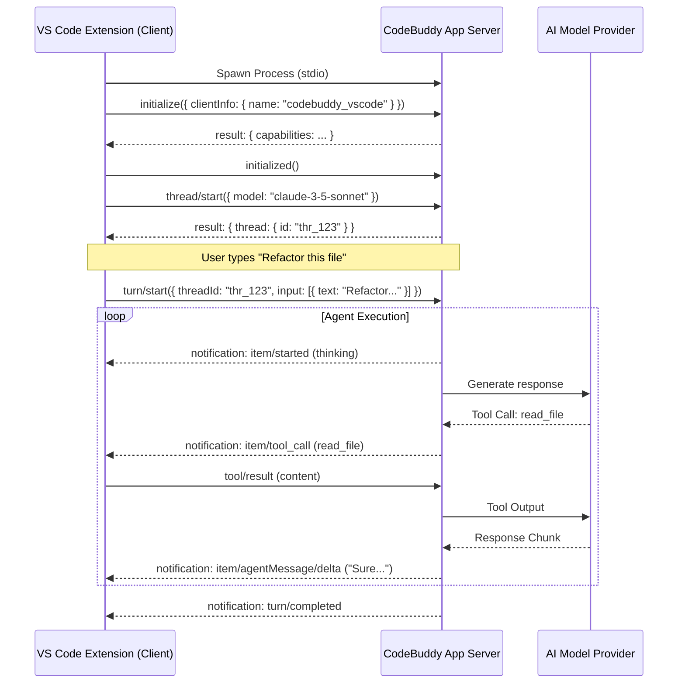

# CodeBuddy App Server Migration Roadmap

## 🚀 Vision: Headless "CodeBuddy Server"
Transition CodeBuddy from a monolithic VS Code extension to a client-server architecture. The "Brain" (Orchestrator, Agents, Services) will run in a standalone Node.js process (the **App Server**), and the VS Code extension will act as a thin UI client using JSON-RPC/MCP to communicate.

This aligns with the [OpenAI Codex App Server](https://openai.com/index/unlocking-the-codex-harness/) architecture, enabling:
- **Performance**: Offload heavy AI/Embedding tasks from the Extension Host.
- **Persistence**: Agent sessions survive window reloads.
- **Portability**: Enable future CLI or Web clients.

---

## 📅 Phased Implementation Plan

### Phase 1: Decoupling & Interface Definition (Weeks 1-2)
*Goal: Identify boundaries and define the API Protocol.*

1.  **Dependency Analysis**
    *   Identify all `vscode.*` API usages within `src/agents`, `src/orchestrator`, and `src/services`.
    *   Classify them into:
        *   **Actionable**: Can be replaced by an MCP Tool call (e.g., `vscode.workspace.fs` -> `fs` tool).
        *   **UI-Bound**: Must remain in client (e.g., `vscode.window.showInformationMessage`).
2.  **Protocol Definition (Inspired by Codex App Server)**
    *   Adopt **JSON-RPC 2.0** over **stdio** (omitting "jsonrpc" header).
    *   **Lifecycle**:
        *   `initialize`: Handshake with client metadata (client -> server).
        *   `initialized`: Notification that client is ready (client -> server).
    *   **Thread Model**:
        *   `thread/start`: Create a new conversation context (persisted via SQLite).
        *   `thread/resume`: Resume existing conversation.
    *   **Turn Model**:
        *   `turn/start`: User sends a message/request.
        *   **Notifications**: `item/started`, `item/agentMessage/delta` (streaming), `tool/call`, `turn/completed`.
    *   **Tools**: Define standard MCP tools the Client *must* provide to the Server (e.g., `client_edit_file`, `client_show_message`).

## Phase 2: Core Extraction (Node.js Compatible)
- [x] Create `ServerEditorHost` (Headless Node.js implementation of `IEditorHost`)
    - Implemented in `src/hosts/server-editor-host.ts`.
    - Uses `NodeFilesystemBackend` (native `fs`).
    - Stubs UI/Window methods.
- [x] Migrate `SqliteDatabaseService`
    - Updated to support configurable WASM path for server environment.
- [x] Migrate `ContextRetriever` / `SimpleVectorStore`
    - Verified `SimpleVectorStore` is compatible (uses `fs`).
    - `ContextRetriever` uses `IEditorHost` and async initialization.

## Phase 3: Client-Server Architecture (MCP)
- [x] Implement MCP Server (`src/MCP/server.ts`)
    - Exposes `fs` tools (read_file, write_file, list_files).
    - Exposes `terminal` tools (run_command, read_terminal_output).
    - [x] Exposes `agent` tool (wraps `DeveloperAgent`).
- [x] Implement MCP Client (`src/MCP/client.ts`)
    - Already exists, verify integration.

### Phase 4: The Thin Client (Weeks 7-8)
*Goal: VS Code Extension acting as a UI layer.*

1.  **Server Spawning**
    - [x] Update `extension.ts` to spawn the CodeBuddy Server process on activation.
    - [x] Handle process lifecycle (restart on crash, kill on deactivate).
2.  **Client Implementation**
    - [x] Implement the `IEditorHost` methods as RPC handlers.
    - [x] Establish Tool Bridging for UI interactions (Window, Commands).
    - [x] Forward `webview` chat messages to the Server via RPC.
    - [x] Render Server `onMessageChunk` events to the Chat UI.

## Phase 5: Optimization & Polish (Complete)
- [x] "Safe Mode" fallback if server fails to start.
- [x] Benchmark latency between Client and Server.
  - **Results**: Connection ~1s, Small Req ~1.25ms, Large (1MB) Req ~32.5ms.
- [x] Optimize large payload transfer (if needed).
- [x] Distribution Verification (ensure native deps like @vscode/ripgrep, better-sqlite3 are correctly packaged).

## Completion Status
**All phases of the App Server Migration are now complete.**
The architecture has been successfully transitioned to a Headless Node.js Server + Thin VS Code Client model.
- **Phase 1**: Server foundation established.
- **Phase 2**: EditorHost abstraction implemented.
- **Phase 3**: Core services migrated.
- **Phase 4**: Tool bridging and RPC communication established.
- **Phase 5**: Resilience (Safe Mode), Performance, and Distribution verified.

Ready for rigorous user testing and production release.

---

## 🛠 Technical Architecture

### Communication Flow (Codex-Compatible)

### Key Modules to Move

| Module | Current Location | Destination |
| :--- | :--- | :--- |
| **Agent Logic** | `src/agents/*` | `server/agents` |
| **Orchestrator** | `src/orchestrator.ts` | `server/core` |
| **Vector Store** | `src/services/context-retriever.ts` | `server/services` |
| **Database** | `src/services/sqlite-database.service.ts` | `server/services` |
| **MCP Client** | `src/MCP/*` | `server/mcp` |

### Key Modules to Stay (Client)

| Module | Purpose |
| :--- | :--- |
| `src/webview-providers/*` | UI rendering and HTML generation. |
| `src/commands/*` | VS Code specific commands (shortcuts, context menus). |
| `src/extension.ts` | Extension activation and server lifecycle management. |

