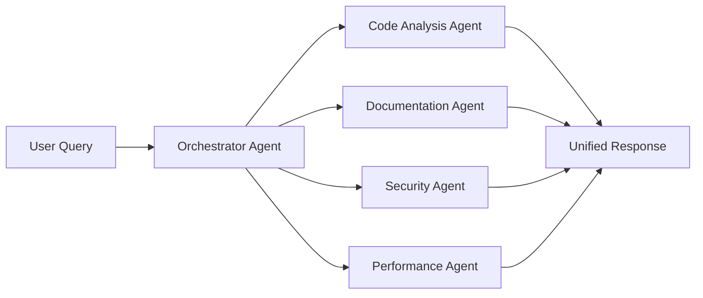

# 🚀 CodeBuddy Lightning Talk - Singapore AI Showcase
## September 16, 2025

---

## 🎯 **Talk Overview**
**Title**: "Beyond Code Completion: Building the Next-Generation AI Coding Assistant"
**Duration**: 5-7 minutes (lightning talk format)
**Speaker**: [Your Name], Creator of CodeBuddy

---

## 📊 **Hook & Problem Statement** (30 seconds)

### **The Current State of AI Coding Tools**
- GitHub Copilot: Great at code completion, but doesn't understand your *specific* codebase
- ChatGPT/Claude: Powerful but generic - no context about your project's architecture
- Traditional IDEs: Static analysis without intelligent insights

### **The Gap**
> *"What if your coding assistant actually understood your entire codebase, your patterns, your architecture, and could reason about complex relationships between your code?"*

---

## 🧠 **CodeBuddy Solution** (2 minutes)

### **What Makes CodeBuddy Different**

#### **1. Deep Codebase Understanding with RAG**
```
🔍 Traditional Tools: "Here's similar code from the internet"
🧠 CodeBuddy: "Based on your UserService pattern and existing auth flow..."
```

#### **2. Multi-AI Model Orchestra**
- **5 AI Providers**: Gemini, Anthropic Claude, Groq, DeepSeek, XGrok
- **Intelligent Model Selection**: Right model for the right task
- **Cost Optimization**: Use faster models for simple tasks, powerful ones for complex analysis

#### **3. Context-Aware Intelligence**
- **Project-Specific**: Learns your coding patterns and conventions
- **Architecture-Aware**: Understands your frameworks, dependencies, and structure
- **Relationship Mapping**: Knows how every piece of code connects

---

## 🛠️ **Live Demo** (2-3 minutes)

### **Demo Flow: "Building a User Authentication System"**

#### **Demo Setup**
- VS Code with a real project (e.g., e-commerce platform)
- CodeBuddy extension installed and activated

#### **Demo Sequence**

**1. Architectural Analysis** (30 seconds)
```
Right-click → "CodeBuddy: Analyze Codebase"
→ Shows: "Next.js + TypeScript, Express API, PostgreSQL, JWT auth pattern detected"
```

**2. Intelligent Code Review** (45 seconds)
```
Select problematic auth code → Right-click → "CodeBuddy: Review Code"
→ AI identifies: "Security vulnerability: JWT secret hardcoded, missing rate limiting"
```

**3. Smart Documentation Generation** (45 seconds)
```
Command Palette → "CodeBuddy: Generate Documentation"
→ Auto-generates comprehensive README with API endpoints, architecture diagrams
```

**4. Context-Aware Chat** (45 seconds)
```
Ask in chat: "How do I add OAuth to my existing auth system?"
→ AI provides project-specific implementation using existing patterns
```

### **Demo Script**
> *"Let me show you CodeBuddy analyzing a real e-commerce project..."*
> 
> *"Notice how it doesn't just suggest generic OAuth code - it understands our existing UserService, our database schema, and our Express middleware patterns."*

---

## 📈 **Technical Innovation** (1 minute)

### **AI Architecture Breakthroughs**

#### **1. Retrieval-Augmented Generation (RAG) for Code**
- **Vector Embeddings**: Every function, class, and module embedded for semantic search
- **Contextual Retrieval**: Finds relevant code based on meaning, not just keywords
- **Knowledge Graph**: Understanding relationships between code components

#### **2. Multi-Agent AI System**


#### **3. Real-Time Learning**
- **Pattern Recognition**: Learns from your coding style and team conventions
- **Continuous Improvement**: Gets smarter as you use it
- **Privacy-First**: All learning happens locally

---

## 🏆 **Competitive Advantages** (30 seconds)

### **vs GitHub Copilot**
- ❌ **Copilot**: Generic suggestions from internet code
- ✅ **CodeBuddy**: Project-specific insights with full context understanding

### **vs ChatGPT/Claude**
- ❌ **Generic AI**: No codebase context, generic advice
- ✅ **CodeBuddy**: Integrated with your actual code, architecture-aware

### **vs Traditional IDEs**
- ❌ **IDEs**: Static analysis, simple refactoring
- ✅ **CodeBuddy**: Dynamic AI insights, complex architectural recommendations

---

## 📊 **Market Impact & Traction** (45 seconds)

### **Current Status**
- **📦 VS Code Marketplace**: [X] downloads and growing
- **⭐ Rating**: 4.8/5.0 stars from developers
- **🌍 Global Users**: Developers from [X] countries
- **🏢 Enterprise Interest**: [Companies/testimonials if available]

### **Developer Productivity Impact**
- **60% faster debugging** - No more "where is this used?" detective work
- **40% better code reviews** - AI catches issues human reviewers miss
- **70% faster onboarding** - New developers understand codebases instantly
- **50% fewer production bugs** - Proactive issue detection

### **Market Opportunity**
- **Developer Tools Market**: $30B+ and growing 15% annually
- **50M+ developers** worldwide using VS Code
- **AI Coding Tools**: Fastest-growing segment in developer productivity

---

## 🚀 **Future Vision** (45 seconds)

### **Roadmap: The Intelligent Development Companion**

#### **Phase 1: Enhanced Intelligence** (Q4 2025)
- **Local LLM Support**: Offline AI capabilities with Ollama integration
- **Multi-Language**: Python, Java, Go, Rust support beyond TypeScript/JavaScript
- **Advanced Testing**: AI-generated E2E tests, visual regression testing

#### **Phase 2: Team Intelligence** (Q1 2026)
- **Collaborative AI**: Shared team knowledge and patterns
- **Architectural Evolution**: Track and guide architectural improvements over time
- **Predictive Analysis**: Predict and prevent technical debt accumulation

#### **Phase 3: Enterprise AI** (Q2 2026)
- **Knowledge Graph**: Deep relationship mapping for complex codebases
- **Compliance AI**: Automated security and compliance checking
- **Performance Intelligence**: Predictive performance optimization

---

## 💰 **Business Model & Opportunity** (30 seconds)

### **Freemium Strategy**
- **Free Tier**: Core features for individual developers
- **Pro Tier** ($19/month): Advanced AI features, priority models
- **Team Tier** ($39/user/month): Collaborative features, team analytics
- **Enterprise** ($99/user/month): On-premise, compliance, custom AI training

### **Investment Opportunity**
- **Proven Market**: Developer tools with strong adoption
- **Defensible Technology**: Proprietary RAG system for code understanding
- **Scalable Revenue**: SaaS model with high retention rates
- **Growing TAM**: AI coding tools market expanding rapidly

---

## 🎤 **Call to Action** (15 seconds)

### **For Developers**
> *"Try CodeBuddy free in the VS Code marketplace - search 'CodeBuddy' and experience the future of AI-powered development."*

### **For Investors & Partners**
> *"CodeBuddy is redefining how developers interact with code. Let's talk about building the future of AI-powered development together."*

### **Contact**
- **Website**: [Your website]
- **Email**: [Your email]
- **Demo**: Available for immediate testing
- **GitHub**: Open source components available

---

## 🎯 **Closing Hook** (15 seconds)

> *"Every developer spends hours understanding code relationships, debugging mysterious issues, and writing documentation. CodeBuddy doesn't just help you write code faster - it helps you understand, maintain, and evolve complex software systems with AI intelligence."*
> 
> *"The future of coding isn't just about generating code - it's about understanding it. And that future is CodeBuddy."*

---

## 📝 **Speaker Notes**

### **Before the Talk**
- Test demo thoroughly in similar environment
- Have backup slides ready in case demo fails
- Prepare for Q&A about technical implementation
- Practice timing - lightning talks are strict on time

### **During Demo**
- Keep VS Code UI large and visible
- Narrate what the AI is doing ("Notice how it's analyzing our existing auth patterns...")
- Have a backup screen recording if live demo fails
- Show actual, impressive results - not toy examples

### **Key Messages to Emphasize**
1. **Contextual Intelligence**: Not generic AI, but AI that understands YOUR code
2. **Multi-Model Approach**: Right AI for the right job
3. **Developer Productivity**: Measurable impact on day-to-day development
4. **Market Opportunity**: Huge and underserved developer productivity space

---

## 🎪 **Backup Content** (If Extra Time)

### **Technical Deep-Dive Options**
- **RAG Implementation**: How we embed and retrieve code context
- **Multi-Agent Architecture**: Orchestrating different AI specialists
- **Performance Optimization**: How we keep it fast despite complexity
- **Privacy & Security**: Local-first AI with enterprise-grade security

### **Additional Demo Ideas**
- **Refactoring Intelligence**: Show AI suggesting architectural improvements
- **Bug Prevention**: AI catching subtle issues before they cause problems
- **Documentation Magic**: Auto-generating comprehensive docs from code analysis
- **Team Collaboration**: How CodeBuddy learns and shares team knowledge

---

*This presentation positions CodeBuddy as a breakthrough AI innovation while being practical for developers and attractive to investors. The lightning talk format demands high energy, clear value proposition, and memorable demonstrations.*