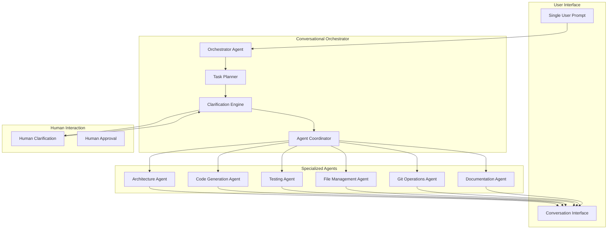

# Specialized Agents with Conversational Orchestrator Architecture

## 🎯 My Opinion on Specialized Agents + Conversational Orchestrator

### ✅ **Why This Approach is Superior**

I believe a **conversational orchestrator with specialized agents** is the optimal architecture for complex development tasks like CodeBuddy for several reasons:

#### 1. **Natural Human-AI Interaction**

- **Single prompt complexity**: Users can express complex multi-step requirements naturally
- **Clarification workflow**: LLM can ask intelligent follow-up questions
- **Context preservation**: Maintains conversation context across the entire workflow
- **Progressive refinement**: Allows iterative improvement of requirements

#### 2. **Clean Separation of Concerns**

- **Orchestrator**: Handles conversation, planning, clarification, and coordination
- **Specialized Agents**: Focus on specific technical domains (architecture, testing, deployment)
- **Modularity**: Easy to add new specialized agents without affecting others
- **Testability**: Each component can be tested independently

#### 3. **Scalability and Maintainability**

- **Agent expertise**: Each agent becomes deeply specialized in its domain
- **Parallel execution**: Multiple agents can work simultaneously on different aspects
- **Error isolation**: Failures in one agent don't cascade to others
- **Knowledge accumulation**: Agents build domain-specific expertise over time

### 📋 **Architecture Overview**



## 🏗️ **Practical Example: Todo List with Clean Architecture**

### **Single Prompt Analysis**

```
"Following a clean architecture approach, create directories and files to build a simple todo list, make sure it works and write a proper unit test."
```

**What this prompt involves:**

1. **Architecture decisions**: Clean architecture layers, folder structure
2. **Technology choices**: Framework, testing library, database
3. **Implementation**: Core business logic, API, UI
4. **Quality assurance**: Unit tests, integration tests
5. **Documentation**: README, API docs

### **Orchestrator Clarification Flow**

```typescript
// Example clarification sequence
const clarifications = [
  {
    question: "What technology stack would you prefer?",
    options: ["Node.js + Express", "Python + FastAPI", "TypeScript + NestJS"],
    reason: "This affects the entire implementation approach",
  },
  {
    question: "What type of persistence do you want?",
    options: ["In-memory", "SQLite", "PostgreSQL", "File-based"],
    reason: "This determines the data layer implementation",
  },
  {
    question: "Do you want a REST API, GraphQL, or both?",
    options: ["REST only", "GraphQL only", "Both"],
    reason: "This affects the presentation layer design",
  },
  {
    question: "What level of testing coverage do you need?",
    options: ["Unit tests only", "Unit + Integration", "Full E2E coverage"],
    reason: "This determines the testing strategy and time investment",
  },
];
```

## 🚀 **CodeBuddy Implementation Strategy**

### **Phase 1: Core Orchestrator Architecture**

```typescript
// src/agents/orchestrator/conversational-orchestrator.ts
export class ConversationalOrchestrator {
  private clarificationEngine: ClarificationEngine;
  private taskPlanner: TaskPlanner;
  private agentCoordinator: AgentCoordinator;
  private conversationContext: ConversationContext;

  async processUserPrompt(prompt: string): Promise<ExecutionResult> {
    // 1. Parse and understand the prompt
    const initialAnalysis = await this.analyzePrompt(prompt);

    // 2. Identify clarification needs
    const clarifications = await this.clarificationEngine.identifyNeeds(initialAnalysis);

    // 3. Conduct clarification conversation if needed
    if (clarifications.length > 0) {
      const refinedRequirements = await this.conductClarificationSession(clarifications);
      initialAnalysis.requirements = refinedRequirements;
    }

    // 4. Create execution plan
    const executionPlan = await this.taskPlanner.createPlan(initialAnalysis);

    // 5. Coordinate specialized agents
    return await this.agentCoordinator.executeplan(executionPlan);
  }

  private async conductClarificationSession(clarifications: Clarification[]): Promise<Requirements> {
    const responses: ClarificationResponse[] = [];

    for (const clarification of clarifications) {
      // Present question to user through VS Code interface
      const response = await this.presentClarification(clarification);
      responses.push(response);

      // Update conversation context
      this.conversationContext.addClarification(clarification, response);
    }

    return this.synthesizeRequirements(responses);
  }
}
```

### **Phase 2: Specialized Agents**

```typescript
// src/agents/specialized/architecture-agent.ts
export class ArchitectureAgent extends BaseSpecializedAgent {
  async createProjectStructure(requirements: Requirements): Promise<ProjectStructure> {
    const architecture = this.determineArchitecture(requirements);
    const structure = this.generateFolderStructure(architecture);

    return {
      architecture,
      folders: structure.folders,
      files: structure.files,
      dependencies: structure.dependencies,
      configFiles: structure.configFiles,
    };
  }

  private determineArchitecture(requirements: Requirements): Architecture {
    if (requirements.pattern === "clean-architecture") {
      return new CleanArchitecture();
    } else if (requirements.pattern === "hexagonal") {
      return new HexagonalArchitecture();
    } else if (requirements.pattern === "mvc") {
      return new MVCArchitecture();
    }
    return new DefaultArchitecture();
  }
}

// src/agents/specialized/code-generation-agent.ts
export class CodeGenerationAgent extends BaseSpecializedAgent {
  async generateCode(structure: ProjectStructure, requirements: Requirements): Promise<GeneratedCode> {
    const codeGenPlan = this.createCodeGenerationPlan(structure, requirements);
    const generatedFiles: GeneratedFile[] = [];

    for (const file of codeGenPlan.files) {
      const content = await this.generateFileContent(file, requirements);
      generatedFiles.push({
        path: file.path,
        content,
        type: file.type,
      });
    }

    return {
      files: generatedFiles,
      entryPoint: codeGenPlan.entryPoint,
      buildCommands: codeGenPlan.buildCommands,
    };
  }
}

// src/agents/specialized/testing-agent.ts
export class TestingAgent extends BaseSpecializedAgent {
  async generateTests(code: GeneratedCode, requirements: Requirements): Promise<GeneratedTests> {
    const testStrategy = this.determineTestingStrategy(requirements);
    const tests: TestFile[] = [];

    for (const file of code.files) {
      if (this.shouldGenerateTestFor(file)) {
        const testFile = await this.generateTestFile(file, testStrategy);
        tests.push(testFile);
      }
    }

    return {
      testFiles: tests,
      testRunner: testStrategy.runner,
      coverage: testStrategy.coverage,
      setupFiles: testStrategy.setupFiles,
    };
  }
}
```

### **Phase 3: Human-in-the-Loop Integration**

```typescript
// src/human-interaction/clarification-interface.ts
export class ClarificationInterface {
  async presentQuestion(question: ClarificationQuestion): Promise<ClarificationResponse> {
    // Use VS Code's native UI components
    const panel = vscode.window.createWebviewPanel(
      "codebuddyClarification",
      "CodeBuddy Needs Clarification",
      vscode.ViewColumn.Beside,
      { enableScripts: true }
    );

    panel.webview.html = this.generateClarificationHTML(question);

    return new Promise((resolve) => {
      panel.webview.onDidReceiveMessage((message) => {
        if (message.type === "clarificationResponse") {
          resolve(message.response);
          panel.dispose();
        }
      });
    });
  }

  private generateClarificationHTML(question: ClarificationQuestion): string {
    return `
      <!DOCTYPE html>
      <html>
      <head>
        <style>
          .clarification-container {
            padding: 20px;
            font-family: 'Segoe UI', Tahoma, Geneva, Verdana, sans-serif;
          }
          .question { font-size: 18px; margin-bottom: 15px; }
          .options { display: flex; flex-direction: column; gap: 10px; }
          .option {
            padding: 10px;
            border: 1px solid #ddd;
            border-radius: 5px;
            cursor: pointer;
            transition: background-color 0.2s;
          }
          .option:hover { background-color: #f0f0f0; }
          .reason { font-style: italic; color: #666; margin-top: 10px; }
        </style>
      </head>
      <body>
        <div class="clarification-container">
          <div class="question">${question.text}</div>
          <div class="options">
            ${question.options
              .map(
                (option, index) => `
              <div class="option" onclick="selectOption('${option}')">
                ${option}
              </div>
            `
              )
              .join("")}
          </div>
          <div class="reason">${question.reason}</div>
        </div>
        
        <script>
          const vscode = acquireVsCodeApi();
          
          function selectOption(option) {
            vscode.postMessage({
              type: 'clarificationResponse',
              response: { selectedOption: option }
            });
          }
        </script>
      </body>
      </html>
    `;
  }
}
```

## 📁 **Practical Implementation: Todo List Example**

Let me create the actual implementation based on this architecture:

```typescript
// Example execution flow for the todo list prompt
const todoListExecution = {
  userPrompt:
    "Following a clean architecture approach, create directories and files to build a simple todo list, make sure it works and write a proper unit test.",

  clarificationFlow: [
    {
      question: "What technology stack would you prefer?",
      userResponse: "TypeScript + Node.js",
      impact: "Determines language, runtime, and ecosystem",
    },
    {
      question: "What type of persistence do you want?",
      userResponse: "SQLite for simplicity",
      impact: "Affects data layer implementation and dependencies",
    },
    {
      question: "Do you want a REST API, CLI, or both?",
      userResponse: "REST API with basic CLI",
      impact: "Determines interface layer architecture",
    },
  ],

  agentExecution: [
    {
      agent: "ArchitectureAgent",
      task: "Create clean architecture folder structure",
      output: "Project structure with domain, application, infrastructure, and presentation layers",
    },
    {
      agent: "CodeGenerationAgent",
      task: "Generate core todo business logic",
      output: "Domain entities, use cases, repositories, and controllers",
    },
    {
      agent: "TestingAgent",
      task: "Create comprehensive unit tests",
      output: "Jest test files for all business logic components",
    },
    {
      agent: "FileManagementAgent",
      task: "Create files and organize project",
      output: "All files created in correct directory structure",
    },
    {
      agent: "DocumentationAgent",
      task: "Generate README and API documentation",
      output: "Project documentation and usage instructions",
    },
  ],
};
```

## 🎯 **CodeBuddy Recommendations**

### **1. Conversational Orchestrator as Core**

- **Primary Interface**: Single prompt handling with intelligent clarification
- **Context Management**: Maintain conversation state across entire workflow
- **Human Approval Gates**: Allow users to review and approve before execution
- **Progressive Disclosure**: Ask for clarification only when necessary

### **2. Specialized Agent Portfolio**

```typescript
const specializedAgents = {
  // Core Development Agents
  architectureAgent: "Project structure and architectural decisions",
  codeGenerationAgent: "Writing actual code based on requirements",
  testingAgent: "Unit, integration, and E2E test generation",

  // DevOps and Infrastructure
  dockerizationAgent: "Container and deployment configurations",
  cicdAgent: "GitHub Actions, Jenkins, deployment pipelines",

  // Quality and Documentation
  codeReviewAgent: "Code quality analysis and improvement suggestions",
  documentationAgent: "README, API docs, code comments",

  // Specialized Tools
  databaseAgent: "Schema design, migrations, queries",
  apiAgent: "REST/GraphQL API design and implementation",
  frontendAgent: "UI/UX implementation for specific frameworks",
};
```

### **3. Implementation Strategy**

#### **Phase 1: Conversational Foundation (Weeks 1-4)**

```typescript
// Core orchestrator with basic clarification
1. Implement ConversationalOrchestrator
2. Create ClarificationEngine with VS Code UI
3. Build TaskPlanner for breaking down complex prompts
4. Create AgentCoordinator for managing specialized agents
```

#### **Phase 2: Essential Specialized Agents (Weeks 5-8)**

```typescript
// Most commonly needed agents
1. ArchitectureAgent - Project structure decisions
2. CodeGenerationAgent - Core code writing
3. TestingAgent - Test generation and validation
4. FileManagementAgent - File operations and organization
```

#### **Phase 3: Advanced Agents (Weeks 9-12)**

```typescript
// Specialized domain agents
1. DatabaseAgent - Schema and data operations
2. APIAgent - REST/GraphQL API development
3. DocumentationAgent - Comprehensive documentation
4. DeploymentAgent - Docker, CI/CD, cloud deployment
```

### **4. Key Implementation Principles**

#### **Smart Clarification Strategy**

```typescript
const clarificationPrinciples = {
  "Ask Only When Necessary": "Don't ask obvious questions",
  "Contextual Defaults": "Use reasonable defaults based on project context",
  "Progressive Refinement": "Allow users to refine requirements iteratively",
  "Impact-Based Priority": "Ask about decisions with highest impact first",
};
```

#### **Agent Coordination Patterns**

```typescript
const coordinationPatterns = {
  Sequential: "Architecture → Code → Tests → Documentation",
  Parallel: "Multiple agents working on independent aspects",
  Hierarchical: "Parent agents delegating to child agents",
  "Event-Driven": "Agents responding to completion events",
};
```

### **5. Benefits for CodeBuddy Users**

#### **Single Prompt Complexity**

- **Natural Language**: "Create a microservice with authentication, database, tests, and deploy to AWS"
- **Intelligent Breakdown**: Orchestrator handles the complexity internally
- **Human Oversight**: User stays in control through clarification dialogs
- **Quality Assurance**: Specialized agents ensure best practices

#### **Learning and Adaptation**

- **Pattern Recognition**: System learns from successful project patterns
- **User Preferences**: Remembers user choices for future projects
- **Best Practices**: Agents accumulate domain expertise over time
- **Continuous Improvement**: Feedback loop improves agent performance

This architecture provides the perfect balance of automation and human control, making CodeBuddy incredibly powerful while keeping users in the driver's seat.
