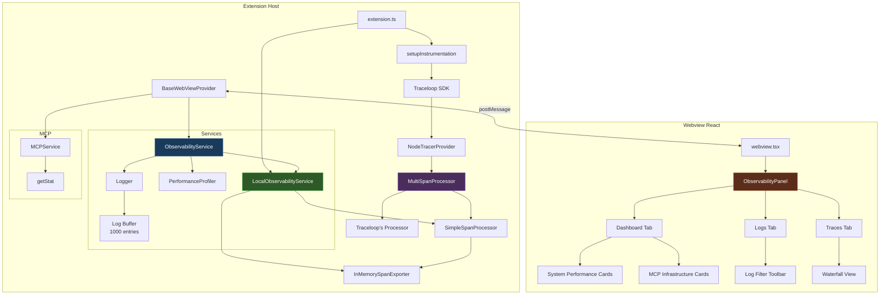
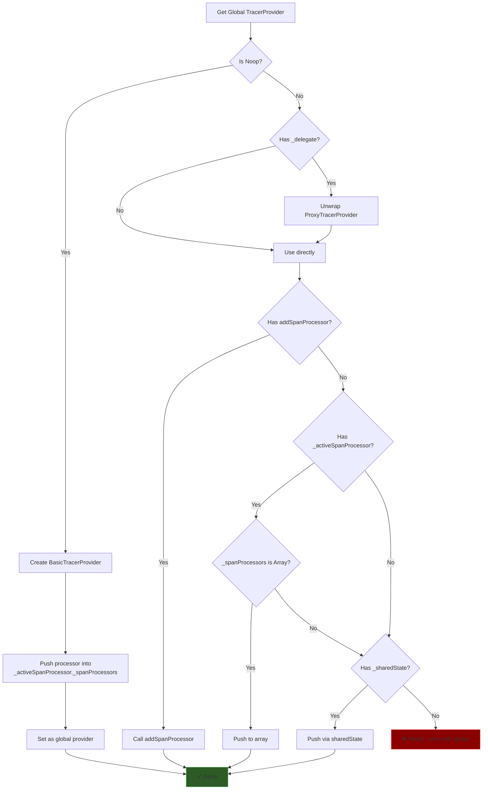
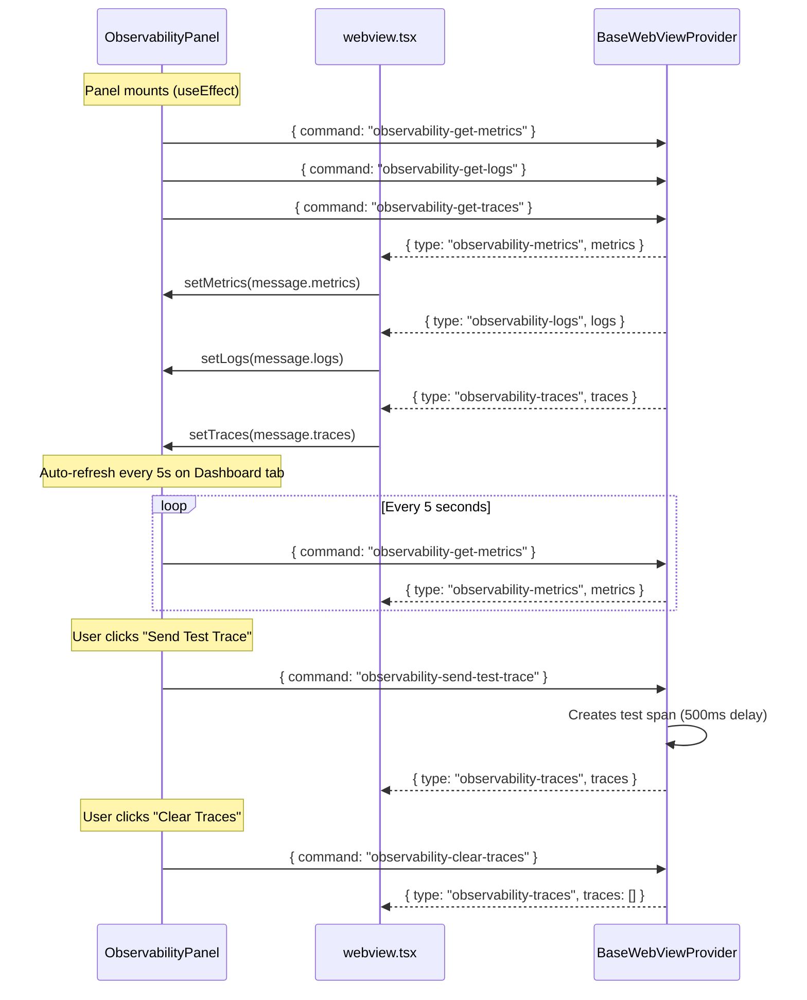

# Telemetry Architecture

End-to-end documentation of CodeBuddy's observability and telemetry pipeline — from span creation to the Observability Panel in the webview UI.

---

## Overview

CodeBuddy ships a fully local observability stack built on [OpenTelemetry](https://opentelemetry.io/) and [Traceloop (OpenLLMetry)](https://www.traceloop.com/). All telemetry data stays on the user's machine — nothing is sent to external services unless an OTLP collector is explicitly configured.

The stack provides three pillars:

| Pillar | What it captures | Storage |
|--------|-----------------|---------|
| **Traces** | Distributed spans from agent operations, LLM calls, tool invocations | In-memory (`InMemorySpanExporter`) |
| **Metrics** | Search latency, memory usage, indexing throughput, cache/error rates, MCP stats | Computed on-demand by `PerformanceProfiler` + `MCPService.getStat()` |
| **Logs** | Structured log events from every module | In-memory ring buffer (1000 entries) via `Logger` |

---

## End-to-End Flow

```mermaid
sequenceDiagram
    participant Ext as extension.ts<br/>(activate)
    participant SI as setupInstrumentation()
    participant TL as Traceloop SDK
    participant OTel as OpenTelemetry API<br/>(trace global)
    participant LOS as LocalObservabilityService
    participant IME as InMemorySpanExporter
    participant OS as ObservabilityService
    participant PP as PerformanceProfiler
    participant MCP as MCPService
    participant Base as BaseWebViewProvider
    participant WV as Webview (React)
    participant Panel as ObservabilityPanel

    Note over Ext: Extension activates

    Ext->>SI: 1. setupInstrumentation()
    SI->>TL: traceloop.initialize()
    TL->>OTel: Register NodeTracerProvider globally
    SI->>OTel: Verify provider (fallback to BasicTracerProvider)

    Ext->>LOS: 2. LocalObservabilityService.initialize()
    LOS->>LOS: Create InMemorySpanExporter
    LOS->>LOS: Create SimpleSpanProcessor (wraps exporter)
    LOS->>OTel: Get global TracerProvider
    alt Provider exists (NodeTracerProvider)
        LOS->>OTel: Unwrap ProxyTracerProvider → _delegate
        LOS->>OTel: Push processor into MultiSpanProcessor._spanProcessors
    else No provider (Noop)
        LOS->>OTel: Create BasicTracerProvider with processor
        LOS->>OTel: Set as global provider
    end
    LOS->>LOS: createTestSpan() to verify pipeline

    Note over Ext: Extension is running

    rect rgb(40, 40, 60)
        Note over WV,Panel: User opens Observability Panel
        WV->>Base: postMessage("observability-get-metrics")
        WV->>Base: postMessage("observability-get-logs")
        WV->>Base: postMessage("observability-get-traces")
    end

    Base->>OS: getMetrics()
    OS->>PP: getPerformanceReport()
    PP-->>OS: { avgSearchLatency, p95, memory, cache, errorRate }
    Base->>MCP: getStat()
    MCP-->>Base: { connectedServers, totalTools, invocations, ... }
    Base-->>WV: type: "observability-metrics" { ...metrics, mcpStats }

    Base->>OS: getRecentLogs()
    OS-->>Base: ILogEvent[]
    Base-->>WV: type: "observability-logs" { logs }

    Base->>OS: getTraces()
    OS->>LOS: getSpans()
    LOS->>IME: getFinishedSpans()
    IME-->>LOS: ReadableSpan[]
    LOS-->>OS: spans
    Base->>Base: Sanitize spans (remove circular refs)
    Base-->>WV: type: "observability-traces" { traces }

    WV->>Panel: setMetrics / setLogs / setTraces
    Panel->>Panel: Render Dashboard / Logs / Traces tabs
```



---

## Component Architecture



---

## Initialization Sequence

Initialization happens at the tail end of `extension.ts activate()`:

```typescript
// extension.ts — after all services are registered
try {
  setupInstrumentation();                                    // Step 1
  await LocalObservabilityService.getInstance().initialize(); // Step 2
} catch (obsError) {
  logger.error("Failed to initialize observability:", obsError);
}
```

### Step 1: `setupInstrumentation()` (`src/instrumentation.ts`)

Initializes the Traceloop (OpenLLMetry) SDK which:
- Registers a `NodeTracerProvider` as the global OTel provider
- Configures the OTLP export endpoint (`http://localhost:4318`)
- Disables auto-instrumentation for LLM libraries (manual tracing is used instead)

If Traceloop fails to register a provider, a fallback `BasicTracerProvider` is created.

### Step 2: `LocalObservabilityService.initialize()` (`src/infrastructure/observability/telemetry.ts`)

Attaches an in-memory span processor to the provider registered in Step 1:

1. Creates an `InMemorySpanExporter` to buffer spans locally
2. Wraps it in a `SimpleSpanProcessor` with debug logging
3. Gets the global `TracerProvider` (set by Traceloop)
4. Unwraps `ProxyTracerProvider` → `NodeTracerProvider`
5. Pushes the processor into `_activeSpanProcessor._spanProcessors[]` (OTel 2.x API)
6. Fires a test span to verify the pipeline

> **Critical:** `setupInstrumentation()` **must** run before `LocalObservabilityService.initialize()`. If the order is reversed, the in-memory processor gets attached to a temporary provider that Traceloop then replaces.

---

## Provider Attachment Strategy

The OTel 2.x SDK removed the public `addSpanProcessor()` method. `LocalObservabilityService` uses a multi-strategy approach:



---

## Data Flow: Three Pillars

### Traces

| Stage | Component | Description |
|-------|-----------|-------------|
| **Create** | Any service via `trace.getTracer().startSpan()` | Standard OTel span creation |
| **Process** | `SimpleSpanProcessor` | Logs span metadata, forwards to exporter |
| **Store** | `InMemorySpanExporter` | Buffers finished `ReadableSpan` objects |
| **Read** | `ObservabilityService.getTraces()` → `LocalObservabilityService.getSpans()` | Returns raw spans |
| **Sanitize** | `BaseWebViewProvider` handler | Strips circular refs, extracts `spanContext()`, computes duration |
| **Display** | `ObservabilityPanel` Traces tab | Grouped by `traceId`, waterfall view with span bars |

Trace message format sent to webview:
```typescript
{
  type: "observability-traces",
  traces: [{
    name: string,
    context: { traceId, spanId },
    parentSpanId?: string,
    startTime: [seconds, nanoseconds],
    endTime: [seconds, nanoseconds],
    attributes: Record<string, any>,
    status: { code: number },
    events: any[],
    links: any[],
    kind: number,
    duration: [diffSeconds, diffNanoseconds]
  }]
}
```

### Metrics

| Stage | Component | Description |
|-------|-----------|-------------|
| **Collect** | `PerformanceProfiler` | Rolling averages for latency, memory, throughput, cache, errors |
| **Collect** | `MCPService.getStat()` | Connected servers, tool counts, invocations, failure rate |
| **Aggregate** | `ObservabilityService.getMetrics()` | Returns `PerformanceReport` |
| **Merge** | `BaseWebViewProvider` handler | Spreads profiler report + `mcpStats` into single object |
| **Display** | `ObservabilityPanel` Dashboard tab | System Performance cards + MCP Infrastructure cards |

Metrics message format sent to webview:
```typescript
{
  type: "observability-metrics",
  metrics: {
    // PerformanceReport
    avgSearchLatency: number,
    p95SearchLatency: number,
    avgIndexingThroughput: number,
    avgMemoryUsage: number,
    cacheHitRate: number,    // 0.0 – 1.0
    errorRate: number,       // 0.0 – 1.0
    timestamp: Date,
    // MCP Stats
    mcpStats: {
      connectedServers: number,
      totalTools: number,
      uniqueTools: number,
      toolsByServer: Record<string, number>,
      totalInvocations: number,
      failedInvocations: number,
      isGatewayMode: boolean,
      lastRefresh: number    // epoch ms
    }
  }
}
```

### Logs

| Stage | Component | Description |
|-------|-----------|-------------|
| **Emit** | `Logger.log()` | Every module logs via `Logger` singleton |
| **Buffer** | `Logger.logBuffer` | Ring buffer, max 1000 entries |
| **Event** | `Logger.logEmitter` | `vscode.EventEmitter<ILogEvent>` for live streaming |
| **Read** | `ObservabilityService.getRecentLogs()` → `Logger.getRecentLogs()` | Returns buffer contents |
| **Display** | `ObservabilityPanel` Logs tab | Filterable by level (ERROR/WARN/INFO/DEBUG) |

Log entry structure:
```typescript
interface ILogEvent {
  timestamp: string,
  level: "ERROR" | "WARN" | "INFO" | "DEBUG",
  module: string,
  message: string,
  data?: any,
  sessionId: string,
  traceId: string
}
```

---

## Webview Communication Protocol

The Observability Panel uses VS Code's `postMessage` API for bidirectional communication:



### Message Commands (Webview → Extension)

| Command | Description |
|---------|-------------|
| `observability-get-metrics` | Fetch performance report + MCP stats |
| `observability-get-logs` | Fetch recent log buffer |
| `observability-get-traces` | Fetch all in-memory spans |
| `observability-clear-traces` | Reset the `InMemorySpanExporter` |
| `observability-send-test-trace` | Create a manual test span for debugging |

### Message Types (Extension → Webview)

| Type | Payload |
|------|---------|
| `observability-metrics` | `{ metrics: PerformanceReport & { mcpStats } }` |
| `observability-logs` | `{ logs: ILogEvent[] }` |
| `observability-traces` | `{ traces: SanitizedSpan[] }` |

---

## File Map

| File | Role |
|------|------|
| `src/instrumentation.ts` | Traceloop SDK init, global provider registration |
| `src/infrastructure/observability/telemetry.ts` | `LocalObservabilityService` — in-memory span capture |
| `src/services/observability.service.ts` | `ObservabilityService` — aggregation facade |
| `src/services/performance-profiler.service.ts` | `PerformanceProfiler` — rolling metric averages |
| `src/infrastructure/logger/logger.ts` | `Logger` — structured logging with buffer + event emitter |
| `src/MCP/service.ts` | `MCPService.getStat()` — MCP infrastructure metrics |
| `src/webview-providers/base.ts` | Message handlers for observability commands |
| `webviewUi/src/components/webview.tsx` | State management, message routing |
| `webviewUi/src/components/observability/ObservabilityPanel.tsx` | Dashboard / Logs / Traces UI |

---

## Troubleshooting

### "FAILED to attach span processor to ANY provider"

**Cause:** `LocalObservabilityService.initialize()` ran before `setupInstrumentation()`, or the OTel provider structure changed between SDK versions.

**Fix:** Ensure `setupInstrumentation()` is called first in `extension.ts`. The initialization order must be:
1. `setupInstrumentation()` — registers the `NodeTracerProvider` globally
2. `LocalObservabilityService.initialize()` — attaches the in-memory processor to the existing provider

### No traces appearing in the panel

1. Check the "System Logs" tab for `[TELEMETRY]` entries
2. Click "Send Test Trace" (beaker icon) — if the test span appears, the pipeline works
3. If no test span appears, the processor attachment failed (check logs for the attachment strategy used)

### Metrics show all zeros

The `PerformanceProfiler` must be registered with `ObservabilityService`:
```typescript
ObservabilityService.getInstance().registerProfiler(profiler);
```
This happens during extension activation. If no profiler is registered, `getMetrics()` returns `null` and the dashboard shows loading skeletons for the System Performance section (MCP stats still appear).

### MCP stats not showing

Verify `MCPService.getInstance().getStat()` is called in the `observability-get-metrics` handler in `base.ts`. The stats are merged into the metrics response:
```typescript
metrics: metrics ? { ...metrics, mcpStats } : { mcpStats }
```
