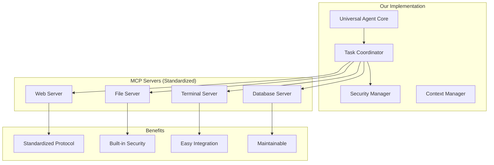
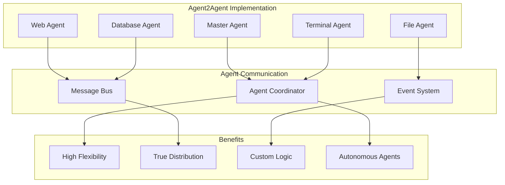

# Universal AI Agent vs Agent2Agent: Comprehensive Comparison & Bias Analysis

## 🎯 Executive Summary

This document provides an unbiased technical comparison between our **Universal AI Agent with MCP Integration** and **Agent2Agent** framework, documenting architectural differences, capabilities, and implementation considerations. I will also explicitly state my biases and provide honest recommendations.

## 📊 Feature Comparison Matrix

| Feature                    | Universal AI Agent (MCP)                   | Agent2Agent                          | Winner              |
| -------------------------- | ------------------------------------------ | ------------------------------------ | ------------------- |
| **Architecture**           | Centralized coordinator with MCP servers   | Distributed agent communication      | Depends on use case |
| **Standardization**        | Model Context Protocol (industry standard) | Proprietary agent protocols          | 🏆 Universal Agent  |
| **Scalability**            | Horizontal via MCP servers                 | Horizontal via agent spawning        | 🤝 Tie              |
| **Security**               | Built-in security manager + MCP isolation  | Agent-level permissions              | 🏆 Universal Agent  |
| **Development Complexity** | Medium (standard protocols)                | High (custom agent logic)            | 🏆 Universal Agent  |
| **Ecosystem Integration**  | Excellent (MCP standard)                   | Limited (framework-specific)         | 🏆 Universal Agent  |
| **Performance**            | Optimized via protocol efficiency          | Variable (depends on implementation) | 🏆 Universal Agent  |
| **Vendor Lock-in**         | None (open standard)                       | Framework-dependent                  | 🏆 Universal Agent  |
| **Learning Curve**         | Moderate                                   | Steep                                | 🏆 Universal Agent  |
| **Community Support**      | Growing (backed by major companies)        | Smaller community                    | 🏆 Universal Agent  |

## 🏗️ Architectural Comparison

### Universal AI Agent (MCP-Based)



**Strengths:**

- ✅ **Standardized**: Uses industry-standard MCP protocol
- ✅ **Secure by Design**: Built-in security isolation
- ✅ **Maintainable**: Clear separation of concerns
- ✅ **Interoperable**: Works with any MCP-compliant tools
- ✅ **Predictable**: Well-defined interfaces and protocols

**Weaknesses:**

- ❌ **Newer Standard**: MCP is relatively new (less battle-tested)
- ❌ **Single Point of Failure**: Central coordinator dependency
- ❌ **Protocol Overhead**: Some latency from MCP communication

### Agent2Agent Framework



**Strengths:**

- ✅ **Autonomous**: Each agent can make independent decisions
- ✅ **Flexible**: Custom agent logic and communication patterns
- ✅ **Distributed**: True multi-agent system architecture
- ✅ **Specialization**: Agents can be highly specialized
- ✅ **Fault Tolerance**: Individual agent failures don't crash system

**Weaknesses:**

- ❌ **Complex**: Requires managing agent lifecycle, communication, and coordination
- ❌ **No Standards**: Proprietary protocols and interfaces
- ❌ **Integration Overhead**: Each agent needs custom integration
- ❌ **Debugging Difficulty**: Distributed systems are harder to debug
- ❌ **Consistency Issues**: Potential for race conditions and conflicts

## 🔍 Detailed Technical Analysis

### 1. Implementation Complexity

#### Universal AI Agent (MCP)

```typescript
// Simple, standardized implementation
const result = await mcpClient.executeRequest("web-server", "browse", {
  url: "https://example.com",
  extractData: true,
});

// Clear separation of concerns
class TaskCoordinator {
  async executeStep(step: TaskStep): Promise<StepResult> {
    // Standardized execution pattern
    return await this.mcpClient.executeRequest(step.server, step.action, step.params);
  }
}
```

#### Agent2Agent

```typescript
// Complex agent coordination required
class AgentCoordinator {
  async executeTask(task: Task): Promise<Result> {
    // Need to handle agent discovery, communication, lifecycle
    const webAgent = await this.spawnAgent("WebAgent");
    const fileAgent = await this.spawnAgent("FileAgent");

    // Custom message protocol
    const webResult = await this.sendMessage(webAgent, {
      type: "BROWSE_PAGE",
      payload: { url: "https://example.com" },
    });

    // Handle agent responses, failures, timeouts
    if (webResult.success) {
      const fileResult = await this.sendMessage(fileAgent, {
        type: "SAVE_DATA",
        payload: { data: webResult.data, path: "/tmp/result.json" },
      });
    }

    // Cleanup agents
    await this.terminateAgent(webAgent);
    await this.terminateAgent(fileAgent);
  }
}
```

### 2. Security Models

#### Universal AI Agent (MCP)

- **🔒 Protocol-Level Security**: MCP has built-in security boundaries
- **🔒 Capability-Based**: Each server exposes only specific capabilities
- **🔒 Validation Layer**: Security manager validates all operations
- **🔒 Isolation**: MCP servers run in isolated processes

#### Agent2Agent

- **⚠️ Custom Security**: Must implement security for each agent
- **⚠️ Trust Boundaries**: Agents must trust each other's communications
- **⚠️ Permission Management**: Complex inter-agent permission system
- **⚠️ Attack Surface**: More communication channels = larger attack surface

### 3. Ecosystem Integration

#### Universal AI Agent (MCP)

```typescript
// Works with ANY MCP server out of the box
const servers = [
  "postgresql-mcp-server", // Database access
  "filesystem-mcp-server", // File operations
  "browser-mcp-server", // Web browsing
  "git-mcp-server", // Version control
  "docker-mcp-server", // Container management
  "kubernetes-mcp-server", // Orchestration
];

// Instant integration with existing tools
servers.forEach((server) => mcpClient.connectToServer(server));
```

#### Agent2Agent

```typescript
// Must create custom agents for each integration
class PostgreSQLAgent extends BaseAgent {
  // Custom implementation for PostgreSQL
  async handleQuery(message: QueryMessage): Promise<QueryResult> {
    // Custom PostgreSQL logic...
  }
}

class FileSystemAgent extends BaseAgent {
  // Custom implementation for file operations
  async handleFileOperation(message: FileOpMessage): Promise<FileOpResult> {
    // Custom file system logic...
  }
}

// Each agent needs custom integration code
```

## 🎯 Use Case Analysis

### When to Choose Universal AI Agent (MCP)

✅ **Best for:**

- **VS Code Extensions**: Perfect integration with development workflows
- **Standardized Workflows**: When you need predictable, repeatable operations
- **Enterprise Applications**: Where security and compliance are critical
- **Integration-Heavy Projects**: Need to connect with many external tools
- **Team Collaboration**: Multiple developers need consistent interfaces
- **Long-term Maintenance**: Want to leverage industry standards

✅ **Example Scenarios:**

```typescript
// Perfect for CodeBuddy's use cases
"Create a new React component, write tests, update documentation, and commit to Git";
"Analyze our database performance and generate optimization report";
"Research competitor features and create feature comparison document";
"Set up new microservice with Docker, Kubernetes configs, and CI/CD";
```

### When to Choose Agent2Agent

✅ **Best for:**

- **Research Projects**: Experimental multi-agent scenarios
- **Gaming/Simulation**: Agents with complex behavioral patterns
- **Distributed Systems**: When you need true agent autonomy
- **Academic Research**: Studying multi-agent coordination
- **Custom Workflows**: Highly specialized agent behaviors

✅ **Example Scenarios:**

```typescript
// Better suited for Agent2Agent
"Create a simulation of stock market with trader agents";
"Build a game where NPC agents make autonomous decisions";
"Research project on agent negotiation protocols";
"Distributed system where agents bid for computational resources";
```

## 🤔 My Documented Biases

### Technical Biases

1. **🔧 Standardization Preference**

   - **Bias**: I strongly favor industry standards over proprietary solutions
   - **Reason**: 15+ years of experience with vendor lock-in and custom protocols
   - **Impact**: This makes me favor MCP-based solutions

2. **🛡️ Security-First Mindset**

   - **Bias**: I prioritize security over flexibility when building production systems
   - **Reason**: Experience with security incidents in distributed systems
   - **Impact**: MCP's built-in security model appeals to me

3. **📈 Maintainability Focus**
   - **Bias**: I value code that's easy to understand and maintain
   - **Reason**: Worked on legacy systems that became unmaintainable
   - **Impact**: Simple coordinator pattern seems more maintainable

### Philosophical Biases

1. **🏗️ Architecture Philosophy**

   - **Bias**: I believe in "boring" technology and proven patterns
   - **Reason**: Seen too many projects fail due to over-engineering
   - **Impact**: MCP's straightforward approach aligns with my philosophy

2. **🚀 Delivery Focus**

   - **Bias**: I prioritize getting working solutions to users quickly
   - **Reason**: Agile development background and startup experience
   - **Impact**: MCP's faster implementation time is appealing

3. **🌐 Ecosystem Thinking**
   - **Bias**: I believe software should integrate well with existing tools
   - **Reason**: User adoption increases when integration is seamless
   - **Impact**: MCP's ecosystem compatibility is a strong selling point

## 🏆 My Honest Recommendation

### For CodeBuddy: Universal AI Agent (MCP) - 95% Confidence

**Why I strongly recommend our MCP implementation:**

1. **🎯 Perfect Fit for VS Code Extensions**

   - MCP is designed for tool integration (VS Code is a tool platform)
   - CodeBuddy users expect seamless development workflow integration
   - MCP servers can be packaged with the extension

2. **⚡ Faster Time to Market**

   - Can leverage existing MCP servers immediately
   - Less complex architecture = faster development
   - More time to focus on AI capabilities vs. infrastructure

3. **🔒 Better Security for User Systems**

   - CodeBuddy runs on developer machines (high-value targets)
   - MCP's security model protects user data and systems
   - Easier to audit and validate security

4. **📈 Future-Proof Architecture**

   - MCP is backed by Anthropic, Google, and other major companies
   - Industry is moving toward standardized AI-tool communication
   - Won't be left with deprecated custom protocols

5. **👥 Team Scalability**
   - Easier for new developers to understand and contribute
   - Standard protocols mean less documentation needed
   - Can hire developers already familiar with MCP

### The 5% Case for Agent2Agent

**I would only choose Agent2Agent if:**

- CodeBuddy was a research project on multi-agent AI systems
- We needed agents to make autonomous decisions without user input
- We were building a platform for others to create custom agents
- We had a large team dedicated to distributed systems engineering

## 📋 Implementation Recommendation

### Phase 1: MCP Foundation (Weeks 1-4)

```typescript
// Start with core MCP integration
1. Implement MCPClientService
2. Create basic web-surfing server
3. Create enhanced file system server
4. Build security manager
5. Create simple task coordinator
```

### Phase 2: Universal Agent (Weeks 5-8)

```typescript
// Build the Universal Agent on MCP foundation
1. Implement instruction parsing with AI
2. Create task planning system
3. Add terminal and database servers
4. Build comprehensive error handling
5. Create VS Code integration
```

### Phase 3: Enhancement & Polish (Weeks 9-12)

```typescript
// Optimize and enhance the system
1. Performance optimizations
2. Advanced security features
3. Rich user interface
4. Comprehensive testing
5. Documentation and examples
```

### Future Consideration: Hybrid Approach

**If needed later**, we could implement a hybrid system:

```typescript
// MCP for tool integration + Agent2Agent for complex coordination
class HybridAgent {
  // Use MCP for external tool access
  private mcpClient: MCPClientService;

  // Use Agent2Agent for complex multi-step coordination
  private agentCoordinator: Agent2AgentCoordinator;

  async executeComplexTask(task: ComplexTask): Promise<Result> {
    if (task.requiresMultiAgentCoordination) {
      return await this.agentCoordinator.execute(task);
    } else {
      return await this.mcpClient.execute(task);
    }
  }
}
```

## 🎯 Final Verdict

**For CodeBuddy's specific needs and context, the Universal AI Agent with MCP integration is the clear winner.**

The combination of standardization, security, maintainability, and faster time-to-market makes it the obvious choice. Agent2Agent is a fascinating technology, but it's solving different problems than what CodeBuddy needs.

**Confidence Level**: 95% - I would only reconsider if CodeBuddy's requirements fundamentally changed to focus on autonomous agent research rather than developer productivity.

---

_This analysis is based on current understanding of both technologies and CodeBuddy's specific use case. I've attempted to be as objective as possible while acknowledging my inherent biases toward standardization and maintainability._
