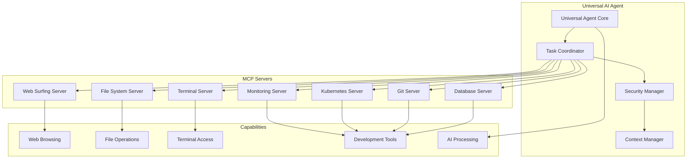

# Universal AI Agent with MCP Integration

## 🎯 Overview

This document outlines how to implement a comprehensive AI agent that leverages Model Context Protocol (MCP) to provide universal system access including web browsing, file operations, terminal commands, and integration with all development tools.

## 🏗️ Architecture Overview



## 🤖 Universal Agent Implementation

### Core Agent Architecture

```typescript
// src/agents/universal-agent.ts
import { MCPClientService } from "../services/mcp-client.service";
import { SecurityManager } from "../services/mcp-security.service";
import { BaseAgent } from "./base-agent";
import { AgentContext, AgentResponse } from "./interface";

export interface UniversalAgentCapabilities {
  webBrowsing: boolean;
  fileOperations: boolean;
  terminalAccess: boolean;
  databaseAccess: boolean;
  gitOperations: boolean;
  systemMonitoring: boolean;
  apiIntegrations: boolean;
}

export interface TaskContext {
  type: "web" | "file" | "terminal" | "database" | "git" | "system" | "composite";
  priority: "low" | "medium" | "high" | "critical";
  requiredCapabilities: string[];
  securityLevel: "read" | "write" | "execute" | "admin";
  timeoutMs?: number;
  retryCount?: number;
}

export class UniversalAgent extends BaseAgent {
  private taskCoordinator: TaskCoordinator;
  private securityManager: SecurityManager;
  private contextManager: ContextManager;
  private capabilities: UniversalAgentCapabilities;

  constructor(
    private mcpClient: MCPClientService,
    agentId: string = "universal-agent"
  ) {
    super(agentId);

    this.taskCoordinator = new TaskCoordinator(mcpClient);
    this.securityManager = new SecurityManager();
    this.contextManager = new ContextManager();

    this.capabilities = {
      webBrowsing: true,
      fileOperations: true,
      terminalAccess: true,
      databaseAccess: true,
      gitOperations: true,
      systemMonitoring: true,
      apiIntegrations: true,
    };
  }

  async executeTask(instruction: string, context: AgentContext, taskContext?: TaskContext): Promise<AgentResponse> {
    try {
      // Parse and understand the instruction
      const taskPlan = await this.parseInstruction(instruction, context);

      // Validate security permissions
      await this.securityManager.validateTaskExecution(taskPlan, taskContext);

      // Execute the task plan
      const result = await this.taskCoordinator.executePlan(taskPlan, context);

      // Generate comprehensive response
      return await this.generateResponse(result, taskPlan, context);
    } catch (error) {
      this.logger.error("Universal agent task execution failed:", error);
      return {
        content: `Task execution failed: ${error instanceof Error ? error.message : "Unknown error"}`,
        context,
        error: true,
        timestamp: new Date(),
      };
    }
  }

  private async parseInstruction(instruction: string, context: AgentContext): Promise<TaskPlan> {
    // Advanced instruction parsing using AI
    const analysis = await this.analyzeInstruction(instruction);

    return {
      id: this.generateTaskId(),
      instruction,
      steps: analysis.steps,
      requiredServers: analysis.requiredServers,
      estimatedDuration: analysis.estimatedDuration,
      riskLevel: analysis.riskLevel,
      dependencies: analysis.dependencies,
    };
  }

  private async analyzeInstruction(instruction: string): Promise<InstructionAnalysis> {
    // Use AI to break down complex instructions into executable steps
    const prompt = `
Analyze this instruction and break it down into executable steps:
"${instruction}"

Consider these capabilities:
- Web browsing and data extraction
- File system operations (read, write, create, delete)
- Terminal command execution
- Database queries and operations
- Git operations
- System monitoring
- API integrations

Return a structured plan with:
1. Required MCP servers
2. Sequential steps
3. Risk assessment
4. Dependencies
5. Estimated duration
`;

    const analysis = await this.llm.run(prompt);
    return this.parseAnalysisResponse(analysis);
  }
}

// Task Coordinator
export class TaskCoordinator {
  constructor(private mcpClient: MCPClientService) {}

  async executePlan(plan: TaskPlan, context: AgentContext): Promise<TaskResult> {
    const results: StepResult[] = [];

    for (const step of plan.steps) {
      try {
        const stepResult = await this.executeStep(step, context, results);
        results.push(stepResult);

        // Check if step failed and handle accordingly
        if (!stepResult.success && step.critical) {
          throw new Error(`Critical step failed: ${stepResult.error}`);
        }
      } catch (error) {
        const errorResult: StepResult = {
          stepId: step.id,
          success: false,
          error: error instanceof Error ? error.message : "Unknown error",
          timestamp: new Date(),
        };
        results.push(errorResult);

        if (step.critical) {
          break; // Stop execution on critical failure
        }
      }
    }

    return {
      planId: plan.id,
      steps: results,
      success: results.every((r) => r.success || !r.critical),
      duration: this.calculateDuration(results),
      summary: this.generateSummary(results),
    };
  }

  private async executeStep(step: TaskStep, context: AgentContext, previousResults: StepResult[]): Promise<StepResult> {
    const startTime = Date.now();

    try {
      let result;

      switch (step.type) {
        case "web":
          result = await this.executeWebStep(step, context);
          break;
        case "file":
          result = await this.executeFileStep(step, context);
          break;
        case "terminal":
          result = await this.executeTerminalStep(step, context);
          break;
        case "database":
          result = await this.executeDatabaseStep(step, context);
          break;
        case "git":
          result = await this.executeGitStep(step, context);
          break;
        case "api":
          result = await this.executeApiStep(step, context);
          break;
        default:
          throw new Error(`Unknown step type: ${step.type}`);
      }

      return {
        stepId: step.id,
        success: true,
        data: result,
        duration: Date.now() - startTime,
        timestamp: new Date(),
      };
    } catch (error) {
      return {
        stepId: step.id,
        success: false,
        error: error instanceof Error ? error.message : "Step execution failed",
        duration: Date.now() - startTime,
        timestamp: new Date(),
      };
    }
  }

  // Web Operations
  private async executeWebStep(step: TaskStep, context: AgentContext): Promise<any> {
    const { action, params } = step;

    switch (action) {
      case "browse":
        return await this.mcpClient.executeRequest("web-server", "browse", {
          url: params.url,
          extractData: params.extractData || true,
          screenshot: params.screenshot || false,
        });

      case "search":
        return await this.mcpClient.executeRequest("web-server", "search", {
          query: params.query,
          engine: params.engine || "google",
          limit: params.limit || 10,
        });

      case "extract":
        return await this.mcpClient.executeRequest("web-server", "extract", {
          url: params.url,
          selector: params.selector,
          dataType: params.dataType || "text",
        });

      case "monitor":
        return await this.mcpClient.executeRequest("web-server", "monitor", {
          url: params.url,
          interval: params.interval || 60000,
          conditions: params.conditions,
        });

      default:
        throw new Error(`Unknown web action: ${action}`);
    }
  }

  // File Operations
  private async executeFileStep(step: TaskStep, context: AgentContext): Promise<any> {
    const { action, params } = step;

    switch (action) {
      case "read":
        return await this.mcpClient.executeRequest("file-server", "read", {
          path: params.path,
          encoding: params.encoding || "utf8",
        });

      case "write":
        return await this.mcpClient.executeRequest("file-server", "write", {
          path: params.path,
          content: params.content,
          encoding: params.encoding || "utf8",
          backup: params.backup || true,
        });

      case "create":
        return await this.mcpClient.executeRequest("file-server", "create", {
          path: params.path,
          type: params.type || "file",
          template: params.template,
        });

      case "delete":
        return await this.mcpClient.executeRequest("file-server", "delete", {
          path: params.path,
          force: params.force || false,
          backup: params.backup || true,
        });

      case "copy":
        return await this.mcpClient.executeRequest("file-server", "copy", {
          source: params.source,
          destination: params.destination,
          overwrite: params.overwrite || false,
        });

      case "move":
        return await this.mcpClient.executeRequest("file-server", "move", {
          source: params.source,
          destination: params.destination,
        });

      case "search":
        return await this.mcpClient.executeRequest("file-server", "search", {
          pattern: params.pattern,
          directory: params.directory || process.cwd(),
          recursive: params.recursive || true,
          includeContent: params.includeContent || false,
        });

      default:
        throw new Error(`Unknown file action: ${action}`);
    }
  }

  // Terminal Operations
  private async executeTerminalStep(step: TaskStep, context: AgentContext): Promise<any> {
    const { action, params } = step;

    switch (action) {
      case "execute":
        return await this.mcpClient.executeRequest("terminal-server", "execute", {
          command: params.command,
          workingDirectory: params.workingDirectory || process.cwd(),
          timeout: params.timeout || 30000,
          env: params.env || {},
        });

      case "interactive":
        return await this.mcpClient.executeRequest("terminal-server", "interactive", {
          command: params.command,
          input: params.input,
          timeout: params.timeout || 60000,
        });

      case "background":
        return await this.mcpClient.executeRequest("terminal-server", "background", {
          command: params.command,
          workingDirectory: params.workingDirectory || process.cwd(),
          env: params.env || {},
        });

      case "kill":
        return await this.mcpClient.executeRequest("terminal-server", "kill", {
          processId: params.processId,
          signal: params.signal || "SIGTERM",
        });

      default:
        throw new Error(`Unknown terminal action: ${action}`);
    }
  }

  // Database Operations
  private async executeDatabaseStep(step: TaskStep, context: AgentContext): Promise<any> {
    const { action, params } = step;

    switch (action) {
      case "query":
        return await this.mcpClient.executeRequest("database-server", "execute_query", {
          sql: params.sql,
          params: params.params || [],
        });

      case "schema":
        return await this.mcpClient.executeRequest("database-server", "get_schema", {
          database: params.database,
        });

      case "optimize":
        return await this.mcpClient.executeRequest("database-server", "optimize_query", {
          query: params.query,
        });

      case "backup":
        return await this.mcpClient.executeRequest("database-server", "backup", {
          database: params.database,
          destination: params.destination,
        });

      default:
        throw new Error(`Unknown database action: ${action}`);
    }
  }

  // Git Operations
  private async executeGitStep(step: TaskStep, context: AgentContext): Promise<any> {
    const { action, params } = step;

    switch (action) {
      case "status":
        return await this.mcpClient.executeRequest("git-server", "status");

      case "commit":
        return await this.mcpClient.executeRequest("git-server", "intelligent_commit", {
          stage_all: params.stageAll || false,
          auto_format: params.autoFormat || true,
        });

      case "branch":
        return await this.mcpClient.executeRequest("git-server", "create_branch", {
          name: params.name,
          from: params.from || "HEAD",
        });

      case "merge":
        return await this.mcpClient.executeRequest("git-server", "merge", {
          branch: params.branch,
          strategy: params.strategy || "auto",
        });

      default:
        throw new Error(`Unknown git action: ${action}`);
    }
  }

  // API Operations
  private async executeApiStep(step: TaskStep, context: AgentContext): Promise<any> {
    const { action, params } = step;

    switch (action) {
      case "request":
        return await this.mcpClient.executeRequest("api-server", "request", {
          method: params.method || "GET",
          url: params.url,
          headers: params.headers || {},
          body: params.body,
          timeout: params.timeout || 30000,
        });

      case "webhook":
        return await this.mcpClient.executeRequest("api-server", "webhook", {
          endpoint: params.endpoint,
          payload: params.payload,
          secret: params.secret,
        });

      default:
        throw new Error(`Unknown API action: ${action}`);
    }
  }
}

// Context Manager
export class ContextManager {
  private contextStack: AgentContext[] = [];
  private sharedContext: Map<string, any> = new Map();

  pushContext(context: AgentContext): void {
    this.contextStack.push(context);
  }

  popContext(): AgentContext | undefined {
    return this.contextStack.pop();
  }

  getCurrentContext(): AgentContext | undefined {
    return this.contextStack[this.contextStack.length - 1];
  }

  setSharedData(key: string, value: any): void {
    this.sharedContext.set(key, value);
  }

  getSharedData(key: string): any {
    return this.sharedContext.get(key);
  }

  clearContext(): void {
    this.contextStack = [];
    this.sharedContext.clear();
  }
}

// Types and Interfaces
export interface TaskPlan {
  id: string;
  instruction: string;
  steps: TaskStep[];
  requiredServers: string[];
  estimatedDuration: number;
  riskLevel: "low" | "medium" | "high";
  dependencies: string[];
}

export interface TaskStep {
  id: string;
  type: "web" | "file" | "terminal" | "database" | "git" | "api";
  action: string;
  params: Record<string, any>;
  critical: boolean;
  timeout?: number;
  retryCount?: number;
}

export interface StepResult {
  stepId: string;
  success: boolean;
  data?: any;
  error?: string;
  duration: number;
  timestamp: Date;
  critical?: boolean;
}

export interface TaskResult {
  planId: string;
  steps: StepResult[];
  success: boolean;
  duration: number;
  summary: string;
}

export interface InstructionAnalysis {
  steps: TaskStep[];
  requiredServers: string[];
  estimatedDuration: number;
  riskLevel: "low" | "medium" | "high";
  dependencies: string[];
}
```

## 🔧 MCP Servers Implementation

### Web Surfing Server

```typescript
// src/mcp-servers/web-surfing-server.ts
import { Server } from "@modelcontextprotocol/server";
import { StdioServerTransport } from "@modelcontextprotocol/server/stdio";
import puppeteer from "puppeteer";
import axios from "axios";
import * as cheerio from "cheerio";

export class WebSurfingServer {
  private server: Server;
  private browser?: puppeteer.Browser;

  constructor() {
    this.server = new Server({ name: "web-surfing", version: "1.0.0" }, { capabilities: { tools: {}, resources: {} } });

    this.setupHandlers();
  }

  async start(): Promise<void> {
    this.browser = await puppeteer.launch({ headless: true });

    const transport = new StdioServerTransport();
    await this.server.connect(transport);
    console.error("Web Surfing MCP Server started");
  }

  private setupHandlers(): void {
    this.server.setRequestHandler("tools/list", async () => ({
      tools: [
        {
          name: "browse_page",
          description: "Browse a web page and extract content",
          inputSchema: {
            type: "object",
            properties: {
              url: { type: "string" },
              wait_for: { type: "string" },
              screenshot: { type: "boolean", default: false },
              extract_links: { type: "boolean", default: true },
              extract_text: { type: "boolean", default: true },
            },
            required: ["url"],
          },
        },
        {
          name: "search_web",
          description: "Search the web using various engines",
          inputSchema: {
            type: "object",
            properties: {
              query: { type: "string" },
              engine: { type: "string", enum: ["google", "bing", "duckduckgo"], default: "google" },
              limit: { type: "number", default: 10 },
              include_snippets: { type: "boolean", default: true },
            },
            required: ["query"],
          },
        },
        {
          name: "extract_data",
          description: "Extract specific data from a webpage using selectors",
          inputSchema: {
            type: "object",
            properties: {
              url: { type: "string" },
              selectors: {
                type: "object",
                additionalProperties: { type: "string" },
              },
              wait_for_element: { type: "string" },
              timeout: { type: "number", default: 30000 },
            },
            required: ["url", "selectors"],
          },
        },
        {
          name: "monitor_page",
          description: "Monitor a page for changes",
          inputSchema: {
            type: "object",
            properties: {
              url: { type: "string" },
              selector: { type: "string" },
              interval: { type: "number", default: 60000 },
              max_checks: { type: "number", default: 10 },
            },
            required: ["url"],
          },
        },
        {
          name: "interact_with_page",
          description: "Interact with page elements (click, type, etc.)",
          inputSchema: {
            type: "object",
            properties: {
              url: { type: "string" },
              actions: {
                type: "array",
                items: {
                  type: "object",
                  properties: {
                    type: { type: "string", enum: ["click", "type", "select", "wait"] },
                    selector: { type: "string" },
                    value: { type: "string" },
                    timeout: { type: "number", default: 5000 },
                  },
                  required: ["type", "selector"],
                },
              },
            },
            required: ["url", "actions"],
          },
        },
      ],
    }));

    this.server.setRequestHandler("tools/call", async (request) => {
      const { name, arguments: args } = request.params;

      switch (name) {
        case "browse_page":
          return await this.browsePage(args);
        case "search_web":
          return await this.searchWeb(args);
        case "extract_data":
          return await this.extractData(args);
        case "monitor_page":
          return await this.monitorPage(args);
        case "interact_with_page":
          return await this.interactWithPage(args);
        default:
          throw new Error(`Unknown tool: ${name}`);
      }
    });
  }

  private async browsePage(args: any): Promise<any> {
    if (!this.browser) throw new Error("Browser not initialized");

    const page = await this.browser.newPage();

    try {
      await page.goto(args.url, { waitUntil: "networkidle2" });

      if (args.wait_for) {
        await page.waitForSelector(args.wait_for, { timeout: 10000 });
      }

      const result: any = {
        url: args.url,
        title: await page.title(),
        timestamp: new Date().toISOString(),
      };

      if (args.extract_text) {
        result.text = await page.evaluate(() => document.body.innerText);
      }

      if (args.extract_links) {
        result.links = await page.evaluate(() => {
          const links = Array.from(document.querySelectorAll("a[href]"));
          return links
            .map((link) => ({
              text: (link as HTMLElement).innerText.trim(),
              href: (link as HTMLAnchorElement).href,
              title: (link as HTMLAnchorElement).title,
            }))
            .filter((link) => link.text && link.href);
        });
      }

      if (args.screenshot) {
        result.screenshot = await page.screenshot({
          encoding: "base64",
          fullPage: true,
        });
      }

      return { success: true, data: result };
    } catch (error) {
      return {
        success: false,
        error: error instanceof Error ? error.message : "Browsing failed",
      };
    } finally {
      await page.close();
    }
  }

  private async searchWeb(args: any): Promise<any> {
    try {
      const searchUrl = this.buildSearchUrl(args.query, args.engine);
      const response = await axios.get(searchUrl, {
        headers: {
          "User-Agent": "Mozilla/5.0 (compatible; WebSurfingBot/1.0)",
        },
      });

      const $ = cheerio.load(response.data);
      const results = this.extractSearchResults($, args.engine, args.limit);

      return {
        success: true,
        data: {
          query: args.query,
          engine: args.engine,
          results,
          total_found: results.length,
          timestamp: new Date().toISOString(),
        },
      };
    } catch (error) {
      return {
        success: false,
        error: error instanceof Error ? error.message : "Search failed",
      };
    }
  }

  private async extractData(args: any): Promise<any> {
    if (!this.browser) throw new Error("Browser not initialized");

    const page = await this.browser.newPage();

    try {
      await page.goto(args.url, { waitUntil: "networkidle2" });

      if (args.wait_for_element) {
        await page.waitForSelector(args.wait_for_element, {
          timeout: args.timeout || 30000,
        });
      }

      const extractedData: any = {};

      for (const [key, selector] of Object.entries(args.selectors)) {
        try {
          const elements = await page.$$(selector as string);

          if (elements.length === 1) {
            extractedData[key] = await page.evaluate(
              (el) => el.textContent?.trim() || el.getAttribute("value") || "",
              elements[0]
            );
          } else if (elements.length > 1) {
            extractedData[key] = await Promise.all(
              elements.map((el) =>
                page.evaluate((element) => element.textContent?.trim() || element.getAttribute("value") || "", el)
              )
            );
          } else {
            extractedData[key] = null;
          }
        } catch (error) {
          extractedData[key] = { error: `Failed to extract: ${error}` };
        }
      }

      return {
        success: true,
        data: {
          url: args.url,
          extracted: extractedData,
          timestamp: new Date().toISOString(),
        },
      };
    } catch (error) {
      return {
        success: false,
        error: error instanceof Error ? error.message : "Data extraction failed",
      };
    } finally {
      await page.close();
    }
  }

  private async monitorPage(args: any): Promise<any> {
    if (!this.browser) throw new Error("Browser not initialized");

    const checks = [];
    let previousContent = "";

    for (let i = 0; i < (args.max_checks || 10); i++) {
      const page = await this.browser.newPage();

      try {
        await page.goto(args.url, { waitUntil: "networkidle2" });

        const content = args.selector
          ? await page.$eval(args.selector, (el) => el.textContent?.trim() || "")
          : await page.evaluate(() => document.body.innerText);

        const changed = i > 0 && content !== previousContent;

        checks.push({
          check_number: i + 1,
          timestamp: new Date().toISOString(),
          content_changed: changed,
          content_length: content.length,
          content_preview: content.substring(0, 200),
        });

        if (changed) {
          checks[checks.length - 1].changes_detected = true;
          checks[checks.length - 1].previous_content_preview = previousContent.substring(0, 200);
        }

        previousContent = content;

        if (i < (args.max_checks || 10) - 1) {
          await new Promise((resolve) => setTimeout(resolve, args.interval || 60000));
        }
      } catch (error) {
        checks.push({
          check_number: i + 1,
          timestamp: new Date().toISOString(),
          error: error instanceof Error ? error.message : "Check failed",
        });
      } finally {
        await page.close();
      }
    }

    return {
      success: true,
      data: {
        url: args.url,
        monitoring_completed: true,
        total_checks: checks.length,
        changes_detected: checks.some((check) => check.changes_detected),
        checks,
      },
    };
  }

  private async interactWithPage(args: any): Promise<any> {
    if (!this.browser) throw new Error("Browser not initialized");

    const page = await this.browser.newPage();

    try {
      await page.goto(args.url, { waitUntil: "networkidle2" });

      const actionResults = [];

      for (const action of args.actions) {
        try {
          switch (action.type) {
            case "click":
              await page.waitForSelector(action.selector, { timeout: action.timeout || 5000 });
              await page.click(action.selector);
              actionResults.push({ action: "click", selector: action.selector, success: true });
              break;

            case "type":
              await page.waitForSelector(action.selector, { timeout: action.timeout || 5000 });
              await page.type(action.selector, action.value || "");
              actionResults.push({ action: "type", selector: action.selector, value: action.value, success: true });
              break;

            case "select":
              await page.waitForSelector(action.selector, { timeout: action.timeout || 5000 });
              await page.select(action.selector, action.value || "");
              actionResults.push({ action: "select", selector: action.selector, value: action.value, success: true });
              break;

            case "wait":
              await page.waitForSelector(action.selector, { timeout: action.timeout || 5000 });
              actionResults.push({ action: "wait", selector: action.selector, success: true });
              break;

            default:
              throw new Error(`Unknown action type: ${action.type}`);
          }

          // Wait a bit between actions
          await page.waitForTimeout(1000);
        } catch (error) {
          actionResults.push({
            action: action.type,
            selector: action.selector,
            success: false,
            error: error instanceof Error ? error.message : "Action failed",
          });
        }
      }

      // Get final page state
      const finalState = {
        url: page.url(),
        title: await page.title(),
        timestamp: new Date().toISOString(),
      };

      return {
        success: true,
        data: {
          initial_url: args.url,
          final_state: finalState,
          actions_executed: actionResults,
          all_actions_successful: actionResults.every((result) => result.success),
        },
      };
    } catch (error) {
      return {
        success: false,
        error: error instanceof Error ? error.message : "Page interaction failed",
      };
    } finally {
      await page.close();
    }
  }

  private buildSearchUrl(query: string, engine: string): string {
    const encodedQuery = encodeURIComponent(query);

    switch (engine) {
      case "google":
        return `https://www.google.com/search?q=${encodedQuery}`;
      case "bing":
        return `https://www.bing.com/search?q=${encodedQuery}`;
      case "duckduckgo":
        return `https://duckduckgo.com/?q=${encodedQuery}`;
      default:
        return `https://www.google.com/search?q=${encodedQuery}`;
    }
  }

  private extractSearchResults($: cheerio.CheerioAPI, engine: string, limit: number): any[] {
    const results: any[] = [];

    // This is a simplified implementation - real implementation would need
    // to handle different search engines' HTML structures
    $("h3").each((i, element) => {
      if (i >= limit) return false;

      const title = $(element).text().trim();
      const link = $(element).closest("a").attr("href");

      if (title && link) {
        results.push({ title, link });
      }
    });

    return results;
  }

  async stop(): Promise<void> {
    if (this.browser) {
      await this.browser.close();
    }
    await this.server.close();
  }
}

// Start the server
if (require.main === module) {
  const server = new WebSurfingServer();
  server.start().catch(console.error);
}
```

### Enhanced File System Server

```typescript
// src/mcp-servers/enhanced-file-server.ts
import { Server } from "@modelcontextprotocol/server";
import { StdioServerTransport } from "@modelcontextprotocol/server/stdio";
import * as fs from "fs/promises";
import * as path from "path";
import * as os from "os";
import { glob } from "glob";
import { createHash } from "crypto";

export class EnhancedFileServer {
  private server: Server;
  private backupDir: string;

  constructor() {
    this.server = new Server(
      { name: "enhanced-file-system", version: "1.0.0" },
      { capabilities: { tools: {}, resources: {} } }
    );

    this.backupDir = path.join(os.tmpdir(), "mcp-file-backups");
    this.setupHandlers();
  }

  async start(): Promise<void> {
    // Ensure backup directory exists
    await fs.mkdir(this.backupDir, { recursive: true });

    const transport = new StdioServerTransport();
    await this.server.connect(transport);
    console.error("Enhanced File System MCP Server started");
  }

  private setupHandlers(): void {
    this.server.setRequestHandler("tools/list", async () => ({
      tools: [
        {
          name: "read_file",
          description: "Read file content with encoding options",
          inputSchema: {
            type: "object",
            properties: {
              path: { type: "string" },
              encoding: { type: "string", default: "utf8" },
              max_size: { type: "number", default: 10485760 }, // 10MB
            },
            required: ["path"],
          },
        },
        {
          name: "write_file",
          description: "Write content to file with backup",
          inputSchema: {
            type: "object",
            properties: {
              path: { type: "string" },
              content: { type: "string" },
              encoding: { type: "string", default: "utf8" },
              backup: { type: "boolean", default: true },
              create_dirs: { type: "boolean", default: true },
            },
            required: ["path", "content"],
          },
        },
        {
          name: "append_file",
          description: "Append content to file",
          inputSchema: {
            type: "object",
            properties: {
              path: { type: "string" },
              content: { type: "string" },
              encoding: { type: "string", default: "utf8" },
            },
            required: ["path", "content"],
          },
        },
        {
          name: "delete_file",
          description: "Delete file or directory with backup option",
          inputSchema: {
            type: "object",
            properties: {
              path: { type: "string" },
              recursive: { type: "boolean", default: false },
              backup: { type: "boolean", default: true },
            },
            required: ["path"],
          },
        },
        {
          name: "copy_file",
          description: "Copy file or directory",
          inputSchema: {
            type: "object",
            properties: {
              source: { type: "string" },
              destination: { type: "string" },
              overwrite: { type: "boolean", default: false },
              preserve_timestamps: { type: "boolean", default: true },
            },
            required: ["source", "destination"],
          },
        },
        {
          name: "move_file",
          description: "Move/rename file or directory",
          inputSchema: {
            type: "object",
            properties: {
              source: { type: "string" },
              destination: { type: "string" },
              backup: { type: "boolean", default: true },
            },
            required: ["source", "destination"],
          },
        },
        {
          name: "search_files",
          description: "Search for files using patterns",
          inputSchema: {
            type: "object",
            properties: {
              pattern: { type: "string" },
              directory: { type: "string", default: "." },
              content_search: { type: "string" },
              case_sensitive: { type: "boolean", default: false },
              include_hidden: { type: "boolean", default: false },
              max_results: { type: "number", default: 100 },
            },
            required: ["pattern"],
          },
        },
        {
          name: "file_info",
          description: "Get detailed file information",
          inputSchema: {
            type: "object",
            properties: {
              path: { type: "string" },
              include_content_analysis: { type: "boolean", default: false },
            },
            required: ["path"],
          },
        },
        {
          name: "create_directory",
          description: "Create directory structure",
          inputSchema: {
            type: "object",
            properties: {
              path: { type: "string" },
              recursive: { type: "boolean", default: true },
              mode: { type: "string", default: "0755" },
            },
            required: ["path"],
          },
        },
        {
          name: "list_directory",
          description: "List directory contents with details",
          inputSchema: {
            type: "object",
            properties: {
              path: { type: "string", default: "." },
              recursive: { type: "boolean", default: false },
              include_hidden: { type: "boolean", default: false },
              sort_by: { type: "string", enum: ["name", "size", "modified"], default: "name" },
            },
          },
        },
      ],
    }));

    this.server.setRequestHandler("tools/call", async (request) => {
      const { name, arguments: args } = request.params;

      try {
        switch (name) {
          case "read_file":
            return await this.readFile(args);
          case "write_file":
            return await this.writeFile(args);
          case "append_file":
            return await this.appendFile(args);
          case "delete_file":
            return await this.deleteFile(args);
          case "copy_file":
            return await this.copyFile(args);
          case "move_file":
            return await this.moveFile(args);
          case "search_files":
            return await this.searchFiles(args);
          case "file_info":
            return await this.getFileInfo(args);
          case "create_directory":
            return await this.createDirectory(args);
          case "list_directory":
            return await this.listDirectory(args);
          default:
            throw new Error(`Unknown tool: ${name}`);
        }
      } catch (error) {
        return {
          success: false,
          error: error instanceof Error ? error.message : "Operation failed",
        };
      }
    });
  }

  private async readFile(args: any): Promise<any> {
    const filePath = path.resolve(args.path);

    // Check file size
    const stats = await fs.stat(filePath);
    if (stats.size > args.max_size) {
      throw new Error(`File too large: ${stats.size} bytes (max: ${args.max_size})`);
    }

    const content = await fs.readFile(filePath, { encoding: args.encoding });

    return {
      success: true,
      data: {
        path: filePath,
        content,
        size: stats.size,
        encoding: args.encoding,
        last_modified: stats.mtime,
        checksum: createHash("md5").update(content).digest("hex"),
      },
    };
  }

  private async writeFile(args: any): Promise<any> {
    const filePath = path.resolve(args.path);

    // Create backup if file exists and backup is requested
    if (args.backup) {
      try {
        await fs.access(filePath);
        await this.createBackup(filePath);
      } catch (error) {
        // File doesn't exist, no backup needed
      }
    }

    // Create directories if needed
    if (args.create_dirs) {
      await fs.mkdir(path.dirname(filePath), { recursive: true });
    }

    await fs.writeFile(filePath, args.content, { encoding: args.encoding });

    const stats = await fs.stat(filePath);

    return {
      success: true,
      data: {
        path: filePath,
        bytes_written: stats.size,
        last_modified: stats.mtime,
        backup_created: args.backup,
      },
    };
  }

  private async appendFile(args: any): Promise<any> {
    const filePath = path.resolve(args.path);

    await fs.appendFile(filePath, args.content, { encoding: args.encoding });

    const stats = await fs.stat(filePath);

    return {
      success: true,
      data: {
        path: filePath,
        total_size: stats.size,
        content_appended: args.content.length,
        last_modified: stats.mtime,
      },
    };
  }

  private async deleteFile(args: any): Promise<any> {
    const filePath = path.resolve(args.path);

    // Create backup if requested
    if (args.backup) {
      await this.createBackup(filePath);
    }

    const stats = await fs.stat(filePath);
    const isDirectory = stats.isDirectory();

    if (isDirectory && args.recursive) {
      await fs.rm(filePath, { recursive: true, force: true });
    } else if (isDirectory) {
      await fs.rmdir(filePath);
    } else {
      await fs.unlink(filePath);
    }

    return {
      success: true,
      data: {
        path: filePath,
        type: isDirectory ? "directory" : "file",
        size: stats.size,
        backup_created: args.backup,
      },
    };
  }

  private async copyFile(args: any): Promise<any> {
    const sourcePath = path.resolve(args.source);
    const destPath = path.resolve(args.destination);

    // Check if destination exists and overwrite is not allowed
    if (!args.overwrite) {
      try {
        await fs.access(destPath);
        throw new Error("Destination exists and overwrite is false");
      } catch (error) {
        // Destination doesn't exist, OK to proceed
        if ((error as NodeJS.ErrnoException).code !== "ENOENT") {
          throw error;
        }
      }
    }

    const sourceStats = await fs.stat(sourcePath);

    if (sourceStats.isDirectory()) {
      // Copy directory recursively
      await this.copyDirectory(sourcePath, destPath, args.preserve_timestamps);
    } else {
      // Copy file
      await fs.copyFile(sourcePath, destPath);

      if (args.preserve_timestamps) {
        await fs.utimes(destPath, sourceStats.atime, sourceStats.mtime);
      }
    }

    const destStats = await fs.stat(destPath);

    return {
      success: true,
      data: {
        source: sourcePath,
        destination: destPath,
        type: sourceStats.isDirectory() ? "directory" : "file",
        size: destStats.size,
        copied_at: new Date(),
      },
    };
  }

  private async moveFile(args: any): Promise<any> {
    const sourcePath = path.resolve(args.source);
    const destPath = path.resolve(args.destination);

    // Create backup if requested
    if (args.backup) {
      try {
        await fs.access(destPath);
        await this.createBackup(destPath);
      } catch (error) {
        // Destination doesn't exist, no backup needed
      }
    }

    const sourceStats = await fs.stat(sourcePath);

    await fs.rename(sourcePath, destPath);

    return {
      success: true,
      data: {
        source: sourcePath,
        destination: destPath,
        type: sourceStats.isDirectory() ? "directory" : "file",
        size: sourceStats.size,
        moved_at: new Date(),
        backup_created: args.backup,
      },
    };
  }

  private async searchFiles(args: any): Promise<any> {
    const searchDir = path.resolve(args.directory);
    const pattern = args.pattern;

    // Use glob for file pattern matching
    const globPattern = path.join(searchDir, "**", pattern);
    const files = await glob(globPattern, {
      dot: args.include_hidden,
      ignore: args.include_hidden ? [] : ["**/.*/**"],
    });

    let results = [];

    for (const file of files.slice(0, args.max_results)) {
      const stats = await fs.stat(file);
      const result: any = {
        path: file,
        name: path.basename(file),
        size: stats.size,
        type: stats.isDirectory() ? "directory" : "file",
        last_modified: stats.mtime,
      };

      // Content search if specified
      if (args.content_search && stats.isFile()) {
        try {
          const content = await fs.readFile(file, "utf8");
          const searchRegex = new RegExp(args.content_search, args.case_sensitive ? "g" : "gi");
          const matches = content.match(searchRegex);

          if (matches) {
            result.content_matches = matches.length;
            result.has_content_match = true;
          } else {
            result.has_content_match = false;
          }
        } catch (error) {
          result.content_search_error = "Could not read file for content search";
        }
      }

      results.push(result);
    }

    // Filter by content match if content search was specified
    if (args.content_search) {
      results = results.filter((r) => r.has_content_match);
    }

    return {
      success: true,
      data: {
        pattern: args.pattern,
        directory: searchDir,
        total_found: results.length,
        content_search: args.content_search || null,
        results,
      },
    };
  }

  private async getFileInfo(args: any): Promise<any> {
    const filePath = path.resolve(args.path);
    const stats = await fs.stat(filePath);

    const info: any = {
      path: filePath,
      name: path.basename(filePath),
      size: stats.size,
      type: stats.isDirectory() ? "directory" : "file",
      permissions: stats.mode.toString(8),
      created: stats.birthtime,
      last_modified: stats.mtime,
      last_accessed: stats.atime,
      is_readable: true, // We'll test this
      is_writable: true, // We'll test this
    };

    // Test actual permissions
    try {
      await fs.access(filePath, fs.constants.R_OK);
    } catch {
      info.is_readable = false;
    }

    try {
      await fs.access(filePath, fs.constants.W_OK);
    } catch {
      info.is_writable = false;
    }

    // Content analysis for files
    if (args.include_content_analysis && stats.isFile() && stats.size < 1024 * 1024) {
      // Max 1MB
      try {
        const content = await fs.readFile(filePath, "utf8");
        info.content_analysis = {
          line_count: content.split("\n").length,
          char_count: content.length,
          word_count: content.split(/\s+/).length,
          encoding_detected: "utf8", // Simplified
          mime_type: this.detectMimeType(filePath, content),
        };
      } catch (error) {
        info.content_analysis = { error: "Could not analyze content" };
      }
    }

    return {
      success: true,
      data: info,
    };
  }

  private async createDirectory(args: any): Promise<any> {
    const dirPath = path.resolve(args.path);
    const mode = parseInt(args.mode, 8);

    await fs.mkdir(dirPath, { recursive: args.recursive, mode });

    const stats = await fs.stat(dirPath);

    return {
      success: true,
      data: {
        path: dirPath,
        created: stats.birthtime,
        permissions: stats.mode.toString(8),
        recursive: args.recursive,
      },
    };
  }

  private async listDirectory(args: any): Promise<any> {
    const dirPath = path.resolve(args.path);

    const entries = await fs.readdir(dirPath, { withFileTypes: true });
    const results = [];

    for (const entry of entries) {
      // Skip hidden files if not requested
      if (!args.include_hidden && entry.name.startsWith(".")) {
        continue;
      }

      const entryPath = path.join(dirPath, entry.name);
      const stats = await fs.stat(entryPath);

      const result: any = {
        name: entry.name,
        path: entryPath,
        type: entry.isDirectory() ? "directory" : "file",
        size: stats.size,
        last_modified: stats.mtime,
        permissions: stats.mode.toString(8),
      };

      results.push(result);

      // Recursive listing for directories
      if (args.recursive && entry.isDirectory()) {
        const subResults = await this.listDirectory({
          ...args,
          path: entryPath,
        });
        results.push(...subResults.data.entries);
      }
    }

    // Sort results
    results.sort((a, b) => {
      switch (args.sort_by) {
        case "size":
          return b.size - a.size;
        case "modified":
          return b.last_modified.getTime() - a.last_modified.getTime();
        case "name":
        default:
          return a.name.localeCompare(b.name);
      }
    });

    return {
      success: true,
      data: {
        directory: dirPath,
        total_entries: results.length,
        sort_by: args.sort_by,
        entries: results,
      },
    };
  }

  // Helper methods
  private async createBackup(filePath: string): Promise<string> {
    const timestamp = new Date().toISOString().replace(/[:.]/g, "-");
    const backupName = `${path.basename(filePath)}.backup.${timestamp}`;
    const backupPath = path.join(this.backupDir, backupName);

    await fs.copyFile(filePath, backupPath);
    return backupPath;
  }

  private async copyDirectory(source: string, destination: string, preserveTimestamps: boolean): Promise<void> {
    await fs.mkdir(destination, { recursive: true });

    const entries = await fs.readdir(source, { withFileTypes: true });

    for (const entry of entries) {
      const sourcePath = path.join(source, entry.name);
      const destPath = path.join(destination, entry.name);

      if (entry.isDirectory()) {
        await this.copyDirectory(sourcePath, destPath, preserveTimestamps);
      } else {
        await fs.copyFile(sourcePath, destPath);

        if (preserveTimestamps) {
          const stats = await fs.stat(sourcePath);
          await fs.utimes(destPath, stats.atime, stats.mtime);
        }
      }
    }
  }

  private detectMimeType(filePath: string, content: string): string {
    const ext = path.extname(filePath).toLowerCase();

    const mimeTypes: Record<string, string> = {
      ".js": "application/javascript",
      ".ts": "application/typescript",
      ".json": "application/json",
      ".html": "text/html",
      ".css": "text/css",
      ".md": "text/markdown",
      ".txt": "text/plain",
      ".xml": "application/xml",
      ".yml": "application/yaml",
      ".yaml": "application/yaml",
    };

    return mimeTypes[ext] || "text/plain";
  }

  async stop(): Promise<void> {
    await this.server.close();
  }
}

// Start the server
if (require.main === module) {
  const server = new EnhancedFileServer();
  server.start().catch(console.error);
}
```

## 🎯 Usage Examples

### Example 1: Complete Web Research and File Generation

```typescript
// Example usage of the Universal Agent
const agent = new UniversalAgent(mcpClient);

const instruction = `
Research the latest trends in AI development, specifically focusing on:
1. Recent breakthrough papers from the last 3 months
2. Popular GitHub repositories with significant updates
3. Industry adoption patterns

Then create a comprehensive markdown report with:
- Executive summary
- Key findings with citations
- Technology comparison table
- Recommendations for our development roadmap

Save the report as 'ai-trends-report-2024.md' in the docs directory.
`;

const result = await agent.executeTask(instruction, context);
```

### Example 2: Automated Development Workflow

```typescript
const instruction = `
I need to set up a new microservice for user authentication. Please:

1. Create the project structure with:
   - Express.js + TypeScript setup
   - Docker configuration
   - Basic authentication routes
   - Database migrations for PostgreSQL
   - Unit tests structure

2. Research best practices for OAuth2 implementation

3. Generate comprehensive documentation including:
   - API documentation
   - Setup instructions
   - Security guidelines

4. Initialize Git repository and create initial commit

5. Set up GitHub Actions for CI/CD

Execute all steps and provide a summary of what was created.
`;

const result = await agent.executeTask(instruction, context);
```

### Example 3: Database Analysis and Optimization

```typescript
const instruction = `
Analyze our production database performance and optimize it:

1. Connect to the production database (read-only)
2. Identify slow-running queries from the last 24 hours
3. Analyze table schemas for missing indexes
4. Research optimization techniques for our specific use cases
5. Generate optimized SQL scripts
6. Create a performance improvement report
7. Schedule the optimizations in our task management system

Focus on queries affecting the user_sessions and order_processing tables.
`;

const result = await agent.executeTask(instruction, context);
```

## 📊 Integration with Existing CodeBuddy

### Update the Extension Activation

```typescript
// src/extension.ts - Add Universal Agent integration
import { UniversalAgent } from "./agents/universal-agent";
import { MCPClientService } from "./services/mcp-client.service";

export async function activate(context: vscode.ExtensionContext) {
  try {
    // ... existing initialization code ...

    // Initialize MCP Client
    const mcpClient = new MCPClientService();

    // Initialize Universal Agent
    const universalAgent = new UniversalAgent(mcpClient);

    // Register Universal Agent command
    const universalAgentCommand = vscode.commands.registerCommand("CodeBuddy.universalAgent", async () => {
      const instruction = await vscode.window.showInputBox({
        prompt: "What would you like me to do?",
        placeHolder: "e.g., Research React best practices and create a component library...",
        ignoreFocusOut: true,
      });

      if (instruction) {
        await vscode.window.withProgress(
          {
            location: vscode.ProgressLocation.Notification,
            title: "Universal Agent working...",
            cancellable: true,
          },
          async (progress, token) => {
            const context = await getAgentContext();
            const result = await universalAgent.executeTask(instruction, context);

            // Display results
            const panel = vscode.window.createWebviewPanel(
              "universalAgentResults",
              "Universal Agent Results",
              vscode.ViewColumn.One,
              { enableScripts: true }
            );

            panel.webview.html = generateResultsHtml(result);
          }
        );
      }
    });

    context.subscriptions.push(universalAgentCommand);

    // ... rest of existing code ...
  } catch (error) {
    // ... error handling ...
  }
}
```

### Add to Package.json

```json
{
  "contributes": {
    "commands": [
      {
        "command": "CodeBuddy.universalAgent",
        "title": "CodeBuddy: Universal AI Agent"
      }
    ],
    "menus": {
      "commandPalette": [
        {
          "command": "CodeBuddy.universalAgent",
          "title": "CodeBuddy: Universal AI Agent - Complete any development task"
        }
      ]
    }
  }
}
```

## 🚀 Deployment and Setup

### Required Dependencies

```json
{
  "dependencies": {
    "@modelcontextprotocol/sdk": "^0.5.0",
    "@modelcontextprotocol/client": "^0.5.0",
    "@modelcontextprotocol/server": "^0.5.0",
    "puppeteer": "^21.0.0",
    "cheerio": "^1.0.0",
    "axios": "^1.6.0",
    "glob": "^10.3.0"
  }
}
```

### MCP Server Configuration

```typescript
// src/config/mcp-servers.config.ts
export const MCP_SERVERS_CONFIG = {
  "web-surfing": {
    type: "stdio",
    command: "node",
    args: ["dist/mcp-servers/web-surfing-server.js"],
    capabilities: ["web", "search", "monitoring"],
  },
  "enhanced-file-system": {
    type: "stdio",
    command: "node",
    args: ["dist/mcp-servers/enhanced-file-server.js"],
    capabilities: ["files", "search", "backup"],
  },
  "terminal-executor": {
    type: "stdio",
    command: "node",
    args: ["dist/mcp-servers/terminal-server.js"],
    capabilities: ["terminal", "process", "system"],
  },
};
```

This implementation provides you with a comprehensive Universal AI Agent that can:

- **Browse the web** and extract information
- **Perform all file operations** with backup and safety features
- **Execute terminal commands** safely
- **Integrate with databases** for queries and optimization
- **Work with Git** for version control operations
- **Coordinate complex multi-step tasks** automatically

The agent uses the MCP architecture I documented to provide secure, scalable access to all system capabilities while maintaining the existing CodeBuddy user experience.
