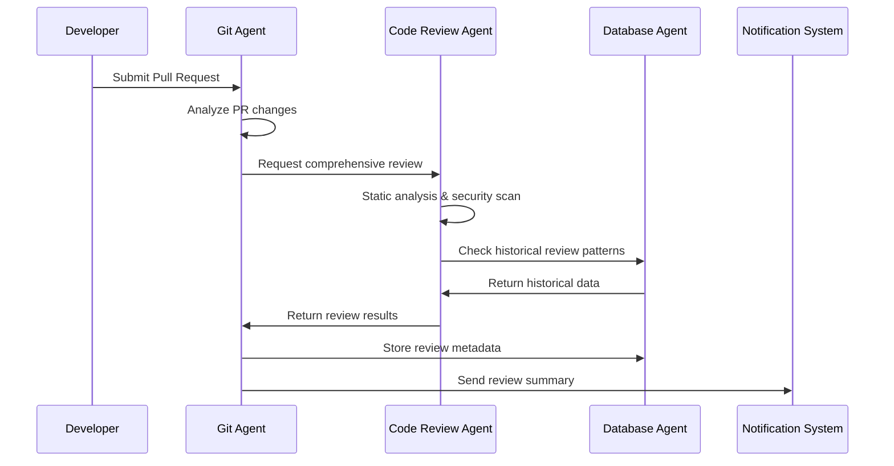
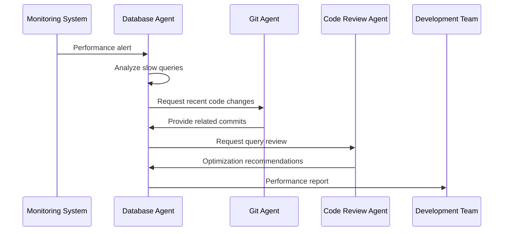
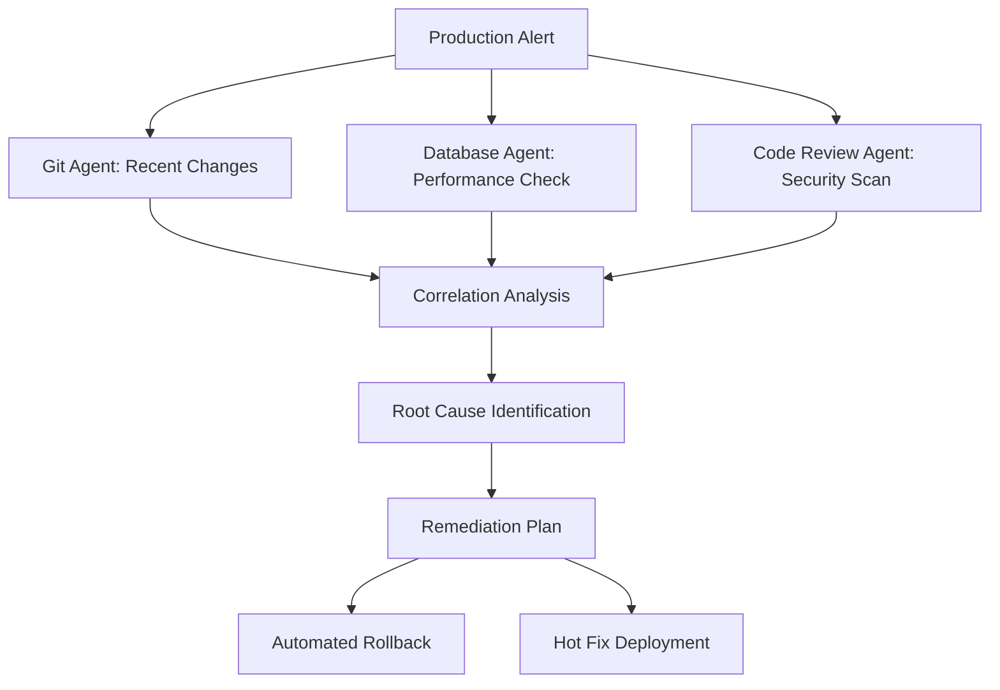

# Use Cases and Practical Scenarios

## Overview

This document outlines practical use cases and real-world scenarios where the MCP-powered specialist agent system demonstrates its value. These use cases illustrate how the agents collaborate through the @a2a-js/sdk for task coordination and communication to solve complex development and operational challenges.

## Core Use Cases

### 1. Comprehensive Code Review Workflow

#### Scenario: Pull Request Quality Gate

**Context:** A developer submits a pull request that needs comprehensive review before merging to the main branch.

**Workflow:**



**Agent Interactions:**

1. **Git Agent Actions:**

   - Detects new pull request
   - Analyzes code changes and diff complexity
   - Extracts commit metadata and branch history
   - Identifies files and modules affected

2. **Code Review Agent Actions:**

   - Performs static analysis on changed files
   - Conducts security vulnerability scanning
   - Analyzes code complexity and maintainability
   - Checks adherence to coding standards

3. **Database Agent Actions:**
   - Queries historical review data for similar changes
   - Stores new review results and metrics
   - Provides insights on code quality trends
   - Tracks reviewer performance and accuracy

**Expected Outcomes:**

- Automated quality assessment within 2-3 minutes
- Comprehensive review report with prioritized issues
- Historical context for informed decision-making
- Reduced manual review time by 60-70%

#### Advanced Scenario: Security-Critical Review

**Context:** A pull request modifies authentication or data access logic requiring enhanced security review.

**Enhanced Workflow:**

```typescript
// Git Agent detects security-sensitive changes
const securitySensitiveFiles = await gitAgent.analyzePR({
  prId: "PR-123",
  securityContext: true,
});

// Trigger enhanced security review
if (securitySensitiveFiles.length > 0) {
  const securityReview = await codeReviewAgent.performSecurityReview({
    files: securitySensitiveFiles,
    severity: "HIGH",
    compliance: ["OWASP", "SOC2"],
  });

  // Database agent checks for similar security issues
  const historicalVulns = await databaseAgent.querySecurityHistory({
    patterns: securityReview.detectedPatterns,
    timeframe: "6months",
  });

  // Generate comprehensive security report
  const report = await codeReviewAgent.generateSecurityReport({
    currentFindings: securityReview,
    historicalContext: historicalVulns,
    riskAssessment: true,
  });
}
```

### 2. Database Performance Optimization

#### Scenario: Slow Query Detection and Optimization

**Context:** The database agent detects performance degradation and initiates a comprehensive optimization workflow.

**Workflow:**



**Detailed Agent Actions:**

1. **Database Agent Detection:**

```typescript
// Continuous monitoring triggers alert
const performanceAlert = {
  queryId: "query-456",
  executionTime: 15000, // 15 seconds
  threshold: 2000, // 2 seconds
  frequency: "high",
  affectedUsers: 150,
};

// Database agent analyzes the issue
const analysis = await databaseAgent.analyzeSlowQuery({
  queryId: performanceAlert.queryId,
  includeExecutionPlan: true,
  indexAnalysis: true,
  resourceUsage: true,
});
```

2. **Git Agent Correlation:**

```typescript
// Find related code changes
const relatedChanges = await gitAgent.findRelatedChanges({
  timeframe: "7days",
  affectedTables: analysis.tablesInvolved,
  filePatterns: ["*.sql", "*Repository.ts", "*Service.ts"],
});

// Identify potential contributors
const contributors = await gitAgent.identifyContributors({
  changes: relatedChanges,
  expertise: "database",
});
```

3. **Code Review Agent Optimization:**

```typescript
// Review query for optimization opportunities
const optimizationReview = await codeReviewAgent.reviewQuery({
  query: analysis.queryText,
  schema: analysis.schemaInfo,
  executionPlan: analysis.executionPlan,
  optimizationLevel: "aggressive",
});

// Generate optimization recommendations
const recommendations = await codeReviewAgent.generateOptimizations({
  currentQuery: analysis.queryText,
  performance: analysis.performanceMetrics,
  indexSuggestions: analysis.missingIndexes,
});
```

**Expected Outcomes:**

- Automated detection of performance issues within minutes
- Root cause analysis linking code changes to performance impact
- Specific optimization recommendations with estimated improvements
- Proactive notification to relevant team members

### 3. Repository Health and Maintenance

#### Scenario: Automated Repository Audit and Cleanup

**Context:** Monthly repository health audit identifying technical debt and maintenance opportunities.

**Comprehensive Workflow:**

```typescript
// Git Agent initiates comprehensive repository audit
const auditTask = await gitAgent.createTask({
  type: "REPOSITORY_AUDIT",
  participants: ["database-agent", "code-review-agent"],
  data: {
    repositoryId: "repo-789",
    scope: "comprehensive",
    includeMetrics: true,
  },
});

// Wait for all agents to complete their analysis
const auditResults = await auditTask.waitForCompletion();

// Extract analysis from each agent's artifacts
const gitAnalysis = auditResults.artifacts.find((a) => a.agentId === "git-agent")?.data;
const dbAnalysis = auditResults.artifacts.find((a) => a.agentId === "database-agent")?.data;
const codeAnalysis = auditResults.artifacts.find((a) => a.agentId === "code-review-agent")?.data;

// Generate consolidated recommendations using A2A SDK
const maintenancePlan = await gitAgent.createTask({
  type: "MAINTENANCE_PLANNING",
  participants: ["database-agent", "code-review-agent"],
  data: {
    gitHealth: gitAnalysis,
    databaseHealth: dbAnalysis,
    codeQuality: codeAnalysis,
    priority: "business-impact",
  },
});
```

**Agent-Specific Analyses:**

1. **Git Agent Analysis:**

   - Branch hygiene and stale branch identification
   - Commit pattern analysis and team collaboration metrics
   - Release cadence and deployment frequency
   - Code ownership and bus factor analysis

2. **Database Agent Analysis:**

   - Database schema evolution and migration health
   - Query performance trends and degradation patterns
   - Data growth patterns and capacity planning
   - Backup and recovery procedure validation

3. **Code Review Agent Analysis:**
   - Technical debt accumulation trends
   - Code complexity evolution over time
   - Security vulnerability lifecycle analysis
   - Test coverage and quality metrics

### 4. Incident Response and Root Cause Analysis

#### Scenario: Production Issue Investigation

**Context:** A production issue requires rapid investigation across code, database, and infrastructure.

**Emergency Response Workflow:**



**Rapid Response Implementation:**

```typescript
// Emergency response using A2A SDK task coordination
class IncidentResponseHandler {
  constructor(
    private gitAgent: GitAgent,
    private databaseAgent: DatabaseAgent,
    private codeReviewAgent: CodeReviewAgent
  ) {}

  async handleProductionIncident(incident: ProductionIncident): Promise<IncidentResponse> {
    // Create emergency investigation task with all agents
    const investigationTask = await this.gitAgent.createTask({
      type: "EMERGENCY_INVESTIGATION",
      priority: "CRITICAL",
      participants: ["database-agent", "code-review-agent"],
      data: {
        timeframe: incident.timeframe,
        severity: "production",
        affectedServices: incident.affectedServices,
        timestamp: incident.timestamp,
        metrics: incident.metrics,
        affectedComponents: incident.affectedComponents,
      },
    });

    // Wait for all agents to contribute their analysis
    const investigation = await investigationTask.waitForCompletion();

    // Generate rapid response plan based on consolidated findings
    return await this.generateResponsePlan(investigation.artifacts, incident);
  }
}
```

### 5. Continuous Integration Enhancement

#### Scenario: Intelligent CI/CD Pipeline

**Context:** Enhancing CI/CD pipelines with intelligent agent-driven quality gates and optimizations.

**Enhanced CI/CD Workflow:**

```yaml
# Intelligent CI/CD Pipeline
stages:
  - agent-analysis
  - quality-gates
  - deployment-decision
  - post-deployment-monitoring

agent-analysis:
  script:
    - git-agent create-task --type=PR_ANALYSIS --pr=${CI_MERGE_REQUEST_IID}
    - code-review-agent create-task --type=SECURITY_SCAN --severity=medium
    - database-agent create-task --type=MIGRATION_VALIDATION

quality-gates:
  script:
    - git-agent create-task --type=QUALITY_EVALUATION --participants=database-agent,code-review-agent
  rules:
    - if: $AGENT_QUALITY_SCORE < 80
      when: manual
    - when: on_success

deployment-decision:
  script:
    - git-agent create-task --type=DEPLOYMENT_PLANNING --participants=database-agent
    - database-agent verify-schema-compatibility
  rules:
    - if: $DEPLOYMENT_RISK == "high"
      when: manual
```

**Intelligent Quality Gate Logic:**

```typescript
// Quality gate evaluation using A2A SDK task coordination
class IntelligentQualityGate {
  async evaluateDeploymentReadiness(context: DeploymentContext): Promise<QualityGateResult> {
    // Create multi-agent assessment task
    const assessmentTask = await this.gitAgent.createTask({
      type: "DEPLOYMENT_ASSESSMENT",
      participants: ["database-agent", "code-review-agent"],
      data: context,
    });

    // Wait for all agents to complete their assessments
    const assessments = await assessmentTask.waitForCompletion();

    // AI-driven risk scoring based on all agent inputs
    const riskScore = await this.calculateRiskScore(assessments.artifacts, context);

    // Adaptive quality thresholds based on historical data
    const adaptiveThresholds = await this.getAdaptiveThresholds(context.projectId);

    return {
      approved: riskScore < adaptiveThresholds.maxRisk,
      riskScore,
      recommendations: this.generateRecommendations(assessments.artifacts),
      requiresManualReview: riskScore > adaptiveThresholds.manualReviewThreshold,
    };
  }
}
```

## Advanced Use Cases

### 6. Multi-Repository Code Refactoring

#### Scenario: Large-Scale Refactoring Across Multiple Repositories

**Context:** Organization needs to refactor shared libraries used across dozens of repositories.

**Orchestrated Refactoring Workflow:**

```typescript
// Multi-repository refactoring using A2A SDK coordination
class RefactoringCoordinator {
  async orchestrateLargeScaleRefactoring(refactoringPlan: RefactoringPlan): Promise<RefactoringResult> {
    // Create comprehensive refactoring task with all agents
    const refactoringTask = await this.gitAgent.createTask({
      type: "LARGE_SCALE_REFACTORING",
      participants: ["database-agent", "code-review-agent"],
      data: {
        targetLibrary: refactoringPlan.targetLibrary,
        currentVersion: refactoringPlan.currentVersion,
        refactoringPlan,
      },
    });

    // Each agent contributes their expertise to the task
    const refactoringAnalysis = await refactoringTask.waitForCompletion();

    // Extract results from each agent's contribution
    const affectedRepos = refactoringAnalysis.artifacts.find((a) => a.agentId === "git-agent")?.data.affectedRepos;
    const migrationPlans = refactoringAnalysis.artifacts.find((a) => a.agentId === "code-review-agent")?.data
      .migrationPlans;
    const tracking = refactoringAnalysis.artifacts.find((a) => a.agentId === "database-agent")?.data.tracking;

    // Execute refactoring in dependency order
    return await this.executeOrderedRefactoring(migrationPlans);
  }
}
```

### 7. Compliance and Audit Automation

#### Scenario: Automated Compliance Monitoring

**Context:** Ensuring continuous compliance with security and regulatory requirements.

**Continuous Compliance Monitoring:**

```typescript
// Automated compliance monitoring using A2A SDK
class ComplianceMonitor {
  async performComplianceAudit(scope: ComplianceScope): Promise<ComplianceReport> {
    // Create comprehensive compliance audit task
    const complianceTask = await this.gitAgent.createTask({
      type: "COMPLIANCE_AUDIT",
      participants: ["database-agent", "code-review-agent"],
      data: {
        scope,
        standards: scope.complianceStandards,
        timeframe: scope.timeframe,
      },
    });

    // Wait for all agents to complete their audit contributions
    const auditResults = await complianceTask.waitForCompletion();

    // Extract audit results from each agent
    const accessControlAudit = auditResults.artifacts.find((a) => a.agentId === "git-agent")?.data;
    const dataProtectionAudit = auditResults.artifacts.find((a) => a.agentId === "database-agent")?.data;
    const securityAudit = auditResults.artifacts.find((a) => a.agentId === "code-review-agent")?.data;

    return this.generateComplianceReport({
      accessControl: accessControlAudit,
      dataProtection: dataProtectionAudit,
      security: securityAudit,
      scope,
    });
  }
}
```

## Integration Patterns

### A2A SDK Integration Patterns

```typescript
// A2A SDK-based integration between agents
class A2AIntegrationHandler {
  constructor(
    private gitAgent: GitAgent,
    private databaseAgent: DatabaseAgent,
    private codeReviewAgent: CodeReviewAgent
  ) {
    this.setupMessageHandlers();
  }

  private setupMessageHandlers(): void {
    // Git events trigger coordinated agent actions via SDK
    this.gitAgent.onMessage("pull_request.opened", async (message) => {
      // Create review task for code review agent
      await this.codeReviewAgent.handleMessage({
        type: "REVIEW_REQUEST",
        data: message.data.pullRequest,
        sourceAgent: "git-agent",
      });

      // Send metrics tracking message to database agent
      await this.databaseAgent.handleMessage({
        type: "LOG_METRICS",
        data: message.data.pullRequest,
        sourceAgent: "git-agent",
      });
    });

    // Database performance events trigger investigation
    this.databaseAgent.onMessage("performance.degraded", async (message) => {
      // Request related changes from git agent
      await this.gitAgent.handleMessage({
        type: "FIND_RELATED_CHANGES",
        data: { timeframe: message.data.timeframe },
        sourceAgent: "database-agent",
      });

      // Request performance analysis from code review agent
      await this.codeReviewAgent.handleMessage({
        type: "ANALYZE_PERFORMANCE_IMPACT",
        data: message.data,
        sourceAgent: "database-agent",
      });
    });

    // Security issues trigger coordinated response
    this.codeReviewAgent.onMessage("security_issue.detected", async (message) => {
      // Create security branch via git agent
      await this.gitAgent.handleMessage({
        type: "CREATE_SECURITY_BRANCH",
        data: message.data.issue,
        sourceAgent: "code-review-agent",
      });

      // Track security issue via database agent
      await this.databaseAgent.handleMessage({
        type: "TRACK_SECURITY_ISSUE",
        data: message.data.issue,
        sourceAgent: "code-review-agent",
      });
    });
  }
}
```

### Workflow Templates

#### Template: Code Quality Improvement Cycle (A2A SDK)

```yaml
workflow_template:
  name: "Continuous Code Quality Improvement"
  trigger: "schedule: weekly"

  steps:
    - name: "create-quality-analysis-task"
      agent: "code-review-agent"
      action: "create_task"
      params:
        type: "REPOSITORY_QUALITY_ANALYSIS"
        participants: ["git-agent", "database-agent"]
        data: { repository: "${REPOSITORY_ID}" }
      output: "quality_task"

    - name: "wait-for-analysis-completion"
      agent: "code-review-agent"
      action: "wait_for_task_completion"
      input: "${quality_task}"
      output: "quality_results"

    - name: "create-improvement-issues"
      agent: "git-agent"
      action: "create_issues_from_task_artifacts"
      input: "${quality_results.artifacts}"
      output: "created_issues"

    - name: "track-improvements"
      agent: "database-agent"
      action: "track_quality_improvements"
      input: "${created_issues}"
```

#### Template: Database Maintenance Workflow (A2A SDK)

```yaml
workflow_template:
  name: "Monthly Database Maintenance"
  trigger: "schedule: monthly"

  steps:
    - name: "create-maintenance-task"
      agent: "database-agent"
      action: "create_task"
      params:
        type: "DATABASE_MAINTENANCE_ANALYSIS"
        participants: ["code-review-agent", "git-agent"]
        data: { scope: "performance_optimization" }
      output: "maintenance_task"

    - name: "wait-for-analysis"
      agent: "database-agent"
      action: "wait_for_task_completion"
      input: "${maintenance_task}"
      output: "maintenance_analysis"

    - name: "create-maintenance-pr"
      agent: "git-agent"
      action: "create_pull_request_from_artifacts"
      input: "${maintenance_analysis.artifacts}"
      params:
        title: "Monthly Database Maintenance"
        branch: "maintenance/${MONTH}-${YEAR}"
```

## Success Metrics and KPIs

### Development Velocity Metrics

- **Code Review Time:** Average time from PR creation to approval
- **Deployment Frequency:** Number of successful deployments per week
- **Lead Time:** Time from code commit to production deployment
- **Change Failure Rate:** Percentage of deployments causing production issues

### Quality Metrics

- **Defect Density:** Number of defects per thousand lines of code
- **Security Vulnerability Rate:** Number of security issues detected per release
- **Code Coverage:** Percentage of code covered by automated tests
- **Technical Debt Ratio:** Ratio of technical debt to total codebase size

### Operational Metrics

- **System Reliability:** Uptime percentage for critical systems
- **Performance Optimization:** Percentage improvement in system performance
- **Incident Response Time:** Average time to resolve production incidents
- **Compliance Score:** Percentage compliance with regulatory requirements

These use cases demonstrate the practical value and versatility of the MCP-powered specialist agent system, showing how intelligent automation can significantly improve software development and operational processes while maintaining high quality and security standards.
