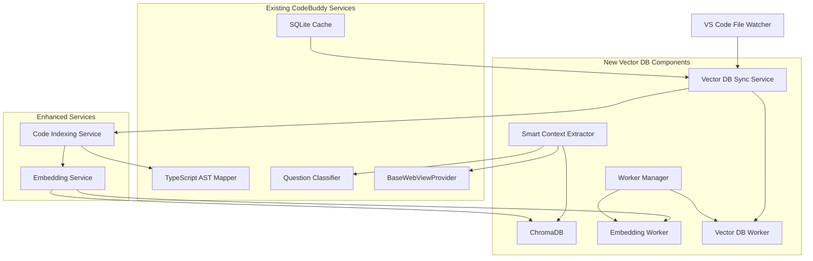

# Vector Database & Smart Context Extraction - Incremental Development Roadmap

## 📋 Table of Contents

1. [Overview](#overview)
2. [Architecture Summary](#architecture-summary)
3. [Development Phases](#development-phases)
4. [Phase 1: Foundation Setup](#phase-1-foundation-setup)
5. [Phase 2: Core Services Implementation](#phase-2-core-services-implementation)
6. [Phase 3: Smart Context Enhancement](#phase-3-smart-context-enhancement)
7. [Phase 4: Integration & Orchestration](#phase-4-integration--orchestration)
8. [Phase 5: Performance & Production](#phase-5-performance--production)
9. [Testing Strategy](#testing-strategy)
10. [Deployment Checklist](#deployment-checklist)
11. [Documentation References](#documentation-references)

## 📖 Overview

This roadmap provides an incremental, step-by-step guide for implementing the Vector Database and Smart Context Extraction system in CodeBuddy. The approach prioritizes user experience, non-blocking performance, and maintainable architecture.

### 🎯 Key Principles

- **Non-blocking architecture**: Use worker threads to prevent UI freezes
- **Embedding consistency**: Always use Gemini's `text-embedding-004` model
- **Multi-phase strategy**: Immediate, on-demand, background, and bulk embedding
- **Graceful fallbacks**: System works without vector DB if needed
- **Incremental development**: Each phase delivers value independently

### 📚 Documentation Foundation

This roadmap is based on comprehensive documentation in `/docs/vector/`:

- [VECTOR_DATABASE_KNOWLEDGEBASE.md](VECTOR_DATABASE_KNOWLEDGEBASE.md) - System overview
- [SMART_EMBEDDING_STRATEGY.md](SMART_EMBEDDING_STRATEGY.md) - Multi-phase embedding approach
- [NON_BLOCKING_IMPLEMENTATION.md](NON_BLOCKING_IMPLEMENTATION.md) - Worker thread architecture
- [SMART_CONTEXT_IMPLEMENTATION.md](SMART_CONTEXT_IMPLEMENTATION.md) - Step-by-step implementation
- [VECTOR_DB_API_REFERENCE.md](VECTOR_DB_API_REFERENCE.md) - API documentation

## 🏗️ Architecture Summary



## 🎯 Development Phases

### Phase Overview

| Phase | Description      | Duration | User Impact               | Priority |
| ----- | ---------------- | -------- | ------------------------- | -------- |
| 1     | Foundation Setup | 1-2 days | None (infrastructure)     | Critical |
| 2     | Core Services    | 2-3 days | Background processing     | High     |
| 3     | Smart Context    | 1-2 days | Enhanced AI responses     | High     |
| 4     | Integration      | 1-2 days | Full feature availability | Medium   |
| 5     | Performance      | 1-2 days | Optimized experience      | Medium   |

## 🚀 Phase 1: Foundation Setup

### Objectives

- Set up ChromaDB infrastructure
- Implement worker thread architecture
- Establish embedding consistency

### Tasks

#### 1.1 Dependencies & Environment

```bash
# Install core dependencies
npm install chromadb worker_threads

# Install type definitions
npm install --save-dev @types/chromadb
```

#### 1.2 Create VectorDatabaseService

**File**: `src/services/vector-database.service.ts`

**Key Features**:

- ChromaDB integration with local persistence
- Always use Gemini embeddings (consistent with existing EmbeddingService)
- Graceful error handling and logging
- Collection management

**Implementation**: Follow [SMART_CONTEXT_IMPLEMENTATION.md](SMART_CONTEXT_IMPLEMENTATION.md#step-1-create-vector-database-service)

#### 1.3 Implement Worker Thread Architecture

**Files**:

- `src/workers/embedding-worker.ts`
- `src/workers/vector-db-worker.ts`
- `src/services/vector-db-worker-manager.ts`

**Key Features**:

- Non-blocking embedding operations
- Queue management for batch processing
- Error handling and retry logic

**Implementation**: Follow [NON_BLOCKING_IMPLEMENTATION.md](NON_BLOCKING_IMPLEMENTATION.md#implementation-steps)

#### 1.4 Update EmbeddingService Consistency

**File**: `src/services/embedding.ts`

**Changes**:

- Ensure Gemini `text-embedding-004` is always used
- Add worker thread support
- Maintain backward compatibility

**Status**: ✅ Already implemented based on codebase analysis

### Validation Criteria

- [ ] ChromaDB initializes successfully
- [ ] Worker threads spawn without blocking main thread
- [ ] Gemini embeddings generate consistently
- [ ] Error logging works correctly
- [ ] No impact on existing functionality

### Estimated Time: 1-2 days

---

## ⚙️ Phase 2: Core Services Implementation

### Objectives

- Implement VectorDbSyncService for file monitoring
- Create multi-phase embedding strategy
- Establish real-time synchronization

### Tasks

#### 2.1 Create VectorDbSyncService

**File**: `src/services/vector-db-sync.service.ts`

**Key Features**:

- File system monitoring with debouncing
- Git-aware change detection
- Batch processing for efficiency
- Integration with SqliteDatabaseService

**Implementation**: Follow [SMART_CONTEXT_IMPLEMENTATION.md](SMART_CONTEXT_IMPLEMENTATION.md#step-2-create-vector-db-sync-service)

#### 2.2 Implement Smart Embedding Strategy

**Reference**: [SMART_EMBEDDING_STRATEGY.md](SMART_EMBEDDING_STRATEGY.md)

**Strategy Implementation**:

1. **Immediate Embedding**: Active file and recent changes
2. **On-Demand Embedding**: Files accessed during chat
3. **Background Embedding**: Workspace files during idle time
4. **Bulk Embedding**: Complete workspace indexing

#### 2.3 Enhance CodeIndexingService

**File**: `src/services/code-indexing.ts`

**Enhancements**:

- Vector database integration
- Prioritized embedding based on user activity
- Metadata enrichment for better search

#### 2.4 File System Monitoring

**Features**:

- Watch for file changes using VS Code APIs
- Debounced batch processing (500ms delay)
- Filter relevant file types (.ts, .js, .py, etc.)
- Ignore node_modules and build directories

### Validation Criteria

- [ ] File changes trigger reindexing
- [ ] Background embedding works without blocking UI
- [ ] Git changes are detected correctly
- [ ] Batch processing reduces API calls
- [ ] Memory usage remains reasonable

### Estimated Time: 2-3 days

---

## 🧠 Phase 3: Smart Context Enhancement

### Objectives

- Enhance SmartContextExtractor with vector search
- Implement semantic similarity matching
- Add fallback mechanisms

### Tasks

#### 3.1 Enhance SmartContextExtractor

**File**: `src/services/smart-context-extractor.ts`

**Key Features**:

- Vector-based semantic search
- Keyword-based fallback
- Context scoring and ranking
- Token budget management

**Implementation**: Follow [SMART_CONTEXT_IMPLEMENTATION.md](SMART_CONTEXT_IMPLEMENTATION.md#step-3-enhance-smartcontextextractor)

#### 3.2 Add Context Extraction Methods

**New Methods**:

- `extractRelevantContextWithVector(question, activeFile?)`
- `getSemanticSimilarity(query, content)`
- `buildContextFromVectorResults(results)`

#### 3.3 Implement Search Result Ranking

**Algorithm**:

1. Vector similarity score (primary)
2. File proximity to active file (secondary)
3. Recent modification time (tertiary)
4. Code complexity/importance (metadata-based)

#### 3.4 Context Formatting

**Features**:

- Clickable file references
- Syntax highlighting markers
- Relevance indicators
- Token-aware truncation

### Validation Criteria

- [ ] Vector search returns relevant results
- [ ] Fallback to keyword search works
- [ ] Context fits within token limits
- [ ] File references are clickable
- [ ] Search performance is acceptable (<2s)

### Estimated Time: 1-2 days

---

## 🔗 Phase 4: Integration & Orchestration

### Objectives

- Integrate with BaseWebViewProvider
- Orchestrate multi-phase embedding
- Ensure seamless user experience

### Tasks

#### 4.1 Update BaseWebViewProvider

**File**: `src/webview-providers/base.ts`

**Integration Points**:

- Initialize vector database on startup
- Pass VectorDatabaseService to SmartContextExtractor
- Handle initialization errors gracefully

**Implementation**: Follow [SMART_CONTEXT_IMPLEMENTATION.md](SMART_CONTEXT_IMPLEMENTATION.md#step-4-update-basewebviewprovider-integration)

#### 4.2 Extension Initialization

**File**: `src/extension.ts`

**Changes**:

- Initialize VectorDbSyncService
- Start background embedding process
- Register file system watchers

#### 4.3 Create SmartEmbeddingOrchestrator

**File**: `src/services/smart-embedding-orchestrator.ts`

**Features**:

- Coordinate all embedding phases
- Prioritize based on user activity
- Manage resource utilization
- Provide progress feedback

#### 4.4 User Feedback Integration

**Features**:

- Status bar indicator for embedding progress
- Toast notifications for completion
- Settings for enabling/disabling features

### Validation Criteria

- [ ] Extension starts without blocking
- [ ] Vector database initializes in background
- [ ] AI responses include vector context
- [ ] User can track embedding progress
- [ ] Settings allow feature control

### Estimated Time: 1-2 days

---

## 🎯 Phase 5: Performance & Production

### Objectives

- Optimize performance and memory usage
- Add monitoring and analytics
- Implement production safeguards

### Tasks

#### 5.1 Performance Optimization

**Reference**: [VECTOR_DB_PERFORMANCE.md](VECTOR_DB_PERFORMANCE.md)

**Optimizations**:

- Embedding batch size tuning
- Memory management improvements
- Cache optimization
- Query performance tuning

#### 5.2 Add Monitoring

**Metrics to Track**:

- Embedding generation rate
- Search query performance
- Memory usage patterns
- Error rates and types

#### 5.3 Configuration Management

**File**: `src/config/vector-db.config.ts`

**Settings**:

- Enable/disable vector database
- Embedding batch size
- Context token limits
- Performance thresholds

#### 5.4 Error Handling & Recovery

**Features**:

- Graceful degradation on errors
- Automatic retry mechanisms
- User-friendly error messages
- Diagnostic information collection

#### 5.5 Production Safeguards

**Safeguards**:

- Resource usage limits
- API rate limiting compliance
- Large codebase handling
- Network failure resilience

### Validation Criteria

- [ ] Performance meets targets (see VECTOR_DB_PERFORMANCE.md)
- [ ] Memory usage is reasonable (<500MB)
- [ ] Error recovery works correctly
- [ ] Large codebases are handled efficiently
- [ ] Monitoring provides useful insights

### Estimated Time: 1-2 days

---

## 🧪 Testing Strategy

### Unit Tests

**Files to Create**:

- `src/test/services/vector-database.service.test.ts`
- `src/test/services/vector-db-sync.service.test.ts`
- `src/test/services/smart-context-extractor.test.ts`
- `src/test/workers/embedding-worker.test.ts`

**Test Coverage**:

- Service initialization
- Embedding generation
- Search functionality
- Error handling
- Worker thread communication

### Integration Tests

**Files to Create**:

- `src/test/integration/smart-context.integration.test.ts`
- `src/test/integration/vector-db-sync.integration.test.ts`

**Test Scenarios**:

- End-to-end context extraction
- File change synchronization
- Performance under load
- Error recovery scenarios

### Performance Tests

**Metrics to Validate**:

- Embedding generation speed
- Search query response time
- Memory usage patterns
- Concurrent operation handling

**Reference**: [VECTOR_DB_PERFORMANCE.md](VECTOR_DB_PERFORMANCE.md#performance-targets)

---

## ✅ Deployment Checklist

### Pre-Deployment

- [ ] All unit tests pass
- [ ] Integration tests validate key scenarios
- [ ] Performance benchmarks meet targets
- [ ] Documentation is up-to-date
- [ ] Error handling covers edge cases

### Configuration

- [ ] Environment variables are set
- [ ] API keys are configured
- [ ] File paths are correct
- [ ] Worker thread limits are appropriate

### User Experience

- [ ] Extension starts without errors
- [ ] Background processes don't block UI
- [ ] Progress feedback is visible
- [ ] Error messages are user-friendly
- [ ] Settings are accessible and functional

### Monitoring

- [ ] Logging captures important events
- [ ] Performance metrics are collected
- [ ] Error tracking is enabled
- [ ] User feedback mechanisms work

---

## 📚 Documentation References

### Primary Implementation Guides

1. **[VECTOR_DATABASE_KNOWLEDGEBASE.md](VECTOR_DATABASE_KNOWLEDGEBASE.md)** - Comprehensive system overview
2. **[SMART_CONTEXT_IMPLEMENTATION.md](SMART_CONTEXT_IMPLEMENTATION.md)** - Step-by-step implementation guide
3. **[SMART_EMBEDDING_STRATEGY.md](SMART_EMBEDDING_STRATEGY.md)** - Multi-phase embedding approach
4. **[NON_BLOCKING_IMPLEMENTATION.md](NON_BLOCKING_IMPLEMENTATION.md)** - Worker thread architecture

### API & Configuration

5. **[VECTOR_DB_API_REFERENCE.md](VECTOR_DB_API_REFERENCE.md)** - Complete API documentation
6. **[VECTOR_DB_PERFORMANCE.md](VECTOR_DB_PERFORMANCE.md)** - Performance targets and optimization

### Troubleshooting & Support

7. **[VECTOR_DB_TROUBLESHOOTING.md](VECTOR_DB_TROUBLESHOOTING.md)** - Common issues and solutions
8. **[VECTOR_DB_DOCUMENTATION_INDEX.md](VECTOR_DB_DOCUMENTATION_INDEX.md)** - Documentation overview

---

## 🔄 Iteration & Feedback

### After Each Phase

1. **Validate functionality** against acceptance criteria
2. **Test performance** and resource usage
3. **Gather user feedback** if possible
4. **Update documentation** with lessons learned
5. **Refine next phase** based on insights

### Continuous Improvement

- Monitor performance metrics
- Track user satisfaction
- Identify optimization opportunities
- Plan future enhancements

---

## 🚨 Risk Mitigation

### Technical Risks

| Risk                        | Impact | Mitigation                                             |
| --------------------------- | ------ | ------------------------------------------------------ |
| ChromaDB performance issues | High   | Implement fallback to keyword search, optimize queries |
| Worker thread memory leaks  | Medium | Add monitoring, implement cleanup routines             |
| API rate limiting           | Medium | Implement intelligent batching, respect limits         |
| Large codebase handling     | High   | Progressive indexing, memory management                |

### User Experience Risks

| Risk                              | Impact | Mitigation                                       |
| --------------------------------- | ------ | ------------------------------------------------ |
| UI blocking during initialization | High   | Worker threads, background processing            |
| Poor search relevance             | Medium | Hybrid search (vector + keyword), result ranking |
| Complex configuration             | Low    | Sensible defaults, auto-configuration            |

---

## 📈 Success Metrics

### Technical Metrics

- **Search Accuracy**: >85% relevant results in top 5
- **Response Time**: <2 seconds for context extraction
- **Memory Usage**: <500MB for large codebases
- **CPU Usage**: <10% during normal operation

### User Experience Metrics

- **Startup Time**: No noticeable delay
- **AI Response Quality**: Improved context relevance
- **Error Rate**: <1% of operations fail
- **User Satisfaction**: Positive feedback on enhanced responses

---

## 🎯 Next Steps

1. **Start with Phase 1**: Foundation setup is critical
2. **Follow the documentation**: Each phase references specific implementation guides
3. **Test incrementally**: Validate each phase before proceeding
4. **Monitor progress**: Use the success metrics to track development
5. **Iterate based on feedback**: Adjust the roadmap as needed

This roadmap serves as your comprehensive guide for building the Vector Database and Smart Context Extraction system. Each phase is designed to deliver incremental value while building toward the complete feature set.

Good luck with your implementation! 🚀
