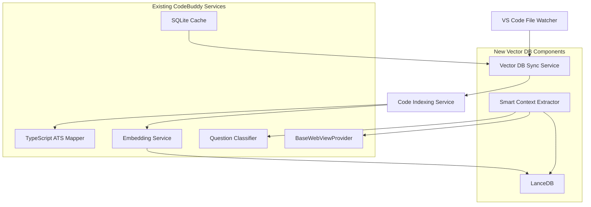

# Vector Database & Smart Context Extraction Knowledgebase

## 📋 Table of Contents

1. [Overview](#overview)
2. [System Architecture](#system-// Enhanced SmartContextExtractor with vector search
   export class VectorSmartContextExtractor extends SmartContextExtractor {
   private currentModel: string;
   private embeddingService: EmbeddingService;

constructor() {
super();
// Use currently selected model from CodeBuddy configuration
this.currentModel = getGenerativeAiModel() || 'Gemini';
const { apiKey, model } = getAPIKeyAndModel(this.currentModel);
this.embeddingService = new EmbeddingService(apiKey, model);
}

async extractRelevantContext(question: string): Promise<string> {
// Try semantic search first using current model
const vectorResults = await this.vectorDb.semanticSearch(question);

    if (vectorResults.length > 0) {
      return this.buildContextFromVectorResults(vectorResults);
    }

    // Fallback to keyword-based search
    return super.extractRelevantContext(question);

}
}3. [Core Components](#core-components) 4. [Implementation Strategy](#implementation-strategy) 5. [Integration Points](#integration-points) 6. [Performance Considerations](#performance-considerations) 7. [Deployment Guide](#deployment-guide) 8. [Monitoring & Maintenance](#monitoring--maintenance)

## 📖 Overview

The Vector Database & Smart Context Extraction system enhances CodeBuddy's ability to understand and search codebases semantically. Instead of relying on keyword-based searches, this system uses vector embeddings to find contextually relevant code snippets, classes, functions, and documentation.

### 🎯 Key Benefits

- **Semantic Understanding**: Find relevant code based on meaning, not just keywords
- **Improved Response Quality**: AI responses include more relevant context
- **Scalability**: Efficient handling of large codebases
- **Real-time Updates**: Automatic synchronization with code changes
- **Performance**: Fast semantic search with local vector database

### 🔧 Technology Stack

- **Vector Database**: LanceDB (local, serverless, TypeScript-native)
- **Embeddings**: Currently selected model from CodeBuddy configuration (Gemini, Groq, Anthropic, DeepSeek, etc.)
- **Code Analysis**: TypeScript AST (existing `typescript-ats.service.ts`)
- **Caching**: SQLite (existing infrastructure)
- **File Monitoring**: VS Code FileSystemWatcher API

## 🏗️ System Architecture



### 🔄 Data Flow

1. **Code Changes Detection**: File watcher detects TypeScript file changes
2. **Incremental Processing**: Modified files are queued for reprocessing
3. **Code Analysis**: TypeScript AST extracts functions, classes, interfaces
4. **Embedding Generation**: Create vector embeddings for code snippets
5. **Vector Storage**: Store embeddings in LanceDB with metadata
6. **Semantic Search**: Query vector DB for relevant context
7. **Context Enhancement**: Inject relevant context into AI prompts

## 🧩 Core Components

### 1. VectorDbSyncService

**Purpose**: Orchestrates file monitoring and incremental updates

**Key Features**:

- Real-time file system monitoring
- Debounced batch processing
- Git-aware change detection
- Error handling and recovery

**Integration**: Works with existing `SqliteDatabaseService` for caching

### 2. Enhanced SmartContextExtractor

**Purpose**: Semantic context retrieval with fallback mechanisms

**Key Features**:

- Vector-based semantic search
- Keyword-based fallback
- Context scoring and filtering
- Token budget management

**Integration**: Extends existing `SmartContextExtractor`

### 3. Vector-Enhanced CodeIndexingService

**Purpose**: Code analysis and embedding generation

**Key Features**:

- TypeScript AST integration
- Incremental file processing
- Metadata enrichment
- Batch embedding generation

**Integration**: Extends existing `CodeIndexingService`

## 🛠️ Implementation Strategy

> **📚 For comprehensive embedding strategy, see**: [Smart Embedding Strategy Guide](SMART_EMBEDDING_STRATEGY.md)

### Multi-Phase Embedding Approach

Instead of embedding everything at once (which blocks the UI), CodeBuddy uses a sophisticated **4-phase strategy**:

1. **⚡ Immediate (5-10s)**: Essential files for instant productivity

   - Open files, entry points, recently modified files
   - User sees progress, gets immediate value

2. **🎯 On-Demand (contextual)**: Files based on user behavior

   - Triggered by questions, file navigation, editing
   - Smart context-aware file discovery

3. **🔄 Background (idle time)**: Gradual processing during downtime

   - Remaining files processed when user is idle
   - Silent, non-intrusive progress

4. **📦 Bulk (user choice)**: Complete codebase indexing
   - Command: "CodeBuddy: Index Entire Codebase"
   - Full progress reporting, cancellable

### Foundation Setup

```typescript
// Install dependencies
npm install @lancedb/lancedb apache-arrow

// ✅ Smart orchestrated approach (non-blocking)
const embeddingOrchestrator = new SmartEmbeddingOrchestrator(context, workerManager);
await embeddingOrchestrator.initialize();
// User can immediately start using CodeBuddy!
```

````

### Phase 2: Code Analysis Integration

```typescript
// Enhance existing CodeIndexingService
export class VectorCodeIndexingService extends CodeIndexingService {
  private vectorDb: VectorDatabaseService;
  private currentModel: string;
  private embeddingService: EmbeddingService;

  constructor() {
    super();
    // Automatically use currently selected model
    this.currentModel = getGenerativeAiModel() || "Gemini";
    const { apiKey, model } = getAPIKeyAndModel(this.currentModel);
    this.embeddingService = new EmbeddingService(apiKey, model);
  }

  async buildVectorIndex(): Promise<void> {
    const codeData = await this.generateEmbeddings();
    await this.vectorDb.indexCodeSnippets(codeData);
  }
}
````

### Phase 3: Smart Context Enhancement

```typescript
// Enhance SmartContextExtractor with vector search
export class VectorSmartContextExtractor extends SmartContextExtractor {
  async extractRelevantContext(question: string): Promise<string> {
    // Try semantic search first
    const vectorResults = await this.vectorDb.semanticSearch(question);

    if (vectorResults.length > 0) {
      return this.buildContextFromVectorResults(vectorResults);
    }

    // Fallback to keyword-based search
    return super.extractRelevantContext(question);
  }
}
```

### Phase 4: Real-time Synchronization

```typescript
// File system monitoring
const syncService = new VectorDbSyncService();
await syncService.initializeAndSync();

// Automatic updates on file changes
syncService.onFileChange((files) => {
  this.reindexFiles(files);
});
```

## 🔗 Integration Points

### With Existing Services

| Service                 | Integration Type | Purpose                          |
| ----------------------- | ---------------- | -------------------------------- |
| `TypeScriptAtsMapper`   | Direct Usage     | Code analysis and AST parsing    |
| `EmbeddingService`      | Enhancement      | Vector embedding generation      |
| `SqliteDatabaseService` | Caching Layer    | Git state and change tracking    |
| `SmartContextExtractor` | Extension        | Add semantic context retrieval   |
| `BaseWebViewProvider`   | Integration      | Enhanced context in AI responses |

### API Integration Points

```typescript
// 1. Vector Database Service
interface VectorDatabaseService {
  initialize(): Promise<void>;
  indexCodeSnippets(snippets: CodeSnippet[]): Promise<void>;
  semanticSearch(query: string, limit?: number): Promise<SearchResult[]>;
  deleteByFile(filePath: string): Promise<void>;
}

// 2. Enhanced Context Extractor
interface EnhancedContextExtractor {
  extractRelevantContext(question: string, options?: SearchOptions): Promise<string>;
  getSemanticSimilarity(query: string, content: string): Promise<number>;
}

// 3. Sync Service
interface VectorDbSyncService {
  initializeAndSync(): Promise<void>;
  onFileChange(callback: (files: string[]) => void): void;
  performFullReindex(): Promise<void>;
}
```

## ⚡ Performance Considerations

### Optimization Strategies

1. **Embedding Caching**

   - Cache embeddings in SQLite
   - Reuse embeddings for unchanged code

2. **Batch Processing**

   - Process multiple files in batches
   - Limit concurrent operations

3. **Incremental Updates**

   - Only reindex changed files
   - Use git state for change detection

4. **Memory Management**
   - Stream large datasets
   - Garbage collect unused embeddings

### Performance Benchmarks

| Operation                      | Target Time  | Memory Usage |
| ------------------------------ | ------------ | ------------ |
| Initial Index (1000 functions) | < 30 seconds | < 200MB      |
| Incremental Update (10 files)  | < 2 seconds  | < 50MB       |
| Semantic Search                | < 100ms      | < 10MB       |
| Context Extraction             | < 500ms      | < 20MB       |

## 🚀 Deployment Guide

### Prerequisites

1. **Dependencies**

   ```bash
   npm install @lancedb/lancedb apache-arrow
   ```

2. **Configuration**

   ```typescript
   // Extension configuration - uses currently selected model
   import { getGenerativeAiModel, getAPIKeyAndModel } from "../utils/utils";

   const selectedModel = getGenerativeAiModel(); // Gets current model from generativeAi.option
   const { apiKey, model } = getAPIKeyAndModel(selectedModel);

   const config = {
     vectorDb: {
       path: path.join(context.extensionPath, "vector_db"),
       selectedProvider: selectedModel, // "Gemini", "Groq", "Anthropic", etc.
       embeddingModel: model, // Dynamic model based on selection
       apiKey: apiKey, // Dynamic API key based on selection
       maxTokens: 6000,
       batchSize: 50,
     },
   };
   ```

### Installation Steps

1. **Initialize Vector Database Service**

   ```typescript
   const vectorDb = new VectorDatabaseService(context);
   await vectorDb.initialize();
   ```

2. **Setup File Monitoring**

   ```typescript
   const syncService = new VectorDbSyncService(vectorDb);
   await syncService.setupFileWatcher();
   ```

3. **Perform Initial Indexing**

   ```typescript
   await syncService.performFullReindex();
   ```

4. **Integrate with Context Extractor**
   ```typescript
   const enhancedExtractor = new VectorSmartContextExtractor(vectorDb, questionClassifier, codebaseUnderstanding);
   ```

## 📊 Monitoring & Maintenance

### Health Checks

```typescript
// System health monitoring
class VectorDbHealthMonitor {
  async checkHealth(): Promise<HealthStatus> {
    const checks = await Promise.all([
      this.checkVectorDbConnection(),
      this.checkEmbeddingService(),
      this.checkFileWatcher(),
      this.checkSyncStatus(),
    ]);

    return this.aggregateHealthStatus(checks);
  }
}
```

### Performance Monitoring

```typescript
// Performance metrics
interface PerformanceMetrics {
  indexingTime: number;
  searchLatency: number;
  memoryUsage: number;
  vectorDbSize: number;
  lastSyncTime: Date;
  errorRate: number;
}
```

### Maintenance Tasks

1. **Regular Cleanup**

   - Remove obsolete embeddings
   - Compact vector database
   - Clear temporary caches

2. **Performance Optimization**

   - Analyze search patterns
   - Optimize embedding dimensions
   - Tune batch sizes

3. **Error Recovery**
   - Handle corrupt embeddings
   - Recover from sync failures
   - Rebuild indices when needed

### Troubleshooting

Common issues and solutions are documented in [VECTOR_DB_TROUBLESHOOTING.md](VECTOR_DB_TROUBLESHOOTING.md).

## 🎛️ Model Selection Integration

The vector database system seamlessly integrates with CodeBuddy's existing model selection system:

### Model Selection Strategy

```typescript
// Chat/Generation: Uses currently selected model from user settings
const currentChatModel = getGenerativeAiModel(); // From generativeAi.option setting

// Embeddings: Always uses Gemini for consistency (regardless of chat model)
const embeddingProvider = "Gemini";
const { apiKey: embeddingApiKey } = getAPIKeyAndModel(embeddingProvider);
const embeddingService = new EmbeddingService(embeddingApiKey);
```

**Why Separate Models?**

- **Embedding Consistency**: All embeddings must use the same model to maintain vector space compatibility
- **Prevents Errors**: Avoids dimension mismatches when switching chat models
- **API Compatibility**: Not all providers (Groq, Anthropic) offer embedding APIs

### Supported Models

**For Chat/Generation (Dynamic - Based on User Selection):**

- **Gemini**: Google's Gemini models for chat responses
- **Groq**: Meta Llama and other models via Groq for chat
- **Anthropic**: Claude models for chat responses
- **DeepSeek**: DeepSeek models for chat responses
- **Custom**: Any model configured in CodeBuddy settings

**For Embeddings (Fixed - Always Gemini):**

- **Gemini `text-embedding-004`**: Used for all vector embeddings
- **Reason**: Ensures consistent vector space and prevents compatibility issues
- **Requirement**: Valid Gemini API key needed regardless of selected chat model

### Configuration

The vector database uses a **dual-model approach**:

1. **Chat Model**: Set your preferred model in VS Code settings: `generativeAi.option`
2. **Embedding Model**: Always uses Gemini (requires `google.gemini.apiKeys` to be configured)
3. Configure API keys for both your selected chat model AND Gemini

**Required Configuration:**

- Your preferred chat model API key (Groq, Anthropic, etc.)
- **Gemini API key** (essential for embeddings, even if not using Gemini for chat)

**Example Settings:**

```json
{
  "generativeAi.option": "Groq",
  "groq.llama3.apiKey": "your-groq-key",
  "google.gemini.apiKeys": "your-gemini-key" // Required for embeddings
}
```

## ⚡ Performance & Threading

**Critical**: The vector database operations (embedding generation, indexing, searching) can block VS Code's main thread for 30-60 seconds with large codebases. This causes UI freezes and poor user experience.

**Solution**: Use worker threads for non-blocking operations:

```typescript
// ❌ Blocking (freezes UI)
const results = await embeddingService.processFunctions(data);

// ✅ Non-blocking (UI stays responsive)
const workerManager = await createVectorDbWorkerManager(context);
await workerManager.indexFunctionData(data, progressCallback);
```

**Benefits**:

- ✅ UI remains responsive during heavy operations
- ✅ Real-time progress feedback
- ✅ Parallel processing with multiple workers
- ✅ Graceful fallbacks if workers fail

## 📚 Additional Resources

- [Smart Embedding Strategy](SMART_EMBEDDING_STRATEGY.md) 🎯 **Strategy Guide**
- [Implementation Guide](SMART_CONTEXT_IMPLEMENTATION.md)
- [Non-Blocking Implementation](NON_BLOCKING_IMPLEMENTATION.md) ⭐ **Essential**
- [API Reference](VECTOR_DB_API_REFERENCE.md)
- [Troubleshooting Guide](VECTOR_DB_TROUBLESHOOTING.md)
- [Performance Optimization](VECTOR_DB_PERFORMANCE.md)

## 🤝 Contributing

When contributing to the vector database system:

1. Follow existing code patterns in `CodeIndexingService`
2. Maintain compatibility with current `SmartContextExtractor`
3. Add comprehensive tests for new functionality
4. Update documentation for API changes
5. Performance test with large codebases

## 📄 License

This documentation is part of the CodeBuddy project and follows the same licensing terms.
