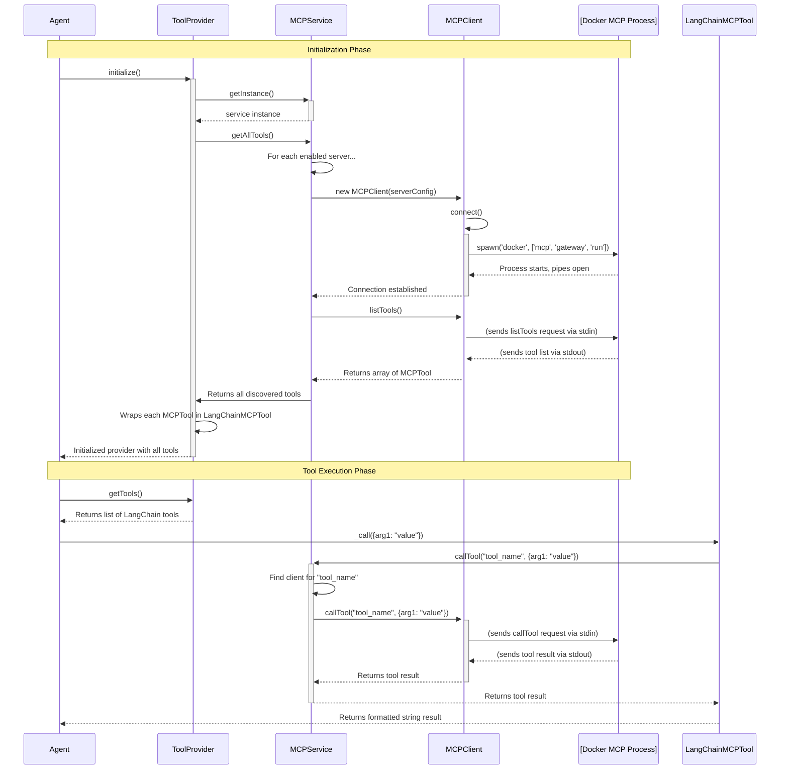

```mermaid
sequenceDiagram
    participant Agent
    participant ToolProvider
    participant MCPService
    participant MCPClient
    participant DockerProcess as [Docker MCP Process]

    Note over Agent, DockerProcess: Initialization Phase
    Agent->>+ToolProvider: initialize()
    ToolProvider->>+MCPService: getInstance()
    MCPService-->>-ToolProvider: service instance
    ToolProvider->>MCPService: getAllTools()
    MCPService->>MCPService: For each enabled server...
    MCPService->>+MCPClient: new MCPClient(serverConfig)
    MCPClient->>+MCPClient: connect()
    MCPClient->>DockerProcess: spawn('docker', ['mcp', 'gateway', 'run'])
    DockerProcess-->>MCPClient: Process starts, pipes open
    MCPClient-->>-MCPService: Connection established
    MCPService->>MCPClient: listTools()
    MCPClient->>DockerProcess: (sends listTools request via stdin)
    DockerProcess-->>MCPClient: (sends tool list via stdout)
    MCPClient-->>MCPService: Returns array of MCPTool
    MCPService->>ToolProvider: Returns all discovered tools
    ToolProvider->>ToolProvider: Wraps each MCPTool in LangChainMCPTool
    ToolProvider-->>-Agent: Initialized provider with all tools

    Note over Agent, DockerProcess: Tool Execution Phase
    Agent->>ToolProvider: getTools()
    ToolProvider-->>Agent: Returns list of LangChain tools

    Agent->>LangChainMCPTool: _call({arg1: "value"})
    LangChainMCPTool->>+MCPService: callTool("tool_name", {arg1: "value"})
    MCPService->>MCPService: Find client for "tool_name"
    MCPService->>+MCPClient: callTool("tool_name", {arg1: "value"})
    MCPClient->>DockerProcess: (sends callTool request via stdin)
    DockerProcess-->>MCPClient: (sends tool result via stdout)
    MCPClient-->>-MCPService: Returns tool result
    MCPService-->>-LangChainMCPTool: Returns tool result
    LangChainMCPTool-->>Agent: Returns formatted string result
```
