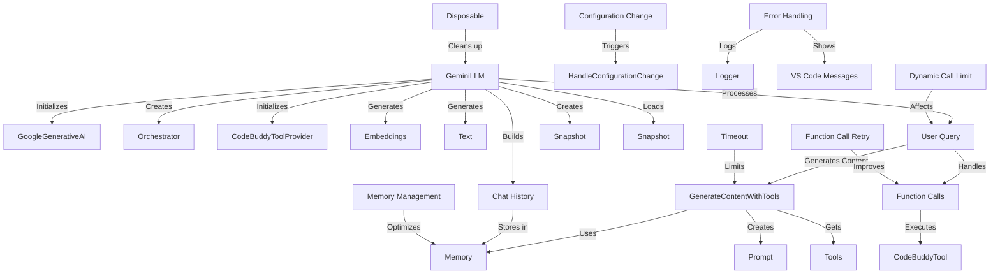

```mermaid
graph TD
    A[GeminiLLM] -->|Initializes| B[GoogleGenerativeAI]
    A -->|Creates| C[Orchestrator]
    A -->|Initializes| D[CodeBuddyToolProvider]

    A -->|Generates| E[Embeddings]
    A -->|Generates| F[Text]

    A -->|Processes| G[User Query]
    G -->|Generates Content| H[GenerateContentWithTools]
    H -->|Uses| I[Memory]
    H -->|Creates| J[Prompt]
    H -->|Gets| K[Tools]

    G -->|Handles| L[Function Calls]
    L -->|Executes| M[CodeBuddyTool]

    A -->|Builds| N[Chat History]
    N -->|Stores in| I

    A -->|Creates| O[Snapshot]
    A -->|Loads| P[Snapshot]

    Q[Configuration Change] -->|Triggers| R[HandleConfigurationChange]

    S[Disposable] -->|Cleans up| A

    T[Error Handling] -->|Logs| U[Logger]
    T -->|Shows| V[VS Code Messages]

    W[Dynamic Call Limit] -->|Affects| G

    X[Timeout] -->|Limits| H

    Y[Function Call Retry] -->|Improves| L

    Z[Memory Management] -->|Optimizes| I
```